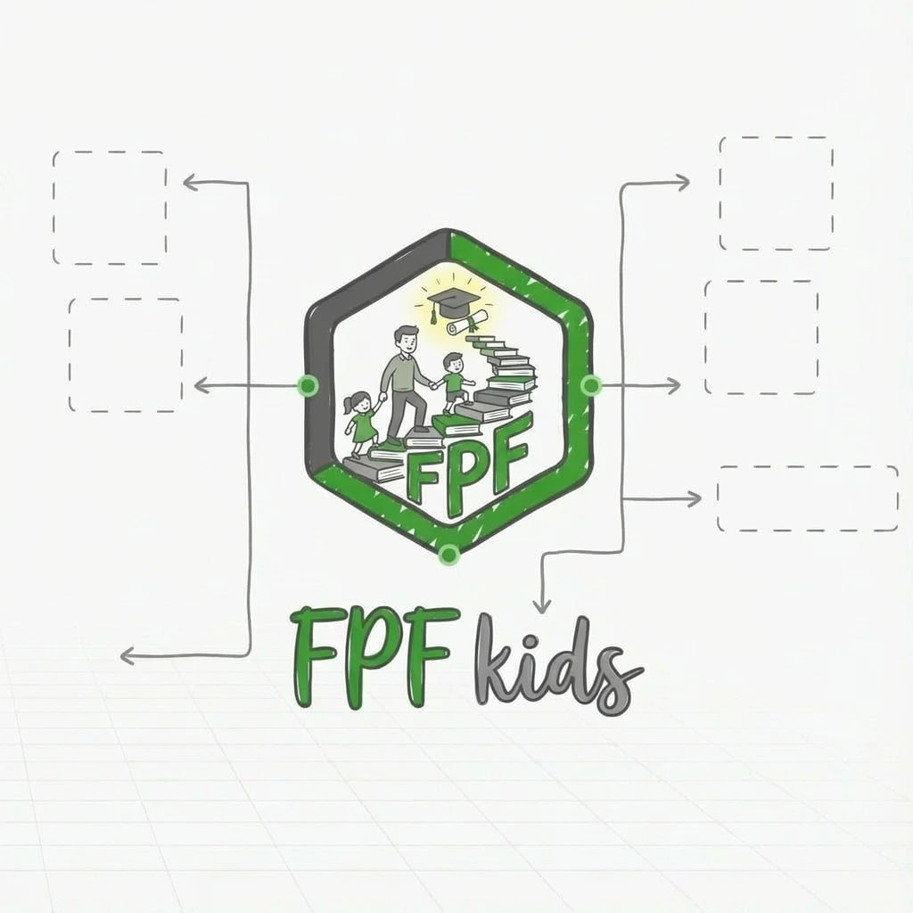
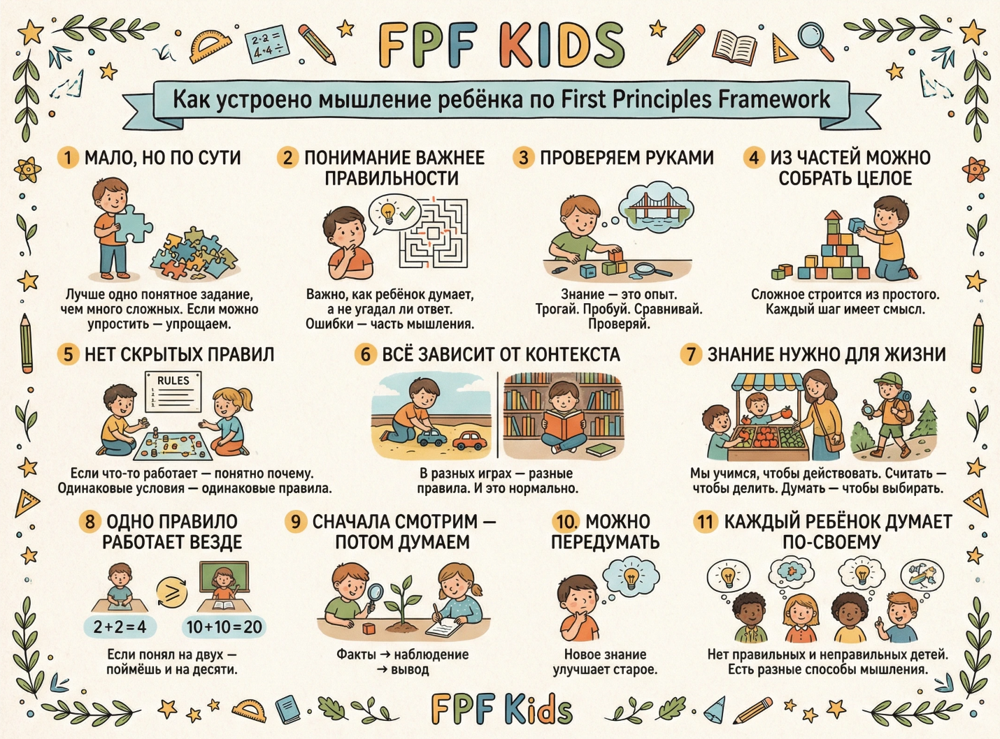
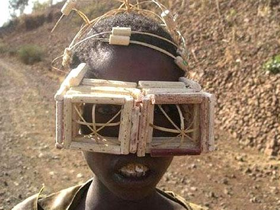
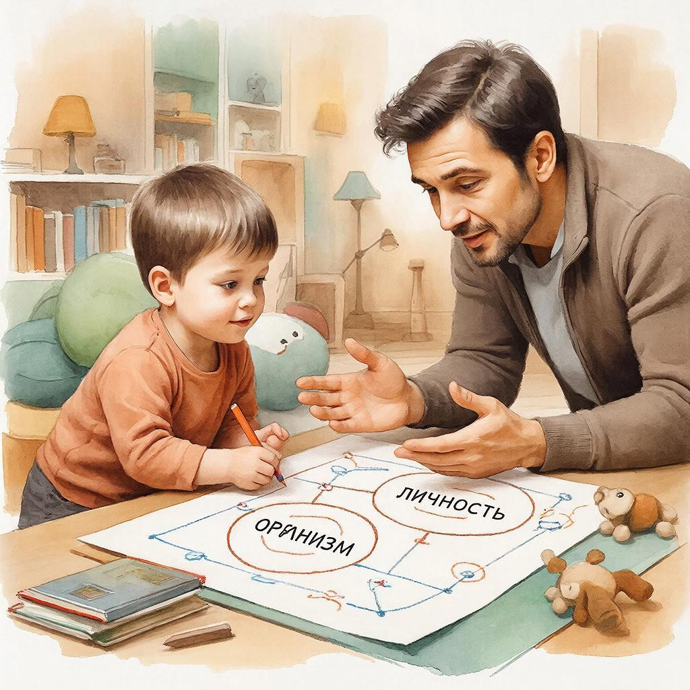
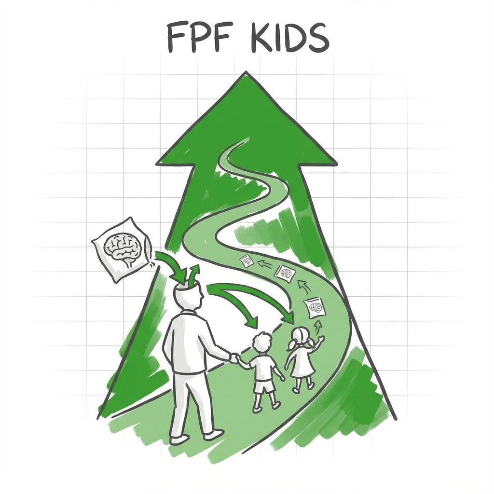
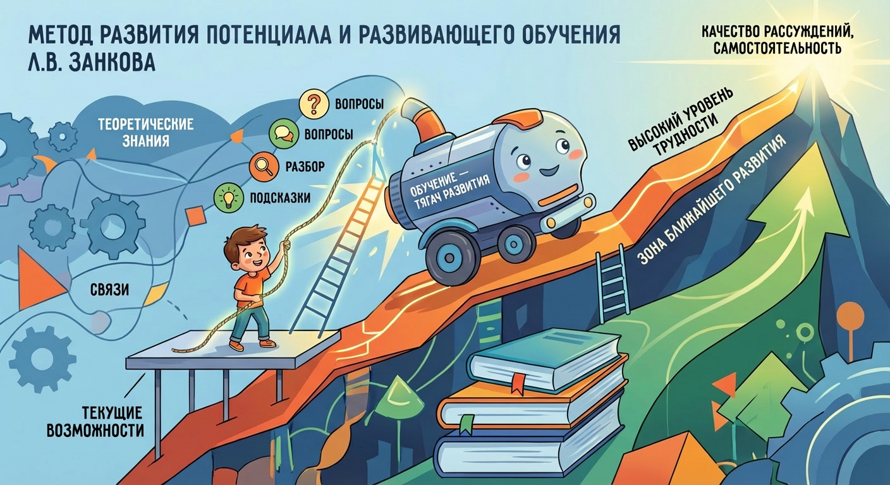
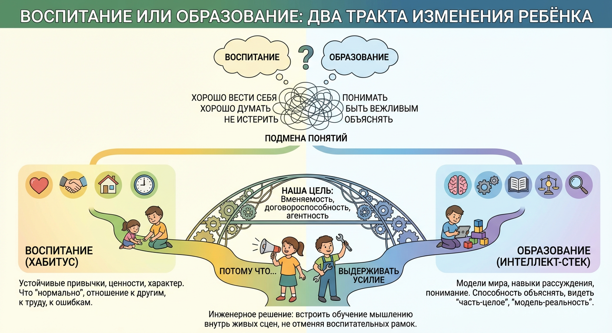
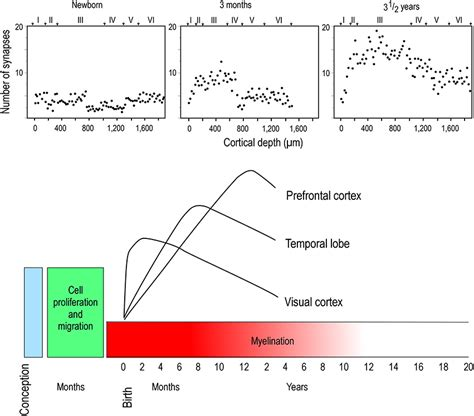

# «Нулевые, первые принципы для детей»

Д.Асфандияров, L.Samer

### Введение

Современный рынок детского образования переполнен: кружки, методики, “развивашки”, приложения, марафоны. В детских садах часто доминируют воспитательные задачи и тренировка отдельных навыков — дисциплина, счёт, письмо, «правильное поведение». В младшей школе много разных предметов, но знания разрознены и не дают явного развития мышления - не хватает связующей рамки, которая учит видеть системы, общие паттерны и способы мышления сквозь факты. В итоге у родителя появляется естественное ощущение перегруза и неопределённости: занятий много, а по какому принципу выбирать — непонятно; хочется дать ребёнку “хороший старт”, развить интеллект, снизить тревогу за его будущее в быстро меняющемся мире, но при этом не превратить детство в бесконечные уроки и не вырастить «супер знающего, но несамостоятельного» исполнителя, который отлично отвечает по шаблону и теряется в новых ситуациях.

Это руководство — не «курс», не «навыковый кружок» не очередная «развивашка». Это MVP программы для взрослого (родителя, воспитателя, тьютора), который хочет годами, малыми дозами и без героизма подмешивать практики мышления в обычную жизнь дошкольника или школьника — так, чтобы ребёнок постепенно наращивал способность замечать, объяснять, рассуждать и переносить способы мышления на новые контексты. Мы сознательно делаем ставку не на “больше контента” и не на “больше кружков”, а на фундамент: на те способы думать, которые помогают ребёнку разбираться с незнакомым и не зависеть от подсказок взрослого. Если у взрослого появляется уверенность, что у ребёнка формируется такой фундамент, тревога о будущем обычно заметно снижается: вы понимаете, что вкладываетесь не в набор случайных навыков «на сегодня», а в базовую обучаемость и самостоятельность «на завтра».

Методологически проект опирается на гипотезу Анатолия Левенчука: детей имеет смысл учить нулевым (и далее первым) принципам — то есть самым базовым, “допредметным” практикам мышления, которые предшествуют школьным дисциплинам и переживают смену технологий, программ и даже профессий. Это не про раннюю академизацию и не про то, чтобы объяснять дошкольнику и школьнику взрослые термины. Это про то, чтобы вырастить у ребёнка простые различения и устойчивые микро-привычки: «что это такое?», «зачем это?», «из чего состоит?», «по какому правилу мы сейчас делим?», «похоже или не похоже?», «почему так вышло?», «что будет, если поменять условие?». На следующем слое — первые принципы: функция и предмет, часть–целое, классификация по критерию, модель и реальный объект, простая причинность и проверка версий. В дошкольной форме это выглядит как короткие бытовые “исследования”, а не как учебная программа, в младшей школьной форме добавляются такие понятия, как «модель», «система», «причина», «версия/гипотеза», «проверка». Вся программа опирается в основном на материалы исследовательского развития МИМ (руководство «Интеллект-стек», семинары А. Левенчука), и есть некоторые материалы из остальных руководств программ рабочего и личного развития МИМ.

Вторая важная гипотеза, на которую опирается руководство – идея Церена Церенова о системной грамотности: школьные предметы важны, но им часто не хватает связующей рамки, которая учит видеть системы, общие паттерны и способы мышления сквозь факты. Вряд ли нужна революция учебников; скорее нужна системная доработка, чтобы системное мировоззрение и системная грамотность формировались с детства. А семья может стать трамплином для бесконечного роста ребенка. Семья — это уникальное сочетание генетического наследия, материального достатка и, что не менее важно, мемов — идей и мировоззрения, которые передаются от поколения к поколению. Это мировоззрение, вбираемое через воспитание и обучение, оказывает колоссальное влияние на будущее ребенка. Для родителя важно осознавать свою роль как ключевого источника знаний и ценностей.

Наш текущий ход — начать ещё раньше школы: дать дошкольнику базу (дети 4-7 лет, которые еще не пошли в школы), на которую потом естественно “сядут” предметы, кружки и проекты. Тогда предметные знания не будут разрозненными кусками, а станут материалом для тренировки мышления. Для младших школьников (7-10 лет) мы даем методологическую прослойку поверх школьных предметов и повседневных задач. То есть мы не отрываем ребёнка от школы и не конкурируем с ней, а делаем так, чтобы школа стала материалом для выращивания мышления.

Чтобы не превращать развитие в набор случайных активностей, взрослому полезно держать в голове интеллект-стек — карту слоёв мастерства мышления: от базовых различений, собранности и умения следовать простому правилу — до классификации по критерию, работы с моделью и причинностью, а дальше — до исследовательского цикла. Ребёнку мы не объясняем “стек” терминами, понятиями; он нужен взрослому как навигация и критерии: что именно мы тренируем в эпизоде, что является нормальным прогрессом, и как корректно усложнять без перегруза. Опираясь на такое фундаментальное образование, остальные кружки и школьные предметы помогают нарастить прикладные знания, при этом рос происходит быстрее и с меньшей нагрузкой для ребенка.

Руководство специально ограничивает обещания и область применения. Оно не заменяет детский сад, кружки и обычные навыковые занятия (читать, писать, считать, спорт, музыка), школу и не спорит с врачами или профильными специалистами; мы не лезем в клинические случаи и не ставим диагнозы. Мы также сознательно не растим “послушного исполнителя”: наша цель несовместима с практиками, которые стыдят за ошибки, давят скоростью, ломают агентность или превращают обучение в постоянный контроль. Приоритет — безвредность, состояние ребёнка и устойчивость процесса. Если ребёнок устал или форма занятия разваливается, это сигнал упростить нагрузку и пересобрать протокол, а не “дожимать план”.

Текущая версия текста написана для инженеров-менеджеров сообщества МИМ: тем, кто уже знаком с системным подходом, проходил обучение самостоятельно или в группе по руководствам, знает про целевую систему, роли, про различные виды мастерства и другие понятия. Мы предполагаем, что первые студенты будут в основном родители, но не исключаем бабушек, дедушек, дядь и теть, у которых есть «доступ» к дошкольникам и младшим школьникам, и которым важно развитие своих младших членов семей. Текст в основном написан с применением GPT и других нейросетей и в дальнейшем будет дорабатываться и корректироваться.

Взрослый здесь — не только преподаватель для своего ребенка, а система создания мастерства агента дошкольного или школьного возраста – целый набор ролей (культуртрегер, тьютор, преподаватель, лидер, методолог...): он решает, что данное обучение нужно его ребенку, держит короткий ритм, выбирает уровень сложности, организует среду и корректирует занятия по наблюдениям, проводит занятия. Ребёнку мы не читаем методологию; её держит в голове взрослый, чтобы не спутать смысл развития и не уехать в школьные суррогаты.

Практически руководство рассчитано на разные формы использования. Его можно проходить в одиночку в семье; в мини-группе взрослых (организовать своих родственников, друзей, знакомых в некую учительскую команду), где раз в неделю сверяются по логам и делятся рабочими эпизодами; в группе с наставником, который помогает удерживать метод и безвредность, а не “занимается с ребёнком вместо вас”; в формате практикума, где разбираются типовые поломки формы и способы их ремонта. Во всех вариантах сохраняется единое ядро: короткие эпизоды в реальных бытовых событиях, повторяемый исследовательский цикл и минимальная фиксация результатов. Текущая версия подразумевает тестовый месяц прохождения с еженедельным созвоном с авторами руководства.

Что считается результатом после прохождения стартового блока (например, тестового месяца или более длинного цикла). У ребёнка ожидаемо усиливается способность объяснять и рассуждать в быту: он чаще называет критерий, отличает функцию от предмета, видит часть–целое, различает модель и реальный объект, выдерживает короткий цикл “версия → проверка → уточнение” и спокойнее относится к изменению своей версии после проверки. У взрослого появляется то, что в этом руководстве считается главным продуктом: устойчивый контур “система создания мастерства ребёнка” — набор работающих карточек-эпизодов под ваши контексты, умение регулировать сложность на лету, привычка к короткой фиксации и недельному обзору, а также ясность, как дальше стыковать это с кружками и предметами, превращая их в полигон для мышления, а не в гонку за количеством.

Руководство появилась в рамках деятельности волонтерского проекта сообщества МИМ по семейному партнерству. Первую версию «FPF for kids» написала Лили на основе FPF Анатолия и после семинара и различных публикаций по теме FPF. Там были задания, которые Лили выполняла со своей дочерью. С активным участием Дениса А.,с поддержкой Церена началась работа над методологией руководства, методическими материалами и другими рабочими продуктами. Благодаря появлению фраймворка FPF, более продвинутых моделей GPT, а также материалов рабочего, личного и исследовательского развития взрослых, удалось собрать данное руководство.

На текущий момент руководство в тестовой версии, поэтому отдельного чата поддержки нет, есть только рабочий чат исследовательской группы. Все вопросы по текущей версии можно задать в телеграм Денису @Denis\_Asf.

Команда проекта

## 1. Неделя 1

### 1.1 Нулевые первые принципы

Это не курс, не кружок и не «ещё одна развивашка». Это руководство — настольная программа для взрослого (родителя, педагога, тьютора), которая помогает годами подмешивать практики мышления в обычную жизнь ребёнка, не превращая детство в бесконечные «уроки».

Мы пишем его как исследовательский и волонтёрский проект: это первая версия, “MVP” (Minimum Viable Product, «минимально жизнеспособный продукт»), которую мы будем дописывать и переписывать по результатам реальной практики в семьях и мини-группах. Поэтому здесь сразу встроены наблюдения, фиксация прогресса и обратная связь — не ради бюрократии, а потому что иначе легко скатиться в карго-культ «развития мышления» на красивых словах («карго-культ» развития – это когда оболочка есть, а реальных изменений нет).

Для кого это руководство

Если коротко: для взрослых из сообщества МИМ (на начальном этапе), кто знаком с системным инженерным подходом (проходил/проходит руководства по личному или рабочему развитию), уже знаком с FPF/интеллект-стеком, и у кого есть доступ к дошкольнику (обычно 4,5–7 лет, но стартовый фокус — дошкольники).

Внутри этой аудитории обычно есть несколько типичных задач (JTBD), которые мы считаем нормальными и «легитимными»:

- хочется снизить количество бытовых «инцидентов» (истерики в магазине, войны за экран, провалы договорённостей) без тотального контроля и без капитуляции, через рост вменяемости, договороспособности и базовой саморегуляции;

- хочется архитектурно увязать своё развитие (по системным руководствам) и развитие ребёнка — чтобы взрослый живёт в инженерной картине мира, а ребёнка не отдают в карго-культ «развития для неразвитых»;

- хочется не разовую методичку, а процесс: короткие регулярные практики, блоки по 3 и более месяца, карта мастерства и критерии приёмки.

Что мы называем «нулевыми» и «первыми принципами» — и почему это про дошкольников

В массовом дошкольном образовании чаще развивают навыки (считать, читать, держать карандаш, “вести себя”), а «интеллект» как набор мыслительных практик обычно предполагают как будто самозарождающимся: мол, «созреет», «школа научит», «хороший учитель подтянет». Мы здесь исходим из другой гипотезы: фундаментальные способы думать можно выращивать рано, мягко и в быту, если делать это короткими регулярными циклами и не героизировать нагрузку.

- Нулевые принципы в нашем проекте — это самые базовые «мета-навыки мышления», которые предшествуют любым предметам. На детском уровне это выглядит не как философия, а как простые различения и привычки: “что это такое?”, “зачем это?”, “из чего состоит?”, “что будет, если…?”, “какое правило здесь работает?”, “похоже или не похоже?”, “всегда или иногда?”.

- Первые принципы — это следующий слой: когда ребёнок (вместе со взрослым) учится не просто запоминать «как правильно», а строить простейшие объяснения: функция vs предмет, часть–целое, классификация по критерию, модель vs реальный объект, простая причинность.

Здесь важно: мы не выводим детям «весь интеллект-стек» словами. Но методологически держим взрослую карту в голове, чтобы не перепутать смысл дисциплин и не уехать в школьные суррогаты. В дошкольной практике мы реально трогаем: понятизацию, собранность и зачатки экзокортекса, семантику, алгоритмику, логику/причинность, исследовательский цикл, этику/безвредность.

Какой результат мы целимся получить у ребёнка

Мы не обещаем «гения» и не строим культ IQ. Результат мы формулируем приземлённо: ребёнок начинает лучше объяснять и рассуждать в бытовых ситуациях, а не только выполнять инструкции.

Это проявляется так (примеры, которые вы уже могли у себя замечать как «точки роста»):

- ребёнок различает предмет и функцию (“чем можно забить гвоздь и почему это работает / не работает”);

- может разложить целое на части и связать свойства частей со свойствами целого (на игрушках, на быту, на простых системах);

- умеет выбирать «лишнее» и объяснять критерий, а не угадывать;

- отличает модель от реального объекта (игрушка-машинка vs “папина машина” как физическая система в мире).

И уже поверх этого (как производные эффекты) могут расти: вменяемость, договороспособность, помогательство, агентность, зачатки критичности и саморегуляции. Мы специально проговариваем это как характеристики, а не как ярлыки “хороший/плохой ребёнок”.

Роль взрослого: вы не «преподаватель», вы — система создания

Самая неудобная правда проекта: у ребёнка не получится «само», если не появится взрослый-практик, который встроит мышление в жизнь. Это не значит «стать строгим учителем» — это значит взять роль наставника-практика, который:

- сам понимает, что именно тренирует (на уровне нулевых/первых принципов);

- умеет запускать короткие эпизоды в быту;

- умеет наблюдать и фиксировать, что меняется, и корректировать формат.

Отдельно: помидорки 10–15 минут — это про ребёнка, а взрослому нужно больше времени на чтение и подготовку. Поэтому руководство будет регулярно “обучать взрослого” прямо внутри недель: текст → проверка понимания → маленькое письменное задание → только потом эпизоды с ребёнком. (Эту логику мы будем соблюдать дальше, начиная уже с первой недели.)

Как этим пользоваться на практике: ритм, блоки, адаптивность

Базовый формат — короткие регулярные помидорки 5–15 минут, встроенные в реальные эпизоды: дом, прогулка, магазин, дорога, кухня, игры. В каждой помидорке есть маленький исследовательский цикл: заметили → вопрос → версии → проверили/понаблюдали → проговорили вывод. Длительность адаптивна: начинаем с малого и увеличиваем только если ребёнок “несёт” нагрузку.

Мы предлагаем мыслить блоками по ~3 месяца, но стартовать разумнее с «тестового месяца»: за этот месяц вы настраиваете форму (место, ритм, перерывы), понимаете реальную длину концентрации ребёнка и подбираете форматы эпизодов. И только потом решаете — продолжать ещё 2 месяца, превращая это в полноценный 3-месячный блок, или мы пересоберем формат.

Результат блока — не сертификат и не “пройденные темы”, а обновлённая картина ребёнка: что он теперь умеет объяснять, где рассуждает лучше, где пока “сыпется”, и какие эпизоды/сктуация дают лучший эффект. Это нужно и вам, и нам — чтобы руководство становилось точнее по мере практики.

Про безопасность и «анти-ошибки»

Это руководство не про героизм и не про “дожимать план”. Приоритет — безвредность и состояние ребёнка, а не выполнение заданий “любой ценой”. Руководство не заменяет сад, кружки и обычные развивашки; не лезет в клинические случаи; не ставит диагнозы; не спорит с врачами; и не превращается в обязаловку.

И ещё одна рамка: мы сознательно не выращиваем «послушного исполнителя без мозгов». Мы хотим, чтобы у ребёнка росла способность думать, объяснять и договариваться — а это несовместимо с практиками, которые ломают агентность, стыдят за ошибки или превращают обучение в постоянный контроль.

### Задания: мини-эссе взрослого «Зачем мне это руководство»

Это первое действие специально сделано письменно: взрослому нужна внешняя фиксация целей и ограничений (иначе будет только внешняя оболочка “позанимались — и ладно”, или наоборот гонка). Не пишешь = не думаешь.

Формат (10–20 минут)

Напиши ½–1 страницу или воспользуйся мини-опросником (необязательно).

Мини-опросник:

1. Текущий контекст (кто вы мама, папа, и т.п., ребенок/дети, возраст, что уже пробовали из обучений и т.д.)

2. Зачем (какая “работа” на самом деле решается)?

3. Что будет считаться успехом через 4 недели для вас и ребенка?

4. Ограничения (честно): время/энергия/вторые взрослые/сад/дорога/экран /болезни/командировки.

5. Риски: что точно нельзя допустить (перегруз, превращение занятий в наказание, “мы меряем любовь результатами”, конфликты между взрослыми из-за методики).

6. Гипотеза недели 1:Пример: “Если я выделю место, ритм и 3–4 простых упражнения, то увижу первые признаки роста объяснений”.

7. Написан пост в клубе или отправлен авторам руководства.

### 1.2 Обучение агентов: чем обучение взрослого отличается от обучения дошкольника

Этот подраздел нужен, чтобы договориться о главном: мы не “развлекаем ребёнка” и не “натаскиваем на навыки”, а инженерно организуем обучение — то есть создание и развитие мастерства как работающей “функции” в личности агента. В нашем проекте агентами выступают и взрослые (родители/наставники), и ребёнок. Но их обучение устроено принципиально по-разному, и если это не различать, взрослый либо начнёт “читать лекции дошкольнику”, либо сам останется на уровне “мне кажется, что я понял” и дальше будет воспроизводить карго-культ “правильного развития”.

1) Что такое обучение в инженерном смысле

Обучение можно рассматривать как сервис, который “поставляет” изменения в мастерстве ученика: от текущего состояния к более сильному. В норме это не разовая акция, а серия связанных “сеансов” (занятий), которые складываются в более крупные блоки. В онтологии обучения это описывается как конструкция, где “программа” состоит из более мелких частей вплоть до отдельных занятий.

Ключевое: в ходе обучения “изготавливается” мастерство (или его новый инкремент). До начала человек (или ребёнок) — условно “на входе”, в ходе обучения — “в процессе”, после — “может выполнять без новичковых ошибок”.
И это не метафора: мастерство трактуется как функциональный объект/“вычислитель”, который помогает агенту действовать и рассуждать в новых ситуациях, а обучение — как инженерия этого объекта.

Отсюда важное следствие для нашего руководства: мы будем говорить не “поиграйте”, а “какое мастерство сейчас создаём, по каким шагам и по каким наблюдаемым признакам поймём, что оно появилось/усилилось”.

2) Что именно мы “создаём”: фундаментальное vs прикладное

Внутри проекта мы постоянно различаем содержание обучения (какое мастерство создаём) и форму обучения (как именно создаём: игра, беседа, задания, наблюдение, ритуал, карточки, и т.п.). В онтологии обучения выделяется:

- Фундаментальное обучение (усиление интеллекта) — обучение практикам “интеллект-стека”, нулевым, первым принципам (то есть способам думать, разбираться с новым, удерживать внимание, работать с понятиями и т.д.).

- Прикладное обучение — всё остальное (практики предметных областей), которое делится на кругозорное и узкое.

Наше руководство относится именно к фундаментальному слою: мы не готовим к экзамену, и не “ставим профессию”, а подмешиваем в жизнь ребёнка практики мышления, которые потом будут переноситься на математику, чтение, естествознание, общение, быт. Это напрямую проговорено в методологическом документе проекта.

3) Почему нельзя одинаково учить взрослого и “неразвитого” (дошкольника)

Теперь главное различие - взрослый: способен учиться “по описанию”

Взрослый агент:

- может держать в голове цель обучения и осознанно её выбирать;

- может учиться через текст, рефлексию, тесты, “мышление письмом”;

- может сам стать провайдером собственного обучения (самообучение: нашёл материал → прочитал → попробовал → исправил ошибки).

- способен работать со стилями/методами как с объектами (“почему этот приём работает и где он сломается”), а не просто повторять. Это принципиально отличает “просто воспроизводить практику” от умения сознательно развивать практику.

Отсюда требование к первой неделе: взрослому придётся самому освоить язык различений (функция/предмет, часть-целое, модель/реальность и т.п.), иначе он не сможет качественно вести ребёнка — будет либо “преподавать как в школе”, либо “играть без цели”.

Дошкольник: учится “через проживание” и совместное действие

Дошкольник как агент:

- ещё не умеет долго удерживать абстрактные объяснения “потому что так устроено”;

- учится через ситуации, повторяющиеся ритуалы, игру, наблюдение, мини-эксперимент;

- критически зависит от взрослого как от “системы создания мастерства”: взрослый задаёт среду, ритм, уровень сложности, обратную связь и безопасность.

И тут есть риск: взрослый может попытаться “перенести взрослую форму обучения” на ребёнка — лекции, длинные объяснения, требования “сразу понять”. Это почти гарантированно даст сопротивление, утомление и ощущение “не работает”.

4) Два контура обучения в этом руководстве

Правильная конструкция проекта — два параллельных контура:

Контур А (взрослый учится сам):

взрослый читает короткий смысловой блок → делает проверку понимания (мини-тест/вопросы/письменный ответ) → пробует на себе мини-упражнение (чтобы “телом” понять) → фиксирует выводы.

Контур B (взрослый обучает ребёнка):

взрослый запускает 10–15 минутные “помидорки” с ребёнком → делает 1–2 микродействия → наблюдает и фиксирует (что ребёнок сказал/сделал) → корректирует следующую “помидорку”.

Почему так: обучение — это не “пересказ знаний”, а создание мастерства, и оно создаётся через повторяемые шаги и постепенную “мутацию” практики под ваш конкретный контекст (семья, темперамент, режим, среда). Эту идею можно понимать как непрерывное развитие мастерства и практики, где описания и шаблоны помогают, но реальная настройка идёт в жизни.

5) Как понять, что мы действительно “обучаем”, а не просто “занимаемся”

В инженерном подходе у обучения всегда есть минимальный набор признаков качества:

1. Есть целевое мастерство (пусть маленькое), а не “занятие ради занятия”.

2. Есть шаги/упражнения, которые реально можно повторять.

3. Есть наблюдаемые индикаторы (что ребёнок говорит/делает в бытовой ситуации), а не “кажется, стал умнее”.

4. Есть корректировка: если не пошло — меняем форму (игра/разговор/эпизод), но сохраняем цель.

5. Есть роль взрослого как инженера среды: взрослый не “судья”, а проектировщик условий, в которых у ребёнка появляется новая привычка рассуждения.

Это и будет отличать наше руководство от карго-культа развивашек: внешние атрибуты (карточки, задания, “занятия”) могут быть похожи, но внутри у нас другой объект работы — не набор навыков, а “когнитивные узлы” рассуждения и объяснения.

### 1.3. Почему «нулевые первые принципы»

Если коротко: мы хотим, чтобы ребёнок научился разбираться с новым (новые ситуации новые прикладные знания и т.д.), а не только повторять знакомое по образцу. Это и есть ставка на развитие интеллекта как “двигателя освоения нового”, а не на натаскивание на отдельные навыки.

В наших терминах ребёнок — агент, у которого есть “аппаратура” (организм, тело, внимание, память, среда и инструменты) и “прошивка” (личность как набор мастерств/практик). Обучение — это сервис, который добавляет и развивает мастерства в личности. При этом важно различать два вида обучения:

- фундаментальное (усиление интеллекта) — обучение практикам интеллект-стека;

- прикладное — обучение конкретным прикладным практикам (и оно бывает кругозорным и узким).

- Подробнее об этом в руководстве .

Дошкольник (в среднем до 6,5–7 лет) находится в фазе, где “прошивка” растёт особенно быстро, но при этом сам он ещё не способен держать длинные объяснения, “учиться как взрослый” и не обязан хотеть учиться. Поэтому мы не делаем из ребёнка маленького студента. Мы делаем иначе: через простые игровые и бытовые ситуации постепенно формируем ядро мыслительных мастерств, которые потом будут “подхватывать” любые школьные и жизненные навыки. Даем ребенку исследовательское развитие.

Что именно мы называем «нулевыми первыми принципами»

“Первые принципы” в инженерной интуиции — это движение от копирования шаблонов к пониманию причин и ограничений: не “делай как показали”, а “почему это работает именно так, а не иначе”. Но дошкольнику “почему” в виде лекций не подходит. Поэтому в дошкольной версии мы начинаем с ещё более базового слоя — с того, что можно назвать нулевыми принципами:

Нулевые принципы = минимальные различения, без которых невозможно рассуждение.

Это те “кирпичи”, из которых затем собираются объяснения, аргументы, гипотезы и исследования.

В частности:

- предмет ↔ функция (чем можно “делать дело” и почему один предмет подходит лучше другого);

- часть ↔ целое (из чего состоит, что будет, если убрать/заменить часть);

- классификация и “лишний объект” (по какому критерию объекты объединяются/разделяются);

- модель ↔ реальный объект (игрушка как модель и “настоящая система” в мире).

Это не “знания ради знаний”. Это структура мышления, которая позволяет ребёнку позже:

- быстрее осваивать школьные предметы (потому что там везде “объект-функция”, “часть-целое”, “модель-реальность”);

- лучше договариваться и объяснять (потому что появляются критерии, причины, границы);

- быть устойчивее к манипуляциям и “сказкам” (потому что привычка спрашивать “что это?”, “по какому признаку?”, “как устроено?” становится нормой).

Картинка из .

Почему это именно “развитие мастерства”, а не “красивые разговоры”

Мы держим инженерное различение: мышление — это работа интеллекта, его функция. Интеллект включается, когда появляется новое и непонятное; а когда всё знакомо — работает автоматизм прикладного мастерства.

Отсюда вытекает практический критерий: мы считаем, что ребёнок продвигается, если он:

- лучше справляется с незнакомыми ситуациями, а не только “выучил конкретный ответ”;

- может объяснить (пусть простыми словами), почему он так решил;

- способен предложить альтернативу (“можно по-другому?”), а не только выполнить инструкцию.

Это и есть рост мастерства. Не “мы прочитали правильную книжку”, а “в быту изменилось поведение и качество рассуждений”.

Почему важен постепенный набор сложности (и почему мы начинаем с малого)

Есть очень неприятная закономерность: если пытаться “в лоб” обучить сложному без промежуточных ступеней — часто ничего не получается. А если строить цепочку задач с возрастающей сложностью — получается. Это подтверждается и в исследованиях обучения (включая эксперименты в ИИ), и в обычной жизни мастеров.

Поэтому мы сознательно:

- начинаем с коротких регулярных шагов,

- строим лесенку: простое различение → применение в быту → маленькая вариативность → перенос на новый контекст,

- много раз возвращаемся к одному и тому же, но под разными углами (у дошкольников так и “прошивается”).

И здесь важно ещё одно: граница между “мыслительным” и “прикладным” мастерством размыта. Ребёнок учится мыслить внутри прикладных ситуаций (игра, быт, дорога, магазин), а не отдельным “уроком логики”.

Роль взрослого: вы учитесь вместе с ребёнком (и это нормально)

Взрослый в этом руководстве — не “контролёр занятий” и не “человек, который должен всё знать заранее”. Взрослый — наставник, который:

1. сам разбирается в минимальных различениях (чтобы не скатываться в “потому что я сказал”),

2. создаёт ребёнку среду для регулярной практики,

3. наблюдает изменения и корректирует форму упражнений.

Фактически вы временно берёте на себя часть ролей “провайдера обучения”: где-то как методолог (что развиваем и зачем), где-то как методист (какие задания и в какой последовательности), где-то как преподаватель (как провести занятие), а где-то как организатор (как встроить в жизнь). Это нормальная “сборка” для семейного формата.

Когда взрослые слышат “первые принципы”, “интеллект-стек”, “развитие мышления”, часто включается автоматический режим: найти “правильные упражнения”, “правильные карточки”, “правильный курс”, повторить ритуал — и ждать результат. Это и есть зона риска, где развитие легко превращается в имитацию развития.

Поэтому следующим разделом мы разберём карго-культ в отношении ребёнка: как взрослые (иногда из лучших побуждений) подменяют причинную работу по развитию мастерства — внешними атрибутами “развития”, и что с этим делать, чтобы не сломать мотивацию, не перегрузить семью и не получить “образованного дикаря” вместо думающего ребёнка.

### Задания: мини-проверка для взрослого

Быстрая самопроверка понимания раздела — ответьте письменно 3–5 строками:

1. В чём разница между “навыком” и “развитием мышления” именно в дошкольном возрасте?

2. Какие 2–3 “нулевых различения” для вашего ребёнка сейчас наиболее актуальны (предмет/функция, часть/целое, модель/реальность, классификация)?

3. В каких бытовых ситуациях это мастерство может реально проявляться уже на этой неделе?

### 1.4. Карго-культ в образовании детей

в образовании — это когда мы копируем внешние признаки «правильного обучения», но не понимаем (и потому не воспроизводим) то, что реально вызывает рост мастерства. В классической метафоре люди видели, что «где-то там» прилетают самолёты с грузом (cargo), и воспроизводили форму: строили «взлётную полосу», «вышку», «наушники диспетчера» — но груз не прилетал, потому что причинный механизм был не в форме, а в огромной системе логистики, техники, дисциплины, экономики и практик. В образовании происходит то же самое: мы видим у успешных детей «результаты» и начинаем воспроизводить декорации результата, надеясь, что результат появится сам.

С дошкольниками карго-культ особенно коварен, потому что тревога взрослых высокая, а рынок «развивашек» огромный. В итоге взрослые начинают измерять развитие ребёнка тем, что легко посчитать и показать: сколько кружков, сколько карточек «пройдено», сколько книжек «осилил», сколько «уроков» сделал, как рано начал читать, какие «сертификаты» и «занятость» есть. Но эти внешние признаки могут не иметь почти никакого отношения к росту интеллекта (умению разбираться с новым, объяснять, рассуждать, проверять версии, удерживать внимание и замысел). А иногда они даже вредят, потому что создают иллюзию прогресса и выжигают интерес.

Почему вообще возникает эта ошибка? Потому что в массовом образовании (и в массовом «допобразовании») исторически закрепилась ориентация на формы контроля: «урок», «домашка», «тест», «правильный ответ», «программа», «отчётность». При этом фундаментальные мыслительные трансдисциплины — то, что лежит в основе современного мировоззрения и умения думать — часто оказываются неразвёрнуты и не поставлены как явные предметы обучения. Считается, что «как-то само вырастет» или «хороший учитель сделает», но в методических материалах это обычно не нормировано и не проверяется. В результате люди могут быть грамотными (читать-писать-считать), даже «очень образованными», но оставаться «дикарями 21 века» — с мышлением прошлых версий, годным для повторения, но плохо годным для работы с новым.

У дошкольников цена карго-культа ещё выше, потому что на этом этапе мы работаем не с «предметами» (математика, физика, история), а с базовыми инструментами мышления, которые потом будут «держать» и школьные предметы, и самообучение. Если взрослый ошибается и вместо настройки «инструментов» начинает гнать «витрину достижений», ребёнок может стать удобным, натасканным, но слабо самостоятельным: умеет повторять, но плохо объясняет; отвечает, но не рассуждает; быстро сдувается при малейшей новизне; ждёт внешнего управления. Это и есть тот самый риск «образованного дикаря» — много действий по инструкции, мало способности понимать, что происходит, и что делать, если инструкции нет.

Карго-культ по отношению к ребёнку обычно выглядит в трёх формах.

Первая — подмена цели. Взрослый на словах хочет «чтобы ребёнок стал умным, самостоятельным, сообразительным», а на деле начинает оптимизировать под «чтобы не капризничал», «чтобы быстро делал», «чтобы красиво отвечал», «чтобы был как “успешные дети” в роликах». Эти цели не обязательно плохие, но они не равны развитию интеллекта. И что хуже — они легко превращаются в давление и дрессировку, потому что результат надо «получить к сроку».

Вторая — подмена причинности ритуалами. Взрослый повторяет «правильные» слова (про развитие, про дисциплину, про ответственность), покупает «правильные» материалы (карточки, тетради, развивающие игры), ставит «правильный» режим (иногда слишком жёсткий), но не понимает, какой именно механизм мы выращиваем и как он проявится в жизни. Формально занятие было, галочка поставлена, а ребёнок через час в быту снова не может объяснить простую разницу «предмет–функция» или «игрушка–реальная система», не может удержать замысел даже на короткое дело, не может договориться без истерики.

Третья — подмена измерения реальностью отчёта. Взрослый видит прогресс в том, что «мы занимались», «мы прошли», «мы сделали». Но развитие интеллекта проявляется не в отчёте, а в переносе: ребёнок начинает иначе объяснять, иначе выбирать, иначе рассуждать в реальных ситуациях. Если перенос не происходит, значит мы делали что-то не то — и это не повод «жать газ», это повод пересобрать практику.

Важно: карго-культ — это не «ошибка плохих родителей». Это типовая ловушка даже для умных людей, потому что рынок и социальное давление устроены так, чтобы продавать форму. Поэтому в руководстве мы прямо вводим анти-карго правило: каждая практика должна быть привязана к наблюдаемому изменению в поведении и объяснениях ребёнка, а не к количеству занятий или «пройденного материала».

Отсюда ключевой разворот: мы не «занимаемся развитием» вообще. Мы ведём инженерный проект выращивания мастерства. У проекта есть цель (какое мастерство растим), есть критерии (как проявляется в быту), есть ограничения (без перегруза, без потери агентности и без ухудшения отношений), есть итерации (проверяем, что работает, убираем то, что не даёт эффекта).

Что именно мы считаем «анти-карго» в дошкольном варианте?

Во-первых, мы считаем нормой, что ребёнок не обязан “хотеть учиться” в нашем взрослом смысле. Наша задача — не тащить его в «уроки», а встроить микропрактики в жизнь так, чтобы они становились частью игры, быта и общения. Тогда ребёнок «учится» как побочный эффект нормальной жизни: он учится объяснять, потому что мы просим объяснить; учится различать модель и реальность, потому что мы это обсуждаем на игрушках и на настоящих вещах; учится часть-целое, потому что мы вместе разбираем предметы и собираем обратно; учится функции, потому что мы постоянно связываем «что это делает» с «что это такое».

Во-вторых, мы считаем нормой, что взрослый тоже учится — иначе он будет неизбежно скатываться в старые школьные формы: «повтори», «выучи», «правильно/неправильно», «быстрее», «не отвлекайся». Но нулевые первые принципы требуют от взрослого другой позиции: взрослый — не “контролёр результата”, а “наставник исследования”. Он задаёт вопросы, удерживает рамку, помогает фиксировать мысли, показывает способы рассуждать и проверять версии. И это не врождённое, это приобретаемое мастерство взрослого.

В-третьих, мы считаем нормой, что часть практик будет “слишком простыми” на вид. Карго-культ любит сложность формы: «чем сложнее тетрадь, тем умнее будет ребёнок». Но в фундаментальном развитии часто наоборот: самые сильные сдвиги дают простые, но регулярные действия — короткие разговоры, один и тот же тип вопросов, одно и то же различение, повторённое в десятках бытовых контекстов. Если практика выглядит скучной взрослому, это не значит, что она бесполезна ребёнку. И наоборот: если практика выглядит «умной» взрослому, это не значит, что она развивает интеллект ребёнка.

И наконец, важный момент про безопасность. Карго-культ легко превращается в насилие: взрослый начинает «дожимать», потому что “так надо”, “мы же купили курс”, “мы же обещали себе заниматься”. Но ребёнок — не объект дрессировки. Если мы видим устойчивую деградацию состояния (срывы, рост тревожности, отвращение к совместным занятиям, ухудшение сна), то инженерное решение не «добавить дисциплины», а снизить нагрузку, упростить практику, поменять формат, усилить взрослого. В этом смысле карго-культ — это ещё и риск-источник: он толкает в ошибочную реакцию “жать газ”.

### 1.5 Роль взрослого в проекте развития ребёнка

В этом проекте взрослый — не «учитель начальных классов на дому» и не «ведущий развивашек». Взрослый здесь играет совсем другую роль: он выступает системой создания мастерства ребёнка, то есть тем, кто проектирует и запускает среду, ритм и формат обучения так, чтобы у ребёнка реально росло мастерство рассуждать и объяснять — в живых бытовых ситуациях, а не только «правильно отвечать».

Это важно проговорить честно, без самообмана. Дошкольник не выбирает себе задачи развития и почти никогда не понимает, «что ему надо». Он живёт текущими желаниями, игрой, эмоциями, усталостью, вниманием. Можно сколько угодно ждать, что «сам дозреет», «в школе научат», «хороший педагог заинтересует» — но если рядом нет взрослого, который регулярно встроит мышление в жизнь, всё свалится в карго-культ: будет много внешней активности и мало внутренних изменений.

Чтобы не перепутать роли, полезно держать в голове простую онтологию агента (человека). У агента есть:

1. Организм / тело / “аппаратура”: сон, еда, здоровье, эмоции, внимание, усталость, среда, инструменты.

2. Личность / “прошивка”: привычки, способы объяснять, способы решать, способы договариваться, способы относиться к ошибкам — то есть набор мастерств.

Обучение (в самом приземлённом смысле) — это добавление и укрепление мастерств в “прошивке”, но оно всегда опирается на “аппаратуру”. Поэтому взрослый-наставник одновременно держит два контура:

- Контур состояния: ребёнок в ресурсе или нет? выдерживает ли он 10 минут? не перегрелся ли? не превращаем ли занятие в борьбу?

- Контур мастерства: что именно сегодня тренируем? какое различение/принцип? в какой сцене/эпизоде/контакте/ситуации? как поймём, что стало лучше?

Отсюда главный принцип роли наставника: вы отвечаете за инженерную связку “цель → формат → наблюдение → корректировка”, а не за “проведение урока”.

Что именно делает наставник (по сути, по работам)

Во-первых, выбирает, что считать результатом.

Мы не целимся в “знания по темам”, мы целимся в наблюдаемое мастерство объяснять и рассуждать. На старте это очень конкретные проявления: ребёнок отличает предмет от функции, умеет разложить целое на части, классифицирует по критерию (и может сказать критерий словами), отличает модель от реального объекта. Это и есть ядро, на которое потом “садятся” более мягкие характеристики вроде вменяемости, договороспособности, помогательства и агентности.

Во-вторых, проектирует ритм и условия.

Дошкольнику не нужны длинные занятия. Ему нужна регулярность и лёгкие повторяющиеся эпизоды. Поэтому «помидорка 10–15 минут» — это про ребёнка. Но взрослому нужно больше: прочитать смысловой блок, понять, что именно развиваем, сделать мини-проверку понимания, подготовить 1–2 простых “хода” и материалы (карточки, предметы, место). Если взрослый не выделил время на подготовку, эпизод с ребёнком почти гарантированно уедет либо в “болтовню без цели”, либо в “школьную лекцию”.

В-третьих, ведёт ребёнка не через объяснение, а через совместное исследование.

Дошкольник учится “через проживание”: увидели → удивились → задали вопрос → предложили версии → проверили/понаблюдали → проговорили вывод. Взрослый задаёт рамку и удерживает её. Это и есть практическая версия «нулевых/первых принципов»: не заучивание формулировок, а тренировка способов думать.

В-четвёртых, удерживает качество: не скатывается в карго-культ.

Карго-культ у взрослого обычно выглядит так: “мы сделали карточки / купили набор / посмотрели видео / сходили на кружок — значит развиваем интеллект”. Нет. Важен не атрибут, а то, изменилось ли поведение и объяснения ребёнка. Наставник постоянно возвращает проект к причинности: что именно сейчас тренируем? почему это упражнение должно сработать? где оно может сломаться? что наблюдаем?

В-пятых, фиксирует наблюдения и принимает решения по данным, а не по ощущениям.

Достаточно простого лога: 2–3 эпизода в неделю, одна фраза “что ребёнок сказал/сделал нового”, один маркер “где был перегруз”. Это не бюрократия. Это защита от самообмана (и сырьё для того, чтобы руководство переписывалось на реальном опыте семей, а не на красивых теориях).

В-шестых, отвечает за безопасность и безвредность.

Это руководство не про “дожать план”. Приоритет — состояние ребёнка и нормальная жизнь семьи. Нельзя превращать занятия в наказание, мерить любовь результатами, ломать агентность стыдом или постоянным контролем. И нельзя устраивать войну методик между взрослыми: ребёнок всегда проигрывает в конфликте взрослых. Наставник — это ещё и тот, кто удерживает эти рамки.

Почему взрослому самому нужно учиться (и это не опция)

Эта программа устроена так, что взрослый неизбежно становится учеником. Не потому что “вам не хватает педагогики”, а потому что вы учите ребёнка тому, что сами должны уметь различать и делать.

Если взрослый не освоил (хотя бы на бытовом уровне) различения “функция/предмет”, “часть/целое”, “модель/реальность”, “критерий классификации”, то он не сможет вести ребёнка — он будет либо требовать “правильные ответы”, либо играть без понимания, что развивает. Поэтому внутри каждой недели будет встроен взрослый контур: короткий текст → проверка понимания → мини-задание письмом → и только потом эпизоды с ребёнком.

Это ещё и защита от иррационализма. Если взрослый сам живёт в режиме “верю потому что так сказали / потому что красиво звучит”, то ребёнок получит ту же прошивку — и тогда никакие “развивашки” не спасут. Взрослый-наставник в этом смысле — фильтр качества: он не обязан быть учёным, но он обязан быть рациональным практиком, который отличает объяснение от лозунга, критерий от вкуса, модель от реальности.

Несколько слов про “родитель” (и другие взрослые)

В тексте дальше мы будем говорить “родитель”, потому что так привычнее. Но по роли это может быть любой взрослый из ближнего круга: мама, папа, бабушка, дедушка, тётя, дядя, старший брат/сестра, воспитатель. Важно не название роли, а выполнение работ: регулярные эпизоды, бережная рамка, наблюдение, корректировка, согласованность между взрослыми.

Если взрослых несколько, наставник (ведущий) — это тот, кто удерживает общий “контракт”: что развиваем, как часто, что нельзя делать, как фиксируем прогресс. Иначе получится “каждый тянет в свою сторону”, а ребёнок будет вынужден адаптироваться к разным правилам вместо того, чтобы учиться думать.

Именно поэтому следующий подраздел — «Маршрут наставника»: мы опишем, как взрослому пройти первые недели так, чтобы сначала собрать форму (место, ритм, простые эпизоды, лог), а уже потом наращивать содержание и сложность, не ломая ребёнка и не срываясь самим.

### 1.6. Маршрут наставника ребенка

Этот проект не про «ещё один кружок» и не про то, чтобы загрузить ребёнка занятиями. Он про то, чтобы один взрослый в семье взял роль ведущего наставника и начал встраивать мышление в жизнь: короткими эпизодами, в обычных бытовых фрагментах/ситуациях, с минимальной дозировкой и с наблюдением изменений. В нашем языке это означает простую вещь: если никто из взрослых не держит контур “понял → сделал → заметил → поправил”, то у ребёнка “само” не появится.

Ниже маршрут первого месяца по неделям подробно и контуры трехмесячного цикла.

Чтобы этот контур было проще держать, само руководство устроено слоями:

- Часть A (для взрослого) — что мы делаем и зачем: нулевые/первые принципы в детской версии, целевая картина мастерства, и как устроен 3-месячный блок (ритм, лог, карта).

- Часть B (для ребёнка) — карточки мини-эпизодов под реальные контексты (“в ванной”, “по дороге”, “в магазине”…), где у каждого эпизода есть цель, шаги, критерии успеха и красные флаги.

- Часть C (наблюдение и фиксация) — формы: “наши текущие эпизоды/фрагменты дня”, недельный лог, карта мастерства, шаблон эссе взрослого и форма обратной связи авторам/методисту.

Дальше — маршрут, как прожить первые 12 недель так, чтобы взрослый сам освоил материал (а не “понял на уровне впечатления”) и смог спокойно, без давления, “привить” ребёнку первые элементы рассуждения.

Роли и договорённости (сначала — организационно)

В семье почти всегда несколько взрослых. Поэтому в самом начале полезно явно договориться, кто из вас:

1. ведущий взрослый (держит ритм, читает, делает задания, выбирает эпизоды);

2. со-наставники (подхватывают отдельные эпизоды и поддерживают единый стиль);

3. кто “не участвует”, но хотя бы не ломает договорённости.

Это важно не ради “формальностей”, а ради устойчивости: ребёнок очень быстро считывает, когда взрослые не синхронизированы (один просит объяснять и думать, другой “лишь бы не мешал”).

Время и ритм (без самообмана про «10 минут»)

Одна из частых ошибок — думать, что “помидорки 10–15 минут” относятся ко всему проекту. Нет: 10–15 минут — это про ребёнка. Взрослому нужно больше времени на чтение, понимание и подготовку. Поэтому внутри недель у нас всегда будет связка: текст → проверка понимания → маленькое письменное задание → эпизоды с ребёнком.

Ориентиры по времени такие (это не догма, а разумная стартовая дозировка):

- Первые 2 недели (настройка)

- взрослому: 1,5–2 часа в неделю (2–3 помидорки по 25–30 минут на чтение и свои задания); с ребёнком: 20–30 минут в неделю (1–2 пробных эпизода по 5–10 минут).

- Недели 3–12 (рабочий ритм)

- взрослому: чтение следующей порции 30–40 минут/нед, лог 20–30 минут/нед, раз в месяц — обновление карты; по желанию — встреча/вебинар 60–90 минут; итого обычно 1,5–3 часа/нед; с ребёнком: 2–4 мини-эпизода по 5–15 минут, суммарно около 1 часа в неделю фокусированной практики (плюс “фон” в обычной жизни).

Ключевая мысль: в календаре надо защитить два отдельных слота — “время взрослого на взрослого” и “время взрослого на ребёнка”.

Этап 1. Настройка (1–2 недели): взрослый «включает систему»

В первые недели задача не в том, чтобы “дать максимум ребёнку”. Задача — чтобы взрослый собрал базовую инфраструктуру:

1. собрал стартовую картину: какие моменты/ситуации/эпизоды у вас сейчас повторяются (магазин, планшет, сборы, еда, прогулка) и где ребёнку труднее всего объяснять и рассуждать;

2. выбрал 1–2 контекста, где проще всего тестировать эпизоды (обычно это “дорога/прогулка” и “кухня/дом” — там меньше давления);

3. завёл место и носитель: папка/тетрадь/таблица для недельного лога и заметок (потом это станет “памятью проекта”);

4. сделал первые мини-проверки себя: понял ли он сам, что такое “предмет vs функция”, “часть–целое”, “критерий классификации”, “модель vs реальный объект” — и может ли объяснить это простыми словами;

5. провёл 1–2 пробных эпизода с ребёнком и после сделал маленький разбор: что получилось, где “сломалось”, что стоит упростить.

На этом этапе особенно важно не попасть в ловушку: “я прочитал — значит, я умею”. Поэтому в руководстве будут мини-тесты и задания на мышление письмом, чтобы взрослый проговаривал идеи своими словами и видел, что именно он понёс в практику.

Этап 2. Ритм (3–4 недели): регулярность важнее глубины

Здесь вы превращаете “пару проб” в простую повторяемую практику:

- выбираете 2–3 базовых эпизода и повторяете их в разных актах/ситауциях/моменте;

- держите короткую длительность, но регулярность (лучше 8 минут три раза в неделю, чем 30 минут один раз);

- фиксируете в логе не “оценки ребёнка”, а наблюдаемые вещи: какие вопросы он начал задавать, какие слова использует, что смог объяснить, где “поплыл”.

И параллельно взрослый продолжает учиться: читает следующий кусок, проходит проверку понимания, делает небольшой письменный инкремент (1 страница/полстраницы).

ПОДРОБНЕЕ ПЕРВЫЙ МЕСЯЦ:

Ниже — маршрут на 4 недели. Он сделан так, чтобы можно было идти “на минималках”, но при этом не терять качество.

Неделя 1. Запуск: взрослый включает контур и делает первые замеры

На первой неделе цель не “обучить ребёнка”, а включить взрослого как наставника и снять стартовую картину.

1) Договорённости и роли в семье.

Если взрослых несколько, нужно быстро и без лишних разговоров зафиксировать: кто ведущий наставник (держит ритм и лог), кто “со-наставники” (иногда подхватывают эпизоды), и кто “не участвует”, но хотя бы не ломает стиль. Ребёнок очень быстро считывает рассинхрон взрослых, и тогда практики превращаются в шум.

2) Инфраструктура: место и носитель.

Заводится “рабочее место проекта” (это может быть полка/папка/коробка) и “носитель фиксации” (тетрадь или таблица). Смысл простой: если всё в голове — оно исчезает. Мы учим не только ребёнка, но и взрослого действовать через внешнюю память.

3) Мини-эссе взрослого: “Что я хочу получить от руководства”.

Это первый шаг приучения к мышлению письмом. 10–15 минут, не больше. Не “красиво”, а честно и конкретно: что беспокоит, какой результат хочется увидеть через месяц, какие ограничения по времени/энергии. Это эссе потом станет точкой сравнения. Если еще не писали, то вернитесь к заданию 1.

4) Замер стартового состояния ребёнка и взрослого (без ярлыков).

Не “хороший/плохой”, а наблюдения: какие сцены/эпизоды/моменты повторяются (магазин, телефон, сборы, еда, прогулка), где больше всего срывов, как ребёнок объясняет “почему”, что делает, когда не получается. Параллельно — замер взрослого: насколько он сам держит внимание, не ускоряется, не давит, умеет задавать вопросы вместо лекции.

5) Первое понимание “нулевых/первых принципов” — на взрослой стороне.

На этой неделе взрослый должен хотя бы на своём уровне ухватить 3–4 ключевых различения, которые мы потом будем мягко “прививать” ребёнку:

- предмет vs функция (“что это” и “для чего это”);

- часть–целое (“из чего состоит” и “какая роль частей”);

- критерий классификации (“почему это лишнее”);

- модель vs реальный объект (“игрушка/картинка” и “настоящая система в мире”).

Важно: взрослый не просто читает, а пробует сформулировать это своими словами.

6) 1–2 пробных эпизода с ребёнком.

Коротко: 5–10 минут, в удобной сцене/моменте/ситуации (обычно дома или на прогулке). Цель — протестировать форму: получается ли удержать разговор без давления, получается ли ребёнку хоть немного объяснять, а взрослому — не превращать всё в допрос и не “додавливать до правильного ответа”.

Ритм недели 1 (ориентир):

- взрослому: 2–3 слота по 25–30 минут (чтение + запись + мини-проверка понимания);

- ребёнку: 1–2 эпизода по 5–10 минут;

- фиксация: 10 минут в конце недели — что получилось/не получилось.

Неделя 2. Стабилизация: регулярность и “мягкая собранность”

На второй неделе задача — превратить разовые попытки в повторяемую практику, но без “системного фитнеса” и без перегруза. Мы не делаем детям тренировочный лагерь. Мы учитываем состояние ребёнка и наращиваем длительность постепенно.

1) Выбираем 2 базовых эпизода и повторяем их.

Не расширяемся, а повторяем. Смысл — чтобы у ребёнка появилась узнаваемость (“а, это наша игра/разговор”), а у взрослого — устойчивость роли наставника.

2) Добавляем упражнения на собранность в детской версии (очень лёгкие).

Не дисциплина ради дисциплины, а микро-навык: “остановиться – посмотреть – назвать”. Например:

- “Секунда тишины” перед началом эпизода;

- “Назови 2 признака” (цвет/форма/материал/для чего);

- “Выбери из двух объяснений, какое лучше и почему” (на уровне 5–6 лет это может быть очень простое сравнение).

3) Взрослый проходит первую проверку понимания.

Небольшой тест (3–4 пункта) и/или мини-задание “объясни своими словами” — не ради оценок, а чтобы взрослый не жил иллюзией “всё ясно”.

4) Лог: фиксируем наблюдаемое.

Не “стал умнее”, а: какие вопросы стал задавать, где смог объяснить, где “слетел”, как быстро восстанавливается после эмоций, когда взрослый вмешался слишком рано.

Ритм недели 2:

- взрослому: 1–2 часа в неделю суммарно (чтение + проверка + запись);

- ребёнку: 2–3 эпизода по 5–10 минут;

- фиксация: 10–15 минут в конце недели.

Неделя 3. Уточнение: два трека сложности и перенос в жизнь

На третьей неделе обычно уже видно, что одному ребёнку “слишком легко”, а другому “слишком сложно”. Поэтому вводим два трека сложности — но не как два разных курса, а как два режима одного и того же эпизода.

Трек A (базовый): коротко, с подсказками, взрослый ведёт, ребёнок отвечает.

Трек B (усложнённый): ребёнок сам предлагает версию/критерий, взрослый задаёт уточняющие вопросы и помогает удержать рассуждение.

Параллельно делаем важную вещь: перенос в естественные сцены/моменты/ситуации. Не только “занятие на коврике”, но и “в магазине”, “по дороге”, “во время готовки”, “на площадке”. Это как раз анти-карго-культ: мы не имитируем обучение, а вшиваем мышление в жизнь.

Неделя 4. Сборка: первый мини-итог и решение “как жить дальше”

Четвёртая неделя — это не “экзамен”. Это инженерный обзор первого спринта.

1) Мини-итог по ребёнку:

Что ребёнок уже может объяснить (хотя бы в одной-двух сценах/занятиях) по четырём базовым различениям: функция, часть–целое, критерий, модель/реальность.

2) Мини-итог по взрослому:

Что получилось в роли наставника, где взрослый “срывается” (ускорение, давление, лекции, раздражение), что помогло удерживать спокойствие и структуру.

3) Решение на следующий месяц:

Оставляем те же эпизоды, но расширяем контексты? Или оставляем контексты, но добавляем новый тип рассуждений? Или сначала стабилизируем ритм, если он пока не держится?

И здесь же важно честно зафиксировать: это не “готовое завершённое руководство”, а первый заход и исследовательская версия. Оно будет дописываться и пересобираться по ходу работы с группой и детьми. Если что-то “не легло” — это не провал, это данные для улучшения.

Дальше (пока коротко, как контуры)

Месяц 2–3 (контуры, уточним позже и, возможно, полностью пересоберём):

- расширение набора детских эпизодов и контекстов (перенос, вариативность);

- усложнение “детской версии нулевых/первых принципов” (без заумных слов, но с ростом глубины рассуждений);

- более явная “карта прогресса” (что уже стабильно проявляется в жизни, а что только в “занятиях”);

- регулярные обзоры (раз в 2–4 недели) и сбор обратной связи авторам/методисту.

Этап 3. Расширение (5–8 недели): добавляем вариативность и перенос

Когда ритм держится, можно добавлять:

- новые контексты (магазин, ванная, встречи с детьми);

- вариативность задач: тот же принцип, но другой объект (функция/предмет не только на молотке, но и на кружке, камне, ложке);

- перенос: замечать, проявился ли навык там, где вы его не “включали специально”.

На этом этапе часто начинают расти “производные эффекты” (вменяемость, договороспособность, помогательство, агентность) — но мы продолжаем фиксировать их только через поведение, а не через ярлыки.

Этап 4. Сборка результата (9–12 недели): карта мастерства и решение «что дальше»

В конце цикла взрослый делает три вещи:

1. закрывает недельный лог (что делали, что сработало/не сработало, что обсуждать с авторами/на встречах);

2. обновляет карту мастерства ребёнка — “как было” и “как стало”, строго через наблюдаемые проявления по ключевым принципам/характеристикам;

3. пишет короткое эссе по шаблону: какие 2–3 изменения заметил, какие эпизоды вошли в привычку, что не подошло и почему, что понял про себя как наставника.

И дальше принимаете инженерное решение:

повторить этот же блок с усложнением (углубить те же принципы, расширить занятия), или перейти к следующему блоку (другой фокус когнитивного ядра).

### 1.7 Для школьников 7-10 лет

Для 7–10 лет (младшая школа) предлагается строить обучение не как отдельный «ещё один кружок», а как методологическую прослойку поверх школьных предметов и повседневных задач. Идея простая: школа даёт ребёнку много содержания (математика, русский, окружающий мир), но редко даёт явный ответ на вопрос «как думать, когда не понимаешь» и «как переносить способ рассуждения из одной темы в другую». В результате дети часто учатся “делать как показали”, а не разбираться. Это выглядит как карго-культ: сделал по образцу — кажется, понял; поменялась формулировка — всё рассыпалось.

Наша прослойка сохраняет ядро нулевых/первых принципов (различения, объяснения, маленькое исследование), но добавляет то, что в 7–10 лет уже возможно и крайне полезно: явные термины, фиксацию мыслей во внешней памяти, простые измерения прогресса и перенос на школьные задания. То есть мы не отрываем ребёнка от школы и не конкурируем с ней, а делаем так, чтобы школа стала материалом для выращивания мышления.

Что меняется по сравнению с дошколкой — и почему это важно

1) Появляется «явный экзокортекс» ребёнка

В дошколке взрослый держит почти всё на себе: ребёнок рассуждает устно, а фиксацию делает наставник. В младшей школе ребёнок уже способен вести собственный носитель памяти: тетрадь исследователя, мини-дневник, простые таблицы. Это даёт 3 эффекта:

- ребёнок учится держать мысль не только “в голове” (а значит меньше зависит от настроения и усталости);

- появляется возможность вернуться к рассуждению завтра и продолжить, а не начинать заново;

- вы получаете минимальную “телеметрию”: не «кажется, стало лучше», а видно по записям — что ребёнок фиксировал, как менялись версии, где были ошибки.

Важно: это не “конспектирование”, не “писать много”. Часто достаточно 2–5 строк или одной схемы.

2) Можно вводить термины — но только как ярлыки к опыту

В 7–10 лет уже можно аккуратно использовать слова вроде:

- «модель» (упрощённое представление, с которым удобно думать),

- «система» (что входит, что не входит, что влияет),

- «причина» (почему так произошло),

- «версия/гипотеза» (предположение),

- «проверка» (как мы выясняем, что версия работает).

Но принцип один: термин не раньше опыта.

Сначала ребёнок сталкивается с задачей, делает наблюдение, предлагает версии, проверяет — и только потом вы называете это: “смотри, то, что ты сделал — это проверка версии”. Так термин становится инструментом, а не лекцией.

3) Школа даёт предметы, а мы даём «рамку мышления»

Ребёнок в школе может быть вполне успешен “по оценкам”, но при этом:

- не понимать, почему правило работает;

- не видеть, что в задачах повторяются одни и те же структуры;

- не уметь переносить подход: сегодня «деление», завтра «дроби» — и снова как с нуля.

Методологическая прослойка — это связующая рамка “как думать”, которая делает предметы осмысленными и переносимыми: правило → модель → контрпример → проверка → уточнение.

Цель для 7–10 лет

Через 2–3 месяца вы хотите увидеть не «умнее вообще», а конкретные признаки:

1. Ребёнок умеет запускать мини-исследование по протоколу:

наблюдение → вопрос → 2 версии → проверка → уточнение
Не обязательно идеально. Достаточно, что ребёнок не застревает в “не знаю”, а умеет предложить варианты и проверить.

2. Ребёнок умеет фиксировать ход мысли во внешней памяти и вернуться к нему завтра.

Это может быть:

- 2–5 строк (“вопрос / версии / что проверили / что вышло”),

- или маленькая схема,

- или таблица “условие → результат”.

1. Ребёнок переносит рамку в учебные задачи:

не только решает, но может ответить:

- “какое правило здесь работает?”

- “почему именно так?”

- “какой пример сломает правило?”

- “как проверить, что ответ разумный?”

1. Ребёнок меньше зависит от подсказок:

он чаще сам ставит вопрос и предлагает действия (“я попробую так”, “давай проверим иначе”), а взрослый всё меньше становится “спасателем”.

Формат, который обычно держится (и не превращается в нагрузку)

Ритм недели

Оптимально, чтобы было две “нормальные” сессии и несколько микро-вставок.

- 2 занятия по 20–30 минут (дома/в классе/в группе): там вы делаете основной кусок — исследование, разбор, фиксацию.

- 2–3 микро-эпизода по 5–10 минут: встроить в домашку, в дорогу, в бытовую задачу (например, “давай проверим версию”).

- 10 минут ретро в конце недели: что сработало, где перенос есть, где нет, что чиним.

Почему так: “редко и долго” почти всегда ломается (устают все), а “часто и коротко” делает навык устойчивым.

Два трека сложности — не по возрасту, а по собранности

Треки — это переключатель “на лету”.

Трек A (базовый): взрослый держит рамку, даёт 2 версии на выбор, ребёнок выбирает, проверяет и фиксирует минимум (1–2 строки).

Трек B (усложнение): ребёнок сам формулирует вопрос, предлагает версии, выбирает проверку, делает таблицу/схему, объясняет, почему считает версию сильнее.

Важно: треки — не “лучше/хуже”. Это как режимы нагрузки: если ребёнок устал — спокойно опускаетесь в A, без чувства, что вы “откатились”.

Структура 3-месячного блока (пример) — что именно делаем

Месяц 1 — «Форма и экзокортекс»

Задача месяца — чтобы метод вообще стал устойчивым.

Что тренируем:

- протокол мини-исследования (вопрос → версии → проверка),

- короткая фиксация (экзокортекс),

- привычка возвращаться к записи (“вчера мы думали вот так”).

Признак успеха: ребёнок пишет/рисует минимум без сопротивления (“не хочу писать”), потому что понимает — это не “домашка”, а инструмент.

Месяц 2 — «Модели и причинность»

Теперь углубляем качество объяснений.

Что добавляем:

- модель vs реальность (“это схема, а это настоящая вещь”),

- “если поменять условие — что изменится?”,

- контрпримеры (один пример ещё не правило),

- аккуратное различение “вместе случилось” и “из-за”.

Признак успеха: ребёнок чаще говорит “давай проверим” и не цепляется за первую версию как за “правильный ответ”.

Месяц 3 — «Системы и перенос в школу»

Делаем перенос явным.

Что добавляем:

- границы системы (“про что эта задача, а про что нет”),

- надсистема (“где это используется”),

- простые проектные задания: “как я буду учиться X”, “как устроить место/ритм/проверку”.

Признак успеха: ребёнок начинает применять рамку к школьным задачам и бытовым решениям без отдельного “урока методологии”.

Как встроить в школьные предметы, чтобы не было «ещё одной нагрузки»

Ключевой принцип: мы не добавляем новые часы, мы меняем качество минут.

Математика

Вместо “реши 20 примеров” периодически делаем:

- “какое правило здесь работает?”

- “почему именно так?”

- “какой пример сломает правило?”

- “как проверить ответ на здравый смысл?” (оценка порядка величины, обратное действие, прикидка).

Смысл: ребёнок учится видеть структуру задачи, а не только процедуру.

Окружающий мир / естествознание

Здесь идеально ложатся мини-исследования:

- вода/растворение,

- тень/свет,

- растения,

- температура и т.п.

Главное — дневник: вопрос → версии → проверка → вывод. Не “параграф пересказать”, а “как мы это узнали”.

Русский / чтение

Тут методология проявляется как ясное объяснение:

- “объясни, что ты сделал, чтобы другой мог повторить”

- “сначала тезис, потом 2–3 шага, потом проверка”

- “покажи, где в тексте факт, а где мнение/оценка” (в простом виде).

### 1.8 Вариант программы для 7-10 лет

Ниже — вариант первого месяца (4 недели) для школьника 7–10 лет именно под фокус «Форма и экзокортекс». Формат сделан так, чтобы это не конкурировало со школой, а “садилось” поверх неё и быта.

Общий ритм месяца (реалистичный минимум)

- 2 занятия по 20–30 минут в неделю (лучше в одни и те же дни).

- 2–3 микро-эпизода по 5–10 минут (встроить в домашку/дорогу/быт).

- В конце недели 10 минут ретро (взрослый + ребёнок на 2–3 вопроса).

Единый протокол мини-исследования (мы держим его весь месяц)

Наблюдение → вопрос → 2 версии → проверка → уточнение → фиксация (2–5 строк/схема).

Экзокортекс ребёнка (минимальный шаблон на 1 страницу)

1. Вопрос

2. Версия 1 / Версия 2

3. Проверка (что делали)

4. Результат

5. Что изменили в версии / что поняли

В Месяце 1 вы требуете не “красиво”, а коротко и регулярно.

Неделя 1. Запуск формы: «мы учимся думать и записывать»

Цель недели

Ребёнок узнаёт формат и перестаёт воспринимать запись как “домашку”. Вы создаёте ритуал старта, ритуал финиша и мягкую фиксацию.

Ритм недели

- 2 занятия по 20–25 минут

- 2 микро-эпизода по 5–7 минут

Правило недели

Запись делает ребёнок, но в виде минимума: 2–3 слова, галочки, стрелки, рисунок + подпись. Взрослый — только помогает оформить.

Варианты занятий (выберите 2 основных + 2 микро)

Занятие A (20–25 мин). “Детектив: что влияет?”

Контекст: бытовое или учебное (почему так вышло).

Примеры вопросов:

- “Почему карандаш ломается?”

- “Почему в примерах ошибки появляются чаще в конце?”

- “Почему в комнате быстро становится беспорядок?”

Проверка: поменять одно условие (острый/тупой карандаш; пауза перед ответом; разложить вещи по зонам).

Фиксация: “Вопрос / 2 версии / что поменяли / что получилось”.

Занятие B (20–25 мин). “Мини-эксперимент на кухне”

Варианты: растворение (соль/сахар), вода и бумага, сила трения (книга по столу/по ткани).

Смысл не в науке, а в форме: версии → проверка → запись.

Фиксация: схема стрелками + 2–3 слова.

Микро-эпизод 1 (5–7 мин). “Один вопрос в домашке”

Перед решением 1 задачи спросите:

- “Какое правило здесь работает?”

- “Какие 2 версии ответа возможны?” (даже если версия = два способа решения)

Проверка: “как проверим?” (обратное действие/прикидка).

Фиксация: 1 строка в тетради “Проверил так-то”.

Микро-эпизод 2 (5–7 мин). “Возврат к записи”

Берёте запись со вчера и спрашиваете: “Что мы проверяли? Что вышло?”

Фиксация: одна галочка “помню/не помню” + одно уточнение.

Критерий недели (простая приёмка)

- ребёнок сделал минимум фиксации без конфликта хотя бы 3 раза за неделю.

Неделя 2. Две версии всегда: «не один ответ, а варианты»

Цель недели

Стабилизировать ключевое правило исследования: всегда две версии, даже если одна кажется “глупой”. Это резко снижает зависимость от “правильного ответа” и делает мышление гибче.

Ритм недели

- 2 занятия по 25–30 минут

- 2–3 микро-эпизода по 5–10 минут

Правило недели

В каждой записи обязательно есть строка: Версия 1 / Версия 2.

Варианты занятий

Занятие A. “Две версии причины” (школьная ситуация)

Берёте реальную школьную проблему недели: ошибки, медленно читает, забывает.

Вопрос: “Почему так происходит?”

Версии: две причины (например: “спешу” / “не вижу условие”; “не понял слово” / “устал”).

Проверка: один маленький тест на каждую версию (пауза 10 сек; подчеркнуть ключевые слова).

Фиксация: таблица “версия → проверка → результат”.

Занятие B. “Две версии в естествознании”

Примеры:

- “Почему лёд тает быстрее на тарелке, чем на столе?”

- “Почему тень утром длиннее?”

- “Почему мокрая бумага рвётся легче?”

Проверка: простая и безопасная.

Фиксация: 2 версии + фото/рисунок результата.

Микро-эпизод 1. “Два способа решения” (математика)

Одна задача — два способа: через рисунок/схему и через вычисление.

Фиксация: “Способ 1 / способ 2” (без длинных записей).

Микро-эпизод 2. “Две версии текста” (чтение)

После абзаца: “О чём это? Дай 2 версии смысла”.

Проверка: “какая фраза в тексте подтверждает?”

Фиксация: 1–2 цитаты как “доказательства”.

Критерий недели

- ребёнок не сопротивляется требованию “две версии” и хотя бы 1 раз сам предлагает вторую.

Неделя 3. Проверка как действие: «как мы узнаем, что версия сильнее»

Цель недели

Убрать “словесные версии без проверки”. Ребёнок учится делать маленькую проверку и принимать, что версия может измениться.

Ритм недели

- 2 занятия по 25–30 минут

- 2 микро-эпизода по 5–10 минут

Правило недели

В каждом эпизоде обязательна строка: “Проверка: что сделали?”

Варианты занятий

Занятие A. “Контрпример ломает правило” (математика/логика)

Берёте “правило”, которое ребёнок думает, что всегда верно (например, “чем больше, тем лучше”; “если число большое — делить трудно”).

Задача: найти пример, где правило не работает.

Фиксация: “Правило / контрпример / что уточнили”.

Занятие B. “Проверка в быту”
Вопросы:

- “Почему мы опаздываем?” (2 версии: долго собираемся / отвлекаемся)

Проверка: таймер на сборы + убрать один отвлекающий фактор.

Фиксация: “условие → время → вывод”.

Микро-эпизод 1. “Проверка ответа”

После любой задачи: “Как проверим за 20 секунд?”

Варианты проверок: прикидка, обратное действие, сравнение с примером.

Фиксация: галочка “проверил”.

Микро-эпизод 2. “Проверка понимания слова” (русский)

Если непонятное слово: 2 версии значения → проверка по контексту/словарю/примеру.

Фиксация: слово → версия → подтверждение (цитата).

Критерий недели

- ребёнок начинает воспринимать проверку как норму, а не как “недоверие”.

Неделя 4. Возврат к записи: «мы умеем продолжать, а не начинать заново»

Цель недели

Сделать самый важный навык экзокортекса: возвращаться к прошлой записи, обновлять, улучшать. Это превращает занятия в процесс, а не разовые события.

Ритм недели

- 2 занятия по 25–30 минут

- 2 микро-эпизода по 5–10 минут

- 10 минут итог месяца

Правило недели

Каждый эпизод начинается с вопроса: “Что мы проверяли прошлый раз?”

Варианты занятий

Занятие A. “Повтор исследования с улучшением”

Берёте эпизод недели 1–2 и делаете его ещё раз, но меняете условие:

- другой предмет, другая задача, другой способ проверки.

Фиксация: “что поменяли → что изменилось”.

Занятие B. “Мини-проект: как мне учиться”

Тема: реальная учебная трудность (ошибки, медленно читает, забывает).

Собираете мини-план в 5 строк:

- проблема, 2 версии причины, проверка, что делаем неделю, как поймём что лучше.

Фиксация: 1 страница “план-проверка”.

Микро-эпизод 1. “Открыть запись и добавить 1 строку”

Каждый микро-эпизод — только это: открыть прошлую запись и добавить одно уточнение/контрпример/вывод.

Микро-эпизод 2. “Дневник успеха без оценки”

В конце дня: “Одна проверка, которую я сделал” (1 строка).

Смысл — закрепить привычку фиксации как инструмента.

Итог месяца (10–15 минут)

- Выберите 2 записи, которыми ребёнок гордится.

- Зафиксируйте: “что я теперь умею” (3 пункта) и “что хочу улучшить” (1 пункт).

- Взрослый делает короткое ретро: что держится, что ломается, что менять в месяце 2.

Критерий месяца (приёмка)

- у ребёнка есть 6–10 записей/страниц (или фото записей),

- хотя бы 2 случая “вернулись к прошлому и улучшили”,

- ребёнок пишет/рисует минимум без сопротивления (не идеально, но стабильно).

### Задания: Повтор материала

Чтобы закрепить это не как красивую идею, а как рабочее правило, я предлагаю прямо сейчас сделать маленький “анти-карго” артефакт (его можно оформить одной заметкой на полстраницы и хранить рядом с вашим «рабочим местом наставника»):

1. Написаны 3–5 строк про то, какой реальный сдвиг вы хотите увидеть у ребёнка через месяц (не «пройти карточки», а “в быту объясняет”, “в магазине договаривается”, “в споре называет критерий”, “при выборе инструмента объясняет функцию”).

2. Написаны 2–3 строки про то, какие внешние «декорации обучения» могут вас соблазнять (больше кружков, больше тетрадей, больше «уроков», больше “раньше всех”), и как вы поймёте, что это декорации, а не развитие. А в конце — одно правило: “Если нет переноса в жизнь, мы не добавляем занятий — мы меняем практику”.

### TEST Самопроверка про нулевые/первые принципы

Формат: выберите один вариант ответа в каждом вопросе, затем сверьтесь с ответом. Если 2+ ответа «мимо» — это нормально: вернитесь к разделам 1.1–1.6 и переформулируйте своими словами, что вы реально будете тренировать.

!!! Вы открываете рынок детского образования: вокруг «развивашки», карточки, ранняя математика, логика, английский. В саду ребёнок в основном социализируется и тренирует отдельные навыки. Вам хочется дать ребёнку «фундамент», но не превращать дом в школу и не вырастить исполнителя, который знает много слов, но теряется в новых ситуациях.

??? В этой ситуации что в нашем проекте означает «нулевые принципы» в дошкольной версии?

--- «Это список главных законов физики/математики, которые нужно выучить пораньше — чтобы дальше было легче». ### Нет, это ловушка “ранней академизации”: она подменяет фундамент мышления ранним контентом. Нулевые принципы у нас — не предметные знания, а допредметные различения и привычки рассуждать, которые нужны до любых школьных тем.

+++ «Это минимальные различения и микро-привычки мышления, без которых ребёнок не может рассуждать и объяснять: “что это?”, “зачем?”, “по какому признаку?”, “похоже/не похоже?”, “всегда/иногда?”, “что будет, если…?” — в детской форме». ### Да, это про основу “операционной системы мышления”: короткие различения, которые потом станут опорой для объяснений и исследования в быту.

--- «Это тренировка усидчивости и послушания: если ребёнок научится сидеть и слушать, всё остальное приложится». ### Нет, это ловушка “дисциплина вместо мышления”. Собранность важна как условие эпизода, но она не является целью №1 и не заменяет практики различений и объяснения. Послушание может даже скрыть отсутствие понимания.

--- «Это набор моральных правил поведения (“что правильно/неправильно”), чтобы ребёнок был удобнее». ### Нет, это ловушка подмены развития мышления воспитанием. Этическая безвредность важна как рамка, но нулевые принципы — не про моральный кодекс, а про когнитивные различения и практики рассуждения.

!!! Вы провели несколько мини-эпизодов. Ребёнок научился угадывать “лишний предмет” в карточке, но вы сомневаетесь: это понимание или натаскивание? Вы хотите перейти к следующему слою и «делать серьёзнее».

??? Что точнее всего описывает «первые принципы» в нашей дошкольной практике?

--- «Это умение повторять правильные формулировки, как в учебнике: главное — чтобы звучало правильно». ### Нет, это ловушка “вербальной правильности”. Ребёнок может воспроизводить слова и не уметь объяснять и переносить. Первые принципы проверяются не красивой фразой, а тем, как ребёнок рассуждает в живой ситуации.

+++ «Это умение строить простейшие объяснения “почему так работает” в быту, опираясь на базовые различения: функция/предмет, часть–целое, критерий классификации, модель vs реальность, простая причинность — и переносить это на новые ситуации». ### Да, первые принципы — это уже “модельное мышление в миниатюре”: ребёнок не просто выбирает ответ, а может назвать основание выбора и проверить версию.

--- «Это раннее изучение школьных предметов отдельными уроками: физика, логика, программирование — чем раньше, тем лучше». ### Нет, это ловушка “школа на дом”. Мы не против предметов, но “первые принципы” у нас — не список дисциплин, а слой объяснений и моделей, который делает предметы осмысленными и переносимыми.

--- «Это способность спорить со взрослыми и доказывать своё любой ценой — тогда точно мыслит». ### Нет, это ловушка “конфликт вместо аргумента”. Мы растим не конфликтность, а способность объяснять, проверять и уточнять. Спор ради победы легко убивает исследовательский цикл.

!!! Через две недели у вас накопятся занятия и материалы. В карточках ребёнок отвечает быстрее. Но вы не уверены, стало ли лучше в обычной жизни: на прогулке, на кухне, в магазине. Возникает вопрос: это обучение или просто «мы что-то делали»?

??? Какой признак сильнее всего показывает, что идёт реальное обучение, а не карго-культ?

--- «Главное, что у нас распечатаны материалы и мы занимались четыре раза — значит процесс идёт». ### Нет, это ловушка “активность вместо результата”. Наличие материалов и частота занятий — это вход, а не выход. Нам нужен признак переноса: как ребёнок рассуждает вне карточки.

--- «Ребёнок стал отвечать быстрее и правильнее в задании — значит точно поумнел». ### Нет, это ловушка “скорость = понимание”. Ускорение может быть натаскиванием на формат. Прогресс в нашем смысле проявляется в переносе рассуждений на новые ситуации и в появлении объяснений, пусть коротких.

+++ «Ребёнок начал использовать рассуждение в живых моментах/ситуациях: сам называет признак/критерий, отличает модель (игрушку/картинку) от реальной вещи, объясняет выбор по функции, предлагает версии и готов их уточнять после проверки — пусть не всегда и коротко». ### Да, это ключевой маркер: перенос практики мышления в реальность. Мы тренируем не “ответы”, а воспроизводимый паттерн рассуждения, который всплывает вне занятий.

--- «Ребёнок стал удобнее: меньше спорит и быстрее слушается — значит обучение удалось». ### Нет, это ловушка “удобство = развитие”. Послушание может быть следствием давления или страха ошибки и не говорить о росте мышления. В нашем подходе ценится агентность и способность объяснять, а не удобство.

!!! Вы запускаете “помидорку”. Ребёнок устал, отвечает односложно или уходит в игру. У вас две естественные реакции: либо начать объяснять «как правильно», либо ужесточить формат. Вы выбираете позицию взрослого.

??? Какая позиция взрослого правильнее для мини-эпизода по нулевым/первым принципам?

--- «Я объясню как надо, ребёнок запомнит и повторит; если ошибся — исправляю сразу, чтобы не закреплял неправильное». ### Нет, это ловушка “лекция вместо исследования”. В нашем формате ребёнок учится выдвигать версии и проверять, а ошибка — это топливо исследования. Немедленное исправление часто убивает самостоятельность и превращает эпизод в угадайку правильного ответа.

+++ «Я задаю рамку и вопросы, помогаю ребёнку выдвигать версии и проверять их действием; держу короткий формат, делаю перерыв, учитываю состояние; не давлю и позволяю уточнять версии». ### Да, это позиция наставника-практика: вы удерживаете протокол (рамка → вопрос → версии → проверка → обсуждение), регулируете сложность и бережёте безвредность. Это и есть “система создания мастерства”.

--- «Главное — чтобы было весело; цель неважна; любые ответы одинаково хороши, проверка не нужна». ### Нет, это ловушка “развлечение вместо практики”. Игра — нормальная среда, но без цели и проверки вы теряете выращивание различений и исследовательского цикла. Тогда остаётся приятное время вместе, но не метод.

--- «Сразу усложняем: если не тянет — значит ленится, надо дисциплину и больше требований». ### Нет, это ловушка “дожима”. У дошкольника ключевой ограничитель — состояние и собранность. При развале формы правильный ход — упростить (короче, меньше предметов, больше опоры), а не усиливать давление.

### Упражнение: стартовое состояние ребёнка и вашей «собранности»

Это задание — стартовый “снимок системы”. Не диагностика и не «оценка ребёнка». Его смысл — убрать самообман (“кажется, он уже…”, “кажется, я делаю правильно…”) и дальше сравнивать не ощущения, а изменения. Плюс — это способ дать авторам руководства данные из реальной жизни, чтобы руководство дописывалось на практике, а не на красивых словах.

Сколько времени: 15–30 минут (можно в два подхода).

Формат: текст в заметках / 1 страница в тетради / таблица.

Правило: пишем про наблюдаемое (что делал/говорил), а не про ярлыки (“ленивый”, “вредный”, “умный”).

Таблица 0. Контекст

Заполните таблицу, включив туда всех детей, с которыми будете заниматься в рамках прохождения руководства.

<table>
  <tr><td>Номер п/п</td><td>Имя (можно просто ребенок 1, ребенок 2)</td><td>Возраст ребёнка/пол</td><td>Контекст (сад/дом/подготовка)</td><td>Братья/сёстры</td><td>Основные взрослые (ведущий наставник + кто помогает)</td><td>Ограничения месяца (график/поездки)</td><td>Экраны сейчас (примерно минут/день + когда)</td><td>3 ключевые сцены, где важны улучшения</td><td>Месячная гипотеза (1 фраза “если…, то…”)</td><td>“Красная линия” (что точно нельзя допускать)</td></tr>
  <tr><td>1</td><td>Лев</td><td>5,5 лет, мальчик</td><td>Сад – Монтессори
Дом – занимаемся самостоятельно: химические опыты, шахматы, рассуждения, ролевые модели по типу «сыщик».
В кружки не ходим, есть в саду</td><td>нет</td><td>отец</td><td>Нет, график отлаживаем после каникул, поездки не планируются</td><td>до 60 мин./день по вечерам, в выходные больше</td><td>1) Дома рассуждения по нулевым, первым принципам – иногда проявляется, но хочется чаще.
2) Иногда «война» за мультики и телефон, хочется уменьшить потребность,
3) Бывает много ест сладкого в ущерб полезной еде, хочется мягко ограничить.</td><td>Если начнем регулярно заниматься по нулевым, первым принципам, то повысится договороспособность - станет лучше понимать зачем правильно питаться.</td><td>Перегруз, занятия через силу</td></tr>
</table>

Таблица 1. «Форма и состояние ребёнка» на начало занятий

Это входные данные для последующего анализа и формирования набора заданий. Не делайте выводов — просто фиксируйте, как чаще всего сейчас.

<table>
  <tr><td>Имя</td><td>Внимание в приятной активности</td><td>Как быстро “сыпется”, если не “мультики/мечта”</td><td>Реакция на “давай сделаем вместе”</td><td>Различает ли “свободная игра” vs “короткое занятие”</td><td>В конфликтной ситуации/контексте (магазин/экран/сборы) обычно</td><td>После “срыва” возвращается в норму</td><td>1–2 наблюдения про состояние/режим (сон, голод, перегруз)</td></tr>
  <tr><td>Ребенок 1</td><td>Варианты: 1–3 мин , 3–5, 5–10, 10+</td><td>Варианты: почти сразу, через пару минут, через 5–7, может долго</td><td>Варианты: чаще отказывается, соглашается, но быстро сворачивает, обычно соглашается при интересном формате, иногда сам просит</td><td>Варианты: нет, всё смешивается ☐ иногда различает, но забывает правила ☐ в целом различает</td><td>Варианты: быстро эскалирует, эскалирует, но гасится взрослым, может успокоиться с напоминанием, обычно держится</td><td>Варианты: долго, средне, быстро (в пределах минут)</td><td>Пример: Голодный - капризы пока не поест, при этом есть иногда отказывается, хотя долго не ел. Если не поспит днем, к вечеру невозможно договориться, не укладывается</td></tr>
</table>

Таблица 2. Как ребёнок сейчас объясняет и рассуждает (по нашему когнитивному ядру)

Для каждого пункта поставьте уровень 0–3:

- 0 — не различает / отвечает наугад

- 1 — различает с сильной подсказкой взрослого

- 2 — различает сам в занятии

- 3 — переносит в быт (вспоминает/использует без специального “урока”)

Эта часть — главный анти-карго маркер: если через 4 недели вы видите хотя бы сдвиг на +1 уровень в 1–2 пунктах и первые признаки переноса в быт — значит формат попал. Если нет — мы не “увеличиваем количество занятий”, мы меняем практику.

<table>
  <tr><td>Элемент мастерства</td><td>База (до старта)</td></tr>
  <tr><td>Предмет ↔ функция (“что это” vs “для чего”)</td><td></td></tr>
  <tr><td>Часть ↔ целое (“из чего состоит” и роль частей)</td><td></td></tr>
  <tr><td>Модель ↔ реальный объект (игрушка/картинка vs “настоящая вещь”)</td><td></td></tr>
</table>

Таблица 3. Самозамер взрослого: «собранность наставника» (чтобы не сломать форму)

Ответьте “да/частично/нет”. Это нужно не для “самокритики”, а чтобы в первой неделе правильно поставить ритм: где вам нужны костыли (таймер, место, заготовленные вопросы, готовые карточки), а где вы уже устойчивы. Если ответили «частично/нет» - напишите, что можно сделать и как повысить свою собранность.

<table>
  <tr><td>Проверка</td><td>Неделя 1</td></tr>
  <tr><td>Держу стиль “вопросы и версии”, а не “лекция и правильный ответ”</td><td></td></tr>
</table>

### 1.9. Анти-ошибки взрослого и безопасность ребёнка

Этот раздел — страховка от главной ошибки старта: превратить хорошую идею в гонку, где взрослый “дожимает план”, а ребёнок и отношения платят за это ресурсом. Мы сразу фиксируем приоритеты: безвредность, состояние и доверие важнее выполнения заданий. Это руководство не заменяет врачей, сад/школу и развивающие занятия; мы не ставим диагнозы и не лезем в клинические истории. Если на горизонте появляются признаки угрозы здоровью, насилия, самоповреждения, грубого пренебрежения базовыми потребностями ребёнка или устойчивых симптомов, которые пугают вас как взрослых, — это сигнал подключать профильную помощь (педиатр, детский психолог/психиатр, невролог, педагог-дефектолог), а не “чинить” всё упражнениями.

Важно ещё одно: мы сознательно не выращиваем “послушного исполнителя без мозгов”. Мы хотим, чтобы ребёнок учился думать, объяснять и договариваться. Поэтому любые практики, которые ломают агентность (обесценивание, стыжение, тотальный контроль, дрессировка “к сроку”), противоречат замыслу руководства.

Безопасность здесь — не только про “не удариться”

Под безопасностью мы будем понимать сразу несколько слоёв.

Физическая безопасность. Любые “мини-эксперименты” и бытовые задачи делаются только в рамках здравого смысла: без огня, токсичных веществ, острых предметов, мелких деталей для детей, которые тянут в рот, без рискованных высот, без попыток “научить смелости” через стресс. Если что-то потенциально опасно — это становится демонстрацией взрослого, а не действием ребёнка.

Психологическая безопасность. Нельзя превращать занятия в экзамен. Никаких “ты должен”, “стыдно не понимать”, “посмотри, как другие дети”. Ошибки для нас — нормальный материал исследования: “проверили версию — не сработало — узнали что-то про мир”. Если взрослый невольно начинает раздражаться, ускоряться, требовать “правильный ответ”, это не вина ребёнка — это сигнал, что взрослому нужно упростить эпизод, сократить время, сменить форму или перенести.

Социальная безопасность. Ребёнок не должен становиться “проектом одного взрослого против остальных”. Самый разрушительный режим — когда один взрослый внедряет практики, а другой высмеивает, отменяет договорённости или “перетягивает” ребёнка на свою сторону. В таких условиях ребёнок учится не думать, а приспосабливаться и манипулировать взрослыми. Поэтому минимальная норма: хотя бы один второй взрослый (если он есть в окружении) знает, что вы делаете, и не саботирует это в присутствии ребёнка — даже если сам участвует мало.

Информационная безопасность. Если вы делитесь наблюдениями с авторами/группой проекта, не превращайте ребёнка в объект публичной диагностики. Делитесь без персональных данных (имя, школа/сад, адрес), короткими наблюдаемыми фактами (“сказал такую фразу”, “в такой ситуации сделал так”), без ярлыков (“ленивый”, “истеричный”).

Анти-ошибки: что чаще всего ломает метод ещё до того, как он начался

Ниже — типовые “поломки”, которые встречаются у сильных, мотивированных взрослых (в том числе инженеров-менеджеров). Это не мораль, а перечень рисков, которые лучше увидеть заранее.

Ошибка 1. Перепутать цель: оптимизировать “оболочку обучения”, а не рост мастерства.

Самый частый карго-сценарий: взрослый начинает считать прогрессом количество карточек, длительность занятий, “правильность ответов”, внешний блеск (“мы занимаемся каждый день!”), но не замечает главный критерий — перенос в жизнь. Если ребёнок “красиво отвечает” только в режиме урока, а в быту не объясняет, не рассуждает, не договаривается — значит мы сделали декорации, а не развитие. Правило простое: если нет переноса — не добавляем объём, меняем практику (упрощаем, меняем место проведения занятия, меняем вопросы, меняем роль взрослого).

Ошибка 2. “Дожимать план” и работать через перегруз.

Взрослый может тянуть за счёт дисциплины, ребёнок — нет и не должен. Для дошкольника важнее частота и лёгкость входа, чем длительность. Любой признак перегруза (усталость, раздражение, резкое падение интереса, истерика, “не хочу”, телесные сигналы) — это не повод усилить давление, а повод сократить эпизод до минимума и закончить на безопасной ноте: “Ок, стоп. Сегодня хватит. Завтра попробуем по-другому”.

Ошибка 3. Заменить исследование лекцией.

У взрослого есть соблазн “объяснить правильно”. Но наша форма — вопросы, версии, проверка, обсуждение. Если взрослый превращается в преподавателя с монологом, ребёнок перестаёт быть исследователем и становится слушателем, который либо подыгрывает, либо сопротивляется. Полезный самоконтроль: если вы говорили больше 70% времени — вы, скорее всего, читали лекцию.

Ошибка 4. Подменить мышление контролем: “проверки вместо развития”.

Даже хорошие чек-листы превращаются в токсичный инструмент, если их использовать как контроль любви и ценности (“мы меряем ребёнка баллами”). Наша документация нужна взрослому как “панель приборов”: чтобы видеть динамику и выбирать следующий шаг. Поэтому записи короткие, спокойные, без стыда, без сравнения.

Ошибка 5. Работать ярлыками вместо наблюдений.

“Он несобранный”, “она ленивая”, “он манипулятор” — это слова, которые не помогают построить упражнение. Нам нужны наблюдения: “в бытовом эпизоде/моменте X удерживает внимание 3 минуты”, “в бытовом эпизоде/моменте Y бросает на середине”, “в споре повторяет фразу взрослого”. Ярлык закрывает мысль, наблюдение открывает инженерное улучшение.

Ошибка 6. Использовать страх, стыд и сравнение как “ускорители”.

Это даёт быстрый внешний эффект, но разрушает главное — желание думать и пробовать. Ребёнок начинает играть в безопасный режим: угадывать, подстраиваться, избегать нового. В нашем проекте это считается дефектом, а не успехом.

Ошибка 7. Несогласованность взрослых и “война методик”.

Если взрослые спорят об этом при ребёнке, ребёнок учится не рассуждать, а выбирать сторону, раскачивать ситуацию, уходить от ответственности (“мама разрешила”). Поэтому: спорим между взрослыми отдельно, при ребёнке — единая линия. Если согласия пока нет, выбирается минимально конфликтный режим: короткие эпизоды без давления, без оценок, без попытки “перевоспитать” второго взрослого через ребёнка.

Ошибка 8. Пытаться “починить ребёнка”, игнорируя состояние системы.

Сон, режим, экраны, перегруз кружками, постоянная спешка, напряжение взрослых — всё это может давать поведение, которое выглядит как “проблема ребёнка”. Если система перегружена, то добавление занятий — не решение. Иногда самое умное действие недели — убрать лишнее и вернуть ресурс.

Что делать, если всё-таки случился “инцидент”

Инциденты будут. Это нормально: вы внедряете новую практику в живую жизнь.

Если вы сорвались (повысили голос, надавили, начали стыдить) — важна скорость восстановления, а не безошибочность. Остановитесь, назовите факт (“я сейчас перегнул”), восстановите контакт (“прости, давай пауза”), и в записи отметьте не ребёнка, а сбой процесса: где вы перегрузились, что стало триггером, что надо упростить завтра (время, место, формат, ожидания). Именно так взрослая часть проекта учится.

Мини-рамка на месяц: четыре “красные кнопки”

Чтобы в первой неделе не утонуть в деталях, держите четыре стоп-сигнала:

1. если растёт напряжение и ухудшаются отношения — практика неверна в текущем виде;

2. если нет переноса в жизнь — объём не увеличиваем, меняем форму;

3. если взрослые начинают воевать — ставим на паузу “методику” и сначала договариваемся;

4. если ребёнок системно перегружается — возвращаем ресурс (сон/режим/снижение нагрузки), а не добавляем “занятий”.

Этот раздел нужен не чтобы “напугать”, а чтобы дать вам право действовать как инженер в живой системе: маленькие безопасные итерации, наблюдаемые эффекты, корректировки без героизма — и уважение к ребёнку как к агенту, который учится думать, а не сдавать отчёт.

### 1.10. Инструкция первой недели (форма, тест формата, собранность, интерес, рабочее место)

Первая неделя — это не про «мы уже обучаем ребёнка нулевым/первым принципам». Первая неделя — про то, чтобы настроить форму, которая потом сможет жить месяцами: короткие эпизоды, понятный ритм, спокойная фиксация наблюдений и устойчивость взрослого в роли наставника. Если форма не настроена, то дальше начинается то, что обычно и ломает хорошие инициативы: взрослый ускоряется, ребёнок сопротивляется, практики превращаются в экзамены, а в конце возникает вывод «не работает». На первой неделе мы не делаем вывод «работает/не работает» — мы собираем данные и настраиваем способ работы.

Вам важно заранее принять одну простую вещь: 10–15 минут — это для ребёнка. Взрослому нужно дополнительное время на чтение, понимание и подготовку. Поэтому в календаре первой недели у вас фактически два проекта: «взрослый учится сам» и «взрослый проводит эпизод с ребёнком». Если вы попытаетесь “впихнуть всё” в один короткий слот, качество резко упадёт.

Что должно появиться к концу первой недели (минимальный результат)

К воскресенью у вас должно быть не «много заданий», а вот этот набор:

1. Рабочее место проекта (физическое) и носитель фиксации (тетрадь/таблица).

2. Понимание взрослым четырёх базовых различений, которые мы дальше будем «проращивать»:

предмет–функция, часть–целое, критерий, модель–реальность.

3. 1–2 коротких эпизода с ребёнком (даже если очень простых).

4. Стартовый “снимок”: как ребёнок сейчас объясняет, как держит внимание, и где взрослый сам теряет собранность.

5. Первое ощущение «формат заходит/не заходит» — не как эмоция, а как наблюдение: где ребёнок включается, где сыпется, что помогает.

Если это сделано — неделя прошла успешно, даже если вы провели всего два эпизода.

Главное правило недели: тестируем форму, а не «уровень ребёнка»

Ребёнок в 5–6 лет может быть в любой точке — это нормально. Ошибка взрослого в том, что он начинает измерять ребёнка («он не тянет») вместо того, чтобы измерять свою подачу и условия («я перегрузил», «неудачное время», «слишком долго», «слишком много слов», «плохой контекст»). Мы здесь строим среду, в которой ребёнку легче рассуждать и объяснять, а взрослому — легче держать рамку без давления.

Настройка рабочего места (10–20 минут один раз)

Не надо делать “идеальный кабинет”. Нужна минимальная инфраструктура:

- место, где лежат материалы (папка/коробка/полка);

- тетрадь или распечатанные таблицы недельного журнала;

- простой таймер (телефон можно, но лучше не в руках — поставьте его в сторону);

- карандаш/ручка, 2–3 предмета для первого эпизода (любые бытовые: кружка, ложка, игрушка-машинка, конструктор).

Зачем это нужно? Чтобы практика не зависела от вашего настроения и памяти. Вы не «вдохновляетесь», вы запускаете процесс.

Ритм недели (реалистичный, без героизма)

На первой неделе достаточно такого графика:

- 2–3 “взрослых” слота по 25–30 минут: почитать текст, сделать 5–7 строк заметок, пройти мини-тест или самопроверку.

- 1–2 эпизода с ребёнком по 5–10 минут.

- микро-фиксация после эпизода (1–2 минуты): что спросил, что ответил, где зацепился, где устал.

Если вы сделали это — у вас есть основание двигаться дальше.

Как проводить эпизод (каркас, который держит форму)

Эпизод должен быть коротким и одинаковым по структуре — детям это помогает, а взрослому экономит силы.

Старт-ритуал (20–30 секунд).

«Давай маленькое исследование. 5 минут. Потом заканчиваем».

Важно: ребёнку легче войти, когда есть понятная рамка по времени.

Одна тема — один эпизод.

Не смешиваем сразу функцию, часть–целое и классификацию. Выбираем одно.

Стиль взрослого: вопросы и версии, а не лекция.

Вы не рассказываете «как правильно». Вы ведёте ребёнка к тому, чтобы он попробовал объяснить. Если ребёнок молчит — вы даёте 1–2 подсказки, но не превращаете это в монолог.

Финиш-ритуал (20–30 секунд).

«Что мы сегодня поняли? Что было интересным? Завтра проверим ещё».

Это копит интерес и создаёт ощущение продолжения, а не экзамена.

Самое важное: заканчивать на рабочей ноте. Лучше остановиться чуть раньше, чем “дожимать до результата”.

Как именно «тестировать формат» на первой неделе

Ваша задача — найти устойчивую комбинацию:

- время дня (утро/день/вечер),

- место (дом/прогулка),

- длительность (5 или 10 минут),

- стиль вопросов (больше выбора или больше объяснений).

Чтобы это не было хаосом, сделайте маленький эксперимент:
первый эпизод — 5 минут дома, второй — 5–10 минут на прогулке. После каждого запишите 2–3 наблюдения: где ребёнок включился, где ушёл, где вы начали раздражаться/ускоряться, что помогло.

Если эпизод не зашёл — это не повод делать вывод “руководство не подходит”. Это повод изменить один параметр, а не всё сразу: сократить время, сменить контекст, сменить тему, сделать больше выбора ребёнку, убрать “правильный ответ”.

Оценка собранности взрослого (без самобичевания)

На первой неделе вы обязательно увидите, что главный ограничитель — не ребёнок, а взрослый: усталость, телефон, желание “быстро получить результат”, раздражение, стремление объяснить вместо спросить. Это нормально. Поэтому прямо в инструкции держим два простых правила:

1. эпизод проводится без телефона в руках (даже если таймер в телефоне — кладём в сторону);

2. если вы почувствовали, что начинаете давить — сокращаем эпизод и закрываем.

Вы не обязаны быть “идеальным наставником”. Вы обязаны быть безопасным наставником: без давления, без стыда, без сравнения.

Накопление интереса у ребёнка (как не убить мотивацию)

Интерес не добывается лекцией. Интерес растёт, когда ребёнок чувствует три вещи:

- ему дают выбор (пусть маленький: «это или то», «какую штуку исследуем?»);

- его объяснение слышат (даже если оно корявое);

- есть ощущение «мы открыли что-то сами» (пусть крошечное).

Оставляйте «крючок»: «завтра проверим, что будет, если…», «а как ты думаешь, это тоже так работает?». И не закрывайте эпизод фразой «неправильно». Лучше: «интересная версия, давай проверим».

Мини-фиксирование (1–2 минуты) — обязательная часть формы

После эпизода (или вечером) запишите:

- тема эпизода (одно слово: функция/часть–целое/критерий/модель),

- 1 фраза ребёнка (по возможности дословно),

- 1 ваша ошибка/срыв формы (если был),

- 1 идея, что поменять в следующий раз.

Эта фиксация — не бюрократия. Это ваш способ не “вариться в ощущениях”, а видеть динамику.

Итог недели (10–15 минут в конце)

В конце недели вы делаете короткий обзор:

- что получилось стабильно (хотя бы один хороший эпизод),

- что не зашло,

- в каком бытовом контексте ребёнок включается лучше всего,

- какая длительность пока оптимальна,

- какой следующий маленький шаг на неделю 2 (не три шага, а один).

Если вам хочется «ускориться» — это как раз сигнал притормозить. Мы не бежим марафон на первой неделе. Мы ставим рельсы.

Дальше, в следующем подразделе, пойдут конкретные задания с ребёнком на неделю в двух вариантах сложности — но они будут работать только если эта инструкция по форме выполнена хотя бы минимально.

### 1.11. Задания с ребёнком дошкольником на 1 неделю: два трека сложности, «карточки» и рабочее место

Ниже набор таблиц (по 1 на каждое различение + отдельные таблицы “правила” и “перерывы”).

В таблицах: в каждой строке есть цель, как проводить (шаги), как облегчать (трек A), как усложнять (трек B), фразы взрослого, типовые сбои и что делать, строка лога.

Таблица 0. Как пользоваться банком заданий (1-я неделя)

<table>
  <tr><td>Что держим</td><td>Как это выглядит на практике</td></tr>
  <tr><td>Состав эпизода</td><td>1–2 карточки из банка + 1 строка лога в конце.</td></tr>
  <tr><td>Как выбирать трек</td><td>Трек A — ребёнок отвечает жестом/1 словом, взрослый ведёт. Трек B — ребёнок объясняет “почему”, сравнивает, предлагает версии/проверку.</td></tr>
  <tr><td>Главное правило</td><td>Не делаем “экзамен”. Ошибка — это материал для “версия → проверка”, а не повод исправлять.</td></tr>
  <tr><td>Признак успеха недели</td><td>Ребёнок возвращается после перерыва 2–3 раза за неделю по сигналу (пусть с минимальной помощью).</td></tr>
</table>

1) Ставим понимание функции (предмет ↔ “работа предмета”)

Таблица 1. Карточки про функцию

<table>
  <tr><td>Карточка</td><td>Задача (что ставим ребёнку)</td><td>Материалы</td><td>Как проводить (ядро)</td><td>Трек A (облегчение)</td><td>Трек B (усложнение)</td><td>Фразы взрослого</td><td>Типовые сбои и что делать</td><td>Мини-лог (1 строка)</td></tr>
  <tr><td>F1 — «Для чего?»</td><td>Связать предмет с функцией (первая “инженерная” интуиция).</td><td>5 предметов (ложка, щётка, ключ, клей, верёвка и т.п.)</td><td>Кладёте предметы. По одному: “Для чего это? Что этим делают?”</td><td>Достаточно жест + 1 слово (“есть”, “чистить”, “открывать”). Если “не знает” — “Покажи действием”.</td><td>Добавьте сравнение: “Что лучше для этого дела — щётка или губка? Почему?” (1–2 признака).</td><td>“Что этим делают?” “Покажи.” “Почему подходит?”</td><td>Сбой: ребёнок ошибся → не “нет!”. Действие: “Есть версия, что этим можно… Давай проверим/вспомним, где видели.”</td><td>“Предмет __ → функция __ (сам/с подсказкой)”</td></tr>
  <tr><td>F2 — «Раздай героям»</td><td>Функция через игру (удержание внимания).</td><td>2–3 игрушки + 4–6 предметов</td><td>“Мишке надо есть / Зайцу рисовать / Кукле чистить зубы”. Ребёнок “отдаёт” предмет.</td><td>Ребёнок может просто “отдать” + 1 слово (“есть”).</td><td>“Почему именно это?” + “А есть другой вариант?”</td><td>“Кому это поможет?” “Что герой этим сделает?”</td><td>Сбой: угадывает молча. Действие: “Одним словом: почему?” (снимаем нагрузку).</td><td>“Герой __ → предмет __ → почему: __”</td></tr>
  <tr><td>F3 — «Чем постучать?»</td><td>Функция как “работа” + пригодность инструмента.</td><td>5 предметов разной твёрдости/массы</td><td>“Чем лучше стучать?” потом “что хуже всего и почему?”</td><td>Достаточно одного признака: “твёрдый/тяжёлый/не ломается”.</td><td>Добавьте “по какому признаку лучше?” + “а если нельзя шуметь/нельзя тяжёлое?”</td><td>“Назови признак.” “Лучше — это как?”</td><td>Сбой: “потому что лучше”. Действие: “Лучше — по чему? (твёрдость/вес/удобство)”.</td><td>“Лучший для __: __; признак: __”</td></tr>
  <tr><td>F4 — «Найди инструмент под дело»</td><td>Выбор инструмента под задачу.</td><td>6–8 предметов</td><td>Вы задаёте дело: “Открыть/порезать/почистить/склеить/перелить”. Ребёнок выбирает предмет.</td><td>Дайте выбор 2 вариантов: “Этим или этим?”</td><td>Попросите 2 причины или сравнение: “Почему это лучше?”</td><td>“Какой инструмент сделает дело?”</td><td>Сбой: хватает первый попавшийся. Действие: “Стоп. Назови 1 признак, почему подходит.”</td><td>“Дело __ → инструмент __ потому что __”</td></tr>
  <tr><td>F5 — «Один предмет — два дела»</td><td>Увидеть, что у предмета может быть несколько функций.</td><td>1 предмет (кружка/лист/прищепка)</td><td>“Придумай два дела, где он полезен”.</td><td>Если сложно — начните сами: “Можно пить. А ещё?”</td><td>Сделайте 3 функции + выбор “самой полезной сегодня” и почему.</td><td>“Ещё один способ?” “В другой комнате?”</td><td>Сбой: повторяет одно и то же. Действие: “Другая комната/другое дело” как переключатель.</td><td>“Предмет __ → функции: __ и __”</td></tr>
  <tr><td>F6 — «Версия → проверка»</td><td>Ввести мягкую проверку: мысль не “правильная/неправильная”, а “проверяется”.</td><td>Любой предмет + безопасное действие</td><td>Ребёнок говорит функцию. Взрослый: “Давай проверим маленько” и делаете 5 секунд проверки.</td><td>Можно проверять самим без требований к ребёнку (“посмотри, получилось/нет”).</td><td>Ребёнок сам предлагает “как проверить”.</td><td>“Как мы проверим?”</td><td>Сбой: ребёнок боится ошибиться. Действие: “Это не экзамен. Мы проверяем версии.”</td><td>“Версия: __ → проверка: __ → вывод: __”</td></tr>
</table>

2) Ставим понимание часть–целое

Таблица 2. Карточки про часть–целое

<table>
  <tr><td>Карточка</td><td>Задача</td><td>Материалы</td><td>Как проводить (ядро)</td><td>Трек A</td><td>Трек B</td><td>Фразы взрослого</td><td>Сбои и решения</td><td>Мини-лог</td></tr>
  <tr><td>P1 — «Покажи 3 части»</td><td>Увидеть, что целое “собрано” из частей.</td><td>Любой объект с частями</td><td>“Покажи 3 части”. Если молчит — вы показываете одну и просите ещё.</td><td>Достаточно показать пальцем без слов.</td><td>Попросите назвать 4–6 частей.</td><td>“Где у него…?”</td><td>Сбой: “не знаю частей”. Действие: начинаем с одной очевидной части.</td><td>“Целое __; части: __, __, __”</td></tr>
  <tr><td>P2 — «Что делает эта часть?»</td><td>Часть = роль/работа.</td><td>То же</td><td>Вы выбираете одну часть: “Что она делает?” потом “если убрать — что станет хуже?”</td><td>1 слово (“держит/крутит/открывает”).</td><td>“Какая часть самая важная и почему?”</td><td>“Зачем нужна?” “Если убрать?”</td><td>Сбой: ребёнок говорит “красивая”. Действие: “А что она делает?”</td><td>“Часть __ делает __; без неё __”</td></tr>
  <tr><td>P3 — «Дверь и ручка»</td><td>Перенос на реальность.</td><td>Дверь/шкаф/окно</td><td>“Целое — дверь. Какие части? Что делают петли/ручка/замок?”</td><td>Достаточно 2 части + роль ручки.</td><td>Добавьте “как бы открывали без ручки?”</td><td>“Как открывается?”</td><td>Сбой: уходит в болтовню. Действие: возвращаем: “Назови одну часть и её работу”.</td><td>“Части __; функция ручки __”</td></tr>
  <tr><td>P4 — «Если убрать…»</td><td>Контрфактуальность: изменение → эффект.</td><td>Машинка/конструктор</td><td>“Если у машинки нет колеса — что будет?”</td><td>Можно показывать на игрушке без объяснений.</td><td>“Какая часть критичная?” + “почему?”</td><td>“Что сломается?”</td><td>Сбой: фантазия слишком далеко. Действие: “Давай про реальность этой игрушки”.</td><td>“Убрали __ → эффект __”</td></tr>
  <tr><td>P5 — «Ремонт-версия»</td><td>Обход/замена части (рост самостоятельности).</td><td>Игрушка/предмет</td><td>“Часть сломалась/пропала. Что можно сделать, чтобы всё равно работало?”</td><td>1 идея достаточно (скотч/держать рукой).</td><td>2 идеи + сравнение “что лучше и почему”.</td><td>“Как заменить/обойти?”</td><td>Сбой: “не знаю”. Действие: “Представь, что ты мастер. Что попробуешь первым?”</td><td>“Поломка __ → решение __”</td></tr>
  <tr><td>P6 — «Пазл как модель»</td><td>Модель помогает понять целое.</td><td>Пазл/лего</td><td>Собрали → вынули деталь → “что изменилось? зачем была часть?”</td><td>Просто “что изменилось”.</td><td>“Это модель. Что в ней проще, чем в реальности?”</td><td>“Мы сделали модель”</td><td>Сбой: начинает расстраиваться из-за “сломали”. Действие: “Мы специально убрали для эксперимента”.</td><td>“Убрали __ → изменилось __; вывод __”</td></tr>
</table>

3) Ставим критерий (правило выбора/деления)

Таблица 3. Карточки про критерий

<table>
  <tr><td>Карточка</td><td>Задача</td><td>Материалы</td><td>Как проводить</td><td>Трек A</td><td>Трек B</td><td>Фразы взрослого</td><td>Сбои и решения</td><td>Мини-лог</td></tr>
  <tr><td>C1 — «Сортировка по правилу»</td><td>Пережить “есть правило деления”.</td><td>6–8 предметов</td><td>“Разложи на мягкое/твёрдое” (или большое/маленькое).</td><td>Можно молча сортировать. Вы проговариваете правило.</td><td>Ребёнок сам говорит правило словами.</td><td>“По какому правилу?”</td><td>Сбой: хаотично. Действие: кладём 1 пример в группу и говорим “сюда всё такое”.</td><td>“Критерий __; получилось __”</td></tr>
  <tr><td>C2 — «Лишний»</td><td>“Лишний” зависит от критерия.</td><td>4 предмета</td><td>“Кто лишний? Почему?”</td><td>Дайте выбор критерия (съедобное/игрушка).</td><td>Ребёнок сам придумывает критерий.</td><td>“Назови правило”</td><td>Сбой: “потому что не нравится”. Действие: “Это не критерий. Назови признак”.</td><td>“Лишний __ по правилу __”</td></tr>
  <tr><td>C3 — «Найди по признаку»</td><td>Удержание условия.</td><td>Комната/набор предметов</td><td>“Найди круглый” → затем “маленький и круглый”.</td><td>Останавливаемся на 1 признаке, если тяжело.</td><td>Комбо из 2 признаков как норма.</td><td>“Сколько условий?”</td><td>Сбой: забывает второе. Действие: повторить коротко: “маленький + круглый”.</td><td>“Условий 1/2; удержал: да/нет”</td></tr>
  <tr><td>C4 — «Придумай правило сам»</td><td>Рождение критерия из головы ребёнка.</td><td>8 предметов</td><td>“Разложи на 2 группы и скажи правило”.</td><td>Можно дать 2 варианта правил на выбор.</td><td>Ребёнок сам без подсказки.</td><td>“Скажи правило словами”</td><td>Сбой: стесняется говорить. Действие: “Можно одним словом”.</td><td>“Критерий ребёнка: __”</td></tr>
  <tr><td>C5 — «2 правила → 2 ответа»</td><td>Ключ: ответ меняется от критерия.</td><td>То же</td><td>Сначала правило 1 → “кто лишний?”, потом правило 2 → снова.</td><td>Взрослый задаёт второе правило.</td><td>Ребёнок придумывает оба.</td><td>“Если правило другое — ответ другой?”</td><td>Сбой: спорит “нет, лишний всегда один”. Действие: показать на примере: при другом правиле лишний другой.</td><td>“Правило1 →; правило2 →”</td></tr>
  <tr><td>C6 — «Критерий в быту»</td><td>Перенос в жизнь (не игра).</td><td>Реальная ситуация</td><td>“Нести вещи” / “выбрать одежду” / “выбрать контейнер”. “Какой критерий важнее сегодня?”</td><td>Вы задаёте критерий (“чтобы не порвалось”).</td><td>Ребёнок выбирает критерий сам и объясняет.</td><td>“Почему по этому критерию лучше?”</td><td>Сбой: уходит в “хочу”. Действие: “Хочу — ок, а критерий какой?”</td><td>“Ситуация __; критерий __; выбор __”</td></tr>
</table>

4) Ставим модель–реальность (модель как инструмент мышления)

Таблица 4. Карточки про модель

<table>
  <tr><td>Карточка</td><td>Задача</td><td>Материалы</td><td>Как проводить</td><td>Трек A</td><td>Трек B</td><td>Фразы взрослого</td><td>Сбои и решения</td><td>Мини-лог</td></tr>
  <tr><td>M1 — «Похоже / не похоже»</td><td>Модель похожа, но не равна.</td><td>Игрушка + фото/реальный объект</td><td>“Чем похожи? Чем отличаются?”</td><td>Достаточно 1 сходство + 1 отличие.</td><td>Добавьте “что в модели проще?”</td><td>“Похоже чем?” “Отличается чем?”</td><td>Сбой: “не знаю”. Действие: предложить варианты: “размер/вес/звук”.</td><td>“Сходство __; отличие __”</td></tr>
  <tr><td>M2 — «Зачем модель?»</td><td>Модель = инструмент.</td><td>Любая модель</td><td>После M1: “Зачем людям модели?”</td><td>Можно дать варианты: “чтобы учиться/планировать/безопасно”.</td><td>Ребёнок сам формулирует + пример.</td><td>“Что модель помогает сделать?”</td><td>Сбой: уходит в абстракцию. Действие: “Пример из жизни: где помогла бы?”</td><td>“Зачем модель: __”</td></tr>
  <tr><td>M3 — «Чего нет в модели»</td><td>В модели нет важного из реальности.</td><td>Игрушка</td><td>“Чего в игрушке нет, но в настоящем есть?”</td><td>1 пункт достаточно (опасность/стоимость).</td><td>2 пункта + “почему важно”.</td><td>“В реальности есть что?”</td><td>Сбой: “ничего”. Действие: “А если настоящая машина — что опасно?”</td><td>“В модели нет __, в реальности есть __”</td></tr>
  <tr><td>M4 — «Схема комнаты/полки»</td><td>Схема как модель для мышления.</td><td>Бумага+карандаш</td><td>Прямоугольник комнаты, 4–6 значков. “Покажи на схеме, где…”</td><td>Соотнести 2–3 объекта.</td><td>Соотнести 4–6 + придумать улучшение.</td><td>“Где на схеме…?”</td><td>Сбой: рисовать “красиво” и застревает. Действие: “Схема не красивая, а полезная.”</td><td>“Соотнёс(ла) __ объектов”</td></tr>
  <tr><td>M5 — «План-изменение»</td><td>Изменение → эффект → почему.</td><td>Схема или реальность</td><td>“Если переставим…, что изменится? удобно/неудобно? почему?”</td><td>Достаточно “лучше/хуже” + 1 причина.</td><td>2 причины или сравнение двух вариантов.</td><td>“Какой будет эффект?”</td><td>Сбой: фантазия без связи. Действие: “Проверим маленько?” (микропроверка).</td><td>“Изменение __ → эффект __ → почему __”</td></tr>
</table>

5) Таблица правил недели (чтобы взрослый держал форму и не было каши)

Таблица 5. Правила ведения эпизода

<table>
  <tr><td>Ситуация</td><td>Правило</td><td>Что говорит взрослый</td><td>Зачем это нужно</td></tr>
  <tr><td>Ошибка ребёнка</td><td>Не исправляем “нет”, даём “версию”</td><td>“Есть версия… давай проверим/вспомним”</td><td>сохраняем мышление, а не экзамен</td></tr>
  <tr><td>Ребёнок молчит</td><td>Снижаем форму ответа</td><td>“Покажи” / “одним словом” / “выбери из двух”</td><td>не ломаем эпизод, но сохраняем различение</td></tr>
  <tr><td>Ребёнок “угадывает”</td><td>Возвращаем к признаку</td><td>“Назови признак/почему”</td><td>тренируем объяснение, а не удачу</td></tr>
  <tr><td>Эпизод расползается</td><td>Обрезаем до одного шага</td><td>“Сделаем один шаг и стоп”</td><td>сохраняем желание возвращаться завтра</td></tr>
  <tr><td>Завершение</td><td>1 строка лога всегда</td><td>“Давай одной строчкой запишем”</td><td>экзокортекс: закрепляем опыт</td></tr>
</table>

6) Таблица перерывов (отдельный банк + правило возврата)

Таблица 6. Перерывы, которые “возвращают”, а не уносят

Общие правила: 30–90 сек, без экранов, конец по таймеру, после перерыва “один маленький шаг”.

<table>
  <tr><td>Перерыв</td><td>Как делать</td><td>Когда особенно полезен</td><td>Фраза возврата</td></tr>
  <tr><td>“Робот до двери”</td><td>необычная походка туда-обратно</td><td>если “залип”</td><td>“Робот закончил — мастерская”</td></tr>
  <tr><td>Приседания</td><td>5–8 раз</td><td>если накопилось напряжение</td><td>“Стоп. Теперь продолжаем”</td></tr>
  <tr><td>Длинный выдох/пузыри</td><td>выдох длиннее вдоха 3 раза</td><td>если расстроился/раздражён</td><td>“Ок. Один маленький шаг”</td></tr>
  <tr><td>Вода 2 глотка</td><td>просто и быстро</td><td>если усталость</td><td>“Глоток — и дальше”</td></tr>
  <tr><td>“Кулаки 10 раз”</td><td>сжать-разжать</td><td>если нервничает</td><td>“Отпустили — вернулись”</td></tr>
  <tr><td>“3 предмета одного цвета”</td><td>быстро найти взглядом</td><td>если внимание “рассыпалось”</td><td>“Нашёл — молодец. Назови признак…”</td></tr>
  <tr><td>Мини-уборка “3 предмета”</td><td>3 вещи на место</td><td>если много хаоса вокруг</td><td>“Убрали 3 — и продолжаем”</td></tr>
</table>

### 1.11.1 Наборы заданий – дошкольники

Ниже таблицы “банк заданий” - в каждой строке сразу пояснение (как проводить) + фразы взрослого + строчка лога.

И отдельно — таблица “правила недели” (чтобы взрослый держал форму) + таблица “перерывы”.

Таблица 1. Банк заданий (Неделя 1). Больше вариантов + сразу пояснение

Как пользоваться банком

- На один эпизод берёте 1–2 задания (не больше).

- Если ребёнок “не держит форму” → берёте Трек A.

- Если ребёнок уже объясняет и предлагает версии → Трек B.

- В конце всегда 1 строка лога (шаблон в таблице).

В таблице:

Как проводить = что реально делать руками/голосом.

Фразы взрослого = готовые реплики, чтобы не скатываться в лекцию.

1) Ставим понимание функции (предмет ↔ что им делают)

<table>
  <tr><td>Трек</td><td>Задание</td><td>Как проводить (коротко)</td><td>Фразы взрослого</td><td>Лог (1 строка)</td></tr>
  <tr><td>A</td><td>«Для чего это?»</td><td>4–5 предметов. По одному: “для чего?” Ребёнку достаточно 1 слова/жеста.</td><td>“Что этим делают?” “Покажи” “Где ты видел?”</td><td>“Предмет __ → функция __ (сам/подсказка)”</td></tr>
  <tr><td>A</td><td>«Раздай героям»</td><td>2–3 игрушки: “Мишке надо есть/строить/мыться”. Ребёнок выбирает предмет и “отдаёт”.</td><td>“Кому это поможет?” “Почему именно это?”</td><td>“Герой __ получил __ потому что __”</td></tr>
  <tr><td>A</td><td>«Чем постучать?»</td><td>Набор предметов. “Чем лучше стучать?” Потом “что хуже всего?”.</td><td>“Почему лучше?” “Каким признаком?”</td><td>“Лучший __ для __; признак __”</td></tr>
  <tr><td>A</td><td>«Найди инструмент»</td><td>Вы задаёте дело: “надо открыть/перелить/почистить/приклеить”. Ребёнок выбирает подходящий предмет.</td><td>“Что поможет сделать дело?”</td><td>“Дело __ → инструмент __”</td></tr>
  <tr><td>A</td><td>«Один предмет — одно действие»</td><td>Берёте предмет и просите: “Покажи, что им делают”. Без слов — ок. Потом “скажи одним словом”.</td><td>“Покажи” “Теперь назови одним словом”</td><td>“Предмет __ → действие __”</td></tr>
  <tr><td>B</td><td>«Один предмет — две функции»</td><td>Один предмет (кружка/лист/прищепка). “Придумай 2 разных дела, где полезен”.</td><td>“Ещё один способ?” “В другой комнате?”</td><td>“Предмет __ → 2 функции: __ / __”</td></tr>
  <tr><td>B</td><td>«Выбор при ограничении»</td><td>Добавьте условие: “можно только тихо/легко/не пачкая”. Выбор меняется.</td><td>“Если нельзя шуметь, что выберем?”</td><td>“Условие __ → выбрали __”</td></tr>
  <tr><td>B</td><td>«Замена инструмента»</td><td>“Нет ложки. Чем заменим?” Ребёнок предлагает “замену” и объясняет почему.</td><td>“Что похожее по функции?”</td><td>“Инструмент отсутствует → замена __ потому что __”</td></tr>
  <tr><td>B</td><td>«Мини-проверка функции»</td><td>Ребёнок сказал функцию — вы делаете 5 секунд проверку (безопасно): “работает/не работает/частично”.</td><td>“Давай проверим маленько”</td><td>“Версия функции __ → проверка: __”</td></tr>
</table>

2) Ставим понимание часть–целое (части делают работу)

<table>
  <tr><td>Трек</td><td>Задание</td><td>Как проводить (коротко)</td><td>Фразы взрослого</td><td>Лог (1 строка)</td></tr>
  <tr><td>A</td><td>«Покажи 3 части»</td><td>Любой объект с частями (рюкзак/машинка/дверь). “Покажи 3 части”.</td><td>“Где у него …?”</td><td>“Целое __; части: __, __, __”</td></tr>
  <tr><td>A</td><td>«Что делает эта часть?»</td><td>Вы выбираете одну часть: “Что она делает?” Потом: “без неё что будет?”</td><td>“Зачем нужна?” “Если убрать?”</td><td>“Часть __ делает __; без неё __”</td></tr>
  <tr><td>A</td><td>«Собери-разбери»</td><td>Конструктор/пазл: собрали → вынули 1 деталь → “что изменилось?”</td><td>“Что перестало работать?”</td><td>“Убрали часть __ → эффект __”</td></tr>
  <tr><td>A</td><td>«Граница целого»</td><td>На примере: “Что относится к машинке, а что уже не машинка?” (колёса — да, стол — нет).</td><td>“Это часть или рядом?”</td><td>“Целое __; граница: часть/не часть __”</td></tr>
  <tr><td>A</td><td>«Найди крепления»</td><td>“Где держится/крепится?” (петли, застёжка, липучка).</td><td>“За счёт чего держится?”</td><td>“Крепление __ удерживает __”</td></tr>
  <tr><td>B</td><td>«4–6 частей + роль каждой»</td><td>Ребёнок перечисляет больше частей и пытается объяснить роль 2–3.</td><td>“Что делает?” “Зачем?”</td><td>“Частей __; роль объяснил(а) для __ частей”</td></tr>
  <tr><td>B</td><td>«Критическая часть»</td><td>“Какая часть самая важная и почему?” (для функции).</td><td>“Без чего совсем не работает?”</td><td>“Критичная часть __ потому что __”</td></tr>
  <tr><td>B</td><td>«Схема частей»</td><td>Быстро рисуете “кружок-целое” и 3–5 “частей”. Ребёнок подписывает/показывает.</td><td>“Покажи на схеме”</td><td>“Сделали схему целого __ (частей __)”</td></tr>
  <tr><td>B</td><td>«Перенос»</td><td>“У чего ещё есть такая часть?” (крышка, ручка, колесо).</td><td>“Где ещё встречал?”</td><td>“Часть __ встречается ещё у __”</td></tr>
</table>

3) Ставим критерий (правило выбора/сортировки)

<table>
  <tr><td>Трек</td><td>Задание</td><td>Как проводить (коротко)</td><td>Фразы взрослого</td><td>Лог (1 строка)</td></tr>
  <tr><td>A</td><td>«Сортировка по правилу»</td><td>Вы задаёте критерий: “мягкое/твёрдое”, “большое/маленькое”. Ребёнок раскладывает.</td><td>“По какому правилу?” (даже если правило дали вы)</td><td>“Критерий __; разложил(а) с (подсказкой/сам)”</td></tr>
  <tr><td>A</td><td>«Лишний»</td><td>4 предмета. “Кто лишний?” Если завис — предложите 2 возможных критерия.</td><td>“По какому правилу он лишний?”</td><td>“Лишний __ по правилу __”</td></tr>
  <tr><td>A</td><td>«Найди по признаку»</td><td>“Найди круглый/красный/мягкий”. Потом 2 признака только если держит.</td><td>“Сначала один признак… теперь два”</td><td>“Условий 1/2; нашёл(а): да/нет”</td></tr>
  <tr><td>A</td><td>«Да/нет-детектив»</td><td>Вы загадываете предмет, ребёнок задаёт вопросы “он большой?” “он мягкий?”.</td><td>“Спрашивай про признаки”</td><td>“Угадал(а) за __ вопросов”</td></tr>
  <tr><td>B</td><td>«Придумай критерий сам»</td><td>8 предметов. “Разложи на 2 группы и скажи правило”.</td><td>“Скажи правило словами”</td><td>“Критерий ребёнка: __”</td></tr>
  <tr><td>B</td><td>«Два критерия → два ответа»</td><td>На тех же предметах: правило 1 → один “лишний”, правило 2 → другой.</td><td>“Если правило другое, ответ другой?”</td><td>“Правило1 →лишний; правило2 →лишний”</td></tr>
  <tr><td>B</td><td>«Критерий качества»</td><td>“Как понять, что рисунок/башня хорошая?” Ребёнок предлагает 2–3 критерия.</td><td>“По чему будем оценивать?”</td><td>“Качество = __, __ (критерии)”</td></tr>
  <tr><td>B</td><td>«Комбинированный критерий»</td><td>“Найди предмет: маленький И круглый” или “мягкий И лёгкий”.</td><td>“Нужно два условия сразу”</td><td>“Комбо-критерий + → нашёл(а): __”</td></tr>
</table>

4) Ставим модель–реальность (похоже, но не равно)

<table>
  <tr><td>Трек</td><td>Задание</td><td>Как проводить (коротко)</td><td>Фразы взрослого</td><td>Лог (1 строка)</td></tr>
  <tr><td>A</td><td>«1 сходство + 1 отличие»</td><td>Игрушка/картинка vs реальный объект (или фото).</td><td>“Чем похоже?” “Чем отличается?”</td><td>“Сходство __; отличие __”</td></tr>
  <tr><td>A</td><td>«Рисунок предмета»</td><td>Ребёнок рисует “как выглядит кружка/машина”. Потом: “что на рисунке есть, а в реальности ещё есть?”</td><td>“Чего не хватает на рисунке?”</td><td>“Модель-рисунок: не хватает __”</td></tr>
  <tr><td>A</td><td>«Карта пути»</td><td>“Нарисуй путь из комнаты на кухню” (2–3 поворота).</td><td>“На схеме где дверь?”</td><td>“Схема пути: __ шагов/поворотов”</td></tr>
  <tr><td>A</td><td>«Тень и предмет»</td><td>“Тень похожа на предмет? Что у тени не так?” (цвет/объём).</td><td>“Тень — это модель?”</td><td>“Тень похожа, но не равна: отличие __”</td></tr>
  <tr><td>B</td><td>«Зачем нужна модель?»</td><td>После “похоже/отличается” задаёте: “Зачем люди делают модели?”</td><td>“Чтобы подумать/потренироваться/спланировать?”</td><td>“Зачем модель: __”</td></tr>
  <tr><td>B</td><td>«Чего нет в модели»</td><td>“В игрушечной машине нет… (опасности/стоимости/ответственности)”.</td><td>“В реальности есть что важное?”</td><td>“В модели нет __, в реальности есть __”</td></tr>
  <tr><td>B</td><td>«Схема комнаты/полки»</td><td>Быстрая схема + 4–6 значков мебели/вещей. Ребёнок “соотносит”.</td><td>“Покажи на схеме, где…”</td><td>“Схема комнаты: соотнёс(ла) __ объектов”</td></tr>
  <tr><td>B</td><td>«План-изменение»</td><td>“Переставим одну вещь. Что изменится? Почему?”</td><td>“Какой эффект ожидаем?”</td><td>“Изменение __ → эффект __ → почему __”</td></tr>
  <tr><td>B</td><td>«Проверка модели»</td><td>Ребёнок предсказал по схеме/модели → вы проверили в реальности.</td><td>“Давай проверим”</td><td>“Прогноз __ → факт __”</td></tr>
</table>

Таблица 2. Правила недели (чтобы задания не превращались в кашу)

<table>
  <tr><td>Блок правил</td><td>Правило</td><td>Зачем</td><td>Готовая фраза взрослого</td></tr>
  <tr><td>Форма</td><td>Коротко: 1–2 задания за раз</td><td>Иначе “перегрев” и сопротивление</td><td>“Сделаем одну штуку — и стоп”</td></tr>
  <tr><td>Форма</td><td>Перерыв обязателен при признаках усталости</td><td>Сохраняем “возврат в работу”</td><td>“Стоп. Перерыв. Потом вернёмся”</td></tr>
  <tr><td>Роль взрослого</td><td>Сначала ‘почему’, потом ‘как проверить’</td><td>Встраиваем протокол мышления</td><td>“Как мы можем проверить?”</td></tr>
  <tr><td>Язык</td><td>Принимаем жест/1 слово как ответ</td><td>Выравниваем нагрузку</td><td>“Одним словом достаточно”</td></tr>
  <tr><td>Ошибки</td><td>Ошибка = материал, не провал</td><td>Ребёнок не боится думать</td><td>“Ошибки нужны, чтобы понять”</td></tr>
  <tr><td>Завершение</td><td>1 строка лога всегда</td><td>Закрепляем “экзокортекс”</td><td>“Давай одной строчкой запишем”</td></tr>
</table>

Таблица 3. Перерывы (меню + правила возврата)

Правила перерыва

- 30–90 секунд (макс. 2 минуты)

- без экранов

- конец перерыва = таймер/сигнал (не торг)

<table>
  <tr><td>Перерыв</td><td>Длительность</td><td>Зачем</td><td>Фраза возврата</td></tr>
  <tr><td>Прыжки 10 раз + длинный выдох</td><td>30–40 с</td><td>разрядить тело</td><td>“Сигнал — возвращаемся”</td></tr>
  <tr><td>“Робот до двери и обратно”</td><td>40–60 с</td><td>переключить внимание</td><td>“Робот закончил — снова мастерская”</td></tr>
  <tr><td>5–8 приседаний</td><td>30–45 с</td><td>снять напряжение</td><td>“Готов? один вдох — и продолжаем”</td></tr>
  <tr><td>“Свечка”: выдох длиннее вдоха</td><td>30–60 с</td><td>успокоить</td><td>“Ок, теперь один шаг к задаче”</td></tr>
  <tr><td>Вода 2 глотка</td><td>20–30 с</td><td>восстановить ресурс</td><td>“Глоток — и дальше”</td></tr>
  <tr><td>“Сожми-разожми кулаки 10 раз”</td><td>20–30 с</td><td>сброс напряжения</td><td>“Отпустили — вернулись”</td></tr>
  <tr><td>“Найди 3 предмета одного цвета”</td><td>30–60 с</td><td>мягкое переключение</td><td>“Нашёл? отлично, обратно”</td></tr>
  <tr><td>Потянуться “кошка” (спина)</td><td>30–45 с</td><td>телесная разгрузка</td><td>“Стоп растяжка — снова работа”</td></tr>
  <tr><td>Мини-уборка: 3 предмета на место</td><td>30–60 с</td><td>завершить цикл, разгрузить</td><td>“Убрали 3 — вернулись”</td></tr>
</table>

### 1.12 Наборы заданий для школьников 7-10 лет

Месяц 1 «Форма и экзокортекс»

Зачем этот банк и как им пользоваться

В младшей школе наша задача — не “ещё один кружок”, а методологическая прослойка поверх школы и быта. Мы тренируем:

- протокол мини-исследования: вопрос → 2 версии → проверка → уточнение

- экзокортекс ребёнка: короткая запись, к которой можно вернуться завтра

- привычку проверять, а не угадывать и не “помнить как делали”

- перенос: чтобы это работало в домашке, чтении, бытовых решениях

Форма месяца (реалистичный минимум):

- 2 занятия по 20–30 минут в неделю (основные)

- 2–3 микро-эпизода по 5–10 минут (встроить в домашку/дорогу/быт)

- 10 минут ретро в конце недели (взрослый + ребёнок)

Треки сложности (переключатель “на лету”):

- Трек A (облегчение): взрослый держит рамку, ребёнок делает минимум записи (1–2 строки/галочки/схема)

- Трек B (усложнение): ребёнок сам формулирует версии/проверку, объясняет “почему”, делает маленькую таблицу/схему

Мини-шаблон записи (хватает почти всегда):

- Вопрос: …

- Версия 1 / Версия 2: …

- Проверка: …

- Результат / уточнение: …

Таблица 0. Как пользоваться банком заданий (Месяц 1)

<table>
  <tr><td>Что держим</td><td>Как выглядит на практике</td><td>Зачем это нужно</td></tr>
  <tr><td>1 эпизод = 1 фокус</td><td>Сегодня либо “2 версии”, либо “проверка”, либо “возврат к записи”</td><td>Иначе всё расползается в болтовню/лекцию</td></tr>
  <tr><td>Две версии всегда</td><td>Даже если одна кажется “глупой”</td><td>Убирает зависимость от “правильного ответа”</td></tr>
  <tr><td>Проверка — действием</td><td>Не “поговорили”, а “сделали маленький тест”</td><td>Включает причинность и снижает угадайку</td></tr>
  <tr><td>Запись — минимальная</td><td>1–5 строк, табличка, схема</td><td>Экзокортекс: можно вернуться и улучшить</td></tr>
  <tr><td>Трек A — норма</td><td>Устал/времени мало → спокойно A</td><td>Стабильность важнее сложности</td></tr>
  <tr><td>В конце — 1 строка лога</td><td>“Что проверили → что вышло”</td><td>Чтобы видеть прогресс и чинить формат</td></tr>
</table>

Таблица 1. Банк заданий (ФОРМА и ЭКЗОКОРТЕКС) — больше вариантов

Эти задания лучше всего подходят как “скелет” месяца: они учат ребёнка писать минимум без сопротивления, и удерживают протокол.

<table>
  <tr><td>Трек</td><td>Задание</td><td>Как проводить (коротко)</td><td>Фразы взрослого</td><td>Мини-запись (1 строка)</td></tr>
  <tr><td>A</td><td>«Одна строка после дела»</td><td>После любой задачи/домашки: ребёнок пишет 1 строку “как делал/что проверил”</td><td>“Одной строкой: что ты сделал?”</td><td>“Сделал __, проверил __”</td></tr>
  <tr><td>A</td><td>«Стикер-формат»</td><td>Пишите на стикере 4 поля: вопрос/версии/проверка/итог. Ребёнок заполняет минимум</td><td>“Заполним 4 клеточки — и всё”</td><td>“В:__ V1/V2:__ П:__ Итог:__”</td></tr>
  <tr><td>A</td><td>«Таймер 7 минут»</td><td>Эпизод ровно 7 минут: 5 минут работа + 2 минуты запись</td><td>“7 минут. Потом стоп, даже если не идеально”</td><td>“7 мин: тема __; итог __”</td></tr>
  <tr><td>B</td><td>«Дневник исследователя (страница)»</td><td>На 20–30 мин: оформляете страницу по шаблону, добавляете маленькую схему/табличку</td><td>“Сделаем страницу, чтобы завтра продолжить”</td><td>“Стр. №__ / тема __”</td></tr>
  <tr><td>B</td><td>«Карта недели (6 записей)»</td><td>Цель недели: 6 коротких записей (хоть по 2 строки). В конце — выбор 2 лучших</td><td>“Собираем 6 следов. В конце выберем лучшие два”</td><td>“Записей за неделю: __ /6”</td></tr>
  <tr><td>B</td><td>«Схема вместо текста»</td><td>Вместо текста — стрелки/кружки: “условие → действие → результат”</td><td>“Не словами. Нарисуй стрелками”</td><td>“Условие→действие→результат”</td></tr>
</table>

Таблица 2. Банк заданий (ДВЕ ВЕРСИИ) — тренируем гибкость

Норма месяца: в каждой работе/ошибке/непонятности есть 2 версии, и это не “стыдно”.

<table>
  <tr><td>Трек</td><td>Задание</td><td>Как проводить (коротко)</td><td>Фразы взрослого</td><td>Мини-запись (1 строка)</td></tr>
  <tr><td>A</td><td>«Две версии причины ошибки»</td><td>Ошибка в домашке → вы даёте 2 версии на выбор (спешка/не понял условие)</td><td>“Выбери: из-за чего больше похоже?”</td><td>“Ошибка: V1/V2 → выбрал __”</td></tr>
  <tr><td>A</td><td>«Две версии смысла абзаца»</td><td>Прочитал абзац → ребёнок говорит 2 версии “о чём это”</td><td>“Дай 2 варианта, потом проверим текстом”</td><td>“Смысл: V1 __ / V2 __”</td></tr>
  <tr><td>A</td><td>«Два способа решения»</td><td>Одна задача: способ 1 (рисунок/схема), способ 2 (вычисление)</td><td>“Сделай двумя способами — коротко”</td><td>“Сп1:__ / Сп2:__”</td></tr>
  <tr><td>B</td><td>«Версия “глупая” — обязательна»</td><td>Вторая версия специально “неочевидная” (для тренировки анти-угадайки)</td><td>“А теперь версия, которая может быть неверной — но проверим”</td><td>“V2 (неочевидная): __”</td></tr>
  <tr><td>B</td><td>«Две версии по критерию»</td><td>“Почему выбрал так?” → ребёнок предлагает 2 критерия выбора</td><td>“Назови 2 критерия, не один”</td><td>“Критерии: __ и __”</td></tr>
</table>

Таблица 3. Банк заданий (ПРОВЕРКА) — «как узнаем, что версия сильнее»

Это ядро анти-карго: версия без проверки = разговор, а нам нужна практика.

<table>
  <tr><td>Трек</td><td>Задание</td><td>Как проводить (коротко)</td><td>Фразы взрослого</td><td>Мини-запись (1 строка)</td></tr>
  <tr><td>A</td><td>«Проверка за 20 секунд»</td><td>После ответа: выбрать 1 проверку (обратное действие/прикидка/перечитать правило)</td><td>“Проверка за 20 секунд — какая?”</td><td>“Ответ __; проверил так: __”</td></tr>
  <tr><td>A</td><td>«Меняем одно условие»</td><td>В мини-эксперименте меняете только одно (температура/перемешивание/время)</td><td>“Меняем одно. Остальное оставляем”</td><td>“Поменяли __ → стало __”</td></tr>
  <tr><td>A</td><td>«Подчеркни ключевые слова»</td><td>В текстовой задаче: подчёркивание “кто/что/сколько/что сделали”</td><td>“Главные слова — подчеркни”</td><td>“Ключевые: __; действие: __”</td></tr>
  <tr><td>B</td><td>«Контрпример ломает правило»</td><td>Берёте “правило” ребёнка → ищете пример, где оно не работает → уточняете</td><td>“Найди случай, где правило сломается”</td><td>“Правило __; контрпример __”</td></tr>
  <tr><td>B</td><td>«Таблица “версия→тест→результат”»</td><td>Делаете табличку из 3 строк: V1 тест → результат; V2 тест → результат</td><td>“Запишем как исследователи: версия-тест-итог”</td><td>“V1 тест __ → __; V2 тест __ → __”</td></tr>
</table>

Таблица 4. Банк заданий (ВОЗВРАТ к записи) — самый важный навык экзокортекса

Сильный признак прогресса месяца: ребёнок умеет продолжать, а не “начинать с нуля”.

<table>
  <tr><td>Трек</td><td>Задание</td><td>Как проводить (коротко)</td><td>Фразы взрослого</td><td>Мини-запись (1 строка)</td></tr>
  <tr><td>A</td><td>«Открой вчера и добавь 1 строку»</td><td>Открыли запись → добавили одно уточнение (слово/строку/галочку)</td><td>“Только одна строка — и всё”</td><td>“Уточнил: __”</td></tr>
  <tr><td>A</td><td>«Что мы проверяли?»</td><td>Начало эпизода = вопрос “что было вчера?”</td><td>“Что было: вопрос-версии-проверка?”</td><td>“Вчера: __; сегодня: __”</td></tr>
  <tr><td>A</td><td>«Исправь версию мягко»</td><td>“Вчера думали так. Сегодня уточним” без “неправильно”</td><td>“Не ошибка, а уточнение версии”</td><td>“Версия стала точнее: __”</td></tr>
  <tr><td>B</td><td>«Улучшение: новый тест»</td><td>К старой записи добавляете новую проверку</td><td>“Какой ещё тест можно сделать?”</td><td>“Добавили тест: __”</td></tr>
  <tr><td>B</td><td>«2 записи → общий вывод»</td><td>Берёте 2 записи недели и формулируете общий принцип</td><td>“Что общего? Какое правило получилось?”</td><td>“Общий вывод недели: __”</td></tr>
</table>

Таблица 5. “Правила месяца” (чтобы не превратить это в домашнюю школу)

<table>
  <tr><td>Ситуация</td><td>Правило</td><td>Готовая фраза взрослого</td><td>Зачем</td></tr>
  <tr><td>Ребёнок устал/сопротивляется</td><td>Падаем в Трек A</td><td>“Ок, сделаем минимум: 1 строка и стоп”</td><td>Сохраняем ритм без давления</td></tr>
  <tr><td>Ребёнок ошибся</td><td>Ошибка = топливо проверки</td><td>“Отлично, значит есть что проверить”</td><td>Убираем стыд и страх</td></tr>
  <tr><td>Ребёнок “угадывает”</td><td>Требуем проверку, не правильность</td><td>“Как проверим за 20 секунд?”</td><td>Анти-угадайка</td></tr>
  <tr><td>Взрослый начинает лекцию</td><td>Возврат к вопросам</td><td>“Какие две версии?”</td><td>Роль наставника, не учителя</td></tr>
  <tr><td>Запись вызывает протест</td><td>Меняем форму записи</td><td>“Не текст. Схема/галочки/2 слова”</td><td>Экзокортекс без боли</td></tr>
  <tr><td>Нет переноса в быт</td><td>Не добавляем объём, меняем практику</td><td>“Объём не увеличиваем. Меняем шаг”</td><td>Анти-карго правило</td></tr>
</table>

Таблица 6. Перерывы 30–90 секунд (чтобы “возвращали”, а не уносили)

<table>
  <tr><td>Перерыв</td><td>Как делать</td><td>Когда полезен</td><td>Фраза возврата</td></tr>
  <tr><td>Вода + 3 вдоха</td><td>2 глотка + 3 спокойных вдоха</td><td>усталость/раздражение</td><td>“Ок. Один шаг — и дальше”</td></tr>
  <tr><td>“Встань-сядь 8 раз”</td><td>8 приседаний/вставаний</td><td>завис/залип</td><td>“Готов? мини-шаг”</td></tr>
  <tr><td>“Плечи-шея 20 сек”</td><td>размять плечи/шею</td><td>напряжение</td><td>“Вернулись. Пишем 1 строку”</td></tr>
  <tr><td>“Глаза: 5 предметов”</td><td>найти 5 предметов одного цвета</td><td>рассыпалось внимание</td><td>“Нашёл — продолжаем”</td></tr>
  <tr><td>“Микро-порядок”</td><td>3 вещи на место</td><td>хаос вокруг</td><td>“Убрали 3 — возвращаемся”</td></tr>
</table>

План и факт для школьников (7-10 лет)

Как пользоваться

- ПЛАН заполняется заранее (что хотим сделать).

- ФАКТ — после недели (что реально сделали + короткий итог).

- Норма: план может быть “дырявым”. Это разрешённые пропуски.

Таблица 7. ПЛАН недели (школьник 7–10)

<table>
  <tr><td>ПЛАН / день</td><td>Пн</td><td>Вт</td><td>Ср</td><td>Чт</td><td>Пт</td><td>Сб</td><td>Вс</td></tr>
  <tr><td>Основное занятие 20–30 мин</td><td></td><td></td><td></td><td></td><td></td><td></td><td></td></tr>
  <tr><td>Микро 5–10 мин</td><td></td><td></td><td></td><td></td><td></td><td></td><td></td></tr>
  <tr><td>Фокус недели (выберите 1–2)</td><td></td><td></td><td></td><td></td><td></td><td></td><td></td></tr>
  <tr><td>Возврат к записи (1 раз)</td><td></td><td></td><td></td><td></td><td></td><td></td><td></td></tr>
  <tr><td>Ретро 10 мин</td><td></td><td></td><td></td><td></td><td></td><td></td><td></td></tr>
</table>

Подсказки, что писать в клетке (прям коротко):

- «Две версии — A», «Проверка 20 сек — A», «Контрпример — B», «Открой запись +1 строка — A»

Таблица 8. ФАКТ недели (школьник 7–10)

<table>
  <tr><td>ФАКТ / день</td><td>Пн</td><td>Вт</td><td>Ср</td><td>Чт</td><td>Пт</td><td>Сб</td><td>Вс</td></tr>
  <tr><td>Что сделали (1 строка)</td><td></td><td></td><td></td><td></td><td></td><td></td><td></td></tr>
  <tr><td>Мини-итог (перенос/сбой)</td><td></td><td></td><td></td><td></td><td></td><td></td><td></td></tr>
  <tr><td>Что чиним на след. неделе</td><td></td><td></td><td></td><td></td><td></td><td></td><td></td></tr>
</table>

Формат записи в факте (любой, но коротко):

- «Две версии — A — 8 мин — сам предложил V2»

- «Проверка 20 сек — A — спорил, упростили»

- «Пропуск — усталость»

Пример заполнения ПЛАН (образец)

Ребёнок: Миша, 8 лет

Неделя: 12.01–18.01

<table>
  <tr><td>ПЛАН / день</td><td>Пн</td><td>Вт</td><td>Ср</td><td>Чт</td><td>Пт</td><td>Сб</td><td>Вс</td></tr>
  <tr><td>Основное занятие 20–30 мин</td><td>«Таблица версия→тест→результат» — A</td><td>-</td><td>«Два способа решения» — A</td><td>-</td><td>«Контрпример ломает правило» — B</td><td>-</td><td>-</td></tr>
  <tr><td>Микро 5–10 мин</td><td>-</td><td>«Проверка за 20 сек» — A</td><td>-</td><td>«Две версии слова» — A</td><td>-</td><td>«Открой запись +1 строка» — A</td><td>-</td></tr>
  <tr><td>Фокус недели</td><td>2 версии + проверка</td><td></td><td>2 версии</td><td>-</td><td>проверка</td><td>-</td><td>возврат</td></tr>
  <tr><td>Возврат к записи</td><td>-</td><td>-</td><td>-</td><td>-</td><td>-</td><td>✓</td><td>-</td></tr>
  <tr><td>Ретро 10 мин</td><td>-</td><td>-</td><td>-</td><td>-</td><td>-</td><td>-</td><td>✓</td></tr>
</table>

### Упражнение: Календарь заданий на неделю

Календарь взрослого на 1-ю неделю: ПЛАН и ФАКТ (на каждого ребёнка отдельно)

Зачем нужен календарь

На первой неделе мы ставим не “знания”, а форму обучения и базовые различения: функция, часть–целое, критерий, модель–реальность (и параллельно — привычку “работа → перерыв → возврат”).

Чтобы это происходило в реальной семейной жизни (особенно если детей несколько), взрослому нужен простой инструмент:

1. заранее наметить, что именно вы хотите сделать (ПЛАН),

2. после эпизода отметить, что реально получилось (ФАКТ),

3. сохранить короткий след: что сработало / что сломалось.

Важно: календарь не должен быть “документом ради документа”. Он нужен, чтобы взрослый не терял нить и мог спокойно корректировать нагрузку.

Ритм первой недели (можно так, можно так — оба варианта нормальные)

Режим 1 — каждый день (если есть ресурс):

- 5–12 минут на ребёнка

- 1–2 задания за эпизод

Режим 2 — не каждый день (самый реалистичный для занятых родителей):

- 3–5 эпизодов в неделю на ребёнка (например: Пн–Ср–Пт + Сб/Вс по желанию)

- пропуски — нормальны; задача недели — регулярность и “возврат после перерыва”, а не идеальная дисциплина.

Как записывать в клетках (простой формат)

В клетке пишем словами:

Название задания — трек A/B (для ПЛАНА)

и

Что сделали — трек — 1 короткий итог (для ФАКТА)

Трек A (облегчённый): ребёнку достаточно жеста/1 слова, взрослый ведёт.

Трек B (усложнённый): добавляем “почему”, сравнение, иногда мини-проверку.

Какие задания можно вписывать

Пишите в клетку любое задание из банка недели. Ниже — самые удобные названия (прям так и используйте):

Функция: «Для чего?», «Раздай героям», «Чем постучать?»

Часть–целое: «Покажи 3 части», «Что делает эта часть?», «Если убрать…»

Критерий: «Сортировка по правилу», «Лишний предмет», «Найди по признаку»

Модель–реальность: «Похоже/отличается», «Схема комнаты/полки», «План-изменение»

Форма/перерыв: «работа–перерыв–работа», «возврат по таймеру»

Если детей несколько

Для каждого ребёнка делайте отдельный ПЛАН и отдельный ФАКТ, потому что у детей разная выносливость, разная сложность (A/B) и разные “любимые” задания.

Просто заведите у себя таблицы на каждого ребенка.

Пример заполнения таблицы ПЛАН (как образец)

Ребёнок: Миша

Неделя: 12.01–18.01

Пример показывает, что план может быть “не каждый день”. Это нормально. В плане можно оставлять пустые клетки: это заранее “разрешённые пропуски”.

<table>
  <tr><td>ПЛАН / день</td><td>Пн 12.01</td><td>Вт 13.01</td><td>Ср 14.01</td><td>Чт 15.01</td><td>Пт 16.01</td><td>Сб 17.01</td><td>Вс 18.01</td></tr>
  <tr><td>Функция</td><td>«Для чего?» — A</td><td></td><td>«Чем постучать?» — A</td><td></td><td>«Раздай героям» — A</td><td>«Для чего?» — B</td><td>-</td></tr>
  <tr><td>Часть–целое</td><td>-</td><td>«Покажи 3 части» — A</td><td>-</td><td>«Что делает эта часть?» — A</td><td>-</td><td>«Если убрать…» — B</td><td>-</td></tr>
  <tr><td>Критерий</td><td>-</td><td>-</td><td>«Сортировка по правилу» — A</td><td>-</td><td>«Лишний предмет» — A</td><td>-</td><td>-</td></tr>
  <tr><td>-Модель–реальность</td><td>-</td><td>-</td><td>-</td><td>-</td><td>-</td><td>«Похоже/отличается» — A</td><td>«Итог недели (цитата)»</td></tr>
  <tr><td>Форма/перерыв</td><td>«работа–перерыв–работа»</td><td>-</td><td>«возврат по таймеру»</td><td>-</td><td>-</td><td>«работа–перерыв–работа»</td><td>-</td></tr>
</table>

Шаблон для заполнения (на одного ребёнка)

Таблица 1. ПЛАН недели

Как заполнять “ПЛАН”:

Пишите в клетке: Название задания — A/B.

Например: «Для чего?» — A или «Лишний предмет» — B.

Если планируете не каждый день — просто оставляйте клетки пустыми.

<table>
  <tr><td>ПЛАН / день</td><td>Пн .</td><td>Вт .</td><td>Ср .</td><td>Чт .</td><td>Пт .</td><td>Сб .</td><td>Вс .</td></tr>
  <tr><td>Функция</td><td></td><td></td><td></td><td></td><td></td><td></td><td></td></tr>
  <tr><td>Часть–целое</td><td></td><td></td><td></td><td></td><td></td><td></td><td></td></tr>
  <tr><td>Критерий</td><td></td><td></td><td></td><td></td><td></td><td></td><td></td></tr>
  <tr><td>Модель–реальность</td><td></td><td></td><td></td><td></td><td></td><td></td><td></td></tr>
  <tr><td>Форма/перерыв</td><td></td><td></td><td></td><td></td><td></td><td></td><td></td></tr>
  <tr><td></td><td></td><td></td><td></td><td></td><td></td><td></td><td></td></tr>
</table>

Таблица 2. ФАКТ недели

Как заполнять “ФАКТ”:

Пишите в клетке одной строкой (любой удобный формат), например:

- «Для чего?» — A — 7 мин — ок, называл функции

- «Если убрать…» — B — спорил, упростили до A

- пропуск (не успели)

Смысл факта — не “отчитаться”, а быстро понять: что сработало и где сломалось.

<table>
  <tr><td>ФАКТ / день</td><td>Пн .</td><td>Вт .</td><td>Ср .</td><td>Чт .</td><td>Пт .</td><td>Сб .</td><td>Вс .</td></tr>
  <tr><td>Функция</td><td></td><td></td><td></td><td></td><td></td><td></td><td></td></tr>
  <tr><td>Часть–целое</td><td></td><td></td><td></td><td></td><td></td><td></td><td></td></tr>
  <tr><td>Критерий</td><td></td><td></td><td></td><td></td><td></td><td></td><td></td></tr>
  <tr><td>Модель–реальность</td><td></td><td></td><td></td><td></td><td></td><td></td><td></td></tr>
  <tr><td>Форма/перерыв</td><td></td><td></td><td></td><td></td><td></td><td></td><td></td></tr>
  <tr><td></td><td></td><td></td><td></td><td></td><td></td><td></td><td></td></tr>
</table>

### Упражнение: Короткие итоги по первой неделе

Заполните коротко что получилось, а что нет по итогам первой недели

<table>
  <tr><td>Пункт</td><td>Ответ</td></tr>
  <tr><td>2) Запишите какая была гипотеза на неделю в формате: “Если мы будем делать X, то ожидаю Y…” и получилось ли ее протестировать. Если нет, то почему</td><td></td></tr>
</table>

## 2. Неделя 2

### 2.1 Интеллект-стек и онтология обучения

Все методологические материалы руководства (чему учить) опираются на трансдисциплинарный , про онтологию обучения агентов, как учить берем из с учетом адаптации материалов.

В этом руководстве мы сознательно отделяем обучение чему угодно от той части обучения, которая направлена на усиление интеллекта. В наших материалах это различение фиксируется прямо: «результат образования — мыслительное мастерство/сильный интеллект», а образование понимается как обучение практикам интеллект-стека, в отличие от прикладного обучения любым остальным практикам.

Это различение полезно держать в голове перед разговором о «школах развития». Потому что многие методики могут быть хорошими, но они чаще оптимизированы под прикладной эффект (навык, предмет, результат “здесь и сейчас”) — и гораздо реже системно выращивают мыслительное мастерство, которое даёт перенос на новые области и ускоряет обучение дальше.

Агент, личность, мастерство: инженерная рамка

Мы смотрим на взрослого и ребёнка как на агентов. В онтологии обучения агент описывается конструктивно:

- организм — “хардвер”: тело, аппаратная часть; сюда же относим экзотело с экзокортексом, и даже ресурсы, которыми агент владеет;

- личность — “софтвер”: получается путём обучения/нейросемантического программирования организма и состоит из набора мастерств (методов/практик/алгоритмов работы, поддержанных организмом).

Эта рамка сразу снимает две типичные иллюзии:

1. «Интеллект — это просто талант».

2. «Если ребёнка “занять” кружками, интеллект вырастет сам».

В нашем языке интеллект — это часть жизненного мастерства личности, и он получается как результат образования/фундаментального обучения, то есть обучения практикам интеллект-стека.

А ещё полезно помнить: обучение — это сервис провайдера обучения, и он конструктивно/модульно состоит из темпоральных частей: учебных программ → семестров → курсов → занятий.

То есть «занятие 10–15 минут» — это не “ерунда”, а минимальная единица “производства мастерства”. И ровно поэтому мы так внимательно относимся к формату эпизодов и ритму.

Учитель как создатель: почему дома нужен не “аниматор”, а инженер обучения

В онтологии обучения роль учителя зафиксирована очень жёстко: учитель::создатель (инженер::роль), который создаёт и развивает целевое мастерство в ученике (ученик — роль/«функциональная часть личности» в проекте обучения).

Дальше эта же онтология раскладывает провайдера обучения на функции:

- лаборатория создаёт материалы руководств (учебник, задачник, тренажёры, методические материалы, элементы AI как автоматизация отдельных функций учителя);

- “университет/школа” как организация поддерживает граф создания: организатор образования, лаборатории, культуртрегеры, методологи, методисты, архитекторы программ.

Для семьи это важно не как бюрократия, а как подсказка: без артефактов и без “станка” обучение не происходит стабильно. Если нет материалов, простых протоколов, фиксации результатов, “рабочего места” — остаётся только героизм взрослого, а героизм быстро заканчивается. В этом смысле руководство и карточки-эпизоды — это и есть ваш «станок» (материал курса), а роль “преподавателя” в семье может усиливаться AI-ассистентом, который помогает отвечать на вопросы, предлагать варианты проверок и поддерживать ритм.

Что такое интеллект: скорость обучения и “вменяемость”, а не “умные слова”

В текстах про обучение агентов (руководство «Инженерия мастерства») интеллект трактуется как общее/general мастерство создания практики решения проблем в предметной области; грубо говоря, интеллект связан с познанием/learn (learning), и познание и обучение для AI и людей — одно и то же.

Интеллект связан с универсальностью в части классов решаемых задач и скоростью обучения их решать, а также с вменяемостью/persuadability — способностью изменять поведение рациональным образом на основе информации из текста/речи/книги/выдачи компьютера.

Единственный способ подтвердить интеллект — демонстрировать, что ты научаешься решать всё более и более сложные новые проблемы, поднимая сложность и меняя классы задач, а также внимаешь рациональным аргументам, исправляешь ошибки.

Отсюда педагогический вывод для семьи: если ребёнок годами делает одно и то же (пусть быстро и “без ошибок”), но плохо переносит способ на новые ситуации — мы выращиваем не интеллект, а узкий автоматизм. Наша цель — поддерживать у ребёнка практику исследовательского мышления по нулевым, первым принципам, адаптированную к возрасту.

Трансдисциплины и интеллект-стек: “название то же, содержание другое”

Трансдисциплины (семантика, теория понятий, онтология, логика и т.д.) придуманы людьми и продолжают уточняться; это не “естественные” навыки Маугли из джунглей, который не владеет ни логикой, ни человеческим языком.

Они эволюционируют (меметическая/техно-эволюция), и именно поэтому говорить о “раз и навсегда выученной логике” — опасная иллюзия.

Интеллект-стек в его современном виде — это прикладное мировоззрение, ни разу не “история философии”! Так, слово “онтология” в нём ровно то же, что в 1920 году, но содержание дисциплины полностью другое!

Cовременная рациональность/логика — это не только классическая силлогистика и “школьная матстатистика”, а современная байесовская и причинная повестка (Jaynes, Pearl и др.).

«Миру надо дать коллективный иммунитет от глупости», потому что каждая новая версия интеллект-стека делает владеющих ей агентов (людей и AI) умнее предыдущих версий, и это напрямую влияет на конкурентоспособность. Это не пафос. Это объяснение, почему мы вообще лезем в “скучные” вещи типа собранности, семантики и онтологий: без них легко попадать в ахинею, верить в бред и спорить о словах вместо моделей.

Интеллект-стек как “стопка” практик (16 трансдисциплин) и роли внутри них

В руководстве мы опираемся на набор из 16 трансдисциплин: понятизация, собранность, семантика, математика, физика, теория понятий, онтология, алгоритмика, логика, рациональность, познание/исследования, эстетика, этика, риторика, методология, системная инженерия.

Трансдисциплины — это и есть сведения о структуре мира, которая оказывается удобной для практик скоростного мышления, мыслительного мастерства быстрого разбирательства с новыми ситуациями. Трансдисциплины — это дисциплины о дисциплинах, наиболее общие мыслительные шаблоны о более конкретных мыслительных шаблонах, используемых для каких-то более конкретных предметных областей. Логика позволяет обсуждать, логичны ли рассуждения какой-нибудь астрологии или квантовой теории поля, онтология позволяет обсуждать объекты мышления в машиностроении и менеджменте, и так со всеми трансдисциплинами.

Трансдисциплины выстроены в условный стек («стопку»), поскольку внутри рассуждений о каких-то одних типах объектов одних трансдисциплин будут использованы рассуждения о других типах объектов других трансдисциплин. Мы называем такой условный (потому как там всё-таки полноценный граф, а не какая-то последовательность, но в целях упрощения мы это игнорируем и продолжаем говорить о «стопке») стек трансдициплин, использующихся для рассуждений о самых разных предметных областях, в том числе предметных областях друг друга, интеллект-стек. Приведём его в обратном порядке, снизу-вверх, чтобы было понятней, как одни трансдисциплины пользуются в своих объяснениях уже введёнными другими трансдисциплинами объектами:

- Понятизация учит выделять какие-то типизированные (тут явное забегание вперёд: понятие типа будет определено в интеллект-стеке позже, но мы предупреждали об условности предлагаемой последовательности практик) фигуры из фона и делать их предметами рассмотрения, давать какие-то имена этим фигурам. Роль — поэт.

- Собранность учит удерживать во внимании «объекты», которые уже вытащены понятизацией. Это делается не «чистым мозгом», а при помощи внешней аппаратуры памяти и поиска в ней. Так что роль — «собранный», и этот собранный — киборг. Впрочем, интеллект-стек относится и к AI, так что «киборг» тут условно, только для людей, чьё внимание усилено компьютерными средствами.

- Семантика учит связывать физические/реальные объекты с математическими/абстрактными/ментальными/идеальными, а также работать со знаками, обозначающими объекты. Если вы вытащили своим вниманием объекты из пестроты окружающего мира, можете удержать их во внимании, то дальше можно обсуждать эти объекты, представляя объекты знаками. Роль — семантик.

- Математика учит тому, какие бывают «ментальные» объекты, как они могут себя вести, каким образом конструируются одни из других. Роль — математик.

- Физика учит тому, какие бывают физические объекты в реальном мире, а также каким образом мы используем математические/ментальные объекты с хорошо изученным поведением для представления физических объектов с целью рассуждений о них. Роль — физик.

- Теория понятий учит тому, как мы думаем о понятиях — математических/абстрактных/ментальных объектах, которые представляют физические объекты. Человеческий мозг (а значит, и AI, если его научить) представляет понятия или в виде объектов и отношений (теоретическая теория понятий), или как какие-то объекты-прототипы и объекты с описанием некоторых отличий от прототипа (теория прототипов), и это даже не единственные два варианта, есть и ещё. Логика хорошо будет работать с теоретической теорией понятий, а вот метафоры и всякая художественность — с теорией прототипов. Это пригодится для всех последующих обсуждений. Теория понятий учит машинке типов: что все объекты в каком-то смысле подобны друг другу, и это описывается типами. Примеры часто встречающихся типов отношений в теоретической теории понятий — это классификация, специализация, композиция. Появляются и конструктивные теории понятий, где объекты «конструируются» путём каких-то операций, а не просто представляются объектами и отношениями. Роль — типолог.

- Онтология учит отвечать на вопрос, каким способом мы описываем/моделируем мир: как мы определяем важное и неважное (моделирование), как мы используем модели для ответа на вопросы (рассуждения на основе моделей). Мы разбираемся с мета-моделированием (описания как абстракции получаются не произвольно, но абстрагирование управляется абстракцией более высокого уровня), разбираемся с тем, что вещи/системы на разных системных уровнях (то есть уровнях по отношению часть-целое) описываются по-разному, ибо при взаимодействии частей получаются новые свойства (эмерджентность). Модели задействуют понятия (используем теорию понятий, в том числе пользуемся идеей конструктивной онтологии, понятия которой получаются путём применения операций, а не обсуждая отношения «вечных понятий»). А ещё модели используются для проведения по ним рассуждений с целью предсказания будущего состояния мира (демоделирование/рендеринг/порождение), тем самым после разбирательства с онтологией мы уже готовы заняться рассуждениями и объяснениями. Роль — онтолог.

- Алгоритмика говорит нам о том, как эффективно (с наименьшей затратой ресурсов) вычислять, то есть проводить каким-то физическим устройством (универсальным компьютером) заданные последовательности операций (алгоритмы) над содержимым какой-то памяти, представляющей собой знаки для математических объектов. Алгоритмика тесно связана с понятием интеллекта, так как интеллект — это программно-аппаратно реализованный универсальный алгоритм, способный с большой эффективностью вычислять самые разные функции. Но физическая природа компьютера не позволяет одинаково эффективно вычислять что угодно, а алгоритмика изучает, что же возможно в этом плане сделать на текущей аппаратной базе, какие последовательности операций на той или иной аппаратуре наиболее универсальны и эффективны. Математик, физик, компьютер — это универсальные вычислители, то есть физические объекты, поведение которых как-то отражает поведение математических/идеальных/ментальных/абстрактных объектов. Алгоритмика тем самым и про живых людей с их рассуждениями/вычислениями, и про классические компьютеры с их рассуждениями, и про квантовые компьютеры с их рассуждениями/вычислениями — всё это просто разные типы физики вычислителей. Роль — алгоритмист.

- Логика говорит, какие есть способы вычислений как рассуждений над моделями, дающие наиболее безошибочные результаты: логический вывод, функциональная оценка, вычисления математических функций, интуитивные оценки в человеческом мозге, прикидки, предсказания, и т.д. Онтология для этого уже рассказала про то, как мы нарезали мир на типизированные (или сконструированные) объекты, описав эту нарезку какими-то моделями, алгоритмика уже рассказала, что такое рассуждения-как-вычисления, так что методы рассуждений работают как алгоритмы с моделями.

- Рациональность занимается созданием правильных объяснений. Объяснения представляют собой теории/модели, которые рассказывают о причинах и следствиях в физическом мире. К этому моменту, если мы изучали интеллект-стек в последовательности «снизу вверх», из онтологии уже известно про разнообразие моделей, из логики — о разнообразии правил рассуждений. Математика даст возможность оценить формальность работы с причинами и следствиями, физика позволит говорить о соотношении того, что мы представляем рациональными моделями и того, что происходит с реальным миром. Роль — разум, который не приемлет кривых объяснений и нещадно их критикует, а модели использует для принятия решений о деятельности.

- Исследования как практика познания говорит о том, каким образом мы получаем хорошие объяснения. Мы уже понимаем, какие должны быть свойства у хорошего (рационального, на основе моделей) объяснения, и надо теперь объяснить, каким образом мы накапливаем на планете всё более и более точные и удобные в использовании знания о том, как устроен мир. Мы делаем догадки о хорошей объяснительной (причинной) модели/теории, а затем критикуем эти догадки на предмет непротиворечивых результатов рассуждений по этой модели (логика) и на предмет лучшего соответствия предсказаний этой модели с результатами эксперимента (измерения). И дальше та догадка, которая пережила критику (поэтому рационализм у нас — критический!), принимается всерьёз, то есть может быть положена в основу планирования действий. Роль — исследователь.

- Эстетика даёт критерии красоты (в исследованиях принято говорить об элегантности) в результатах мышления и прикладного труда. Эстетика рассказывает, какой отклик вызывает наше поведение не столько в окружающем мире, сколько в самих агентах (и не факт, что современная эстетика обсуждает, например, эмоциональное воздействие каких-то продуктов труда и описаний только на агентов-людей. Нет, современная эстетика рассматривает и агентов с искусственным интеллектом, и искусственную жизнь). Эстетика оказывается такой же трансдисциплиной, как и любая другая. Математики о красивых доказательствах говорят, что они элегантны, «ничего лишнего, всё по делу — это красиво». Менеджеры говорят о lean/элегантном производстве. Это тоже про красоту, один из предметов, изучаемых эстетикой. Красота тесно связана с понятием стиля, «что стильно — то красиво, в стильности проявляется вкус», а понятие стиля — это прежде всего про многоуровневое паттернирование, понятие «похожести произвольного вида». Роль — эстет.

- Этика говорит нам о том, чего нужно добиваться в жизни: какие цели приемлемо ставить агенту и какими средствами добиваться реализации этих целей. Должны ли люди умирать («программируемая смерть» как полезная для эволюции), или лучше бы их сделать бессмертными? А искусственные интеллекты? К этому моменту уже владеем пониманием, что такое объяснения и как устроены исследования — можем теперь разбираться, что делать с результатами всех этих исследований, на что их можно направлять, а на что направлять вроде не следует. Этика тем самым оказывается близкой к понятию стиля, обсуждаемому в эстетике, обсуждает «стиль жизни». Роль — совесть.

- Риторика говорит о том, как убедить какого-то человека совершить какие-то действия. Начинаем с того, что у вас есть какая-то модель ситуации (полученную вами в ходе исследований) и вы имеете перед собой агента, которому вы объясняете вашу модель ситуации и пытаетесь его уговорить использовать эту модель для достижения каких-то совместных его и ваших целей, достижение этих целей вам обоим будет полезно, но агент этого ещё не знает, вы ему объясняете. Но этика вам уже известна, вы не подбиваете агентов (людей, AI, организации, сообщества) на что-то плохое. Риторика существенно связана с тем, что и люди, и AI сегодня представлены нейронными сетями, а не представляют из себя логические машины, поэтому для них задействуется prompt engineering. Риторика использует свойство вменяемости сильного интеллекта. Роль — ритор.

- Методология рассказывает о труде/деятельности, в которой агенты (раньше — только люди, а сейчас мы подходим к этому не столь антропоцентрично) организовываются в команду, занимают в ней какие-то роли, выполняют работы по каким-то практикам и тем самым добиваются своих целей. Для этого люди и их компьютеры договариваются о работе в какой-то предметной области, логично рассуждают на базе рациональных теорий, ведут коллективные исследования и не теряют внимания к объектам своей работы. Основной объект методологии — «метод работы»/«способ работы»/труд/деятельность/практика, которую выполняют какие-то роли. Методология — наука, «логия», исследует «какие бывают методы работы». Роль — методолог.

- Системная инженерия — это уже нормативная трансдисциплина. Она не столько исследует, сколько на основании методологии и наблюдения за пробами и ошибками в реальном труде предписывает на высоком уровне абстракции (мета-мета-модель из онтологии) устройство деятельности по созданию систем: какие там должны быть практики и какими ролями они потом будут выполняться. Системная инженерия называется системной, ибо исходит из того, что создаются какие-то системы как состоящие из частей-подсистем целые объекты-системы, отделённые от среды, частью которой эти объекты-системы являются. Такое рассмотрение систем изучается трансдисциплинами интеллект-стека, начиная с физики, и далее проходит красной нитью через весь интеллект стек как «системный подход» (рассмотрение мира как набора взаимодействующих систем). Инженерия — это про то, как одни системы (системы-создатели) должны создавать другие системы. Именно «должны создавать» (задаётся норма, «как надо»), ибо «как могли бы создавать» — это методология. Самые разные варианты прикладных дисциплин дальше будут просто специализацией системной инженерии для разных классов систем: если организация, то это будет менеджмент (инженерия организации), если мастерство, то это будет обучение (инженерия мастерства), и так далее. Для рассуждений об инженерных практиках задействуются все предыдущие уровни интеллект-стека (особенно если учесть, что в качестве агентов действуют люди, люди и компьютеры, и даже уже иногда сами компьютеры). Роль — инженер.

Каждая мыслительная практика, основанная на фундаментальной дисциплине/трансдисциплине, при помощи своих понятий и приёмов мышления на их основе помогает разобраться со следующей мыслительной практикой интеллект-стека, а в конце их цепочки — с прикладной практикой, основанной на прикладной дисциплине, которая поддержана какими-то инструментами моделирования (моделерами, специальным софтом для удобного описания ситуаций) или даже просто инструментами (станками, оборудованием или даже какими-то сооружениями, типа нефтяной скважины для практики нефтедобычи).

Важно, что этот список — не “программа занятий для ребёнка”, а карта для взрослого: по сути, каждая дисциплина — это чеклист объектов для рассуждений и чеклист операций с ними (в мышлении и в действиях), а технологии (экзокортекс и др.) помогают удерживать всё во внимании и проверять рассуждения на безошибочность.

Пару дисциплин полезно описать почти “один в один”, потому что в них зашит наш стиль работы:

- Понятизация учит выделять типизированные фигуры из фона и делать их предметами рассмотрения, давать им имена. Роль — «поэт».

- Собранность учит удерживать во внимании объекты, которые уже вытащены понятизацией. И это делается не «чистым мозгом», а при помощи внешней аппаратуры памяти и поиска в ней — поэтому собранный в этом смысле “киборг” (для людей) или агент с внешними инструментами.

Эти две дисциплины — фундамент фундамента: без понятизации нечего удерживать, без собранности всё разваливается на “поговорили — забыли”. И это напрямую объясняет, почему мы в начале руководства так много внимания уделяем форме, артефактам и фиксации.

Как мы развиваем интеллект-стек у дошкольников

У дошкольника мы работаем не “с дисциплинами”, а с зачатками практик, встроенными в игру и быт. В методологии руководства это сформулировано прямо: на детском уровне мы не читаем дисциплины по названию, а даём зачатки соответствующих практик через игры, бытовые сюжеты и семейные ситуации.

Если разложить это по узлам интеллект-стека, то ребёнок постепенно учится:

- замечать объекты мира и их типы (понятизация, семантика);

- задавать вопросы «почему?» и «что будет, если…?» как исследовательские, а не как “каприз” (познание/исследования, причинность, рациональность);

- строить простые модели и гипотезы («может быть так, а может — так») и проверять их маленькими экспериментами (логика, причинность, исследования);

- опираться на внешнюю память — рисунки, схемы, «дневничок экспериментов» — как на прототип экзокортекса (собранность, алгоритмика, риторика, методология);

- отличать рассказ/миф от объяснения, которое что-то предсказывает и выдерживает проверки (рациональность, причинная повестка, системное мышление).

Здесь важно не сорваться в “академизм”. Дошкольник учится через действие. Поэтому наша базовая единица — короткий эпизод, в котором обязательно есть: объект внимания → вопрос → версии → проверка действием/наблюдением → фиксация следа (артефакт) → короткий вывод. Именно фиксация — то, что делает эпизод обучением, а не просто разговором.

Почему фиксация так критична, объясняет общая логика трансдисциплин: без собранности (и без экзокортекса) агент не удерживает мысль, не замечает противоречий и легко принимает ахинею за смысл.

Мы поэтому и вводим экзокортекс рано: не как “тетрадь ради тетради”, а как внешнюю аппаратную часть интеллекта. Таблицы из первой недели можно собрать в одном файле и завести некий кейс по каждому ребенку. Это поможет настроить ритм, удерживать внимание на длительном промежутке времени.

Ещё один важный кусок именно “из документов”, который хорошо держит родителя в инженерной позиции: развитие мастерства рассматривается как развитие практики/стиля (паттерна работ), это меметическая/техно-эволюция; каждый шаг развития — это изменение способа работы (иногда «умная мутация», иногда случайная), и практики меняются в контексте других практик.

Перевод на дошкольника простой: мы не “воспитываем характер”, мы внедряем маленькие практики, которые потом будут эволюционировать (становиться более точными, быстрыми, переносимыми).

Практический фокус для дошкольника в терминах интеллект-стека выглядит так:

- Понятизация — ребёнок учится видеть типы ситуаций (а не только единичные случаи): “это как тогда…”, “это похоже на…”;

- Собранность+экзокортекс — ребёнок оставляет след: рисунок/наклейка/фото+подпись взрослого (экзокортекс взрослого – отдельный объект внимания);

- Семантика — “что ты имеешь в виду?”, “это слово про что именно?”;

- Исследования — “версия → проверка”, без спора и угадывания “правильного ответа”;

- Алгоритмика — простые процедуры: “как мы делаем опыт”, “как мы собираем рюкзак”, “как мы наводим порядок”;

- Этика (безвредность) — делать так, чтобы обучение не ломало агентность ребёнка и не превращалось в обязаловку.

Как мы развиваем интеллект-стек у школьников

Со школьником мы сохраняем ту же базовую архитектуру — потому что интеллект-стек один и тот же — но увеличиваем мощность инструментов и явность метода.

Во-первых, у школьника экзокортекс может быть “взрослее”: короткие записи, таблицы «вопрос—версии—проверка—вывод», схемы объектов и связей, списки допущений. Это важнейшая часть собранности: удерживать объекты мышления не “чистым мозгом”, а внешней памятью и поиском.

Во-вторых, со школьником можно явно отрабатывать “проверку безошибочности”. Если у вас работает «машинка типов» (теория понятий), вы физически чувствуете дискомфорт, когда читаете противоречивый текст, и вы быстрее отличаете ахинею от мысли. Ощущения в теле переводите в мысль (о дребезге подробнее разбирается в «»)

В школьном возрасте это можно “приземлять” без философии: учить ребёнка ловить подмену смысла словами, путаницу причин и следствий, “следует/не следует”, “всегда/иногда”, “доказали/кажется”. То есть мы переводим логику и рациональность из абстракции в анти-ошибки.

В-третьих, школьник уже может работать с “методологическим слоем”: не только решать задачу, но и улучшать способ. В документах про обучение агентов есть важное различение: есть обучение работе по практике (сугубо прикладное, “уметь воспроизводить”), а есть обучение работе в предметной области, ориентированное на сознательное использование стилей и получение новых стилей (методологическая работа).

Нам в семье важно, чтобы ребёнок не просто “делал упражнения”, а учился выращивать новые стили решения, переносимые между задачами.

Очень полезно держать и ещё одну рамку из “Интеллект-стека”: различение времени создания/развития мастерства (познания) и времени использования мастерства (выполнения прикладной практики). Прикладной навык делает работу; мыслительное мастерство делает новые навыки. Совокупность видов мастерства и даёт силу интеллекта: узкий/слабый, если это одно прикладное мастерство, и сильный/общий, если это множество мыслительных практик, скоординированных в мышлении/познании.

Отсюда практический вывод для семьи со школьником: мы используем школьные предметы как сырьё и тренажёр, но постоянно удерживаем фокус на “времени создания”:

что нового мы научились делать мозгом (какую операцию добавили), как это записали, как проверили, как перенесём на другой предмет/ситуацию.

В терминах интеллект-стека у школьника особенно быстро начинают расти:

- понятизация (пример → тип) и теория понятий (“машинка типов”) — чтобы не путаться и не жить в тумане;

- семантика, онтология, рациональность — как умение строить модели и выбирать применимость моделей;

- алгоритмика — “вычислять по моделям” и строить процедуры;

- исследования — оценка применимости, проверка гипотез, маленькие “научные” циклы;

- системная инженерия — выбирать “тот кусок мира”, для которого строится модель и разворачивается деятельность (границы, надсистема, требования);

- этика — не вредить, учитывать других агентов и долгие последствия (это особенно важно, когда появляются конфликты целей в школе и семье).

Почему здесь обязательно есть “про агентов” и “про AI”, даже если мы говорим про детей

Во-первых, потому что наши определения обучения и интеллекта общие для агентов любой природы: людей, AI и даже организаций. Это есть в : жизненное мастерство включает прикладное мастерство и мыслительное мастерство/интеллект; и важно учитывать доступ к AI и интернету как часть “экзотела” и коллективного интеллекта.

Во-вторых, потому что AI-агенты уже сейчас могут участвовать в роли лаборатории (создание материалов, что используется в данном руководстве), преподавателя (помощь в прохождении программы), и как “персональный ассистент”, где деканата и группы из одного человека нет — просто помощник в обучении. Такое в руководстве по “Системному саморазвитию” Цереном и командой МИМ.

Для семьи это означает: инструменты могут стать частью экзокортекса, ускорить подбор упражнений, подсказать варианты проверок, помочь сформулировать вопрос/версию/вывод. Но “учитель::создатель” всё равно остаётся человеком-наставником: именно взрослый держит безвредность, режим, ритм и культуру мышления.

Теперь можно смотреть на внешние методики холодно и инженерно. В руководстве у нас для этого есть даже “тепловая карта”: какие дисциплины интеллект-стека реально трогает каждая методика (и где обычно пустоты).

И главный критерий выбора перестаёт быть «нравится/не нравится». Он становится профессиональным:

- даёт ли методика фундаментальное обучение (практики интеллект-стека) или это в основном прикладной слой;

- есть ли там собранность и экзокортекс, чтобы мысль удерживалась и улучшалась, а не “улетала”;

- тренируется ли моделирование (семантика/онтология/рациональность) и проверка применимости (исследования), а не только “повтори за мной”;

- развиваются ли у ребёнка операции, которые потом дают скорость обучения новому (универсальность + persuadability), а не только один класс задач.

С этой рамкой дальше можно без войны брендов разобрать: что дают “школы развития” дошкольников, почему они часто не покрывают фундамент, и как наш подход закрывает именно слой образования/усиления интеллекта, который потом позволяет любому прикладному обучению (кружкам, предметам, спорту) ложиться “на подготовленную платформу”, а не на песок.

### 2.2. Школы развития дошкольников

После разговора про карго-культ в первой части руководства, полезно сделать шаг назад и посмотреть на рынок «развивашек» инженерно: что именно развивает каждая методика, какую “дырку” в мастерстве ребёнка закрывает, и как понять, что дырка реально закрылась — а не просто стало «красиво и занято».

Проблема не в том, что Монтессори/Вальдорф/Reggio/домашние кубики/«менталки» плохие. Проблема в типичном способе выбора: методика покупается как амулет («мы ходим туда → значит, ребёнок точно будет умным/успешным»). Это и есть карго-логика: подмена результата внешними признаками процесса (занятия, тетрадки, кубики, бренд, “раннее развитие”), без ответа на 3 базовых вопроса:

1. Какое мастерство мы выращиваем (в терминах поведения и навыков)?

2. Где оно проявится в быту/школе/конфликтах/новых задачах?

3. Как мы поймём, что оно выросло (какие наблюдаемые маркеры)?

Наша позиция в руководстве: методики можно и нужно комбинировать, но взрослый обязан держать карту целевых результатов, иначе почти любая среда превращается в “занятость” и самоуспокоение.

Коротко про основные школы и методики (что дают и чего не дают)

Ниже — “инженерная характеристика”: какое мастерство растят, где сильны, где провалы, и как их сочетать с нашим руководством (как «верхним слоем»). Важно учитывать то, что методики могут отличаться для разных заведений. Ниже «справочные» данные, а в своем случае вы после прочтения нашего руководства сможете сами разобраться.

1) Обычный сад / ранний академизм

Обычно это смесь: режим, социализация, «занятость», плюс иногда раннее письмо/чтение/счёт.

Сильное: ритм, групповая жизнь, привычка к “надо”, базовая социализация.

Слепая зона: мышление редко является явной целью; ребёнку дают задания, но не выращивают механизм объяснения и исследования. Иногда любопытство даже подавляется («не умничай», «делай как сказали»).

Как сочетать с нами: используйте сад как среду, а “интеллект-дырку” закрывайте дома: мини-эпизоды «объясни», «сравни», «проверь», «что будет если». (Здесь важна регулярность, а не длительность.)

2) Монтессори

Ключевая идея — подготовленная среда, самостоятельный выбор работы, сенсорные материалы, смешанные возрастные группы, взрослый как наблюдатель/наставник. ()

Сильное: самоорганизация, концентрация, работа руками, аккуратность; среда реально “ведёт” ребёнка.

Слепая зона (типичная): причинность и исследование могут идти неявно: ребёнок делает “правильно с материалом”, но не всегда учится строить и проверять объяснения (особенно если взрослый следит за «правильной техникой» больше, чем за мыслью).

Как сочетать с нами: поверх монтессори-рутины добавляйте короткие связки:

— «зачем это? какая функция?»

— «чем модель отличается от реальности?»

— «какие есть версии, почему так получилось?»

По исследованиям важно качество реализации: “высокая точность” Монтессори-среды может давать лучшие приросты по ряду показателей (в т.ч. исполнительным функциям), чем «смешанные» версии. ()

По опыту автора данного руководства – методика местами «жестковата», но ее «смягчают» в условиях российских городов добрые воспитательницы. В садике по методике Монтессори, куда ходит сын автора, табуируют слово «игра» и говорят «мы с материалами работаем, а не играем». Дают краски, пластилин, и другие «материалы и ребенок «работает», игрушки проносить в группу нельзя. Однако добрые воспитатели на улице дают возможность поиграть с игрушками, машинками и куклами, принесенными с собой. Либо дают играть оставшемуся последним ребенку, но там, где не видно по камерам. Так что вариации методик зависят от места, города, людей, других условий.

3) Reggio Emilia

Подход вырос в Италии; акцент на ребёнке как соавторе, проектности, роли среды как “третьего учителя”, документировании, мастерских (atelier) и фигуре atelierista. ()

Сильное: речь, смыслообразование, коммуникация, совместные проекты, уважение к детской инициативе.

Риск: легко уехать в “красивые проекты” без жёсткой рамки проверки версий: получается выражение/творчество, но не исследование.

Как сочетать с нами: даём проектам “скелет” (наблюдение → вопрос → версии → проба/проверка → вывод) и фиксируем в логе, что именно ребёнок понял/проверил.

4) Вальдорф (Штайнер)

Исторически связан с Рудольфом Штайнером; в практике много ритмов, художественности, воображения, ручного труда; часто позднее введение академических навыков.

Сильное: телесность, ритмы, эстетика, “нецифровая” плотная жизнь, труд/ремесло, воображение.

Слабое место: рациональная линия может быть слабее/неявнее (в зависимости от школы): проверяемость объяснений, различение «модель/вымысел/реальность», привычка спорить аргументами.

Как сочетать с нами: сохраняем ритмы и “рукотворность”, но добавляем обязательные различения: что мы наблюдаем, что предполагаем, как проверим, что оказалось не так.

5) HighScope / play-based (структурированная игра)

HighScope известен активным обучением и циклом plan–do–review (“спланируй–сделай–обсуди”), а также исследовательской/социальной линией. ()

Сильное: саморегуляция и цикл действия-рефлексии (очень близко к тому, что нам нужно), инициативность ребёнка, социальные навыки.

Сильная доказательная линия: Perry Preschool Study (рандомизация в 1960-х) — один из самых известных долгосрочных лонгитюдов в дошкольном образовании, с эффектами по ряду жизненных исходов. ()

Слепая зона: без карты “что именно тренируем в мышлении” обсуждение легко превращается в «расскажи, что делал».

Как сочетать с нами: в plan–do–review «встраиваем» нужные различения (функция, часть-целое, модель-реальность) и короткие проверки версий.

6) Bank Street (developmental-interaction)

Прогрессивная традиция, “developmental-interaction” — обучение через активное взаимодействие с материалами, идеями и людьми, с опорой на целостное развитие ребёнка. ()

Сильное: связка эмоций и мышления, социальное обучение, наблюдение ребёнка “в контексте жизни”, проектность и связь с сообществом.
Риск: если взрослые не держат чётких мыслительных ходов, то «богатая деятельность» остаётся богатой деятельностью — без роста проверяемых объяснений.
Как сочетать с нами: мы превращаем “богатый опыт” в обучение: фиксируем вопрос, версии, критерий проверки и результат (пусть одной строкой).

7) Фрёбель (Kindergarten, “дары” и “занятия”)

Фрёбель — один из основателей детского сада; его “дары” (геометрические формы/блоки) и “занятия/occupations” — ранняя инженерия игры и конструирования. ()

Сильное: геометрия руками, часть-целое, композиция, закономерности, переход от формы к структуре.

Риск: метод легко превратить в “собери по образцу” (узкий навык), потеряв линию объяснения.

Как сочетать с нами: каждый “дар” превращаем в мини-исследование: «какая структура? какая функция? как изменится, если…?».

8) Никитины / «развивающая среда» и развивающие игры

Никитины известны идеей развивающей среды и задачных игр; в практике это часто конструирование, головоломки, лестницы сложности. ()
Сильное: задачность, самостоятельность, пространственное мышление, “не бояться сложного”.
Риск: скатиться в спорт достижений: ребёнок “решает”, но не объясняет, не переносит способ, взрослый давит результатом.
Как сочетать с нами: вводим обязательный компонент: объяснение хода, критерии, «какая была версия», «почему ошиблись», «как перенести на другую задачу».

9) Доман (IAHP) и «раннее обучение фактами/карточками»

Связан с Институтами достижения человеческого потенциала (IAHP) и практиками раннего обучения через карточки/программы; вокруг части идей (например, “patterning”) много критики и споров. ()

Сильное: может дать быстрый прирост “знает/узнаёт/называет” (особенно если семья любит рутину и повторение).

Слабое: риск натаскивания: растёт “витрина знаний”, но не растёт объяснение, перенос и проверка гипотез.

Как сочетать с нами: если используете — держите как узкий инструмент, не подменяя им фундаментальную линию; каждую карточку превращайте в вопрос/объяснение/проверку в реальности.

10) Зайцев (кубики/склады)

Автор — Николай Зайцев; подход часто описывают как обучение чтению через склады/кубики с сильной сенсорной опорой. ()

Сильное: мягкий вход в чтение для некоторых детей (сенсорность, ритм, “игровой носитель”).

Слабое: это всё равно в основном прикладной слой (навык чтения), который легко ошибочно принять за “развитие интеллекта”.

Как сочетать с нами: кубики — материал для эпизодов про различения: «знак/звук/смысл», «модель слова vs слово в речи», «как проверить, что понял смысл, а не просто сложил».

11) Forest school / nature-based

Природно-ориентированное обучение (часто с регулярными занятиями на улице) как педагогическая модель. ()

Сильное: внимание, телесность, наблюдение, живое естествознание, самостоятельность и риск-менеджмент “по возрасту”.

Риск: без методического слоя может остаться просто “хорошей прогулкой”.

Как сочетать с нами: природа — идеальная площадка для нулевых принципов: объект/функция, причина/следствие, классификация, гипотеза-проверка.

12) Tools of the Mind / программы исполнительных функций (EF/self-reg)

Tools of the Mind — известный пример программы, где саморегуляция и “навыки учиться” прокачиваются через сценарную игру, планирование, внешние опоры и постепенное усложнение. ()

Сильное: собранность, правила, удержание роли/плана, торможение импульса — то, что потом резко влияет на школьную успешность.

Слепая зона: если ограничиться только саморегуляцией, можно недокачать линию объяснения/рациональности/моделирования.

Как сочетать с нами: EF-слой отлично “держит форму”, а мы сверху добавляем содержание мыслительных различений и мини-исследования.

13) Для школьного возраста: Эльконин–Давыдов и Занков (как продолжение линии)

Важно понимать школьные “семейства”, потому что часть родителей выбирает их уже с 1 класса.

Эльконин–Давыдов обычно описывают как развивающее обучение с акцентом на учебную деятельность, способы действия и понимание, а не на натаскивание.

Занков — одна из отечественных методик развивающего обучения, где в разных описаниях подчёркивают роль активной мыслительной работы, обсуждений, наблюдений, сравнения, самостоятельных выводов. ()

Как сочетать с нами: наше руководство может быть “дошкольным мостом” и “домашним верхним слоем” — чтобы ребёнок вошёл в школьную развивающую систему уже с привычкой: различать, объяснять, проверять, фиксировать.

14) Кумон (как типичный пример «сильного прикладного слоя»)

Кумон — массовая система тренировок навыка через очень много маленьких шагов и ежедневную практику.

Сильное: дисциплина, скорость, автоматизация счёта/чтения.

Слепая зона: автоматизация не равна мышлению; перенос и объяснения могут не расти.

Как сочетать с нами: используйте Кумон как “двигатель” для навыка, а наше руководство — как “руль” для смысла: зачем, что означает, как проверить, как перенести.

Тепловая карта: какие «дисциплины интеллект-стека» реально трогает каждая методика

Обозначения: ++ сильно, + заметно, ± местами/зависит от педагога, - почти не трогает.

A) Массовые дошкольные методики + наш подход (базовый слой карты)

<table>
  <tr><td>Методика / курс</td><td>Понятизация</td><td>Собранность</td><td>Семантика</td><td>Математика</td><td>Физика</td><td>Теория понятий</td><td>Онтология</td><td>Алгоритмика</td><td>Логика</td><td>Рациональность</td><td>Познание/исслед.</td><td>Эстетика</td><td>Этика</td><td>Риторика</td><td>Методология</td><td>Сист. инж.</td></tr>
  <tr><td>Монтессори</td><td>++</td><td>++</td><td>+</td><td>+</td><td>+</td><td>-</td><td>-</td><td>+</td><td>+</td><td>-</td><td>+</td><td>++</td><td>+</td><td>+</td><td>-</td><td>-</td></tr>
  <tr><td>Reggio Emilia</td><td>+</td><td>+</td><td>+</td><td>±</td><td>+</td><td>-</td><td>-</td><td>±</td><td>+</td><td>-</td><td>++</td><td>++</td><td>+</td><td>+</td><td>-</td><td>±</td></tr>
  <tr><td>HighScope / play-based</td><td>+</td><td>++</td><td>+</td><td>+</td><td>±</td><td>-</td><td>-</td><td>+</td><td>+</td><td>-</td><td>+</td><td>+</td><td>+</td><td>+</td><td>-</td><td>-</td></tr>
</table>

B) Рамочные/«продвинутые» фреймворки (второй слой карты)

<table>
  <tr><td>Методика / курс</td><td>Понятизация</td><td>Собранность</td><td>Семантика</td><td>Математика</td><td>Физика</td><td>Теория понятий</td><td>Онтология</td><td>Алгоритмика</td><td>Логика</td><td>Рациональность</td><td>Познание/исслед.</td><td>Эстетика</td><td>Этика</td><td>Риторика</td><td>Методология</td><td>Сист. инж.</td></tr>
  <tr><td>Tools of the Mind</td><td>±</td><td>++</td><td>+</td><td>-</td><td>-</td><td>-</td><td>-</td><td>+</td><td>±</td><td>±</td><td>±</td><td>-</td><td>±</td><td>±</td><td>-</td><td>-</td></tr>
  <tr><td>Harvard Project Zero / Visible Thinking</td><td>++</td><td>+</td><td>++</td><td>±</td><td>-</td><td>±</td><td>±</td><td>±</td><td>++</td><td>+</td><td>++</td><td>±</td><td>±</td><td>++</td><td>++</td><td>±</td></tr>
  <tr><td>Phenomenon-based learning (Finland)</td><td>++</td><td>+</td><td>+</td><td>+</td><td>+</td><td>±</td><td>±</td><td>+</td><td>+</td><td>+</td><td>++</td><td>+</td><td>+</td><td>+</td><td>+</td><td>+</td></tr>
</table>

Примечание: оценки в блоке B — “инженерная прикидка” по типичному содержанию подходов. В реальном проекте их стоит уточнять по наблюдениям конкретных реализаций.

Сходство и различие (по смыслу, без брендов)

Если смотреть на карту, методики группируются в несколько “семейств”:

1. Среда и саморегуляция (Монтессори, HighScope, Tools of the Mind, частично Nikitin, EF-curricula). Они сильны в собранности и поведенческой устойчивости. Это важно, но само по себе не гарантирует рост объяснений и мышления.

2. Творчество, коммуникация и смыслы (Reggio, forest school, частично Вальдорф). Сильны в речи, эстетике, совместности. Но без рамки проверки версий легко уехать в “красивые активности”.

3. Ранний навык как продукт (Доман, Зайцев, ранний академизм). Дают быстрый видимый результат “умеет”, но почти не трогают фундаментальные инструменты мышления.

4. Развивающее обучение и явные мыслительные действия (Эльконин–Давыдов, Занков, Visible Thinking, PBL/phenomenon-based). Это ближе к нашей линии: не только “знания”, но и способ думать.

Где здесь наше руководство и в чём его отличие

Наше руководство — это не “ещё одна школа”. Это сквозная методическая рамка, которую можно накладывать поверх разных сред:

- мы фиксируем целевой результат как мастерство объяснять и рассуждать в быту (а не “знать больше”);

- даём взрослому короткие формы (мини-эпизоды), где ребёнок проходит цикл: наблюдение → вопрос → версии → проверка → вывод;

- вводим “нулевые принципы” как базовые различения (функция/предмет, часть/целое, модель/реальность), чтобы ребёнок не путал слова с вещами, а взрослый не путал занятия с развитием;

- поощряем документирование (хотя бы одной строкой в лог), чтобы уходить от самообмана и карго-культа.

### 2.3 Методики для детей 7-10 лет

Если на дошкольном рынке “развивашек” карго-культ чаще выглядит как «походим на Монтессори — значит, ребёнок умный», то в начальной школе он обычно маскируется под более “серьёзные” формы: «возьмём сильный УМК», «наймём репетитора», «натаскаем на ВПР», «дадим Кумон/Сингапурскую математику», «переведём в методику Занкова/Эльконина–Давыдова — и всё решится». Проблема та же: взрослые выбирают обёртку процесса (бренд, формат, нагрузку), но не формулируют целевое мастерство и не строят инженерный контур контроля: что именно выращиваем, где это проявится в реальной жизни ребёнка, и по каким наблюдаемым признакам поймём, что оно выросло.

В 7–10 лет ставки выше: у ребёнка резко растёт объём “прикладных вычислений” (читать, писать, считать, решать задачи по образцу, держать темп класса). Но если мы развиваем только этот слой, ребёнок становится сильным исполнителем в знакомых задачах — и начинает “сыпаться” в новом контексте: другая формулировка, другая тема, другой учитель, другая задача, где надо понять, а не воспроизвести.

Два слоя образования: прикладный и фундаментальный (интеллект-стек)

1) Прикладный слой — это предметные навыки и школьные “операции”: техника чтения, грамотность, счёт, алгоритмы, типовые решения, “делай как в образце”, подготовка к проверочным. Он важен: без него ребёнку банально тяжело жить в школе.

2) Фундаментальный слой (интеллект-стек) — это настройка “внутренних вычислителей мышления”: как ребёнок выделяет объект из фона и удерживает его во внимании, как связывает слово/знак с реальностью, как строит модель задачи, как проверяет объяснение, как ведёт мини-исследование, как документирует ход мысли (экзокортекс), как выбирает метод, как работает в роли в команде, как проектирует “способ работы”, а не только выполняет задания.

Мы в руководстве держим фокус именно на фундаментальном слое: нулевые/первые принципы — это базовые различения и ходы рассуждения, поверх которых потом быстрее и устойчивее наращиваются предметные навыки. В начальной школе это особенно заметно: два ребёнка могут одинаково “знать таблицу умножения”, но один умеет думать задачей, а другой — только воспроизводить тренировку.

Что меняется в 7–10 лет (по сравнению с дошкольником)

Начальная школа — это переход к более явной учебной деятельности: ребёнку нужно

- удерживать цель (что делаем и зачем),

- планировать шаги,

- замечать ошибку и исправлять,

- объяснять ход решения словами,

- переносить способ рассуждения на новый материал,

- и, главное, учиться учиться, а не просто “делать уроки”.

Здесь наш подход “ложится” естественно: мы не добавляем ребёнку ещё один кружок, мы добавляем методическую прослойку поверх школы:

- короткие эпизоды рассуждения (5–15 минут),

- простая фиксация в экзокортексе (1–5 строк/схема/табличка),

- цикл: наблюдение → вопрос → версия → проверка → вывод,

- и постоянная привязка к нулевым различениям: объект/функция, часть/целое, модель/реальность, причина/следствие, критерий/оценка (в школьных задачах это встречается каждый день).

Коротко про основные методики/фреймворки для 7–10 лет (что дают и чего не дают)

Ниже — “инженерная” характеристика: какую дырку закрывает методика, где сильна, где типовые провалы, и как сочетать с нашим руководством.

1) Массовая школа и типовые УМК (например, «Школа России», «Перспектива», «Начальная школа XXI века»)

Что обычно дают. Нормированный темп и системную отработку базовых школьных операций: чтение/письмо/счёт, дисциплина урока, привычка доводить до конца, “школьная собранность”. В линейках УМК часто прямо заявляют метапредметные результаты и развитие учебной самостоятельности, но на практике это сильно зависит от учителя и организации класса (в больших классах почти всегда побеждает “успеть программу”). Примеры: у «Школы России» и «Перспективы» есть официальные учебники/материалы у издателя, и по описаниям видно, что они нацелены на предметные + метапредметные результаты. ()

Типовой провал. Много “сделай упражнение”, мало “объясни модель”. Ребёнок привыкает искать правильный ответ вместо правильного объяснения.

Как накладываем наше руководство.

- Любое домашнее задание превращаем в мини-эпизод мышления: “какая модель задачи?”, “какие сущности?”, “что дано/что нужно?”, “какая проверка ответа?”

- Вводим “журнал ошибок”: не ругать ошибку, а классифицировать её (ошибка модели/ошибка операции/ошибка внимания/ошибка чтения условия). Это сразу качает понятизацию, теорию понятий, алгоритмику и рациональность.

- Делаем экзокортекс: 1 страница на неделю — “что я понял”, “какие правила вывел”, “какие вопросы остались”.

Отдельно:

- «Начальная школа XXI века» (как концепция/линейка) заметно чаще подчёркивает адаптацию, диагностику, универсальные учебные действия — по крайней мере так это описывается в материалах и карточках учебников у издателя. ()

- «Перспектива» в описаниях учебников тоже явно опирается на метапредметные результаты и “осмысление” языковых/мироведческих содержаний. ()

2) Развивающее обучение: методика Занкова и линия Эльконина–Давыдова

Общая идея. Эти подходы исторически ближе к росту мышления: не только “навыки”, но и учебные действия, анализ, обобщение, работа с отношениями, поиск оснований. Это семейство часто связывают с более широкой традицией “развивающего обучения”.

Сильные стороны.

- Ребёнка чаще ставят в позицию не исполнителя, а участника рассуждения: “почему так устроено?”, “какой способ построим?”.

- Лучше растёт теория понятий и онтологическая дисциплина: ребёнок учится видеть типы задач, типы отношений, типы моделей.

Типовые риски.

- Для части детей и родителей вход сложнее: если взрослый ждёт “простых алгоритмов и быстрых пятёрок”, возникает конфликт ожиданий.

- При слабой реализации превращается либо в формализм (“мы так говорим, потому что методика”), либо в перегруз без опоры на экзокортекс.

Как накладываем наше руководство.

- Мы даём взрослому “короткие формы” фиксации и проверки: ребёнок не просто рассуждает, а документирует (схема/таблица/1–2 абзаца) и проверяет.

- Мы делаем мост между “умными разговорами” и бытовой практикой: те же принципы ребёнок видит в магазине, на кухне, в конструкторе — и переносит обратно в учебник.

3) Явное обучение (explicit teaching) / Direct instruction

Что это. Подход, где учитель максимально ясно показывает образец, ведёт через серию маленьких шагов, много тренировки и проверки понимания. Это хорошо описано как отдельная линия “Direct Instruction”. ()

Сильные стороны.

- Быстро поднимает базовые навыки (особенно чтение, математика, письмо) и снижает тревожность: ребёнок понимает “что делать”.

- Отлично качает алгоритмику и дисциплину выполнения.

Типовой провал.

- Если застрять только здесь, ребёнок может стать зависим от образца и теряться в нестандартных задачах (слабая онтология/рациональность как критика объяснений/исследовательский слой).

Как накладываем наше руководство.

- Оставляем явное обучение как “двигатель навыка”, но добавляем обязательный слой: “какая модель?”, “какой критерий проверки?”, “как объяснить решение другому?”.

4) Mastery learning и “мастер-подход” в математике (в т.ч. Singapore math)

Mastery learning — логика “не идём дальше, пока не освоили предыдущее”, с циклами диагностики и доработки. ()

Singapore math — известная линейка/подход с акцентом на меньше тем, но глубже, и на модели (например, бар-модели) как мост между текстом и математикой. ()

Сильные стороны.

- Очень хороши для математики: меньше дыр, выше устойчивость навыка, лучше перенос в задачах.

- Поддерживают “модельность” (семантика/математика/логика).

Риски.

- Легко превратить в бесконечную “шлифовку”, если нет понимания, зачем и где применять.

Как накладываем наше руководство.

- Каждая тема математики “привязывается” к миру: что это моделирует? какие объекты? какие отношения? где встречается?

- В экзокортексе ребёнок ведёт “словарь моделей”: схема → пример → антипример.

5) Kumon (как ускоритель тренировки)

Кумон позиционируется как система, развивающая самостоятельность и продвижение маленькими шагами за счёт ежедневной практики. ()

Сильные стороны.

- Хорошо добивает базовую беглость (вычисления, чтение), снижает “трение” при выполнении школьных заданий.

- Дисциплинирует регулярность.

Риски.

- Может остаться “спортом листочков”: скорость растёт, а объяснение и исследование — нет.

Как накладываем наше руководство.

- Оставляем тренировку как сервисную функцию, но добавляем 1–2 раза в неделю “эпизод смысла”: объяснить правило, придумать свою задачу, проверить решение другим способом.

6) IB PYP (7–10 лет — внутри диапазона программы)

PYP — трансдисциплинарная, inquiry-based программа для 3–12 лет, с акцентом на агентность ученика и обучение через исследование. ()

Сильные стороны.

- Сильный слой исследования, риторики, методологии (проектность, рефлексия, действие).

- Хорошо выращивает “ученик как агент”: ребёнок не только выполняет, но и ставит вопросы.

Риски.

- При слабой предметной дисциплине может просесть техника (чтение/счёт) — зависит от школы и баланса.

Как накладываем наше руководство.

- Мы даём PYP-проектам “скелет” нулевых/первых принципов и экзокортекс, чтобы inquiry не превращался в “красивые разговоры”.

7) Visible Thinking / thinking routines (Harvard Project Zero)

Project Zero развивает “рутины мышления” — короткие повторяемые ходы для наблюдения, объяснения, аргументации, смены перспектив. ()

Сильные стороны.

- Очень практичный мост к метапредметности: ребёнок учится думать вслух и письменно.

- Сильно качает семантику, логику, рациональность и риторику.

Риски.

- Без привязки к предметному материалу и без фиксации может остаться “болтовнёй”.

Как накладываем наше руководство.

- Мы связываем рутины с нашими базовыми различениями и фиксируем результат в экзокортексе (1 карточка = 1 мыслительный ход + 1 наблюдение/пример).

8) Inquiry-based learning, Project-based learning, Phenomenon-based learning

- Inquiry-based learning: обучение через вопросы/исследование. ()

- Project-based learning (PBL): длинные проекты вокруг “драйвер-вопроса” и артефакта результата. ()

- Phenomenon-based learning: изучение явлений “сквозь предметы”, а не по предметам. ()

Сильные стороны.

- Отлично растят исследовательский слой и методологию (планировать, собирать данные, делать выводы, презентовать).

Риски.

- Если нет дисциплины модели/критерия — легко уехать в “проект ради проекта”.

Как накладываем наше руководство.

- Мы делаем обязательными: (а) модель (что за сущности/отношения), (б) критерий проверки, (в) короткий лог решений.

9) TRIZ (ТРИЗ) как логика изобретательства

ТРИЗ — подход к решению изобретательских задач, выросший из инженерной практики. ()

Сильные стороны.

- Прекрасно качает алгоритмику, логику, системное видение противоречий (в нашем языке — зачатки системной инженерии на детском материале).

Риски.

- Без адекватной педагогической упаковки может стать “набором приёмов” без понимания.

Как накладываем наше руководство.

- Мы привязываем приёмы к нулевым принципам (часть/целое, функция, модель), фиксируем примеры в экзокортексе и переносим в бытовые задачи.

10) Montessori (начальная школа) и Waldorf (Штайнер)

Это альтернативные школьные философии, которые часто выбирают не из-за предметных результатов, а из-за образа жизни/ритма/среды.

- Montessori education в целом описывается как подход с самостоятельностью, средой, материалами, смешанными возрастами и вниманием к саморегуляции. ()

- Waldorf education (Steiner) — холистический подход с сильным искусством/воображением, ритмами и “целостным развитием”. ()

Сильные стороны.

- Montessori: собранность, самостоятельность, “учусь сам”.

- Waldorf: эстетика, речь через истории, мотивация, ручной труд.

Риски.

- Montessori: может не хватать явной линии критики объяснений/исследования, если школа этого не держит.

- Waldorf: при слабой рациональной линии ребёнку сложнее верифицировать объяснения и отделять модель от реальности (сильно зависит от конкретной школы).

Как накладываем наше руководство.

- Добавляем “рациональную линию”: проверка объяснений, модели, критерии, экзокортекс (хотя бы в виде рисунков/схем).

Тепловая карта: какие трансдисциплины интеллект-стека трогает каждая методика (7–10 лет)

Обозначения: ++ сильно, + заметно, ± местами/зависит от реализации, - почти не трогает.

<table>
  <tr><td>Методика/подход</td><td>Понятизация</td><td>Собранность</td><td>Семантика</td><td>Математика</td><td>Физика</td><td>Теория понятий</td><td>Онтология</td><td>Алгоритмика</td><td>Логика</td><td>Рациональность</td><td>Познание/исследования</td><td>Эстетика</td><td>Этика</td><td>Риторика</td><td>Методология</td><td>Системная инженерия</td></tr>
  <tr><td>Массовая школа + типовые УМК (в среднем)</td><td>±</td><td>+</td><td>±</td><td>+</td><td>±</td><td>-</td><td>-</td><td>+</td><td>±</td><td>±</td><td>-</td><td>±</td><td>±</td><td>±</td><td>±</td><td>-</td></tr>
  <tr><td>УМК «Школа России»</td><td>±</td><td>+</td><td>±</td><td>+</td><td>-</td><td>-</td><td>-</td><td>+</td><td>±</td><td>±</td><td>-</td><td>±</td><td>±</td><td>±</td><td>±</td><td>-</td></tr>
  <tr><td>УМК «Перспектива»</td><td>+</td><td>+</td><td>+</td><td>+</td><td>±</td><td>-</td><td>-</td><td>+</td><td>±</td><td>±</td><td>±</td><td>±</td><td>±</td><td>±</td><td>±</td><td>-</td></tr>
  <tr><td>УМК «Начальная школа XXI века»</td><td>+</td><td>+</td><td>+</td><td>+</td><td>±</td><td>±</td><td>±</td><td>+</td><td>+</td><td>±</td><td>±</td><td>±</td><td>±</td><td>±</td><td>+</td><td>-</td></tr>
  <tr><td>Методика Занкова</td><td>+</td><td>+</td><td>+</td><td>+</td><td>±</td><td>+</td><td>±</td><td>+</td><td>+</td><td>+</td><td>±</td><td>±</td><td>±</td><td>±</td><td>+</td><td>±</td></tr>
  <tr><td>Линия Эльконина–Давыдова (развивающее обучение)</td><td>++</td><td>+</td><td>+</td><td>+</td><td>±</td><td>++</td><td>+</td><td>+</td><td>+</td><td>+</td><td>+</td><td>±</td><td>±</td><td>+</td><td>+</td><td>±</td></tr>
  <tr><td>Explicit teaching / Direct instruction</td><td>±</td><td>++</td><td>±</td><td>+</td><td>-</td><td>-</td><td>-</td><td>++</td><td>±</td><td>±</td><td>-</td><td>-</td><td>-</td><td>-</td><td>±</td><td>-</td></tr>
  <tr><td>Singapore math (мастер-подход в математике)</td><td>+</td><td>+</td><td>+</td><td>++</td><td>-</td><td>±</td><td>±</td><td>+</td><td>+</td><td>±</td><td>±</td><td>-</td><td>-</td><td>-</td><td>±</td><td>-</td></tr>
</table>

“Сходство и различие” — без брендов (какие семейства подходов вы реально выбираете)

Если смотреть на карту, то подходы в начальной школе обычно выбираются как комбинация 2–3 “семейств”:

1. Навык и дисциплина выполнения (explicit teaching, тренировки, часть УМК): быстрый рост техники, но нужен слой смысла. ()

2. Развивающее мышление (Занков, Эльконин–Давыдов): сильнее растят учебные действия и модели, но требуют грамотной реализации и поддержки дома.

3. Inquiry/проектность/трансдисциплинарность (PYP, Visible Thinking, inquiry, PBL): мощно растит исследовательский слой, но требует дисциплины фиксации и критериев, иначе “красиво, но рыхло”. ()

4. Альтернативная среда и ритмы (Montessori/Waldorf): сильны в среде, эстетике, саморегуляции; рациональную линию и проверку объяснений лучше держать явно. ()

Где здесь наше руководство и в чём отличие (именно для 7–10)

Мы не конкурируем с УМК/школой/кружками. Мы даём интеллект-стек как инженерную опору: взрослый получает способ проектировать развитие мастерства ребёнка.

Что именно делает руководство:

- фиксирует целевой результат как мастерство объяснять, моделировать и проверять (а не “пройти учебник”);

- вводит экзокортекс (лог мыслей/ошибок/моделей) как обязательный усилитель собранности и переноса;

- переводит обучение из режима “сделай упражнение” в режим “собери модель → прогони рассуждение → проверь”;

- позволяет сочетать разные методики без карго-логики: вы видите, какие трансдисциплины реально качает ваша текущая школа, и чем вы можете компенсировать пробелы короткими домашними эпизодами.

### 2.4. Методика Л. В. Занкова — советский опыт «развивающего обучения». Что общего с нашим подходом и что отличается

Когда мы говорим «фундаментальное образование для ребёнка», легко попасть в иллюзию, что это какая-то новая мода или «переворот школы». На самом деле в советской (и шире — российской) педагогике уже была сильная линия, где целью ставили не натаскивание, а развитие самого мышления ребёнка через обучение. Методика — один из самых известных примеров такой линии. Нам важно её разобрать по двум причинам: во-первых, чтобы не изобретать велосипед там, где уже есть качественные решения; во-вторых, чтобы ясно отделить «что мы берём как рабочий опыт» от «что мы добавляем как недостающее звено — нулевые/первые принципы и интеллект-стек».

Что такое методика Занкова по сути

Если перевести идею Занкова на инженерный язык, это попытка спроектировать обучение как «тягач развития»: обучение должно идти немного впереди текущих возможностей ребёнка и за счёт правильно подобранной трудности, поддержки и содержания вытягивать его мыслительные способности. В этой логике ключевой продукт — не только «знание темы», а изменение качества рассуждений, объяснений, самостоятельности и устойчивости мышления ученика.

У Занкова обычно выделяют несколько дидактических принципов (в разных источниках формулировки могут отличаться, но смысл сохраняется), и важно понимать их как принципы проектирования учебной работы, а не как «методические фишки».

Пять принципов Занкова — и почему они работают именно на мышление

1) Обучение на высоком уровне трудности.

Это не про «мучить» и не про «пусть страдает — закалится». Это про то, что задачи должны быть сложнее привычного среднего уровня, чтобы ребёнок не ехал на автомате. Но сложность обязательно компенсируется поддержкой: вопросами учителя, подсказками, коллективным разбором, материалом, который помогает удержать мысль. При правильной настройке это запускает то, что в обычном «лёгком» обучении не включается: поиск причин, проверка догадок, попытки объяснить, сравнить, обобщить.

2) Ведущая роль теоретических знаний.

Смысл не в том, чтобы «нагрузить теорией», а в том, что ребёнку дают не только частные примеры, а понятия и связи, которые позволяют объяснять много разных случаев. Часто это движение «от целого к части»: сначала общее представление/модель, потом детализация. Это важный мост к нашему «нулевому/первому принципу»: уметь видеть структуру и объясняющую схему, а не набор разрозненных правил.

3) Быстрый темп прохождения материала.

Опять же, не «гнать программу». Идея в том, что развитие мышления хуже всего растёт на бесконечной дрели одного и того же. Повторение здесь устроено по спирали: возвращаемся к теме, но в новом контексте, с более богатыми связями и более высокими требованиями к объяснению. Это очень созвучно нашему принципу коротких регулярных циклов и возвращений к одним и тем же различениям на новом материале.

4) Осознанность учения.

Ребёнок не просто «сделал», а понимает, что он делал и почему получилось/не получилось. Это шаг к метапознанию: замечать способ действия, уметь обсуждать ход мысли. В нашей терминологии это уже вход в дисциплины интеллект-стека (рефлексия над мышлением), но у Занкова это чаще встроено внутрь предметного урока.

5) Систематическое развитие каждого ребёнка.

Важный гуманистический и одновременно инженерный принцип: проектируется рост каждого, а не «работаем на сильных, остальные дотянутся». Поэтому там логично смешиваются формы работы: фронтальная, групповая, индивидуальная. Для нас это перекликается с тем, что «руководство» не про идеального ребёнка и идеального наставника, а про реальную вариативность стартовых условий и постепенное наращивание сложности без героизации.

Отдельно стоит подчеркнуть: в занковском уроке центр тяжести — деятельность детей (наблюдать, сравнивать, группировать, объяснять, делать выводы), а не «лекция учителя + упражнение по образцу». Это тоже близко нам: интеллект растёт на активной мыслительной работе, а не на пассивном потреблении.

Где методика Занкова находится на нашей «карте методик» и по отношению к интеллект-стеку

Если продолжать логику «фундаментальное (интеллект-стек) ↔ прикладное (кругозор/узкое)», то подход Занкова — это сильная школьная методика, ориентированная на фундаментальный рост мышления через содержание предметов.

Если разложить более детально по укрупнённым блокам нашей теплокарты (понятийность, логика/причинность, исследовательские шаги, метапознание, экзокортекс и т. п.), то картина примерно такая:

- Понятийность и теоретические связи — сильная сторона: ребёнка постоянно ведут к обобщениям и к объяснениям, а не только к «правильному ответу».

- Логика/причинность — сильная сторона: высокая трудность почти вынуждает объяснять и обосновывать.

- Исследовательская компонента — заметная, но не основная: внутри предмета есть проблемность и поиск зависимостей, но это не «проектное обучение вокруг феноменов мира».

- Экзокортекс — есть, но обычно “как у школы” (тетради, схемы, тексты), без явной идеи «делать мышление видимым» как отдельной дисциплины.

- Метапознание — заложено принципом осознанности, но сильно зависит от реализации конкретным педагогом.

Что у нас с Занковым общее

1. Цель — не “навыки по чек-листу”, а изменение качества мышления.

Это принципиально совпадает с нашей критикой «карго-культа кружков»: когда внешняя активность есть, а внутренний рост интеллекта не спроектирован и не проверяется.

2. Сложность нужна — но посильная и с поддержкой.

В нашем дошкольном варианте это выражается мягче: мы не «поднимаем планку предмета», мы поднимаем планку объяснения. Не просто «назвал», а «объяснил по-простому почему так».

3) Возврат по спирали, а не дрель.

Нулевые/первые принципы вообще живут на спирали: те же различения (функция/предмет, часть/целое, критерий классификации, модель/реальность) возвращаются в разных бытовых ситуациях и постепенно становятся привычкой рассуждения.

В чём отличия — и почему это важно для дошкольников и нашего руководства

1) У Занкова “двигатель развития” встроен в школьный предмет. У нас — в бытовые ситуации и в мета-различения.

Занков проектировал уроки начальной школы. Мы стартуем раньше и поэтому опираемся на «нулевые принципы» — самые базовые различения и привычки мысли, которые не требуют школьной предметности, но дают фундамент для неё. Это прямо согласуется с нашей рамкой фундаментального обучения как обучения практикам интеллект-стека (а не только прикладным навыкам).

2) У Занкова много “имплицитного” интеллект-стека. Мы делаем его более явным для взрослого.

Мы не будем рассказывать дошкольнику слова «интеллект-стек» и «метапознание». Но взрослый (наставник) держит карту в голове и видит, какую мыслительную дисциплину сейчас трогаем, чтобы не съехать в “раннюю школу” или в развлечения без результата. В нашем руководстве это уже сформулировано: дошкольнику не выдаём взрослую терминологию, но методологически удерживаем её, чтобы не путать смыслы дисциплин.

3) Мы сильнее упираем в экзокортекс и в «мыслить письмом» взрослого.

В школьных методиках это обычно живёт в тетради ученика. У нас другой объект управления: взрослый как наставник и как инженер образовательной среды дома. Поэтому в руководстве отдельно выращивается привычка фиксировать наблюдения, держать мини-лог, формулировать гипотезы про ребёнка и проверять их. Это продолжает линию «обучение как сервис, состоящий из программ/курсов/занятий», где артефакты (тексты, логи, чек-листы) — часть конструкции обучения.

Как правильно “взять Занкова”, чтобы не сломать ребёнка и не получить обратный эффект

Самая частая ошибка взрослых при чтении про развивающее обучение — схватить внешнюю форму и потерять смысл:

- «Высокая трудность» превращают в давление (“давай быстрее, ты должен!”) вместо посильного вызова с поддержкой.

- «Быстрый темп» превращают в гонку, где ребёнок не успевает осознать способ действия.

- «Теоретичность» превращают в умные слова, которые ребёнок повторяет, но не может применить.

В нашем руководстве мы специально страхуемся: короткие эпизоды, маленькая сложность, упор на объяснение своими словами, постепенное увеличение длительности и обязательная проверка состояния ребёнка и взрослого (ресурсность, собранность, интерес).

Как это встраивается в наш проект

Этот кусок во 2-й неделе нужен как “стыковочный узел” между двумя мирами:

- миром привычных образовательных методик (где многие уже слышали про развивающее обучение),

- и нашим замыслом «нулевых/первых принципов» как фундамента интеллект-стека, который в массовой методике редко артикулируется явно.

Поэтому итоговая позиция такая: методика Занкова — не конкурент и не “ошибка прошлого”, а важный предшественник, который показывает, что «развитие мышления» возможно в массовом формате. А наше руководство — это попытка вынести фундамент (нулевые/первые принципы + карта дисциплин мышления) в более ранний возраст и в домашнюю практику, добавив то, чего обычно не хватает: явную ориентацию на интеллект-стек, экзокортекс и инженерную сборку среды.

Критика методики Занкова

Критика методики Занкова обычно не про «плохие идеи», а про риск внедрения: методика требовательна к качеству работы взрослого. В популярном обзоре для родителей это сформулировано жёстко: если учитель формально следует учебникам, то ожидаемый развивающий эффект может «не завестись» — потому что ключевые механизмы там не в заданиях, а в стиле ведения урока: инициативность, уважительное отношение к ребёнку, умение вести обсуждение и рефлексию, психологическая грамотность. ()

Вторая линия критики — нагрузка и темп. Родители часто жалуются на заметный объём домашних заданий/проектов (особенно в первые годы), а также на «непривычность» задач (например, в математике) — это не “плохо”, но для семьи может стать фактором сопротивления. Туда же относится и уязвимость быстрого темпа: в обзоре отмечается, что повторению уделяется меньше места, поэтому ребёнок, который часто болеет и пропускает, может относительно быстро отстать.

Третья линия — институциональная/организационная. В 2014 году учебники, связанные с методикой Занкова, действительно попадали в историю с исключением из перечня рекомендуемых (что для школы превращается в управленческий риск “лучше не трогать”). В итоге на практике даже сильная методика может не масштабироваться не потому, что она «не работает», а потому что системе образования проще выбирать подходы с меньшими требованиями к подготовке и стилю работы взрослых.

Ответ на критику

1) Да, методика Занкова “требует взрослого”. Это не баг, это цена развития.

Сама логика развивающего обучения в этой линии опирается на идеи Выготского про обучение, которое ведёт развитие, и работу в зоне ближайшего развития. () То есть методика изначально не про «дать материал», а про «правильно организовать деятельность и помощь», чтобы у ребёнка рождались новые психические новообразования и способы действия. Это всегда дороже по компетенции взрослого, чем “объяснил → натренировал”.

2) Главный предмет критики — не методика, а внедренческий контур (“методика без взрослого”).

Когда говорят «формально следуют учебнику — и ничего не получается», это фактически диагноз: перепутали носитель метода. В Занкове носитель — это не учебник, а связка: (а) постановка задач на “оптимальной трудности”, (б) ведение обсуждения, (в) поддержка детских гипотез и ошибок как ресурса, (г) осознание хода умственных действий. () Если эта связка не поддержана, остаётся внешняя оболочка — отсюда и «упрощённые варианты, которые не работают».

3) Наш ответ как проекта: мы делаем “пакет внедрения”, а не просто “методику”.

Ключевое отличие нашей задумки — мы не предполагаем, что взрослый “и так умеет”. Мы строим цепочку подготовки: наставники программы → родители как наставники → дети, и делаем то, чего обычно не хватает в массовом внедрении:

- эксплицитные сценарии (что говорить/спрашивать, куда вести ребёнка, где остановиться);

- микро-практики на 10–20 минут, которые можно встроить в быт, а не “жить домашкой”;

- контроль качества без бюрократии: короткая фиксация в экзокортексе (“что пробовали / что получилось / что поменять”). Это прямо адресует уязвимость «эффект не заводится при формальном следовании учебнику».

- Предполагаем, что взрослые сами уже частично освоили или осваивают интеллект-стек, есть собранность, развивают свой экзокортекс и привыкли к постоянному личному саморазитию, умеют и получают результаты в рабочем развитии, в том числе в развитии других взрослых.

4) Про нагрузку и темп: мы разделяем “развивающий механизм” и “объём”.

Критика про большие домашние задания и риск отставания при пропусках справедлива для школьного режима “каждый день много”. Но развивающий механизм можно сохранить, снизив объём и добавив инженерную страховку:

- вместо «много раз решить» — “одна задача, но с объяснением, вариантом, проверкой”;

- вместо “быстрого темпа без возврата” — короткое сопутствующее повторение (возврат к идее в новом контексте), что, кстати, прямо присутствует в описаниях принципов методики как “закрепление в новых условиях”.

- вместо “не догнал — сломался” — протокол догоняния: 1–2 опорных различения + 1 пример применения.

5) Про “исключили из перечня”: это аргумент не против методики, а за независимую прослойку.

История с рекомендательными перечнями показывает, что школа может менять курсы по административным причинам. Поэтому мы и проектируем руководство как надстроечную прослойку: оно остаётся применимым при любом УМК и любой школьной программе — как домашний “двигатель мышления”, который переносится между средами.

### 2.5. Воспитание или образование

Почти все взрослые, которые начинают «развивать ребёнка», довольно быстро попадают в одну и ту же путаницу: мы одновременно хотим, чтобы ребёнок вел себя “хорошо” (не истерил, слушался, был вежливым, не грубил, держал слово), и чтобы он думал “хорошо” (понимал, объяснял, рассуждал, видел причины, мог договориться, умел разбираться с новым). И в речи это обычно смешивается в одну кашу: «надо заняться воспитанием и образованием». Но если мы хотим выйти из карго-культа и реально управлять результатом, то в нашем руководстве важно навести порядок в смыслах.

Два разных тракта изменения одного и того же ребёнка

В FPF-логике ребёнок — один и тот же агент, но мы можем целиться в разные “слои” изменений. В этом смысле воспитание и образование — это два разных, хотя и пересекающихся тракта изменения состояния одного и того же ребёнка.

Воспитание — это про то, каким человеком он становится в смысле устойчивых привычек, ценностей и способов реагировать: что для него “нормально”, что “нельзя”, как он относится к другим, к себе, к ошибкам, к труду, к договорённостям. Это про хабитус: характерные паттерны поведения и отношения.

Образование — это про то, что и как он умеет понимать и делать: какие у него есть модели мира, языки описания (в быту — слова и простые схемы), навыки рассуждения, способность объяснять, классифицировать, видеть “часть–целое”, “предмет–функция”, “модель–реальность”. Это про интеллект-стек и мастерства мышления.

Важный момент: это не “или–или”. В реальной жизни ребёнок всегда развивается сразу по обоим трактам — вопрос только в том, что вы проектируете сознательно, а что получается случайно.

Почему в дошкольном возрасте это особенно легко перепутать

Потому что дошкольники учатся не “как студенты”: у них нет устойчивой цели “учиться”, они живут игрой, эмоциями, вниманием. И взрослый часто вынужден действовать быстро: “сейчас надо успокоить”, “сейчас надо собраться”, “сейчас надо выйти из дома”. Отсюда рождается популярная подмена:

- взрослый хотел образования (чтобы ребёнок лучше рассуждал и объяснял),

- а в жизни вынужденно делает только воспитание (добивается поведения здесь и сейчас),

- и потом разочаровывается: “мы же занимаемся, а толку мало”.

Или наоборот:

- взрослый хотел воспитания (чтобы стало меньше конфликтов),

- начинает “учить умному” (карточки, задания, кружки),

- а конфликтов меньше не становится, потому что не меняется взрослый контур: границы, ритм, согласованность взрослых, безопасность, спокойная позиция наставника.

Наше руководство устроено так, чтобы встроить обучение мышлению прямо внутрь живых бытовых моментов, не отменяя воспитательных рамок. Это и есть “инженерное” решение: не разрывать жизнь на “воспитание отдельно / образование отдельно”, а в каждом эпизоде понимать, какую именно работу вы сейчас делаете.

Многозначность слов — и почему из-за неё ломаются практики

Слова “воспитание” и “образование” в быту используются в разных значениях, и из-за этого взрослые постоянно спорят мимо сути.

“Воспитание” может означать:

- нравственность/этика (“будь добрым”, “нельзя обижать”),

- дисциплину/управляемость (“слушайся”, “не перебивай”),

- социализацию (“как вести себя среди людей”),

- уклад и привычки (“мы так делаем дома”, “у нас принято так”).

“Образование” может означать:

- формальное обучение (“занятия”, “программа”, “подготовка к школе”),

- знания и умения (“читает”, “считает”, “знает факты”),

- способ думать (что редко явно проговаривают, но именно это нас интересует).

В нашем проекте мы жёстко держим различение: образование = рост мастерства мышления и объяснения, а не “раньше всех читать”. И мы честно признаём: хорошее образование почти всегда несёт воспитательный эффект (например, отношение к ошибкам, привычка объяснять, уважение к истине), а хорошее воспитание почти всегда нуждается в образовании (например, договороспособность невозможна без минимальной способности рассуждать и объяснять причины).

Как наша основная идея “сшивает” воспитание и образование

Наша цель (в этом блоке руководства) формулируется приземлённо: ребёнок становится сильнее в бытовых объяснениях и рассуждениях — и это начинает проявляться в реальных жизненных ситуациях.

И вот тут появляется ключевой мост:

- Когда ребёнок учится говорить “потому что…”, называть критерий, отличать “модель” от “реальности”, видеть “часть–целое”, — это образование.

- Но одновременно ребёнок учится выдерживать маленькое усилие, принимать ограничения, не паниковать от ошибки, слышать другого, договариваться — и это уже воспитание (в смысле хабитуса и отношений).

Поэтому мы специально не выращиваем “послушание” как главную цель. Мы выращиваем более взрослую характеристику: вменяемость + договороспособность + помогательство + агентность, а это достигается не приказами, а сочетанием рамок и мышления.

Три бытовых примера, где видно различие

Пример 1. Магазин и “хочу игрушку”.

Воспитание в лоб: “нет и всё”, “не ной”, “веди себя”. Иногда это неизбежно (есть границы и безопасность), но оно редко учит ребёнка понимать ситуацию.
Образование в нашем смысле: вы добавляете минимум рассуждения: “нужное vs хочется”, “критерий выбора”, “ограничение — это причина”. Ребёнок не обязан согласиться мгновенно, но он начинает видеть структуру: правило не магия, а модель мира.

Пример 2. Сборы/одевание.

Воспитание: “соберись”, “быстрее”, “я сказала”.

Образование: “план из 3 шагов”, “что сначала–потом–после”, “как поймём, что готово” — это элементарная алгоритмика и управление вниманием. И это же снижает конфликтность, потому что ребёнок получает понятный каркас действий.

Пример 3. Ошибка в задании/игре.

Воспитание: можно либо стыдить (“как ты не понял”), либо защищать (“ничего страшного”), но без структуры это часто превращается в эмоции.
Образование: “версия → проверка → вывод”: ошибка становится данными. И одновременно это воспитание отношения к реальности: “мы не угадываем, мы проверяем”.

Практическое правило наставника: в какой роли я сейчас?

Чтобы не утонуть в теории, держите очень простую внутреннюю проверку прямо в быту:

1. Я сейчас регулирую поведение (воспитательный контур)?

— тогда моя задача: безопасность, границы, спокойствие, короткая рамка.

2. Или я сейчас выращиваю мастерство рассуждать (образовательный контур)?

— тогда моя задача: вопрос, версия, “почему”, минимальная проверка, фиксация результата.

И главный трюк: почти всегда можно сделать оба контура, но в правильной последовательности. Сначала — безопасность и рамка (воспитательный минимум), потом — маленькое рассуждение (образовательный шаг). Именно так мы избегаем двух крайностей: “дрессировки без мышления” и “умных разговоров без управляемой формы”.

Мини-самопроверка взрослого (2–3 минуты, письменно)

Чтобы заякорить различение, напишите 5–7 строк:

- В каких 2 бытовых эпизодах у вас сейчас больше всего “воспитательных” столкновений?

- В какой из них вы сможете добавить один образовательный шаг (вопрос “почему”, критерий, часть–целое, функция) без удлинения конфликта?

- По какому наблюдаемому признаку вы поймёте через 2–4 недели, что это сработало (перенос в жизнь, а не “мы позанимались”)?

Дальше, в следующем подразделе, мы уже будем говорить о целевой системе и о том, как именно фиксировать прогресс так, чтобы воспитание не превращалось в контроль любви, а образование — в карго-культ “занятий ради занятий”.

### Задания: Проверка по итогам прочтения 2.1-2.5

Это задание — короткая проверка, что вы не просто “прочитали”, а начали мыслить письмом. Ответьте письменно 3–5 строками.

1. Интеллект-стек. Что вы понимаете под “интеллект-стеком” и чем он отличается от набора отдельных знаний/умений? Поразмышляйте как понимание интеллект-стека поможет вам в деле развития своего ребенка.

2. Кружки и “развивашки”. Просмотрите набор кружков и развивашек вашего ребенка Попробуйте описать какие трансдисциплины из интеллект-стека есть, а какие нет в методиках кружка. Будете ли пересматривать наборы кружков у ребенка?

3. Фундаментальное и прикладное. В чём разница между прикладным обучением и фундаментальным образованием применительно к ребёнку? Дайте по 1 примеру каждого на материале вашей семьи.

4. Про Занкова. Какие 2 идеи из развивающего обучения (по Занкову) вы считаете практичными для дома и почему? Что в них важно не испортить “выполнением ради галочки”?

5. Воспитание и образование. Поразмыслите на тему воспитания и образования. Что на текущий момент больше в вашей семье по отношению к ребенку и что можно подкорректировать. Возьмите один бытовой эпизод (например: сборы, еда, экран, уборка). Что там является задачей воспитания, а что — задачей образования?

6. Опубликован пост в клубе с тегом #FPFforkids/

### 2.6. Целевая система — мастерство дошкольника объяснять и рассуждать, проявляющееся в бытовых и других ситуациях

В этом руководстве мы сознательно выбираем что именно “делаем”: не «занимаемся ребёнком вообще», не «подтягиваем навыки», не «добиваемся послушания любой ценой», а выращиваем конкретное мастерство — умение объяснять и рассуждать в реальных жизненных ситуациях, моментах. Это и есть наш “целевой объект” (в проектных терминах — целевая система: то, состояние чего мы хотим изменить).

Почему такая формулировка важна? Потому что большинство взрослых (и большинство программ) меряют развитие ребёнка косвенными суррогатами: сколько букв знает, сколько примеров решил, насколько “удобный”, как быстро слушается. Эти вещи могут быть полезны, но они не отвечают на главный вопрос: ребёнок будет уметь разбираться с новым? Если да — он потом освоит и буквы, и примеры, и дисциплину. Если нет — мы получим “натренированного исполнителя”, который теряется при любой нестандартной задаче и легко попадает в зависимость от внешних подсказок (взрослых, гаджетов, “авторитетов”).

Рабочее определение мастерства (на возраст 4,5–7 лет)

Мы берём возраст примерно 4,5–7 не потому, что “до 7 поздно/рано”, а потому что именно в этом окне обычно ещё нет школьной машины “оценок и натаскивания”, и можно относительно мягко поставить когнитивное ядро — так, чтобы оно потом переносилось в школу и жизнь. У кого-то школа начинается в 6, у кого-то — ближе к 7; поэтому границу держим практично: дошкольник = ребёнок, чьё обучение ещё можно строить через бытовые эпизоды, игру, короткие фокус-сессии и разговоры.

Рабочее определение такое: ребёнок в типичных жизненных моментах способен:

1) Различать предмет и функцию.

Не просто “знает, как называется”, а объясняет назначение: что эта вещь делает — и подбирает замену по функции (“чем ещё можно забивать гвоздь и почему это хуже/лучше”, “чем можно размешать суп, если ложки нет”). Здесь мы выращиваем основу рациональности: обсуждаем не ярлык, а работу вещи в мире.

2) Видеть «часть–целое».

Ребёнок может разложить знакомый объект на части (часы, велосипед, рюкзак, дом) и связать свойства частей со свойствами целого (“если колесо спустит — что будет с велосипедом”, “что в рюкзаке делает молния и что будет, если она сломалась”). Это прямой вход в “нулевые принципы”: мир составной, у целого есть устройство, и от устройства зависят последствия.

3) Классифицировать и называть критерий.

Задания типа “лишний предмет” нам важны не сами по себе, а потому что они заставляют ребёнка делать ключевой шаг: назвать признак/критерий (“это животные, а это растения”, “это мягкое, а это твёрдое”, “это то, чем режут, а это то, чем мажут”). Ребёнок учится не угадывать, а объяснять — а это уже фундамент будущей аргументации.

4) Отличать модель от реального объекта.

Игрушечная машинка — это модель, картинка — это представление, а “папина машина” — реальная система с рисками, ограничениями, правилами. Это критично для цифрового мира: ребёнок постепенно начинает понимать, что “в мультике так” не равно “в жизни так”, и что реклама/ролик — это тоже “модель”, у которой есть цель.

5) Делать простые причинные объяснения.

Мы не требуем от дошкольника строгой науки. Мы требуем минимальную взрослость мышления: ответ на “почему?” в 1–2 разумных шага, без ухода в магию и произвол (“почему лёд тает”, “почему мы опоздали”, “почему упала башня из кубиков”). Это и есть зерно первых принципов в детской форме: события имеют причины, причины можно обсуждать и проверять.

Вот это пять пунктов — когнитивное ядро. Мы специально называем его “ядром”, потому что на нём держатся многие “поведенческие” характеристики, из-за которых родители обычно и приходят: вменяемость (понимает ограничения мира), договороспособность (может объяснить и услышать объяснение), помогательство (понимает функцию и видит, чем помочь), агентность (может сам сделать что-то самостоятельно – придумать себе занятие и т.п.), базовая критичность к информации, зачатки саморегуляции. То есть мы не убегаем от воспитательных запросов — мы просто строим к ним более надёжный фундамент.

Где это мастерство должно проявляться (и почему мы на этом настаиваем)

Руководство не для того, чтобы ребёнок “круто делал задания из тетрадки”. Проверка мастерства — в переносе на жизнь. Мы заранее фиксируем три “полигона”, где новое мышление должно начать проявляться:

1. Быт и семейные задачи: магазин, просьбы о покупках, домашние дела, конфликты за ресурсы (время/внимание/игрушки), экранное время. Там мастерство видно сразу: ребёнок легче идёт в объяснение и переговоры, чаще ищет ресурс (“помоги разобраться”, “давай по-другому”), меньше упирается в магическое “хочу сейчас”.

2. Подготовка к школе (без натаскивания): короткие занятия 5–15 минут, “получил задачу → подумал → попробовал → объяснил, что сделал и почему”. Здесь важно не количество решённых листов, а появление привычки объяснять и раскладывать на шаги.

3. Коммуникация в группе: сад, площадка, кружки. Там мастерство проявляется в том, что ребёнок лучше формулирует критерий (“так нечестно, потому что…”), легче договаривается про правила игры, может объяснить свою позицию, а не только требовать/плакать/драться.

Если мы не видим проявлений хотя бы в одном из этих контекстов — значит, мы делаем что-то “бумажное”: либо слишком учебно, либо слишком сложно, либо не попали в зону ближайшего развития.

Как мы будем “измерять” это мастерство без школьных оценок

Нам не нужна пятибалльная система и не нужны “экзамены”. Но нам нужна наблюдаемость, иначе мы снова попадём в карго-культ: “вроде занимались, но непонятно, что изменилось”.

Поэтому мы используем очень инженерный, но мягкий подход: уровни проявления и признаки переноса.

Например, для каждого элемента ядра можно держать простую шкалу 0–3:

- 0 — не проявляется (отвечает “не знаю”, “потому что”, уходит в каприз/молчание).

- 1 — проявляется с подсказкой (взрослый задаёт наводящие вопросы, ребёнок достраивает).

- 2 — проявляется стабильно в знакомых бытовых ситуациях (сам объясняет в быту 1–2 шага).

- 3 — появляется перенос (сам применяет в новой ситуации: “а давай подумаем, почему так”, “а можно другим способом”).

Мы не будем требовать “3” везде. Для дошкольника огромный успех — устойчивый “1–2” и первые ростки переноса по одному-двум пунктам.

### 2.7. Когнитивное ядро

Когда мы говорим «нулевые и первые принципы для дошкольника», легко ошибиться и начать думать про отдельные навыки: научили считать до 20, выучили буквы, «прокачали память», добавили кружок. Это всё может быть полезно, но это не когнитивное ядро. Когнитивное ядро — это набор базовых “инструментов мышления”, которые работают в любой предметной области и позволяют ребёнку потом быстро осваивать и математику, и чтение, и спорт, и коммуникацию — потому что он умеет разбираться с новым, а не только повторять по образцу.

Инженерно это удобно представлять так: есть «прикладные приложения» (навыки и предметные знания), а есть «операционная система» — то, как устроены внимание, смысл, объяснение, проверка догадок, удержание цели, переход от слов к делу. Мы в этом руководстве на старте нацелены именно на «операционную систему» — потому что она и определяет, станет ли ребёнок со временем самостоятельным исследователем, или останется исполнителем чужих инструкций.

Почему мы вообще выделяем “ядро”? Потому что в исследованиях по раннему развитию довольно стабильно всплывают два неудобных факта.
Первый: многое из того, что называют «тренировкой мозга» (особенно узкие тренировки памяти/внимания), даёт заметный прогресс внутри самой тренировки, но плохо переносится на реальную жизнь и другие задачи. Это показано, например, в мета-анализах по тренировкам рабочей памяти и когнитивным тренингам: улучшается выполнение похожих задач, но “дальний перенос” (на интеллект, успеваемость, широкие способности) часто слабый или нестабильный.
Второй: там, где прогресс устойчивее, обычно работают не “магические упражнения”, а встроенные в жизнь практики: совместное обсуждение, игры с правилами, простые ритуалы саморегуляции, проговаривание причин, регулярное «делаем → обсуждаем → фиксируем вывод». Это же видно в больших обзорах вмешательств на саморегуляцию/исполнительные функции в дошкольной среде и дома: эффекты чаще появляются, когда подход системный и контекстный, а не «натренируй навык в вакууме».

Отсюда и конструкция нашего «ядра»: мы берём не “100 тем”, а несколько опорных способностей, и повторяем их в разных бытовых ситуациях — чтобы они становились частью поведения ребёнка.

Что входит в когнитивное ядро дошкольника в нашей версии (через нулевые/первые принципы):

Во-первых, понятизация и классификация: ребёнок учится не только узнавать предметы, но и выделять признаки, группировать по критериям, объяснять «почему это лишнее», различать «похоже внешне» и «похоже по функции». Это фундамент для всего — от словаря до математики. Мы будем делать это на простых объектах, игрушках, еде, вещах в магазине и т.д.

Во-вторых, различение “объект ↔ функция” и “часть ↔ целое”. Это прямо нулевые принципы в детской версии: чем предмет является и что он делает, из чего он состоит и почему целое ведёт себя не так, как любая отдельная часть. Это и есть зачатки системного взгляда без сложных слов: «папина машина — не игрушка», «часы — это части + их взаимодействие», «камень может забивать гвоздь, но не является молотком».

В-третьих, модель ↔ реальный объект: различать “игрушечное/нарисованное/словесное” и “настоящее”, понимать, что модель помогает думать и объяснять, но не равна реальности. Это ключ к будущей обучаемости: ребёнок не путает картинку с миром и начинает аккуратно относиться к словам, схемам, обещаниям, «видео из интернета».

В-четвёртых, собранность (исполнительные функции в бытовом виде): удержать маленькую цель, закончить «миссию», дождаться очереди, следовать простому правилу игры, переключиться. Здесь важно не превращать всё в дрессировку. Нам нужна не «идеальная дисциплина», а минимальная управляемость вниманием и поведением, достаточная для совместного исследования и объяснения. Большие обзоры показывают, что саморегуляция/исполнительные функции связаны с широкими жизненными исходами, но эффекты и перенос зависят от того, как именно это развивают (и как измеряют).

В-пятых, объяснение причин и проверка догадок (первые принципы в простом виде): «как ты думаешь, почему так?», «какие есть версии?», «как проверить безопасно и быстро?». Мы не делаем из дошкольника “маленького учёного по учебнику”, но запускаем привычку: не просто утверждать, а пытаться обосновывать и проверять.

В-шестых, внешняя фиксация (зародыш экзокортекса): не держать всё в голове — рисовать, отмечать стикером, складывать карточки, вести короткий лог “одной строкой”. Для ребёнка это может быть пиктограмма/наклейка, для взрослого — запись наблюдения. В долгую это резко снижает хаос и повышает качество обратной связи: взрослый не “кажется, стало лучше”, а видит динамику.

Отдельно подчеркну: это ядро не «про психологию ради психологии». Это про инженерные характеристики будущей обучаемости. Мы хотим, чтобы ребёнок через год-два мог:

1. объяснить бытовую ситуацию внятно,

2. различить важные типы объектов (модель/реальность, часть/целое, функция/предмет),

3. предложить версию и способ проверки,

4. удержать маленькую цель и довести до завершения,

5. пользоваться простыми внешними “опорами памяти”.

Почему мы делаем ставку на совместное чтение/обсуждение и “разговор как инструмент”, а не только на задания? Потому что по языковому развитию и ранней грамотности самые устойчивые эффекты часто связаны с качественным взаимодействием взрослого и ребёнка: совместное чтение, диалогическое чтение, обсуждение причин, уточнение значений слов. Это регулярно подтверждается обзорами и мета-анализами по вмешательствам “shared book reading / dialogic reading” — улучшаются компоненты языка и ранней грамотности.
Для нашего руководства это означает: тексты и вопросы взрослого — это не “вода”, а часть технологии. Мы будем давать взрослому формулировки и «ходы разговора», которые прямо тренируют понятизацию, причинность и проверку версий.

Как это встроено в наше руководство по неделям (и зачем этот раздел стоит именно здесь): после разговора о том, что такое образование/воспитание и какая у нас целевая система (мастерство объяснять и рассуждать), нам нужно зафиксировать: какими узлами эта целевая система держится. Когнитивное ядро — это набор этих узлов. Дальше, когда мы будем давать «эпизоды» и задания, мы каждый раз будем фактически крутить один и тот же цикл: внимание → смысл → объяснение → проверка → фиксация, просто на разном материале (игрушки, быт, прогулка, магазин). И именно так мы защищаемся от карго-культа: мы не “копируем видимость обучения”, а повторяем ядро до появления устойчивого поведения.

И ещё одна важная инженерная оговорка про ожидания: для дошкольников быстрые сдвиги возможны, но они обычно локальны и контекстны — ребёнок начинает лучше объяснять и рассуждать там, где вы это регулярно практикуете (дома, в магазине, в дороге). Это нормально. Наша задача — за счёт повторяемых эпизодов расширять перенос на новые контексты, но без обещаний “магического скачка интеллекта за неделю”. Ровно поэтому у нас есть: маленькие помидорки, недельные логи, простые рубрики прогресса и регулярные «проверки по живым ситуациям», а не по абстрактным тестам.

### 2.8. Архитектурные (поведенческие) характеристики: что именно «растим» в ребёнке и что нельзя сломать по дороге

Если относиться к развитию ребёнка как к проекту (а не как к череде «реакций на поведение»), неизбежно появляется инженерный вопрос: какие ключевые характеристики мы хотим улучшать — и как поймём, что улучшили, не ухудшив остальное.

В инженерии это привычно. Машина — это не «хорошая/плохая», а система с характеристиками: скорость, устойчивость, безопасность, экономичность, ремонтопригодность. Любая доработка — это баланс: улучшая одно, можно ухудшить другое. С ребёнком логика похожая: мы не оцениваем личность ярлыками «умный/ленивый/послушный», а выбираем несколько наблюдаемых характеристик поведения, которые хотим сдвинуть за ближайшие 4 недели. Это помогает действовать аккуратно, проверяемо и без «развивающих перегибов».

Характеристика, состояние и «симптом»

Перед тем как перечислять характеристики, важно различить три вещи.

Состояние — в каком режиме ребёнок сейчас: выспался/не выспался, голоден/сыт, перевозбуждён/спокоен, в игре/в сопротивлении, в тревоге/в интересе. Одно и то же «поведение» может быть следствием состояния. Если ребёнок развалился вечером после садика — это часто не «характер», а перегруз.

Характеристика — более устойчивое свойство, проявляющееся в разных ситуациях: умеет ли договариваться, насколько собран в действии, может ли объяснять, как ищет помощь, как переносит отказ, как восстанавливается после эмоций.

Симптом — заметный внешний эффект («истерики», «не слушается», «залипает в мультики», «ничего не хочет»), который может быть вызван состояниями, средой, режимом, стилем взаимодействия взрослых — и только иногда является прямым «провалом характеристик».

В этом руководстве мы будем стараться не чинить симптом напрямую, а разбираться, что за ним стоит: состояние, среда или реальное слабое место в характеристиках. Тогда действия получаются мягкими, безопасными и с лучшим переносом в жизнь.

Что такое «архитектурные (поведенческие) характеристики»

Мы называем их “архитектурными”, потому что это несущие свойства, которые:

- проявляются во множестве бытовых ситуаций, а не только на «занятиях»;

- влияют на способность ребёнка учиться дальше (в том числе — учиться самостоятельно);

- должны расти от наших практик — и мы должны следить, чтобы по пути их не «сломать».

Упрощённо: навыки — это «что ребёнок умеет делать по образцу», а характеристики — это «как ребёнок действует как агент в мире»: как выбирает, как объясняет, как держит задачу, как разговаривает, как справляется с трудностью, как восстанавливается после эмоций, как сотрудничает.

Набор характеристик на дошкольный старт (4 недели): базовая версия

Ниже — практичный набор для дошкольника. Он хорошо совпадает с типовыми запросами взрослых («капризы», «мультики», «несамостоятельность», «не помогает», «не слышит», «внушаемость», «хочу дать шанс на будущее»). Список можно адаптировать, но на старте лучше выбрать 3–5 приоритетов, а не пытаться «прокачать всё сразу».

1) Вменяемость (убеждаемость разумными доводами)

Что это: способность хотя бы иногда переходить из режима «хочу/не хочу» в режим «понял объяснение → изменил действие».

Как проявляется:

- ребёнок может выслушать короткое объяснение («почему нельзя», «что будет если»);

- в части случаев принимает ограничение без эскалации;

- может повторить своими словами причину (на своём уровне).

Почему это базово: нулевые и первые принципы начинаются там, где ребёнок готов слушать «как устроено» и «почему так», а не только пробивать реальность эмоциями.

2) Договороспособность

Что это: умение участвовать в простых договорённостях: «сначала — потом», «один мультик — и выключаем», «сегодня не покупаем игрушку, но занесём в список желаний».

Как проявляется:

- ребёнок принимает правило игры и удерживает его 5–10 минут;

- умеет ждать очередь хотя бы немного;

- начинает сам предлагать варианты «по правилам».

Почему это базово: договороспособность — детская версия рациональности: способность жить не только импульсом, но и договором.

3) Агентность (инициатива и влияние на свою жизнь)

Что это: способность быть не только объектом управления, но соавтором своего дня: предлагать, выбирать, начинать действие, принимать маленькую ответственность.

Как проявляется:

- ребёнок предлагает идею занятия;

- выбирает из вариантов и держится выбранного;

- может назвать маленькую цель («хочу дорисовать», «хочу собрать башню»).

Важная оговорка: агентность — это не «делаю что хочу». Это «учусь выбирать и отвечать за маленький выбор».

4) Собранность в действии (удержание задачи и доведение до “готово” на своём уровне)

Что это: способность удерживать внимание на выбранной задаче, пройти 2–3 шага “по плану” и довести мини-дело до завершения, даже если стало чуть труднее или отвлекло что-то рядом.

Это именно собранность, а не “усидчивость” и не “идеальное послушание”. Собранность — про то, чтобы:

- начать действие без долгого «разгона»;

- не распадаться на десяток параллельных хотелок;

- возвращаться к делу после отвлечения;

- иметь опыт завершения («готово», «закрыл задачу»).

Как проявляется:

- удерживает внимание 5–10 минут на интересном деле;

- делает 2–3 шага “по плану” (пусть план проговаривает взрослый);

- может вернуться к прерванному делу с подсказкой;

- различает «я старался и закончил» vs «я бросил на середине».

Почему это базово: без собранности любое обучение превращается в хаотичные вспышки: ребёнок вроде “что-то делал”, но ничего не закрепилось, потому что нет привычки завершать, фиксировать и возвращаться.

5) Ресурсность (умение искать помощь и инструменты)

Что это: при трудности ребёнок не сразу «я не умею» и бросаю, а делает попытку найти ресурс: спросить, взять инструмент, посмотреть пример, попробовать другой способ.

Как проявляется:

- задаёт вопрос вместо истерики;

- пробует другой способ;

- пользуется “полкой помощников” (простые материалы/карточки/пиктограммы).

Почему это базово: ресурсность делает ребёнка обучаемым: он понимает, что «не получается» — это не тупик, а сигнал искать инструмент.

6) Эмоциональная устойчивость (управляемость переходов состояний)

Что это: способность с поддержкой взрослого переходить из сильной эмоции в спокойное состояние и потом коротко обсудить ситуацию.

Как проявляется:

- ребёнок учится называть 3–5 эмоций («злюсь», «грущу», «страшно», «радуюсь»);

- пользуется ритуалом успокоения (дыхание/объятие/тихое место);

- после эмоции может обсудить «что случилось» на своём уровне.

Что это не означает: это не “ребёнок не плачет”. Речь о том, чтобы эмоции не разрушали способность учиться и договариваться.

7) Помогательность и кооперация

Что это: способность участвовать в общем деле и иногда замечать нужды других.

Как проявляется:

- предлагает помощь в быту («я подержу», «давай вместе»);

- умеет делать маленькую роль в общем деле;

- учится не разрушать общее ради импульса.

Почему это важно: это не «воспитание удобного ребёнка», а развитие способности жить среди людей без постоянных конфликтов.

8) Безвредность (к себе, другим, вещам)

Что это: умение не делать действий, которые причиняют очевидный вред, и останавливаться по сигналу.

Как проявляется:

- соблюдает ключевые правила безопасности;

- не “разгоняет” риск ради эмоции;

- понимает простые последствия («упадёт», «сломается», «будет больно»).

Почему это важно: мы не считаем развитие успешным, если ребёнок “умнее”, но при этом опаснее, агрессивнее или манипулятивнее.

Как эти характеристики связаны с «нулевыми и первыми принципами»

Ключевая мысль: мы не делаем из ребёнка “знающего ребёнка”. Мы строим мыслящего ребёнка, который в быту способен:

- различать объект и его функцию («чем можно забить гвоздь и почему»);

- видеть часть и целое («из чего состоит и как это влияет на работу целого»);

- отличать модель от реального объекта («игрушка/картинка vs реальная вещь»);

- объяснять выбор через критерий («почему это лишнее»);

- при трудности искать ресурс, а не капитулировать;

- обсуждать причины и последствия на своём уровне.

Эти различения напрямую питают вменяемость, договороспособность, ресурсность и агентность, а без собранности они просто не закрепляются в поведении: ребёнок может один раз “понять”, но не удержать и не применить в другой ситуации. Поэтому мы и говорим о «когнитивном ядре»: оно переносимо на любые жизненные контексты и работает не как “разовый урок”, а как настройка способа думать и действовать.

Как измерять без “психотестов”: простая инженерная рамка

Чтобы это не осталось красивыми словами, используем формат:

Характеристика → индикатор → текущее значение → целевое состояние на 4 недели.

Примеры:

- Вменяемость

Индикатор: сколько раз в неделю ребёнок принимает короткое объяснение без эскалации.

Текущее: «почти никогда».

Цель (4 недели): «2–3 раза в неделю».

- Договороспособность

Индикатор: соблюдает правило «один мультик» в 3 случаях из 5.

Текущее: «0 из 5».

Цель: «2 из 5».

- Собранность в действии

Индикатор: завершает 1 “маленькую миссию” (2–3 шага) в день; возвращается к делу после отвлечения с одной подсказкой.

Текущее: «бросает на середине, возвращается только если взрослый делает вместе».

Цель: «4 дня из 7 завершает хотя бы одну миссию сам, с подсказкой по шагам, но без “делания за него”».

- Ресурсность

Индикатор: при трудности делает хотя бы одну попытку найти ресурс (вопрос/инструмент/пример).

Текущее: «бросает сразу».

Цель: «3–5 случаев в неделю».

Важно: это не про контроль и не про «оценки». Это про то, чтобы взрослый видел прогресс в реальной жизни, а не только “в ощущениях”.

Красные флаги (чтобы не сломать ребёнка по дороге)

В процессе “развития” взрослые иногда случайно ухудшают ключевые характеристики. Вот типичные риски:

- Выученная беспомощность: взрослый всё делает за ребёнка → падает агентность и ресурсность.

- Гиперконтроль вместо обучения: взрослый ведёт ребёнка “за руку” каждую секунду → внешне выглядит “послушнее”, но собранность не растёт, потому что задача удерживается взрослым, а не ребёнком.

- Дрессировка вместо объяснения: растёт внешнее подчинение, но падает вменяемость и договороспособность (ребёнок перестаёт обсуждать и начинает “пробивать” эмоциями).

- Перегруз: слишком много ожиданий и активностей → падает эмоциональная устойчивость, растут истерики.

- Культ результата: хвалят только за успех → ребёнок избегает сложного, бросает при первом тормозе, собранность не формируется (нет опыта “дошёл до готово”).

### Задания Мини проверка для взрослого

Этот раздел нужен, чтобы вы перестали оценивать ребёнка ярлыками и начали думать как инженер: выбираем 2–3 наблюдаемые характеристики поведения, задаём индикаторы, фиксируем текущее значение и цель на 4 недели, а ещё отдельно держим в голове разницу между состоянием, характеристикой и “симптомом”.

1. Состояние vs характеристика vs симптом. В чём разница между ними? Приведите по 1 примеру из вашей жизни с ребёнком: где это “состояние” (например, перегруз/голод/устал), где — “характеристика” (устойчивая проявляемость), и какой “симптом” вы чаще всего неверно принимаете за “характер”.

2. Выбор характеристик на 4 недели. Выберите 3 характеристики (например: вменяемость, договороспособность, собранность в действии, ресурсность) и заполните для каждой шаблон «Характеристика → индикатор → сейчас → цель на 4 недели» (в 1–2 строки на каждую). Важно: индикатор должен быть наблюдаемым (что можно реально посчитать/заметить).

3. Одна бытовая ситуация как “тестовый полигон”. Опишите одну типовую бытовую ситуацию (сборы/еда/экраны/магазин/уборка), где выбранные характеристики обычно проявляются. Что в этой ситуации вы будете считать “замером” (по индикатору) и какую маленькую корректировку вы попробуете, чтобы не перепутать развитие характеристики с реакцией на состояние ребёнка?

4. Красные флаги (что нельзя сломать по дороге). Какой риск вам ближе: выученная беспомощность, гиперконтроль, или дрессировка вместо объяснения? Опишите: (а) как это у вас может выглядеть, (б) один “стоп-сигнал”, что вы в него съезжаете, (в) одно правило/приём, который вы вводите, чтобы не ухудшить ключевые характеристики.

5. Как вы будете логировать прогресс (1 строка). Придумайте формат “одной строки” после каждого мини-эпизода: что именно вы будете записывать, чтобы видеть сдвиг (пример: «характеристика/индикатор → что сделали → что получилось»).

### 2.9. Задания: Задания по 2 неделе

Цель этого блока — закрепить материал недели 2 не “в голове”, а в виде маленьких артефактов (записей/табличек/карточек решений), которые прямо помогут вам вести ребёнка дальше и не скатиться в карго-культ “занятий ради занятий”.

Правило формата

- Делайте письменно (даже 5–7 строк — уже достаточно).

- Пишите про наблюдаемое, не про ярлыки.

- В конце каждой задачи — 1 решение, что вы меняете в практике на следующей неделе.

1. «Карта вашего контекста: где именно будет проявляться мастерство»

Время: 10–15 минут

Выход: список из 3 бытовых контекстов + кратко “что хотим увидеть”.

- Выпишите 7–10 повторяющихся ситуаций (пример: сборы утром, магазин, экран, еда, дорога/прогулка, ванна, укладывание, площадка, гости).

- Выберите 3 главных “полигона переноса” на ближайшие 2 недели (там проще всего заметить изменения).

- Для каждой бытовой ситуации допишите по одной строке:

- какой элемент когнитивного ядра там естественно тренируется (функция/часть–целое/критерий/модель–реальность/причинность/версии-проверка),

- какая фраза/действие ребёнка будет считаться успехом.

Шаблон:

- Бытовой контекст №1: \_\_\_\_\_\_ → тренируем \_\_\_\_\_\_ → успех = ребёнок сказал/сделал \_\_\_\_\_\_

- Бытовой контекст №2: \_\_\_\_\_\_ → тренируем \_\_\_\_\_\_ → успех = \_\_\_\_\_\_

- Бытовой контекст №3: \_\_\_\_\_\_ → тренируем \_\_\_\_\_\_ → успех = \_\_\_\_\_\_

2. «Целевая система: формулировка + 5 наблюдаемых индикаторов»

Время: 10–12 минут

Выход: ½ страницы текста + мини-панель индикаторов.

- В 4–6 строк сформулируйте вашу “целевую систему” на месяц с привязкой к быту:

«Через 4 недели ребёнок чаще объясняет и рассуждает в бытовых эпизодах/контекстах \_\_\_\_\_\_, проявляя \_\_\_\_\_\_ (2–3 элемента ядра) без перегруза и без ухудшения отношений».

- Заведите 5 индикаторов, которые можно заметить без тестов. Примерные варианты:

- “даёт причину” (хотя бы 1 раз в день / 3 раза в неделю),

- “называет критерий ‘лишний’” (с подсказкой / сам),

- “делает 2 версии и выбирает проверку”,

- “отличает модель от реальности на 1 примере”,

- “возвращается к задаче после перерыва”.

Шаблон таблицы (можно прямо списком):

- Индикатор 1: \_\_\_\_\_\_ | сейчас: \_\_ | цель на 2 недели: \_\_

- Индикатор 2: \_\_\_\_\_\_ | сейчас: \_\_ | цель: \_\_

- …
(оценка “сейчас/цель” может быть словами: «почти никогда / иногда / часто», или шкалой 0–3 как в тексте недели 2)

3. «Воспитание vs образование: разбор 2 конфликтных бытовых эпизодов по двум контурам»

Время: 10–15 минут

Выход: 2 мини-сценария “рамка + образовательный шаг”.

Выберите 2 ситуации, где у вас чаще всего напряжение (например, экран / магазин / сборы / сон). Для каждой сделайте две части:

A) Воспитательный контур (рамка и безопасность, 1–2 фразы):

- граница/правило: \_\_\_\_\_\_

- короткая причина (без лекции): \_\_\_\_\_\_

- выбор внутри рамки (если уместно): \_\_\_\_\_\_

B) Образовательный шаг (добавить 1 микровопрос на рассуждение):

Выберите ОДИН тип:

- функция (“для чего это / что оно делает?”)

- критерий (“по какому признаку выбираем?”)

- часть–целое (“какая часть важна / что будет если убрать?”)

- причинность (“почему так получилось?”)

- версии-проверка (“какие есть версии / как проверить быстро?”)

Шаблон (1 ситация):

- Ситуация: \_\_\_\_\_\_

- Рамка: “\_\_\_\_\_\_”

- Образовательный шаг: вопрос “\_\_\_\_\_\_”, ожидаю ответ уровня: (жест/1 слово/фраза/“потому что…”)

4. «Архитектурные характеристики: выберите 3 приоритета и защитите их от “побочек”»

Время: 8–10 минут

Выход: список “3 приоритета + 3 запрета + 3 стоп-сигнала”.

1. Из списка характеристик (вменяемость, договороспособность, агентность, собранность, ресурсность, устойчивость, помогательство, безвредность) выберите 3 приоритета на 2 недели.

2. Для каждой — допишите:

- как это выглядит в быту (1 пример поведения),

- что нельзя сломать по дороге (типичная ошибка взрослого),

- стоп-сигнал (по чему вы поймёте, что надо снизить нагрузку/сменить форму).

Шаблон:

- Приоритет 1: \_\_\_\_\_\_

- В быту: \_\_\_\_\_\_

- Нельзя ломать: \_\_\_\_\_\_

- Стоп-сигнал: \_\_\_\_\_\_

### 2.10. Инструкция второй недели

Вторая неделя — это про стабилизацию: мы перестаём относиться к мини-занятиям как к разовой акции и начинаем выстраивать управляемый ритм. Если первая неделя была «развернуть рабочее место, проверить формат, снять базовые замеры и не сломать интерес», то на второй неделе мы делаем переход: регулярность + мягкая собранность + первые устойчивые различения, которые начинают всплывать в повседневной жизни сами собой.

Главная идея недели: взрослый выбирает, что давать ребёнку. Это не “обязательная программа”, а меню принципов. Важно не распыляться: возьмите 2–3 принципа и повторяйте их в разных бытовых моментах, чтобы появился перенос.

Какие принципы можно выбирать на 2-й неделе (меню для взрослого)

На 2-й неделе взрослый сам выбирает, какие принципы сейчас уместнее. Возьмите 2–3 принципа и повторите каждый 2–3 раза в течение недели.

Важно про школьников (7–10): если вы видите, что нулевые принципы (базовые различения) ещё не держатся — начинайте с них, даже если ребёнок уже школьник. Возраст не гарантирует усвоение. Разница только в форме: школьнику быстрее добавляются “почему”, критерий и короткая запись.

Для дошкольников (обычно стартуем с нулевых принципов)

Цель: ребёнок различает и говорит/показывает это в быту (жестом, 1–2 словами).

1. Нулевой принцип: функция ↔ предмет
Зачем вещь, что ей делают, чем заменить, что получится лучше/хуже.

2. Нулевой принцип: часть ↔ целое
Из чего состоит, что делает часть, что изменится, если части нет.

3. Нулевой принцип: критерий
По какому правилу выбираем/сортируем (“круглое/красное/удобное/быстро”).

4. Нулевой принцип: модель ↔ реальность
Картинка/игрушка/рисунок похожи, но не равны реальному; что в модели упрощено.

5. Принцип мини-исследования (в детском виде)
Вопрос → версия → короткая проверка (“давай попробуем 10 секунд”).

6. Принцип формы: мягкая собранность + след (лог)
Пауза перед началом, один вопрос за раз, 1 строка после эпизода (обычно пишет взрослый).

Для школьников (7–10) — два варианта старта

Вариант A — если нулевые принципы ещё не усвоены
Делаете то же меню, что и для дошкольника, только чаще просите 1 причину (“почему так лучше?”) и иногда делаете короткую запись вместе с ребёнком.

Вариант B — если нулевые принципы уже держатся
Можно смещать акцент на “первые принципы” в мягком виде — не как теорию, а как практику:

1. Критерии качества (“что значит хорошо сделано”) — 2–3 критерия для дела.

2. Проверка по факту — меньше спорим, больше проверяем коротко.

3. Планирование 2–3 шагами — план → факт → что мешало → улучшение.

4. Модель помогает думать — схема/таблица → прогноз → проверка → уточнение.

5. Версия вместо угадайки — 2 версии → одну проверили → вывод.

6. След (экзокортекс) — ребёнок пишет 1 строку/рисует схему.

Рекомендация, если трудно выбрать:
возьмите один принцип из нулевых + один принцип формы (пауза/лог) + (по желанию) один усилитель (проверка по факту или план 2 шага).

Как выглядит обучение на этой неделе (смешанный цикл)

Мы строим неделю как связку:
(1) текст для взрослого → (2) мини-проверка понимания → (3) мини-эпизод с ребёнком → (4) короткий лог → (5) микро-корректировка следующего эпизода.

Это помогает закреплять смысл разными способами и не превращать всё в “карточки ради карточек”.

Норматив по времени (реалистично)

Ребёнок: 4–6 мини-эпизодов за неделю, по 7–15 минут.

- Дошкольник: чаще 5–12 минут, больше “покажи/выбери”.

- 7–10: чаще 8–15 минут, добавляем 1 причину и иногда короткую запись/схему.

Взрослый: чтение + свои задания — ориентир 30–60 минут 2–3 раза в неделю (можно дробить).
Если взрослый не делает свою часть, детские эпизоды быстро становятся карго-культом: “поиграли”, но непонятно, что тренировали и по каким признакам видим рост.

Протокол недели: что именно делать

Шаг 1. Закрепляем “рабочее место” (старт за 60 секунд)

Коробка/папка + бумага + карандаши + 5–10 предметов + таймер.

- Дошкольник: предметы + таймер — достаточно.

- 7–10: добавьте тетрадь для “одной строки” (или листы в папке).

Если места нет — эпизоды будут срываться, потому что каждый раз придётся «собираться», и именно это чаще всего ломает регулярность.

Шаг 2. Выбираем ритм: дни и “окна”

Без героизма. Выберите 3 “якоря” (например: после завтрака, по дороге, перед сном) и заранее решите, в какие 4–6 из них будет мини-эпизод.

Эпизод лучше проводить до сильной усталости. Если ребёнок выжат — лучше упростить до трека A или сделать “разговор на ходу”.

Шаг 3. Выбираем 2–3 принципа и повторяем (не распыляться)

На 2-й неделе важнее повтор и перенос, чем разнообразие.
Выберите 2–3 принципа из меню и повторите каждый 2–3 раза в разных ситуациях.

Повторы — это не скука. Повторы дают перенос: ребёнок начинает использовать принцип без подсказки, в реальной жизни.

Шаг 4. Добавляем “мягкую собранность” (детская версия)

Это не дисциплина ради дисциплины, а микро-навык:
остановиться → посмотреть → назвать.

Примеры:

- “секунда тишины” перед началом;

- “назови 2 признака” предмета/ситуации;

- “повтори мой вопрос” (для 7–10).

Шаг 5. Двухтрековость (A/B) — по состоянию, а не по плану

- Трек A (базовый): короче, проще, больше выбора и действий.
Дошкольнику достаточно жеста/1 слова. Школьнику — 1 причина без углубления.

- Трек B (усложнённый): добавьте один усилитель:
критерий / ограничение / сравнение / мини-проверка / короткая запись.

Если сегодня только A — это нормально. Мы работаем на устойчивость, а не на “впечатление”.

Шаг 6. Ведём лог (инженерный, не “дневник чувств”)

Лог нужен, чтобы через 2–3 недели видеть динамику, а не спорить с памятью.

Формат лога (1 строка):
контекст + что делали + трек + 1 наблюдение (+ цитата ребёнка)

- Дошкольник: лог обычно пишет взрослый.

- 7–10: ребёнок может писать вместе с взрослым или сам (1 строка).

Пример:
«Кухня, “выбор инструмента”, B — выбрал щётку, потому что “быстрее”, проверили 20 сек — правда быстрее».

Что считать успехом недели

Неделя удалась, если к концу выполняются хотя бы 2–3 пункта:

- ребёнок 1–2 раза объяснил “почему так” (на своём языке);

- вы увидели, что выбранный принцип всплыл в быту (ребёнок сам назвал правило/часть/причину);

- взрослый удержал формат: коротко, без давления, не “экзамен”;

- есть хотя бы несколько строк лога, и вы понимаете, что “заходит”.

Дополнительно для 7–10 (если нулевые уже держатся):

- хотя бы 1–2 раза была мини-проверка по факту (вместо спора);

- ребёнок сделал простую запись/схему.

Типовые сбои и что с ними делать (отладка)

Сбой 1: ребёнок сопротивляется любому “занятию”.
Частые причины: вы незаметно сделали контроль или ребёнок в плохом состоянии (устал/голоден/перегружен).
Решение: сократить до 5–7 минут, уйти в разговор в быту, убрать “правильно/неправильно”, оставить выбор (“про машинку или про чашку?”).

Сбой 2: взрослый не уверен, что именно тренирует.
Это нормально. На этой неделе взрослый тоже учится: перечитывает, делает задания, пробует формулировки.
Решение: 2–3 минуты “прогнать в голове”, что тренируем сегодня и какой индикатор ловим, потом эпизод.

Сбой 3: ребёнок угадывает/дурачится.
Иногда это защита от ощущения “проверки”.
Решение: меньше вопросов “как в школе”, больше действий: “покажи”, “выбери”, “собери”, “найди часть”, “давай проверим коротко”.

“Пора усложнять?” — быстрый чек

Переходите на трек B чаще, если:

- ребёнок спокойно держит 7–10 минут;

- сам предлагает варианты;

- иногда даёт “почему”;

- эпизоды стали повторяемыми (не каждый раз как заново).

Если этого нет — не давите. Лучше ещё неделю держать 2–3 принципа и улучшать качество “ведения эпизода”.

Последняя настройка недели (анти-карго)

На второй неделе легко улететь в “давайте добавим материалов и усложним”. Держите формулу:

мы растим не объём занятий, а переносимое умение ребёнка объяснять и рассуждать в обычной жизни.

Если по итогу недели ребёнок пару раз сказал «нужно вот это, чтобы…» или «так лучше, потому что…» — вы попали в цель лучше, чем если “прошли много материалов”.

### 2.11. Наборы заданий для дошкольников

Ниже — таблицы “банк заданий” (в каждой строке сразу: как проводить + фразы взрослого + строчка лога) и отдельно — таблица “правила недели” + таблица “перерывы”.

Важно: можно продолжать делать задания по первой неделе, а эти использовать дополнительно.

Как пользоваться банком (Неделя 2)

- На один бытовой момент берёте 1 задание (максимум 2, если ребёнок бодрый).

- Неделя 2 — не про расширение, а про повторяемость: выберите 2 базовых задания и повторите каждое 2–3 раза в разных бытовых моментах.

- Если ребёнок “не держит форму” (устал, перевозбудился, спорит) → Трек A.

- Если ребёнок спокойно отвечает и иногда объясняет → Трек B.

- В конце всегда 1 строка лога (шаблон — в каждой строке таблицы).

Таблица 1. Банк заданий (Неделя 2). Регулярность + “мягкая собранность”

0) Ставим “мягкую собранность” (остановиться – посмотреть – назвать)

<table>
  <tr><td>Трек</td><td>Задание</td><td>Как проводить (коротко)</td><td>Фразы взрослого</td><td>Лог (1 строка)</td></tr>
  <tr><td>A</td><td>«Секунда тишины»</td><td>Перед любым заданием: 1 вдох-выдох, “секунда тишины”, потом вопрос.</td><td>“Стоп. Одна секунда. Поехали.”</td><td>“Старт: сделал(а) паузу? да/нет; дальше пошло/не пошло”</td></tr>
  <tr><td>A</td><td>«Посмотри и назови»</td><td>Показали предмет/картинку: ребёнок называет 1 слово (что это / какой).</td><td>“Посмотри. Одно слово.”</td><td>“Объект __; назвал(а) __ (сам/подсказка)”</td></tr>
  <tr><td>A</td><td>«Два признака»</td><td>Любой предмет: назвать 2 признака (цвет/форма/материал/размер/тяжёлый-лёгкий).</td><td>“Назови два признака.” “Ещё один.”</td><td>“Предмет __; признаки: __, __ (сам/с подсказкой)”</td></tr>
  <tr><td>B</td><td>«Выбери лучше и почему»</td><td>Два варианта (две ложки / два кубика / два маршрута по комнате): “что лучше для дела и почему (1 причина)”.</td><td>“Какой лучше?” “Почему?”</td><td>“Выбор __ для __; причина __”</td></tr>
  <tr><td>B</td><td>«Повтори вопрос»</td><td>Ребёнок отвлёкся: попросите повторить вопрос и только потом отвечать.</td><td>“Повтори мой вопрос.” “Теперь отвечай.”</td><td>“Сумел(а) повторить вопрос: да/нет; ответил(а) __”</td></tr>
</table>

1) Ставим понимание функции (предмет ↔ что им делают)

<table>
  <tr><td>Трек</td><td>Задание</td><td>Как проводить (коротко)</td><td>Фразы взрослого</td><td>Лог (1 строка)</td></tr>
  <tr><td>A</td><td>«Для чего это? + 1 признак»</td><td>3–4 предмета. На каждый: “для чего?” + один признак (“какой он?”).</td><td>“Что этим делают?” “Какой он?”</td><td>“Предмет __ → функция __; признак __”</td></tr>
  <tr><td>A</td><td>«Раздай помощников»</td><td>2–3 игрушки: “Мишке надо есть/строить/мыться”. Ребёнок выбирает предмет и “отдаёт”.</td><td>“Кому поможет?” “Для чего?”</td><td>“Герой __ получил __ для __”</td></tr>
  <tr><td>A</td><td>«Найди предмет для дела»</td><td>Вы говорите дело: “открыть/перелить/вытереть/почистить”. Ребёнок выбирает предмет.</td><td>“Что поможет сделать дело?”</td><td>“Дело __ → предмет __ (сам/подсказка)”</td></tr>
  <tr><td>B</td><td>«Один предмет – два дела»</td><td>Один предмет (кружка/лист/прищепка): придумать 2 применения.</td><td>“Ещё один способ.” “Где ещё?”</td><td>“Предмет __ → 2 дела: __ / __”</td></tr>
</table>

2) Ставим понимание часть–целое (части делают работу)

<table>
  <tr><td>Трек</td><td>Задание</td><td>Как проводить (коротко)</td><td>Фразы взрослого</td><td>Лог (1 строка)</td></tr>
  <tr><td>A</td><td>«Покажи 3 части»</td><td>Любой объект (рюкзак/дверь/машинка): “покажи 3 части”.</td><td>“Где у него…?”</td><td>“Целое __; части: __, __, __”</td></tr>
  <tr><td>A</td><td>«Что делает эта часть?»</td><td>Вы выбираете часть: “что она делает?” Потом: “если убрать — что изменится?”</td><td>“Зачем нужна?” “Если убрать?”</td><td>“Часть __ делает __; без неё __”</td></tr>
  <tr><td>A</td><td>«Найди крепление»</td><td>На одежде/рюкзаке/двери: “где держится/крепится?”</td><td>“За счёт чего держится?”</td><td>“Крепление __ держит __”</td></tr>
  <tr><td>A</td><td>«Собери-разбери»</td><td>Конструктор/пазл: собрали → вынули 1 деталь → “что изменилось?”</td><td>“Что перестало работать?”</td><td>“Убрали часть __ → эффект __”</td></tr>
  <tr><td>B</td><td>«Критическая часть»</td><td>“Без какой части совсем не работает?” (для функции целого).</td><td>“Без чего точно нельзя?”</td><td>“Критичная часть __ потому что __”</td></tr>
  <tr><td>B</td><td>«Ремонт по-детски»</td><td>“Часть сломалась/потерялась — как сделать, чтобы всё равно работало?”</td><td>“Чем заменим?” “Как обойдём?”</td><td>“Поломка/нет __ → обход __”</td></tr>
  <tr><td>B</td><td>«Перенос части»</td><td>“У чего ещё есть такая часть?” (крышка/ручка/колесо).</td><td>“Где ещё встречал?”</td><td>“Часть __ есть у: __, __”</td></tr>
  <tr><td>B</td><td>«Схема частей»</td><td>Быстро рисуете кружок “целое” + 3–5 “частей”. Ребёнок показывает/подписывает значками.</td><td>“Покажи на схеме.”</td><td>“Схема целого __; частей __; показал(а) __”</td></tr>
</table>

3) Ставим критерий (правило выбора/сортировки)

<table>
  <tr><td>Трек</td><td>Задание</td><td>Как проводить (коротко)</td><td>Фразы взрослого</td><td>Лог (1 строка)</td></tr>
  <tr><td>A</td><td>«Сортировка по правилу»</td><td>Вы задаёте критерий (цвет/форма/мягкое-твёрдое). Ребёнок раскладывает.</td><td>“По какому правилу?”</td><td>“Правило __; разложил(а) (сам/подсказка)”</td></tr>
  <tr><td>A</td><td>«Лишний предмет»</td><td>4 предмета: “кто лишний?” Если завис — предложите 2 возможных правила.</td><td>“Почему лишний?”</td><td>“Лишний __ по правилу __”</td></tr>
  <tr><td>A</td><td>«Найди по признаку»</td><td>“Найди круглый/красный/мягкий”. Если держит — 2 признака.</td><td>“Сначала один… теперь два.”</td><td>“Условий 1/2; нашёл(а): да/нет”</td></tr>
  <tr><td>A</td><td>«Пара»</td><td>“Найди пару — что похоже?” И назвать признак.</td><td>“Похоже чем?”</td><td>“Пара __ и __ по признаку __”</td></tr>
  <tr><td>B</td><td>«Придумай правило сам»</td><td>6–8 предметов: “разложи на 2 группы и скажи правило”.</td><td>“Скажи правило словами.”</td><td>“Правило ребёнка: __; получилось/с подсказкой”</td></tr>
  <tr><td>B</td><td>«Два правила — два ответа»</td><td>Те же предметы: правило 1 → один лишний, правило 2 → другой.</td><td>“Если правило другое, ответ другой?”</td><td>“Правило1→ __; Правило2→ __”</td></tr>
  <tr><td>B</td><td>«Критерий качества»</td><td>“Как понять, что башня/рисунок хороший?” Ребёнок даёт 2 критерия.</td><td>“По чему оценим?”</td><td>“Качество = __ и __ (критерии)”</td></tr>
</table>

4) Ставим модель–реальность (похоже, но не равно)

<table>
  <tr><td>Трек</td><td>Задание</td><td>Как проводить (коротко)</td><td>Фразы взрослого</td><td>Лог (1 строка)</td></tr>
  <tr><td>A</td><td>«Похоже / отличается (2 пункта)»</td><td>Игрушка/картинка vs реальный объект: 1 сходство + 1 отличие.</td><td>“Чем похоже?” “Чем отличается?”</td><td>“Сходство __; отличие __”</td></tr>
  <tr><td>A</td><td>«Рисунок и реальность»</td><td>Ребёнок рисует предмет. Потом: “чего на рисунке не хватает, что есть в реальности?”</td><td>“Чего не нарисовали?”</td><td>“В рисунке нет __; в реальности есть __”</td></tr>
  <tr><td>A</td><td>«Карта пути»</td><td>“Нарисуй путь из комнаты на кухню” (2–3 поворота).</td><td>“Где на схеме дверь?”</td><td>“Схема пути: __ шагов/поворотов”</td></tr>
  <tr><td>B</td><td>«Схема полки/коробки»</td><td>Схема + значки 4–6 вещей. Ребёнок соотносит “где что лежит”.</td><td>“Покажи на схеме.”</td><td>“Схема __; соотнёс(ла) __ вещей”</td></tr>
  <tr><td>B</td><td>«План — изменение»</td><td>“Если переставим одну вещь, что изменится?” Потом проверяете.</td><td>“Какой эффект ждёшь?”</td><td>“Изменение __ → ожидал(а) __ → факт __”</td></tr>
  <tr><td>B</td><td>«Проверка по модели»</td><td>Ребёнок сделал прогноз по схеме/рисунку → проверили в реальности.</td><td>“Давай проверим.”</td><td>“Прогноз __; проверка __; получилось/нет”</td></tr>
</table>

Таблица 2. Правила недели (Неделя 2: регулярность и “мягкая собранность”)

<table>
  <tr><td>Блок</td><td>Правило</td><td>Зачем</td><td>Готовая фраза взрослого</td></tr>
  <tr><td>Ритм</td><td>Выберите 2 базовых задания и повторяйте их 2–3 раза</td><td>Неделя про привычку, а не про разнообразие</td><td>“Сегодня снова наша знакомая игра.”</td></tr>
  <tr><td>Старт</td><td>Перед началом: “секунда тишины”</td><td>Собранность в детской версии</td><td>“Стоп. Одна секунда. Поехали.”</td></tr>
</table>

Таблица 3. Перерывы (меню + правила возврата)

Правила перерыва

- 30–90 секунд (макс. 2 минуты)

- без экранов

- конец перерыва = таймер/сигнал (не торг)

- после перерыва — один маленький шаг (самый лёгкий вариант задания)

<table>
  <tr><td>Перерыв</td><td>Длительность</td><td>Зачем</td><td>Фраза возврата</td></tr>
  <tr><td>10 прыжков + длинный выдох</td><td>30–40 с</td><td>разрядить тело</td><td>“Сигнал — возвращаемся на один шаг.”</td></tr>
  <tr><td>“Робот” до двери и обратно</td><td>40–60 с</td><td>переключить внимание</td><td>“Робот закончил — один вопрос и стоп.”</td></tr>
  <tr><td>5–8 приседаний</td><td>30–45 с</td><td>снять напряжение</td><td>“Готов? Теперь только один ответ.”</td></tr>
  <tr><td>“Свечка”: выдох длиннее вдоха</td><td>30–60 с</td><td>успокоить</td><td>“Ок. Теперь секунда тишины и дальше.”</td></tr>
  <tr><td>Вода 2 глотка</td><td>20–30 с</td><td>восстановить ресурс</td><td>“Глоток — и выбираем вариант A.”</td></tr>
  <tr><td>Сжать-разжать кулаки 10 раз</td><td>20–30 с</td><td>сброс напряжения</td><td>“Отпустили — возвращаемся.”</td></tr>
  <tr><td>“Найди 3 предмета одного цвета”</td><td>30–60 с</td><td>мягкая собранность</td><td>“Нашёл? Отлично. Теперь один вопрос.”</td></tr>
  <tr><td>Потянуться “кошка” (спина)</td><td>30–45 с</td><td>телесная разгрузка</td><td>“Стоп растяжка — продолжаем.”</td></tr>
  <tr><td>“Слушаем 5 звуков”</td><td>30–60 с</td><td>собрать внимание</td><td>“Назвали звуки — теперь отвечаем.”</td></tr>
  <tr><td>Мини-уборка: 3 предмета на место</td><td>30–60 с</td><td>закрыть цикл</td><td>“Убрали 3 — и один шаг задания.”</td></tr>
</table>

### 2.12. Наборы заданий для школьников

Ниже — таблицы “банк заданий” (в каждой строке сразу: как проводить + фразы взрослого + строчка лога) и отдельно — таблица “правила недели” + таблица “перерывы”.

Важно: можно продолжать делать задания по первой неделе, а эти использовать дополнительно.

Как пользоваться банком (Неделя 2)

- На один бытовой эпизод берёте 1 задание (максимум 2).

- Неделя 2 — про осознанность и критерии: ребёнок учится объяснять выбор, задавать правило, проверять по факту, и фиксировать одной строкой.

- Если ребёнок уставший / раздражён / “не держит форму” → Трек A (короче, проще, больше выбора).
Если ребёнок бодрый и может объяснять → Трек B (добавляем критерий/ограничение/проверку).

- В конце всегда 1 строка лога (шаблон — в каждой строке таблицы). Лог можно вести в тетради “экзокортекс”.

Таблица 1. Банк заданий (Неделя 2). Больше вариантов + сразу пояснение

0) Держим форму недели (пауза → цель → шаг → запись)

<table>
  <tr><td>Трек</td><td>Задание</td><td>Как проводить (коротко)</td><td>Фразы взрослого</td><td>Лог (1 строка)</td></tr>
  <tr><td>A</td><td>«Пауза 5 секунд»</td><td>Перед заданием: 5 секунд молча смотрим на предмет/ситуацию.</td><td>“Пауза. Смотрим. Начинаем.”</td><td>“Пауза была? да/нет; стало легче/нет”</td></tr>
  <tr><td>A</td><td>«Цель одним словом»</td><td>Ребёнок говорит 1 слово: “зачем сейчас это?” (порядок/время/чисто/безопасно).</td><td>“Цель одним словом.”</td><td>“Эпизод __; цель-слово __”</td></tr>
  <tr><td>B</td><td>«План из 2 шагов»</td><td>“Что сделаем сначала? что потом?” (2 шага максимум).</td><td>“Два шага — не больше.”</td><td>“План: 1) __ 2) __; выполнил(а): да/нет”</td></tr>
  <tr><td>B</td><td>«Запись одной строкой»</td><td>После: записать 1 строку по шаблону (см. лог).</td><td>“Одна строка — и свободен.”</td><td>“Дата/эпизод/задание/что получилось/что улучшить”</td></tr>
</table>

1) Ставим функцию и инструмент (предмет ↔ работа ↔ качество результата)

<table>
  <tr><td>Трек</td><td>Задание</td><td>Как проводить (коротко)</td><td>Фразы взрослого</td><td>Лог (1 строка)</td></tr>
  <tr><td>A</td><td>«Инструмент для дела»</td><td>Вы даёте дело (вымыть/открыть/нарезать/перенести) — ребёнок выбирает инструмент и объясняет 1 причину.</td><td>“Что тут инструмент?” “Почему он?”</td><td>“Дело __ → инструмент __; причина __”</td></tr>
  <tr><td>A</td><td>«Чего НЕ хватает?»</td><td>“Почему не получается?” — назвать 1 недостающую вещь/условие (время/место/инструмент).</td><td>“Чего не хватает для результата?”</td><td>“Не хватает __; добавили __ → стало лучше/нет”</td></tr>
  <tr><td>A</td><td>«Один инструмент — 2 применения»</td><td>Берём предмет (скотч/резинка/лист бумаги): 2 применения в быту.</td><td>“Два применения, не фантазия.”</td><td>“Инструмент __ → применения: __ / __”</td></tr>
  <tr><td>B</td><td>«Сравни два инструмента по критерию»</td><td>2 инструмента на одно дело: выбрать лучший по критерию (быстрее/чище/аккуратнее/безопаснее).</td><td>“Критерий?” “По нему кто победил?”</td><td>“Критерий __; победил __; почему __”</td></tr>
  <tr><td>B</td><td>«Мини-проверка ‘работает?’»</td><td>Ребёнок предложил инструмент/способ → 20–30 секунд безопасной проверки, фиксируем “работает/частично/не работает”.</td><td>“Проверим коротко.”</td><td>“Версия __ → проверка: __ (факт)”</td></tr>
</table>

2) Часть–целое (система, подсистемы, роль части)

<table>
  <tr><td>Трек</td><td>Задание</td><td>Как проводить (коротко)</td><td>Фразы взрослого</td><td>Лог (1 строка)</td></tr>
  <tr><td>A</td><td>«Назови 5 частей»</td><td>Берём объект (велосипед/рюкзак/дверь/карандаш) → назвать 5 частей.</td><td>“Перечисли части.”</td><td>“Целое __; частей назвал(а) __/5”</td></tr>
  <tr><td>A</td><td>«Роль части»</td><td>Вы выбираете одну часть: “какую работу делает?”</td><td>“За что отвечает эта часть?”</td><td>“Часть __ → работа __”</td></tr>
  <tr><td>A</td><td>«Если убрать часть…»</td><td>“Если убрать/сломать — что перестанет работать?”</td><td>“Что будет с целым?”</td><td>“Убрали часть __ → стало __”</td></tr>
  <tr><td>B</td><td>«Критическая часть и почему»</td><td>Ребёнок выбирает критическую часть для функции целого и объясняет.</td><td>“Без чего совсем нельзя?”</td><td>“Критическая часть __ потому что __”</td></tr>
  <tr><td>B</td><td>«Обход/ремонт-версия»</td><td>“Часть пропала: как сделать, чтобы всё равно работало?” (обойти/заменить/изменить процесс).</td><td>“Как обойдём?” “Чем заменим?”</td><td>“Проблема __ → решение __; сработало/нет”</td></tr>
  <tr><td>B</td><td>«Схема ‘целое–части’»</td><td>Быстро рисуем: кружок “целое”, 5 стрелок “части”. Ребёнок подписывает словами/значками.</td><td>“Покажи на схеме.”</td><td>“Схема __; частей __; подписал(а) __”</td></tr>
</table>

3) Критерий (правило выбора, сортировка, качество)

<table>
  <tr><td>Трек</td><td>Задание</td><td>Как проводить (коротко)</td><td>Фразы взрослого</td><td>Лог (1 строка)</td></tr>
  <tr><td>A</td><td>«Сортировка по правилу (ты задаёшь)»</td><td>10 предметов: ребёнок сам придумывает правило и делит на 2 группы.</td><td>“Какое правило?”</td><td>“Правило ребёнка: __; группы получились/нет”</td></tr>
  <tr><td>A</td><td>«Лишний по правилу»</td><td>5 предметов: “кто лишний?” Ребёнок говорит правило.</td><td>“По какому правилу лишний?”</td><td>“Лишний __ по правилу __”</td></tr>
  <tr><td>A</td><td>«Два признака одновременно»</td><td>“Найди предмет: маленький И круглый / мягкий И лёгкий”.</td><td>“Нужно два условия.”</td><td>“Условия + → нашёл(а): да/нет”</td></tr>
  <tr><td>B</td><td>«Два разных правила — два разных ответа»</td><td>Те же предметы: правило 1 → один лишний, правило 2 → другой.</td><td>“Если правило другое — ответ другой?”</td><td>“Правило1→__ ; Правило2→__”</td></tr>
  <tr><td>B</td><td>«Критерии качества (2–3 штуки)»</td><td>Для “хорошей уборки/хорошей поделки/хорошей презентации”: 2–3 критерия.</td><td>“По чему оценим ‘хорошо’?”</td><td>“Качество = __, __, __”</td></tr>
  <tr><td>B</td><td>«Выбор в быту по критерию»</td><td>Реальный выбор (что взять/как упаковать/как сделать быстрее) — ребёнок называет критерий и выбирает.</td><td>“Что важнее сегодня?”</td><td>“Эпизод __; критерий __; выбор __”</td></tr>
</table>

4) Модель–реальность (схема/план/таблица ↔ факт)

<table>
  <tr><td>Трек</td><td>Задание</td><td>Как проводить (коротко)</td><td>Фразы взрослого</td><td>Лог (1 строка)</td></tr>
  <tr><td>A</td><td>«1 сходство + 1 отличие»</td><td>Картинка/схема/игрушка vs реальный объект: 1 сходство, 1 отличие.</td><td>“Похоже чем?” “Отличается чем?”</td><td>“Модель __; сходство __; отличие __”</td></tr>
  <tr><td>A</td><td>«План комнаты (быстро)»</td><td>Нарисовать план комнаты (только 5 объектов). Потом проверить: всё ли на месте.</td><td>“План — это упрощение.”</td><td>“План комнаты: объектов __/5; совпало __/5”</td></tr>
  <tr><td>A</td><td>«Таблица ‘план–факт’ на 1 эпизод»</td><td>Один эпизод (уроки/сборы): план 2 пункта → факт.</td><td>“Что планировали? что вышло?”</td><td>“План: __; факт: __; причина отклонения __”</td></tr>
  <tr><td>B</td><td>«Прогноз по модели»</td><td>По плану/схеме ребёнок делает прогноз (“успею за 10 минут?”) → проверяем временем.</td><td>“Сначала прогноз, потом проверка.”</td><td>“Прогноз __; факт __; ошибка прогноза __”</td></tr>
  <tr><td>B</td><td>«Схема процесса (3 шага)»</td><td>Рисуем 3 шага процесса (например, “сделать уроки” / “собрать рюкзак”).</td><td>“Три шага — достаточно.”</td><td>“Процесс __: шаги 1) __ 2) __ 3) __”</td></tr>
</table>

5) Мини-исследование (вопрос → версии → проверка) — “детская научность”

<table>
  <tr><td>Трек</td><td>Задание</td><td>Как проводить (коротко)</td><td>Фразы взрослого</td><td>Лог (1 строка)</td></tr>
  <tr><td>A</td><td>«Почему так получилось?»</td><td>В любом эпизоде: 1 вопрос “почему?” → 1 версия.</td><td>“Какая версия?”</td><td>“Вопрос __; версия __”</td></tr>
  <tr><td>A</td><td>«Проверка версии (1 шаг)»</td><td>К версии придумать 1 проверку на 1 минуту (время/изменить один параметр).</td><td>“Как проверить быстро?”</td><td>“Версия __; проверка __; факт __”</td></tr>
  <tr><td>B</td><td>«Две версии — какая сильнее?»</td><td>Придумать 2 версии и проверить хотя бы одну.</td><td>“Какая версия лучше объясняет?”</td><td>“Версии: /; проверка: __; вывод __”</td></tr>
</table>

Таблица 2. Правила недели (чтобы взрослый держал форму)

<table>
  <tr><td>Блок правил</td><td>Правило</td><td>Зачем</td><td>Готовая фраза взрослого</td></tr>
  <tr><td>Ритм</td><td>4–6 эпизодов за неделю достаточно</td><td>Важнее регулярность, чем объём</td><td>“Сегодня коротко, но сделаем.”</td></tr>
  <tr><td>Объём</td><td>10–15 минут и стоп</td><td>Не превращаем в “ещё одну школу”</td><td>“Сделали — заканчиваем.”</td></tr>
  <tr><td>Старт</td><td>Пауза 5 секунд перед началом</td><td>Собираем внимание</td><td>“Пауза. Смотрим. Начинаем.”</td></tr>
  <tr><td>Вопросы</td><td>Один вопрос — один ответ</td><td>Убираем перегруз</td><td>“Сначала это. Потом следующее.”</td></tr>
  <tr><td>Роль взрослого</td><td>Не “учить лекцией”, а вести вопросами</td><td>Растим объяснения</td><td>“Почему так думаешь?”</td></tr>
  <tr><td>Проверка</td><td>Всегда мини-проверка версии/выбора</td><td>Связь с реальностью</td><td>“Давай проверим фактом.”</td></tr>
  <tr><td>Запись</td><td>1 строка лога после эпизода</td><td>Экзокортекс и прогресс</td><td>“Запиши одной строкой.”</td></tr>
  <tr><td>Завершение</td><td>Заканчиваем на успехе</td><td>Ребёнок хочет повторить</td><td>“Ок, получилось. На сегодня всё.”</td></tr>
</table>

Таблица 3. Перерывы (меню + правила возврата)

Правила перерыва

- 1–3 минуты (для 7–10 можно чуть дольше, но без “залипания”)

- без экранов

- конец перерыва = таймер/сигнал

- после перерыва — самый лёгкий вариант (Трек A, один вопрос)

<table>
  <tr><td>Перерыв</td><td>Длительность</td><td>Зачем</td><td>Фраза возврата</td></tr>
  <tr><td>Вода + 3 глубоких выдоха</td><td>60–90 с</td><td>восстановить ресурс</td><td>“Ок, теперь один вопрос — и стоп.”</td></tr>
  <tr><td>Пройтись до окна и обратно</td><td>60–120 с</td><td>переключить внимание</td><td>“Вернулись — делаем шаг 1.”</td></tr>
  <tr><td>“Слушаем 5 звуков”</td><td>60–120 с</td><td>собрать внимание</td><td>“Назвали звуки — возвращаемся.”</td></tr>
  <tr><td>10 приседаний или планка 20 сек</td><td>60–90 с</td><td>разрядить тело</td><td>“Сделал — теперь ответ одним предложением.”</td></tr>
  <tr><td>Дудл 1 минуту (каракуль)</td><td>60–90 с</td><td>разгрузить голову</td><td>“Стоп рисунок — одна строка лога.”</td></tr>
  <tr><td>“3 предмета на место”</td><td>60–120 с</td><td>закрыть цикл</td><td>“Убрали 3 — и продолжаем.”</td></tr>
</table>

### Упражнение: Календарь заданий на неделю

Календарь взрослого на 2-ю неделю: ПЛАН и ФАКТ (на каждого ребёнка отдельно)

Подходит и для дошкольников, и для детей 7–10: меняется только трек (A/B) и то, сколько “объяснений/критериев” вы добавляете.

Зачем нужен календарь (именно на 2-й неделе)

На 1-й неделе вы ставили форму и базовые различения. На 2-й неделе задача — закрепить регулярность и повтор (не распыляться), а также чуть усилить “взрослый слой” в детском виде:

- ребёнок чаще делает выбор и может объяснить (дошкольник — жест/1 слово, школьник — 1 причина),

- появляется критерий (“по чему лучше?”),

- появляется мини-проверка по факту (“давай проверим коротко”),

- появляется след в экзокортексе: 1 строка после эпизода.

Календарь помогает:

1. заранее выбрать 2–3 базовых задания и повторять их,

2. держать трек A/B по состоянию ребёнка,

3. видеть по ФАКТу: что работает, а что перегружает.

Ритм 2-й недели (оба режима нормальные)

Режим 1 — каждый день (если есть ресурс):

- дошкольник: 5–12 минут, школьник: 8–15 минут

- 1–2 задания за один бытовой момент

Режим 2 — не каждый день (самый реалистичный):

- 4–6 эпизодов в неделю на ребёнка (например: Пн–Ср–Пт + Сб/Вс по желанию)

- пропуски допустимы: цель недели — возврат и повтор, а не идеальная дисциплина.

Как записывать в клетках (простой формат)

В клетке пишем словами:

ПЛАН: Название задания — A/B
ФАКТ: Что сделали — трек — 1 короткий итог

Трек A (облегчённый):

- дошкольник: ответ жестом/1 словом, взрослый ведёт

- школьник: 1–2 предложения, но без усложнений

Трек B (усложнённый):

- дошкольник: добавляем “почему?” или сравнение (очень мягко)

- школьник: добавляем критерий/ограничение/проверку и короткую запись

Какие задания можно вписывать (универсальные короткие названия)

Записывайте в клетку любые задания из банка недели. Ниже — удобные “универсальные ярлыки” (работают и для дошкольников, и для школьников):

Функция: «Для чего?», «Инструмент для дела», «Сравни инструменты», «Замена инструмента», «Проверка “работает?”»
Часть–целое: «Покажи части», «Что делает часть?», «Если убрать…», «Критическая часть», «Схема целое–части»
Критерий: «Сортировка по правилу», «Лишний», «Найди по признаку», «Правило ребёнка», «Критерии качества»
Модель–реальность: «Похоже/отличается», «Схема комнаты/полки», «План–факт», «Прогноз», «Уточнение модели»
Форма/перерыв/лог: «Пауза», «План 2 шага», «Возврат по таймеру», «Запись 1 строкой»

Если детей несколько

Для каждого ребёнка делайте отдельный ПЛАН и отдельный ФАКТ: разный ресурс, разный трек A/B, разные задания “заходят”.

Пример заполнения ПЛАН (универсально, можно “не каждый день”)

Ребёнок: \_\_\_
Неделя: –

<table>
  <tr><td>ПЛАН / день</td><td>Пн</td><td>Вт</td><td>Ср</td><td>Чт</td><td>Пт</td><td>Сб</td><td>Вс</td></tr>
  <tr><td>Функция</td><td>«Для чего?» — A</td><td></td><td>«Сравни инструменты» — B</td><td></td><td>«Замена инструмента» — A</td><td></td><td></td></tr>
  <tr><td>Часть–целое</td><td></td><td>«Покажи части» — A</td><td></td><td>«Что делает часть?» — A</td><td></td><td>«Если убрать…» — B</td><td></td></tr>
  <tr><td>Критерий</td><td></td><td></td><td>«Сортировка по правилу» — A</td><td></td><td>«Лишний» — A</td><td></td><td></td></tr>
  <tr><td>Модель–реальность</td><td></td><td></td><td></td><td></td><td>«Похоже/отличается» — A</td><td></td><td></td></tr>
  <tr><td>Форма/перерыв/лог</td><td>«Пауза» — A</td><td></td><td>«Возврат по таймеру» — A</td><td></td><td>«Запись 1 строкой» — A</td><td>«План 2 шага» — B</td><td>«Итог недели (1 фраза)»</td></tr>
</table>

Смысл примера: вы повторяете базовые штуки, а не пытаетесь закрыть всё сразу.

Таблица 1. ПЛАН недели (универсальный шаблон)

Как заполнять “ПЛАН”: в клетке пишите Название задания — A/B. Пустые клетки = разрешённые пропуски.

<table>
  <tr><td>ПЛАН / день</td><td>Пн __</td><td>Вт __</td><td>Ср __</td><td>Чт __</td><td>Пт __</td><td>Сб __</td><td>Вс __</td></tr>
  <tr><td>Функция</td><td></td><td></td><td></td><td></td><td></td><td></td><td></td></tr>
  <tr><td>Часть–целое</td><td></td><td></td><td></td><td></td><td></td><td></td><td></td></tr>
  <tr><td>Критерий</td><td></td><td></td><td></td><td></td><td></td><td></td><td></td></tr>
  <tr><td>Модель–реальность</td><td></td><td></td><td></td><td></td><td></td><td></td><td></td></tr>
  <tr><td>Форма/перерыв/лог</td><td></td><td></td><td></td><td></td><td></td><td></td><td></td></tr>
  <tr><td></td><td></td><td></td><td></td><td></td><td></td><td></td><td></td></tr>
</table>

Таблица 2. ФАКТ недели (универсальный шаблон)

Как заполнять “ФАКТ”: одна строка в клетке. Примеры:

- «Для чего?» — A — 7 мин — отвечал жестом/словом, было легко

- «Если убрать…» — B — спорил → упростили до A

- пропуск (не успели)

<table>
  <tr><td>ФАКТ / день</td><td>Пн __</td><td>Вт __</td><td>Ср __</td><td>Чт __</td><td>Пт __</td><td>Сб __</td><td>Вс __</td></tr>
  <tr><td>Функция</td><td></td><td></td><td></td><td></td><td></td><td></td><td></td></tr>
  <tr><td>Часть–целое</td><td></td><td></td><td></td><td></td><td></td><td></td><td></td></tr>
  <tr><td>Критерий</td><td></td><td></td><td></td><td></td><td></td><td></td><td></td></tr>
  <tr><td>Модель–реальность</td><td></td><td></td><td></td><td></td><td></td><td></td><td></td></tr>
  <tr><td>Форма/перерыв/лог</td><td></td><td></td><td></td><td></td><td></td><td></td><td></td></tr>
  <tr><td></td><td></td><td></td><td></td><td></td><td></td><td></td><td></td></tr>
</table>

### Упражнение: Короткие итоги по 2-й неделе

Заполните коротко, что получилось, а что нет по итогам 2-й недели.

Особенность недели 2: мы не “расширяем банк”, а закрепляем регулярность и добавляем взрослый слой в детском виде: критерий, объяснение выбора, мини-проверка по факту, одна строка лога, перенос.

Формат: отвечайте 1–3 предложениями в каждой строке (или дайте ссылку на заметку/файл).

<table>
  <tr><td>Пункт</td><td>Ответ</td></tr>
  <tr><td>2) Запишите гипотезу недели в формате: “Если мы будем делать X (повторять 2–3 базовых задания + мини-проверку), то ожидаю Y (ребёнок чаще объясняет и меньше спорит/быстрее выбирает/лучше планирует)…” и получилось ли её проверить. Если нет — почему</td><td></td></tr>
</table>

## 3. Неделя 3

### 3.1. Инструкция третьей недели

Мы продолжаем всё, что делали на 2-й неделе: держим ритм, двухтрековость A/B, короткие эпизоды, лог и перенос в быт.

Если систематичность ещё не настроена — не усложняем содержание. Сначала выстраиваем ритм и устойчивость, потому что без них любые “умные методы” превращаются в разовые вспышки.

Но добавляется важное: взрослый начинает понимать почему это работает — через более ясное понимание современных методов обучения (SoTA) и “интеллект-стека” (на каких слоях мышления мы реально тренируем ребёнка). Это делает эпизоды точнее и экономнее: меньше слов, больше смысла. Об этом далее по тексту.

Два контура и архитектурная увязка (напоминание на неделю 3)

Мы по-прежнему строим связку из двух контуров, которые работают только вместе:

1. Контур взрослого: вы осваиваете принципы/методы (SoTA + интеллект-стек), учитесь задавать вопросы, удерживать протокол, видеть ошибки как данные, вести лог и корректировать следующий шаг.

2. Контур ребёнка: ребёнок получает короткие повторяемые эпизоды, где он наблюдает, предлагает версии, проверяет и обсуждает — без экзамена и давления.

Архитектурная увязка на этой неделе простая:

- взрослый читает/разбирает → делает мини-проверку понимания → проводит эпизод → пишет 1 строку лога → делает микро-корректировку следующего эпизода.
Если выпадает взрослый контур — детские эпизоды становятся карго-культом (время было, карточки были, роста мышления нет).

Что именно добавляем на 3-й неделе (без увеличения нагрузки)

Мы не добавляем “объём”. Мы можем добавить 1–2 осознанных усилителя.

1) Один SoTA-усилитель на неделю (выберите 1):

- повтор с интервалом (тот же принцип в разных ситуациях в разные дни);

- “проверка понимания” вместо объяснения (пусть ребёнок попробует сформулировать/показать);

- чередование контекстов (один принцип — кухня/улица/игрушки);

- короткая проверка фактом (не спорим — тестируем 10–20 секунд).

2) Один слой интеллект-стека, который вы держите в фокусе:

- различение/критерий (по какому правилу мы делим?);

- модель ↔ реальность (что упрощено в модели?);

- причинность/объяснение (почему так? что будет если…?);

- версия ↔ проверка (две версии — один тест — вывод).

Главное правило недели 3

Если ритм и регулярность ещё “плавают” — делайте неделю 3 как неделю 2, просто чуть точнее выбирайте один SoTA-усилитель и один слой интеллект-стека.

Если ритм уже держится — тогда можно углублять качество эпизода (версии/проверка/обсуждение), но без увеличения длительности.

### 3.2. Наборы заданий для дошкольников

Ниже — таблицы “банк заданий” (в каждой строке сразу: как проводить + фразы взрослого + строчка лога) и отдельно — таблица “правила недели” + таблица “перерывы”.

Важно: можно продолжать делать задания по 2-й неделе, а эти — использовать как “надстройку” на качество эпизода (версии/проверка/обсуждение), без увеличения длительности.

Как пользоваться банком (Неделя 3)

1. На один бытовой момент берёте 1 задание (максимум 2, если ребёнок бодрый).

2. На неделю выберите:

- один SoTA-усилитель (повтор с интервалом / проверка понимания / чередование контекстов / проверка фактом 10–20 сек);

- один слой интеллект-стека (критерий / модель↔реальность / причинность / версия↔проверка).

1. Если “форма не держится” → Трек A. Если ребёнок спокойно отвечает и иногда объясняет → Трек B.

2. В конце всегда 1 строка лога (шаблон — в строке задания).

Таблица 1. Банк заданий (Неделя 3). SoTA-усилители “поверх любого задания”

<table>
  <tr><td>Трек</td><td>Задание</td><td>Как проводить (коротко)</td><td>Фразы взрослого</td><td>Лог (1 строка)</td></tr>
  <tr><td>A</td><td>«Вспомни прошлый раз»</td><td>Перед эпизодом: ребёнок показывает/говорит 1 слово “что делали”.</td><td>“Вчера/в прошлый раз мы…” “Покажи/скажи одним словом.”</td><td>“Реколл: вспомнил(а) __ (сам/с подсказкой)”</td></tr>
  <tr><td>A</td><td>«Проверка понимания без объяснений»</td><td>Не объясняете. Даете выбор из 2 вариантов — ребёнок выбирает действием.</td><td>“Выбери.” “Покажи как.”</td><td>“Понимание: выбрал(а) __; смог(ла) показать: да/нет”</td></tr>
  <tr><td>A</td><td>«Чередование контекста»</td><td>То же различение — в другой комнате/на улице (1 вопрос, 1 действие).</td><td>“А теперь так же, но здесь.”</td><td>“Контекст 1/2: получилось/нет”</td></tr>
  <tr><td>B</td><td>«Научи игрушку»</td><td>Ребёнок “объясняет” игрушке 10–20 секунд (1 причина/правило).</td><td>“Объясни мишке: почему так?”</td><td>“Teach-back: причина/правило __”</td></tr>
  <tr><td>B</td><td>«Проверка фактом 10–20 сек»</td><td>Вместо спора — микро-тест (безопасный).</td><td>“Не спорим — проверяем 10 секунд.”</td><td>“Тест: версия __ → факт __”</td></tr>
</table>

Таблица 2. Банк заданий (Неделя 3). Версия ↔ проверка (две версии — один тест — вывод)

<table>
  <tr><td>Трек</td><td>Задание</td><td>Как проводить (коротко)</td><td>Фразы взрослого</td><td>Лог (1 строка)</td></tr>
  <tr><td>A</td><td>«Что пролезет?»</td><td>6 предметов + банка/коробка. Ребёнок выбирает “влезет/не влезет”, пробует.</td><td>“Как думаешь — влезет?” “Проверим.”</td><td>“Влезло/нет: __; ошибся(лась) 0/1/2…”</td></tr>
  <tr><td>A</td><td>«Что быстрее?»</td><td>2 способа (идти/прыгать до двери; катить/нести машинку). Проверяете 1 раз.</td><td>“Как быстрее?” “Давай коротко проверим.”</td><td>“Быстрее оказалось __”</td></tr>
  <tr><td>A</td><td>«Что удержит?»</td><td>Прищепка/скотч/верёвочка: “что удержит салфетку/лист?”. 1 тест.</td><td>“Какая версия?” “Проверяем.”</td><td>“Удержало __; не удержало __”</td></tr>
  <tr><td>A</td><td>«Что тонет/плавает?»</td><td>4 предмета (безопасные). Предсказание → проверка.</td><td>“Версия?” “В воду — проверка.”</td><td>“Плавало/тонуло: __”</td></tr>
  <tr><td>B</td><td>«Две версии про “лучше”»</td><td>“Чем вытереть быстрее: ткань A или B?” 2 версии → тест 10 сек.</td><td>“Почему думаешь так?” “Тест 10 секунд.”</td><td>“Версия __; факт __; вывод __”</td></tr>
  <tr><td>B</td><td>«Один параметр поменяли»</td><td>Башня падает? Версия “узкое основание”. Меняете 1 параметр (основание) → проверка.</td><td>“Что поменяем одно?” “Сработало?”</td><td>“Параметр __; стало лучше/нет”</td></tr>
  <tr><td>B</td><td>«Сильнее версия»</td><td>2 версии “почему не получилось” (не держу/скользко). Проверяете одну.</td><td>“Какая версия сильнее?”</td><td>“Версии /; проверка __; вывод __”</td></tr>
  <tr><td>B</td><td>«Перенос»</td><td>“Где ещё это пригодится?” (ванна/кухня/улица).</td><td>“Где применим?”</td><td>“Перенос: __”</td></tr>
</table>

Таблица 3. Банк заданий (Неделя 3). Причинность/объяснение (почему? что будет если?)

<table>
  <tr><td>Трек</td><td>Задание</td><td>Как проводить (коротко)</td><td>Фразы взрослого</td><td>Лог (1 строка)</td></tr>
  <tr><td>A</td><td>«Что будет если…?»</td><td>Меняете 1 условие (свет/дверь/скорость/вода теплее) → наблюдаете.</td><td>“Что будет если…?”</td><td>“Условие __ → стало __”</td></tr>
  <tr><td>A</td><td>«Почему упало/разлилось?»</td><td>Случай из быта/игры. Ребёнку достаточно 1 причины (словом/жестом).</td><td>“Почему так?”</td><td>“Причина (детская) __”</td></tr>
  <tr><td>A</td><td>«Выбор причины из 2»</td><td>Вы даёте 2 версии, ребёнок выбирает, пробуете коротко.</td><td>“Это потому что A или B?”</td><td>“Выбрали причину __; похоже/нет”</td></tr>
  <tr><td>B</td><td>«Потому что… + проверка»</td><td>Ребёнок говорит “потому что…”. Вы проверяете 10–20 сек (если можно).</td><td>“Как проверить быстро?”</td><td>“Причина __; проверка __; факт __”</td></tr>
  <tr><td>B</td><td>«Если убрать/добавить»</td><td>“Если убрать полотенце/добавить коврик — что изменится?” Проверяете.</td><td>“Что изменится?” “Почему?”</td><td>“Изменение __ → эффект __”</td></tr>
</table>

Таблица 4. Банк заданий (Неделя 3). Модель ↔ реальность (схема помогает думать)

<table>
  <tr><td>Трек</td><td>Задание</td><td>Как проводить (коротко)</td><td>Фразы взрослого</td><td>Лог (1 строка)</td></tr>
  <tr><td>A</td><td>«План-картинка из 3 шагов»</td><td>Вы рисуете 3 значка (1-2-3). Ребёнок “идёт по плану”.</td><td>“План — это подсказка.”</td><td>“План 3 шага: сделал(а) 1-2-3? да/нет”</td></tr>
  <tr><td>A</td><td>«Карта пути»</td><td>“Нарисуй путь” (2–3 поворота) → пройти по нему.</td><td>“На схеме где…?”</td><td>“Схема пути: __ шагов; совпало/нет”</td></tr>
  <tr><td>A</td><td>«Сходство/отличие»</td><td>Фото/игрушка vs реальность: 1 сходство, 1 отличие.</td><td>“Похоже чем?” “Не равно чем?”</td><td>“Сходство __; отличие __”</td></tr>
  <tr><td>B</td><td>«Прогноз по схеме»</td><td>По плану: “успеем за 2 минуты?” → проверяете таймером.</td><td>“Сначала прогноз.” “Проверяем.”</td><td>“Прогноз __; факт __”</td></tr>
  <tr><td>B</td><td>«Уточним модель»</td><td>После проверки: “что забыли в плане?” Добавляете 1 значок/шаг.</td><td>“Чего не было в модели?”</td><td>“Добавили в модель __”</td></tr>
</table>

Таблица 5. Банк заданий (Неделя 3). Различение/критерий (правило деления и выбора)

<table>
  <tr><td>Трек</td><td>Задание</td><td>Как проводить (коротко)</td><td>Фразы взрослого</td><td>Лог (1 строка)</td></tr>
  <tr><td>A</td><td>«Критерий дня»</td><td>Вы выбираете 1 критерий (мягкое/твёрдое) → 6 предметов → разложить.</td><td>“По какому правилу?”</td><td>“Критерий __; получилось/нет”</td></tr>
  <tr><td>A</td><td>«Лишний по правилу»</td><td>4–5 предметов → “кто лишний?”</td><td>“Почему лишний?”</td><td>“Лишний __ потому что __”</td></tr>
  <tr><td>A</td><td>«Найди по 1 признаку»</td><td>“Найди круглый/красный/лёгкий” (1 условие).</td><td>“Один признак.”</td><td>“Признак __; нашёл(а): да/нет”</td></tr>
  <tr><td>B</td><td>«Ребёнок задаёт правило»</td><td>8 предметов: ребёнок делит на 2 группы и говорит правило.</td><td>“Скажи правило словами.”</td><td>“Правило ребёнка: __”</td></tr>
  <tr><td>B</td><td>«Критерии качества»</td><td>Для “хорошей башни/рисунка”: 2 критерия (устойчивая/красивая).</td><td>“Что значит ‘хорошо’?”</td><td>“Качество = __, __”</td></tr>
  <tr><td>B</td><td>«Комбо-критерий»</td><td>“Найди маленький И круглый”.</td><td>“Два условия сразу.”</td><td>“Комбо: + → нашёл(а): да/нет”</td></tr>
</table>

Таблица 6. Правила недели (Неделя 3: SoTA + интеллект-стек без перегруза)

<table>
  <tr><td>Блок правил</td><td>Правило</td><td>Зачем</td><td>Готовая фраза взрослого</td></tr>
  <tr><td>Фокус</td><td>1 SoTA-усилитель на неделю</td><td>Чтобы был перенос, а не “попробовали всё”</td><td>“На этой неделе мы тренируем вот это одно.”</td></tr>
  <tr><td>Формат</td><td>Сначала вопрос/действие → потом объяснение</td><td>Проверка понимания важнее лекции</td><td>“Сначала покажи/выбери. Потом расскажешь.”</td></tr>
  <tr><td>Спор</td><td>Не спорим — проверяем 10–20 сек</td><td>“Факт” быстрее спора</td><td>“Давай проверим и посмотрим.”</td></tr>
  <tr><td>Объём</td><td>Лучше короче, но регулярно</td><td>Ритм важнее “количества”</td><td>“Сделаем 5 минут — и свободен.”</td></tr>
</table>

Таблица 7. Перерывы (меню + правила возврата)

<table>
  <tr><td>Перерыв</td><td>Длительность</td><td>Зачем</td><td>Фраза возврата</td></tr>
  <tr><td>Вода/глоток</td><td>30–60 сек</td><td>Снять “закипание”</td><td>“Пьём — и один маленький шаг.”</td></tr>
  <tr><td>Потянуться/10 прыжков</td><td>30–90 сек</td><td>Сброс напряжения</td><td>“Таймер — и возвращаемся.”</td></tr>
  <tr><td>Посмотреть в окно/найти 3 предмета</td><td>30–90 сек</td><td>Переключить внимание</td><td>“Нашёл(ла) — теперь один вопрос.”</td></tr>
  <tr><td>“Тихая пауза”</td><td>20–40 сек</td><td>Вернуть собранность</td><td>“Стоп. Дышим. Поехали.”</td></tr>
  <tr><td>Мини-выбор (про что эпизод)</td><td>20–40 сек</td><td>Вернуть контроль ребёнку</td><td>“Про ложку или про машинку?”</td></tr>
</table>

### 3.3. Наборы заданий для школьников (7–10 лет)

Ниже — “банк заданий” (в каждой строке: как проводить + фразы + лог), отдельно — “правила недели” и “перерывы”.

Важно: если вы видите, что нулевые принципы “не держатся”, берите задания попроще (по сути дошкольный формат), но добавляйте школьнику: 1 причину и 1 строку записи.

Как пользоваться банком (Неделя 3)

- На один эпизод — 1 задание (максимум 2).

- На неделю выберите 1 SoTA-усилитель + 1 слой интеллект-стека (критерий / модель / причинность / версия↔проверка).

- Трек A — короче и проще; Трек B — добавляем критерий/версии/проверку/запись.

Таблица 1. Банк заданий (Неделя 3). SoTA-усилители (делаются “поверх” любого задания)

<table>
  <tr><td>Трек</td><td>Задание</td><td>Как проводить (коротко)</td><td>Фразы взрослого</td><td>Лог (1 строка)</td></tr>
  <tr><td>A</td><td>«Реколл 10 секунд»</td><td>Перед началом: “что тренировали вчера?” (1 фраза).</td><td>“Одной фразой: что тренировали?”</td><td>“Реколл: __ (сам/подсказка)”</td></tr>
  <tr><td>A</td><td>«Проверка понимания»</td><td>Вместо объяснения: ребёнок показывает/делает; вы задаёте 1 уточнение.</td><td>“Покажи.” “Как понял?”</td><td>“Понимание: смог(ла) показать: да/нет”</td></tr>
  <tr><td>B</td><td>«Teach-back 30 секунд»</td><td>Ребёнок объясняет правило/вывод “как учитель” (30 сек).</td><td>“Объясни мне как учитель.”</td><td>“Teach-back: правило/вывод __”</td></tr>
  <tr><td>B</td><td>«Повтор с интервалом»</td><td>То же различение — в другой день/контекст (1 перенос).</td><td>“А теперь применим это в другом месте.”</td><td>“Повтор/перенос: __”</td></tr>
  <tr><td>B</td><td>«Факт вместо спора»</td><td>Любая гипотеза → тест 10–30 сек.</td><td>“Давай проверим коротко.”</td><td>“Тест: версия __ → факт __”</td></tr>
</table>

Таблица 2. Банк заданий (Неделя 3). Версия ↔ проверка (мини-исследование в быту)

<table>
  <tr><td>Трек</td><td>Задание</td><td>Как проводить (коротко)</td><td>Фразы взрослого</td><td>Лог (1 строка)</td></tr>
  <tr><td>A</td><td>«Почему не успеваем?»</td><td>Ситуация (сборы/уроки): 1 вопрос “почему?” → 1 версия.</td><td>“Какая версия?”</td><td>“Вопрос __; версия __”</td></tr>
  <tr><td>A</td><td>«Проверка версии (1 шаг)»</td><td>К версии придумать 1 проверку на 1 минуту (изменить 1 параметр).</td><td>“Как проверить быстро?”</td><td>“Версия __; проверка __; факт __”</td></tr>
  <tr><td>B</td><td>«Две версии — какую проверим?»</td><td>2 версии → выбираете одну и тестируете (таймер/сравнение способов).</td><td>“Две версии.” “Проверяем одну.”</td><td>“Версии /; проверка __; вывод __”</td></tr>
  <tr><td>B</td><td>«Перенос вывода»</td><td>“Где ещё применим?” (школа/спорт/дом).</td><td>“Где пригодится?”</td><td>“Перенос: __”</td></tr>
</table>

Таблица 3. Банк заданий (Неделя 3). Модель ↔ реальность (план/схема → прогноз → проверка)

<table>
  <tr><td>Трек</td><td>Задание</td><td>Как проводить (коротко)</td><td>Фразы взрослого</td><td>Лог (1 строка)</td></tr>
  <tr><td>A</td><td>«Схема процесса (3 шага)»</td><td>Любой процесс: рисуем 3 шага (иконки/слова).</td><td>“Три шага — достаточно.”</td><td>“Процесс __: 1) __ 2) __ 3) __”</td></tr>
  <tr><td>A</td><td>«План–факт на 1 эпизод»</td><td>План 2 пункта → факт → 1 причина отклонения.</td><td>“Что планировали? что вышло?”</td><td>“План __; факт __; причина __”</td></tr>
  <tr><td>B</td><td>«Прогноз времени»</td><td>“Сколько займёт?” → замер таймером.</td><td>“Сначала прогноз.” “Проверяем.”</td><td>“Прогноз __; факт __; ошибка __”</td></tr>
  <tr><td>B</td><td>«Схема помогает выбору»</td><td>По схеме: где “узкое место”? что улучшить 1 шагом?</td><td>“Где узкое место?”</td><td>“Узкое место __; улучшение __”</td></tr>
</table>

Таблица 4. Банк заданий (Неделя 3). Различение/критерий (качество и выбор)

<table>
  <tr><td>Трек</td><td>Задание</td><td>Как проводить (коротко)</td><td>Фразы взрослого</td><td>Лог (1 строка)</td></tr>
  <tr><td>A</td><td>«Правило деления (ты задаёшь)»</td><td>8–10 предметов: ребёнок делит на 2 группы и называет правило.</td><td>“Какое правило?”</td><td>“Правило ребёнка: __”</td></tr>
  <tr><td>A</td><td>«Лишний по правилу»</td><td>5 предметов: кто лишний и почему (правило).</td><td>“По какому правилу лишний?”</td><td>“Лишний __ по правилу __”</td></tr>
  <tr><td>B</td><td>«Критерии качества (2–3)»</td><td>Для “хорошей уборки/работы/поделки” — 2–3 критерия.</td><td>“Что значит ‘хорошо’?”</td><td>“Качество = __, __, __”</td></tr>
  <tr><td>B</td><td>«Ограничение меняет критерий»</td><td>“За 2 минуты / без шума” → меняется критерий/выбор.</td><td>“С ограничением что меняется?”</td><td>“Ограничение __ → критерий/выбор __”</td></tr>
</table>

Таблица 5. Правила недели (Неделя 3: анти-карго и анти-мемы)

<table>
  <tr><td>Блок правил</td><td>Правило</td><td>Зачем</td><td>Готовая фраза взрослого</td></tr>
  <tr><td>Фокус</td><td>1 SoTA-усилитель + 1 слой в фокус</td><td>Чтобы реально углубиться</td><td>“На этой неделе качаем: __.”</td></tr>
  <tr><td>Ошибка</td><td>Ошибка = данные</td><td>Не ломать агентность</td><td>“Отлично, узнали факт.”</td></tr>
  <tr><td>Мемы</td><td>Ловим “вредные мемы” взрослого</td><td>Команды типа “быстро/правильно” убивают исследование</td><td>Вместо “быстро!” → “Как сделать быстрее? Какая версия? Проверим?”</td></tr>
  <tr><td>Спор</td><td>Факт вместо “кто прав”</td><td>Быстрее и честнее</td><td>“Не спорим — тест 20 секунд.”</td></tr>
  <tr><td>Объём</td><td>Не удлиняем эпизод</td><td>Качество важнее длительности</td><td>“Сделаем коротко, но точно.”</td></tr>
</table>

Таблица 6. Перерывы (меню + правила возврата, 7–10)

<table>
  <tr><td>Перерыв</td><td>Длительность</td><td>Зачем</td><td>Фраза возврата</td></tr>
  <tr><td>Вода/проветрить</td><td>1–2 мин</td><td>Снять перегрев</td><td>“Вернулись: один вопрос.”</td></tr>
  <tr><td>Разминка (20 приседаний/потянуться)</td><td>1–2 мин</td><td>Переключить тело</td><td>“Таймер — и делаем трек A.”</td></tr>
  <tr><td>“Смена контекста” (встать/перейти)</td><td>30–60 сек</td><td>Сбросить сопротивление</td><td>“Ок. Теперь коротко.”</td></tr>
  <tr><td>Мини-выбор задания</td><td>20–40 сек</td><td>Вернуть контроль</td><td>“Выбирай: версия-тест или критерий?”</td></tr>
</table>

### Упражнение: Календарь заданий на неделю

Календарь взрослого на 3-ю неделю: ПЛАН и ФАКТ (на каждого ребёнка отдельно)

Подходит и для дошкольников, и для детей 7–10: меняется только трек (A/B) и то, сколько “объяснений/критериев” вы добавляете.

Таблица 1. ПЛАН недели (универсальный шаблон)

Как заполнять “ПЛАН”: в клетке пишите Название задания — A/B. Пустые клетки = разрешённые пропуски. В строках можно поменять что тренируем.

<table>
  <tr><td>ПЛАН / день</td><td>Пн __</td><td>Вт __</td><td>Ср __</td><td>Чт __</td><td>Пт __</td><td>Сб __</td><td>Вс __</td></tr>
  <tr><td>Функция</td><td></td><td></td><td></td><td></td><td></td><td></td><td></td></tr>
  <tr><td>Часть–целое</td><td></td><td></td><td></td><td></td><td></td><td></td><td></td></tr>
  <tr><td>Критерий</td><td></td><td></td><td></td><td></td><td></td><td></td><td></td></tr>
  <tr><td>Модель–реальность</td><td></td><td></td><td></td><td></td><td></td><td></td><td></td></tr>
  <tr><td>Форма/перерыв/лог</td><td></td><td></td><td></td><td></td><td></td><td></td><td></td></tr>
  <tr><td></td><td></td><td></td><td></td><td></td><td></td><td></td><td></td></tr>
</table>

Таблица 2. ФАКТ недели (универсальный шаблон)

Как заполнять “ФАКТ”: одна строка в клетке. Примеры:

- «Для чего?» — A — 7 мин — отвечал жестом/словом, было легко

- «Если убрать…» — B — спорил → упростили до A

- пропуск (не успели)

<table>
  <tr><td>ФАКТ / день</td><td>Пн __</td><td>Вт __</td><td>Ср __</td><td>Чт __</td><td>Пт __</td><td>Сб __</td><td>Вс __</td></tr>
  <tr><td>Функция</td><td></td><td></td><td></td><td></td><td></td><td></td><td></td></tr>
  <tr><td>Часть–целое</td><td></td><td></td><td></td><td></td><td></td><td></td><td></td></tr>
  <tr><td>Критерий</td><td></td><td></td><td></td><td></td><td></td><td></td><td></td></tr>
  <tr><td>Модель–реальность</td><td></td><td></td><td></td><td></td><td></td><td></td><td></td></tr>
  <tr><td>Форма/перерыв/лог</td><td></td><td></td><td></td><td></td><td></td><td></td><td></td></tr>
  <tr><td></td><td></td><td></td><td></td><td></td><td></td><td></td><td></td></tr>
</table>

### 3.4. SoTA-методы в образовании детей

Когда мы говорим “SoTA” (state of the art — «передовой уровень практики») про образование дошкольников, важно не сделать ещё один карго-культ: взять модные ярлыки (“STEM”, “критическое мышление”, “проектное обучение”) и считать, что этим уже «развиваем интеллект». В этом руководстве SoTA — это не «самое модное», а наиболее современные, надёжные и воспроизводимые механики обучения, которые:

- имеют понятный механизм (“почему это работает”);

- в исследованиях дают устойчивый эффект (часто умеренный, но повторяемый);

- укладываются в реальность семьи (короткие эпизоды, повторяемость, низкий порог входа);

- позволяют взрослому видеть изменения в поведении ребёнка, а не только “ощущать”.

Дошкольник — не студент. Поэтому “SoTA для дошкольников” — это чаще не сложный контент, а правильная организация опыта: внимания, речи, различений, маленьких действий и возвратов. Мы подводим к нулевым/первым принципам не лекциями, а регулярными мини-эпизодами, где ребёнок учится различать → объяснять → рассуждать → проверять на бытовых примерах.

Ниже — набор SoTA-компонентов (по сути, “строительных блоков” методики), которые мы намеренно «вшиваем» в формат недель, карточек мини-эпизодов и логов.

1) Responsive interaction: “Serve-and-Return” («подача–ответ», «взаимные циклы»)

Самый сильный “усилитель” развития в дошкольном возрасте — качество живого взаимодействия взрослого и ребёнка: ребёнок подаёт “сигнал” (вопрос, жест, идея), взрослый отвечает так, чтобы поддержать и развить инициативу (вопросом, уточнением, совместным действием), и цикл повторяется. В исследованиях развития это описывают как Serve-and-Return interaction и связывают с формированием устойчивых навыков саморегуляции и познавательного развития. ()

Для руководства это звучит инженерно и конкретно: без этого “усилителя” любые карточки превращаются в «что-то поделали». Поэтому в каждой карточке у нас “вшит” протокол наставника:

- навести внимание (“давай посмотрим сюда / сравним / проверим”),

- попросить объяснение (“почему ты так решил?”),

- выдержать паузу, чтобы ребёнок “дособрал” мысль,

- добавить уточняющий вопрос, а не готовый ответ.

2) Micro-episodes / Microlearning («микро-эпизоды», «микро-обучение») вместо «занятий»

Для дошкольника SoTA-форма — это не “урок на 45 минут”, а короткие повторяющиеся эпизоды (5–15 минут), встроенные в жизнь: дом, дорога, магазин, ванна, прогулка. Это даёт перенос в реальность и снижает перегруз.

В наших карточках мини-эпизодов это выглядит так:

одно различение → 2–3 вопроса → 1 маленькое действие → короткий лог (1 строка)

Это дисциплинирует взрослого (не расползаться) и делает процесс “управляемым”: можно повторять, сравнивать, усложнять.

3) Spacing / Distributed Practice (“spacing effect”, “spaced practice”, “distributed practice”)

и почему spaced и spacing не разные «методики»

Тут действительно легко запутаться, поэтому договоримся о терминах:

- Spacing effect — «эффект распределения»: явление, что материал лучше закрепляется, когда повторения разнесены во времени, а не “сжаты” в один день.

- Spaced practice / Distributed practice — «распределённая практика»: приём (техника), который этот эффект использует.

- Spaced repetition — «интервальное повторение»: частный инженерный вариант распределённой практики, где интервалы подбираются по правилам (часто в приложениях-карточках).

В обзорах по эффективным техникам обучения распределённая практика (distributed practice / spaced practice) относится к наиболее надёжным и “высокополезным” приёмам. ()

Как мы применяем это в руководстве: возвраты по одной и той же идее в разных контекстах. Например, “функция vs предмет” всплывает и в ванной (чем можно вычерпывать воду), и на кухне (что чем режут/мешают), и на площадке (что чем копают).

4) Retrieval Practice / Practice Testing («вытаскивание из памяти», «практика воспроизведения», «тест-эффект») вместо “перечитали/показали”

Одна из самых частых ошибок взрослых: “мы объяснили — значит, понял”. На практике след закрепляется, когда ребёнок сам воспроизводит: словами, выбором, действием. В исследованиях это называют Retrieval practice (или Practice testing), и это один из самых подтверждённых приёмов обучения. ()

В дошкольной версии это не «экзамен», а короткие “проверочные реплики”:

- “Покажи лишнее и скажи почему.”

- “Чем игрушечная машина отличается от папиной? (Что у папиной ‘внутри’, чего нет у игрушки?)”

- “Чем можно забить гвоздь и почему — молотком, камнем, кружкой?”

То есть каждая карточка должна заканчиваться не “рассказом взрослого”, а коротким объяснением ребёнка (пусть кривым, но своим).

5) Scaffolding (“instructional scaffolding”, “guided support”) — «лесенка подсказок», «поддержка по зоне ближайшего развития»

SoTA-поддержка — это не “делаю за ребёнка” и не “пусть сам страдает”. Это лесенка подсказок: вопрос → пауза → уточнение → пример одного шага → снова вопрос. В педагогической литературе это описывают как Instructional scaffolding: поддержка, которая помогает сделать шаг самому, а не заменяет ребёнка. ()

Зачем нам это именно в “нулевых/первых принципах”? Потому что мы тренируем не “правильный ответ”, а переход к объяснению. Если взрослый постоянно подставляет ответ — у ребёнка не растёт ни агентность, ни ресурсность.

6) Dialogic Reading / Interactive Shared Book Reading («диалогическое чтение», «интерактивное совместное чтение»)

Есть SoTA-практики, которые выглядят слишком простыми — и потому их недооценивают. Одна из них — Dialogic reading (вариант Interactive shared book reading): взрослый не “читает лекцию-книжку”, а постоянно возвращает мяч ребёнку вопросами и обсуждением (кто? почему? что будет дальше? чем похоже/чем отличается?).

Для дошкольников есть обзоры и практические материалы, включая разбор интервенций в рамках What Works Clearinghouse. ()
Есть и более новые мета-анализы по shared book reading interventions, показывающие, что этот формат улучшает развитие языка и связанных навыков. ()

Почему это важно именно нам: “нулевые/первые принципы” в детской версии почти всегда требуют языка: назвать признаки, сравнить, удержать нить рассуждения. Поэтому мы используем чтение/картинки как инфраструктуру для тренировок объяснения.

7) Executive Functions / Self-Regulation (“EF training”, “self-regulation interventions”) — «исполнительные функции», «саморегуляция»

Отдельная линия SoTA-подходов — развитие исполнительных функций и саморегуляции (Executive functions): внимание, торможение импульса, удержание цели. Здесь важно быть честными: интервенции существуют, доказательность неоднородна, эффекты зависят от реализации и “дозы”. В большом обзоре по EF-интервенциям для детей (4–12) подчёркивается, что работают разные виды активностей, но результат сильно зависит от контекста и качества внедрения. ()

Как мы применяем это без “психологизации”: не превращаем руководство в терапию, но строим формат так, чтобы ребёнку было возможно быть собранным: короткие эпизоды, ритуал входа/выхода, постепенное увеличение длительности, наблюдение состояния в логах.

8) Formative Assessment (“assessment for learning”) — «формирующее оценивание», «маленькие проверки низкой ставки»

SoTA-образование почти всегда опирается на частые маленькие проверки (formative assessment): не чтобы поставить оценку, а чтобы понять “что понял / что не понял / что делать дальше”. Это классическая линия работ по assessment for learning. ()

В нашем руководстве это два канала:

1. проверка взрослого (мини-тесты, короткие письменные ответы, «объясни своими словами»);

2. проверка ребёнка действием/объяснением в новой ситуации (“может ли он так рассуждать вне занятия”).

9) Blended Learning (смешанное обучение) — как мы используем идею, даже без видео/платформы

Мы не делаем цифровой курс. Но берём SoTA-принцип Blended learning как смешение режимов деятельности (а не обязательно “онлайн+офлайн”):

- взрослый читает короткий текст → проходит мини-проверку понимания;

- делает мини-эпизод с ребёнком по карточке;

- фиксирует наблюдение одной строкой;

- возвращается к той же идее через 2–3 дня в другом контексте (spacing);

- периодически получает разбор кейсов/вопросов на встречах проекта (социальная поддержка внедрения).

Это и есть “blended” в нашей реализации: текст → практика → фиксация → возврат → обратная связь.

10) Зачем этот раздел: школа/методика — это упаковка, а результат дают механизмы

Дальше мы будем говорить о “школах” и подходах. Но инженерная позиция руководства такая: школы — это упаковки, а устойчивый результат дают механизмы (retrieval, spacing, scaffolding, dialogic talk, formative checks). Мы берём механизмы, которые:

- развивают способность ребёнка объяснять и рассуждать;

- поддерживают ключевые поведенческие характеристики (вменяемость, договороспособность, агентность, ресурсность);

- не требуют от семьи невозможного.

И дальше каждую карточку мини-эпизода можно маркировать (для себя): “какой механизм тут работает?” — это резко снижает риск карго-культа: становится понятно что именно делаем и почему.

11) Для школьников (7–10): SoTA-методы те же, но добавляется “школьная надстройка”

Важно: базовые механизмы (spacing, retrieval, scaffolding, formative checks) работают и у дошкольников, и у школьников — меняется форма применения и появляется возможность делать больше “инженерных” приёмов: короткая запись, работа с ошибкой, выбор стратегии, самопроверка. Это хорошо согласуется с логикой руководства: для 7–10 мы делаем методологическую прослойку поверх школы, а не «ещё одну школу».

Ниже — SoTA-блоки, которые особенно полезны именно для школьников (и которые мы можем целенаправленно вшивать в карточки и логи).

11.1 Interleaving (“перемежение задач”) — тренируем выбор стратегии, а не только выполнение

В начальной школе дети часто “умеют решать”, но только в режиме узнавания шаблона (сегодня — такие примеры, значит делаем так). Interleaving (перемежение типов задач/примеров) заставляет ребёнка сначала распознать тип, выбрать подход и только потом решать — это ближе к реальной жизни и контрольным.

Как мы берём в руководство: не делаем “кучу заданий”, а делаем мини-миксы (3–5 коротких примеров разных типов) + вопрос “почему ты выбрал именно этот способ?”.

11.2 Worked Examples + Guided Practice (cognitive load) — “покажи образец → сделай вместе → сделай сам”

Для новичков (а школьник часто новичок именно в способе мышления, даже если “по возрасту должен”) минимально направленное обучение и чистое “сам открой” часто проигрывает: перегруз рабочей памяти, много лишнего поиска, мало закрепления. Поэтому SoTA-ход для 7–10 — больше явных примеров, коротких шагов и совместной практики, а уже потом самостоятельность.

Как мы берём в руководство: в карточках для школьников можно явно добавлять “пример решения” (или пример рассуждения) и затем просить ребёнка сделать аналогичный шаг + объяснить его словами.

11.3 Elaboration & Self-Explanation (“объясни ход мысли”) — не «правильный ответ», а причинная связка

Для школьников особенно сильна механика self-explanation и родственных техник (объяснение, почему так; что это значит; чем похоже/чем отличается). В обзоре эффективных техник обучения именно эти приёмы рассматриваются как рабочие — при правильном применении и дозировке.

Как мы берём в руководство: фиксируем “1 причина” как стандарт школьной версии (плюс при желании — “вторая версия/альтернатива”).

11.4 Direct instruction “в малых шагах” + частые вопросы — как анти-карго-культ “занятий”

У школьника накапливается контент, и взрослые часто пытаются “помочь” длинными объяснениями. SoTA-альтернатива — малые порции, частая проверка понимания, моделирование решения, быстрый возврат к предыдущему (review). Это хорошо описано в практических принципах эффективного обучения.

Как мы берём в руководство: взрослая роль — не “прочитать лекцию”, а держать протокол: вопрос → версия → проверка → короткий вывод (и не давать рассказу расползтись на 20 минут).

11.5 Feedback & error-based learning (“ошибка — это данные”) — но с безопасной рамкой

Для школьника обратная связь становится критичной: она может либо ускорять обучение, либо ломать мотивацию. В исследованиях влияние feedback большое, но зависит от того, на что именно он направлен (что делать дальше, где ошибка, какой следующий шаг).

Как мы берём в руководство: в лог добавляем микрошаблон “ошибка → причина → как проверили → как исправили” (без стыда и ярлыков).

11.6 Formative assessment для школьника = частые низко-ставочные мини-проверки

Формирующее оценивание — это не оценки, а регулярные маленькие проверки, которые помогают понять “что понял / что не понял / что делать дальше”. Классика направления показывает, что именно это повышает результаты.

Как мы берём в руководство: 1–3 вопроса на воспроизведение/объяснение по школьной теме через 2–3 дня (вшиваем в spacing) + короткая корректировка следующего эпизода.

11.7 Саморегуляция и метакогнитивные мини-шаги: план → факт → улучшение

Школьнику уже можно давать очень “взрослую” штуку в детском объёме: самопроверка и планирование. Даже простое “что было трудно / что сработало” улучшает управление вниманием и ошибками. Связка “practice + review” и осознанная самопроверка хорошо согласуются с тем, что считается эффективными техниками обучения.

Как мы берём в руководство: добавляем в недельный цикл 1 минуту: “план 2 шага → факт → одна улучшалка”.

12) Что именно мы берём в это руководство для школьников (коротко)

Чтобы не расползтись в «репетиторство по всем предметам», фиксируем границы:

Мы берём:

- те же базовые механизмы: spacing + retrieval + scaffolding + formative checks (как “двигатель”).

- школьную надстройку: interleaving, worked examples / малые шаги, объяснение хода мысли, работа с ошибкой, короткая запись/схема.

Мы не берём как основу:

- “чистое открытие без опоры” для новичков (оставляем inquiry как режим после появления базы и при хорошей поддержке).

Короткий список материалов (ссылки)

- Serve-and-Return — Harvard Center on the Developing Child (страница + гайд). ()

- Spacing / distributed practice — Cepeda et al., 2006 (мета-анализ). ()

- Retrieval practice / testing effect — Roediger & Karpicke, 2006 (статья). ()

- “Какие техники обучения реально работают” — Dunlosky et al., 2013 (обзор/монография). ()

- Formative assessment / AfL — Black & Wiliam (Inside the Black Box / Assessment and Classroom Learning). ()

- Dialogic Reading — WWC (IES) evidence snapshot / report. ()

- Shared Book Reading — WWC (IES) intervention report. ()

- Shared picture book reading interventions — Dowdall et al., 2020 (мета-анализ). ()

- Executive functions interventions — Diamond & Lee, 2011 (доступно через PubMed Central). ()

- Scaffolding — van de Pol et al., 2010 (обзор “десятилетие исследований”). ()

### 3.5. Интеллект-стек и исследовательское развитие: что именно мы «строим» у детей

В этом руководстве мы считаем, что у ребёнка (как и у взрослого) есть две «части системы»: организм (тело, энергия, режим, внимание, плюс “внешнее тело” — среда, инструменты, материалы) и личность как набор воспроизводимых способов действия — практик/мастерств.

Обучение в таком взгляде — это не «заливка знаний», а наращивание набора мастерств, которые организм реально может выполнять. Интеллект тогда — не «IQ», а фундаментальный слой мастерств, который получается через образование/фундаментальное обучение — обучение практикам интеллект-стека.

Почему здесь слово «стек»? Потому что это удобная инженерная метафора: слои опираются друг на друга, и каждый слой делает следующие возможными.

И ещё одна важная рамка — она теперь относится и к дошкольникам, и к школьникам:

- дошкольник — не студент: мы не пытаемся в 5–7 лет «дать предметы», мы строим предпосылки — различения, привычку объяснять, мини-протоколы исследования и проверки;

- школьник тоже не студент-универсал: возраст 7–10 не гарантирует базовых различений и умения проверять версии; просто школьнику быстрее доступна “надстройка” — критерии, короткая запись/схема, самопроверка.

В 2.1 мы вводили инженерную рамку: агент, организм/личность, мастерства, образование vs прикладное обучение.

А здесь, в 3.4, нам нужно другое: понять что именно делает взрослый дома, чтобы у ребёнка реально появлялись эти мастерства.

Поэтому важная оговорка (она снимает половину иллюзий): этот список — не “программа занятий для ребёнка”, а карта для взрослого. Каждая дисциплина — это по сути чек-лист объектов для рассуждений и операций с ними, а экзокортекс и формат мини-эпизодов помогают удерживать это во внимании и проверять на практике.

То есть “16 трансдисциплин ребёнку дают родители” означает очень приземлённую вещь: ребёнок учится не от названий дисциплин, а от того, как вы задаёте вопросы, как выдерживаете паузу, как просите объяснение, как просите проверить, как фиксируете одной строкой. Это и есть перенос культуры мышления в семью.

Ниже — раскрытие 16 трансдисциплин интеллект-стека: что это такое, как выглядит у взрослого, как выглядит у дошкольника, как выглядит у школьника, и как мы используем это в формате мини-эпизодов/недель.

Понятизация — это способность превращать кашу впечатлений в устойчивые различения: вот это одно, вот это другое, вот так отличаем, вот критерий. У взрослого это видно по тому, что он быстро договаривается о терминах, не путает уровни описания и не спорит о словах вместо сути. У дошкольника понятизация выглядит очень приземлённо: он может выбрать “лишнее” и назвать критерий, отличить предмет от функции (молоток и камень как инструмент), различить игрушку-модель и реальный объект, сказать “почему так” хотя бы одним предложением. У школьника понятизация — это уже не просто “лишнее”, а удержание критерия в серии примеров: он не “перескакивает” между признаками, может сделать простое определение “по признакам” (“это такое, у чего…”), отличает пример от объяснения. Тренируем это через контрастные примеры и стандартные вопросы “чем похоже/чем отличается?”, а эпизод всегда закрываем короткой формулировкой “мы выяснили, что…”. Для школьника добавляем микрозапись: 2–5 слов критерия (“критерий: …”) — это резко повышает перенос и снижает “вроде понял”.

Собранность — это управление вниманием и условиями, а не “сила воли”. Суть слоя в том, что мышление — это работа, а работа требует операционной дисциплины: подготовить место, материалы, вход в задачу, выдержать фокус и нормально выйти. У взрослого собранность — это способность устранять “утечки” внимания, делать короткий старт и чёткий финиш, держать ритм. У дошкольника собранность проявляется как способность 5–10 минут удерживать фокус, если есть понятный ритуал входа; возвращаться после отвлечения; завершать микро-эпизод; пользоваться простыми “помощниками” (карточка, песочные часы, полка с материалами). У школьника собранность — это уже 15–25 минут при ясных шагах и понятном завершении, плюс умение возвращаться к записи (“вчера мы думали так”), а не начинать каждый раз с нуля. Тренируем не “дожиманием дисциплины”, а настройкой системы: короткий ритуал входа → маленькая цель → один шаг → короткий выход → одна строка в логе. Ошибка взрослых здесь классическая: пытаться продавить волей то, что на самом деле лечится уменьшением цели и улучшением входа/выхода.

Семантика — это управление смыслом и контекстом: “о чём мы сейчас”, что главное, что вторично, что означают слова в этой ситуации. У взрослого это способность удерживать смысл задачи и не тонуть в формулировках. У дошкольника семантика начинается с простых вещей: он учится уточнять “что это значит?”, замечать, что одно слово может означать разное, и что “назвали” не равно “объяснили”. У школьника семантика проявляется как умение пересказать смысл своими словами, отличать условие от решения, замечать, что в задаче слово знакомое, а смысл другой. Тренируем это постоянными вопросами вокруг действия: “что мы сейчас делаем?”, “зачем?”, “как поймём, что получилось?”, “что это значит здесь?”. Для школьника почти магический приём — “перескажи условие своими словами, не решая”: часто уже на этом шаге выясняется, что он не понял смысл, а не “тупит”.

Математика в нашем смысле — это не “учить счёт”, а развивать структуру мышления: сравнение, мера, упорядочивание, простые инварианты (что сохраняется при преобразовании). У взрослого это способность видеть структуру и критерии, делать прикидку, понимать “что важно измерить”. У дошкольника это “больше/меньше”, “длиннее/короче”, “тяжелее/легче”, “сколько частей”, “если переставить — что изменилось, а что нет”. У школьника математика проявляется как умение выбирать критерий сравнения, делать оценку и прикидку, узнавать одну и ту же схему в разных задачах (“это снова про сравнение по критерию”, “это снова про структуру шагов”). Тренируем математическое мышление в быту — сервировка, упаковки, конструктор, узоры — но каждый раз не просто “посчитали”, а спросили “по какому критерию сравниваем?” и “что осталось тем же?”.

Физика — это привычка искать причинный механизм в материальном мире. У взрослого физика как слой проявляется как непривычка верить в “потому что так”, а склонность искать, что чем двигает и почему. У дошкольника физика — это различение “кажется” и “проверили”, понимание простых причинных цепочек: толкнул — покатилось, мокрое — скользко, тяжёлое — труднее поднять. У школьника физика становится более “инженерной”: он способен выдвинуть две версии и проверить хотя бы одну, поменять одно условие и посмотреть, что изменилось. Тренируем через мини-эксперименты (вода/лёд/пар, тени, трение, баланс), но важно, чтобы опыт был не “вау-шоу”, а всегда проходил протокол: вопрос → версии → проверка → короткий вывод.

Теория понятий — про то, что категории в жизни не всегда чёткие: есть прототипы (“самый типичный стул”), размытые границы, семейные сходства и исключения. Это слой, который даёт гибкость мышления и защищает от тупого “так написано”. У взрослого это проявляется как способность работать с неточными понятиями, уточнять границы и не ломаться на исключениях. У дошкольника теория понятий видна в фразах “похоже, но не то”, в понимании, что “птица” — это не только воробей, и что игрушечная машина похожа на настоящую, но не является ею. У школьника это проявляется как умение уточнять правило, встретив исключение (“почти всегда так, кроме…”), понимать определение как способ провести границу, а не как “магическую формулу”. Тренируем через коллекции предметов/картинок и игру “придумай правило → найди исключение → улучши правило”. Очень важно: здесь взрослый не требует “один правильный ответ”, а помогает ребёнку улучшать правило по фактам.

Онтология — это различение типов сущностей: объект, свойство, отношение, часть, функция, роль, модель, процесс. Этот слой резко снижает путаницу и ускоряет обучение, потому что ребёнок перестаёт сваливать всё в одну кучу “про это”. У взрослого онтология проявляется как способность быстро разложить ситуацию по типам (“это объект”, “это свойство”, “это правило”, “это роль”) и не путать “модель” с реальностью. У дошкольника онтология начинается с простого: предмет и его функция, часть-целое, модель vs реальный объект, роли в игре (“я сейчас сыщик/помощник”). У школьника онтология усиливается: он учится не путать “свойство” и “вещь”, “правило” и “пример”, “условие” и “решение”, понимать схему как модель ситуации. Тренируем это не лекциями, а мягкой маркировкой в речи: “это функция”, “это часть”, “это правило”, “это модель”, и постоянными короткими вопросами “что это за тип?”.

Алгоритмика — умение описывать действие как шаги с условиями, повтором и проверкой результата. У взрослого это способность работать процедурами и “отлаживать” их, когда они не работают. У дошкольника алгоритмика — это “сначала-потом”, рецепт из 3–5 шагов, понимание, что после действия надо проверить результат (“получилось ли?”). У школьника алгоритмика становится ближе к “дебагу”: он может найти пропущенный шаг, добавить условие (“если не получилось — делаем так”), сравнить два алгоритма (“какой надёжнее/быстрее/безопаснее”). Тренируем алгоритмику на быту: одевание, сбор рюкзака, уборка, “протокол сыщика” (поиск потерянного). Сильный приём — взрослый специально даёт “дырявую инструкцию”, а ребёнок чинит: это очень быстро выращивает навык видеть шаги.

Логика — это минимальный контроль качества рассуждения: держать критерий, не утверждать несовместимое, не делать вывод без основания. У взрослого это проявляется как привычка проверять свои выводы, ловить противоречия и не скатываться в “потому что мне кажется”. У дошкольника логика — это честность правила: если сказал правило, применяй; если выбрал критерий, держи его; если отвечаешь “почему”, дай хоть одну причину. У школьника логика проявляется уже глубже: он учится отличать причину от повтора (“потому что потому”), начинает понимать идею контрпримера (“одного примера недостаточно”), осваивает фразу “из этого не следует” хотя бы в простых ситуациях. Тренируем через “логические ловушки” в игре (взрослый ошибается — ребёнок ловит) и через вопросы-стандарты: “это всегда или иногда?”, “какое основание?”, “что должно быть правдой, чтобы это работало?”.

Рациональность — это связь “цель → план → выбор → последствия” плюс минимальная проверка реальности. У взрослого рациональность — это умение действовать по цели и ограничениям, а не по импульсу или “как принято”. У дошкольника рациональность — это микровыборы: выбрать из двух вариантов и объяснить почему, начинать учитывать последствия (“если сейчас…, то потом…”). У школьника рациональность становится стратегией: сравнить 2–3 способа по критериям (быстрее/точнее/спокойнее), учесть ограничения (время, усталость, правила школы), сделать маленькую “послеаналитику”: что сработало, что нет. Тренируем рациональность через ежедневные микрорешения с обязательным “почему этот вариант?” и через игры “оптимизация”: как сделать так же, но быстрее/тише/аккуратнее.

Познание и исследование — ядро руководства: протокол “наблюдение → вопрос → гипотеза → проверка → вывод → запись”. У взрослого это привычка не удовлетворяться первой версией и держать проверку как норму. У дошкольника исследование начинается с радости “давай узнаем”: ребёнок не только спрашивает, но пробует, принимает, что версия может быть неверной, и видит, что это не провал, а способ учиться. У школьника исследование усиливается: он способен держать две версии, проверять одну, менять одно условие, делать минимальную фиксацию (1–2 строки или схема) и перенос (“где ещё это пригодится?”). Тренируем это на микро-кейсах из быта и школы: “почему не получилось?”, “что будет если…?”, “как проверить за 10 секунд?”. Самая частая ошибка взрослых — рассказать объяснение раньше, чем ребёнок выдвинул версии и сделал проверку: в этот момент ребёнок получает знание без практики.

Эстетика — не про “рисовать красиво”, а про критерии качества: соразмерность, простота, аккуратность, выразительность, “чистота решения”. У взрослого это умение ценить ясность и простоту, видеть “красивое” как экономное и понятное. У дошкольника эстетика проявляется как различение “аккуратно/неаккуратно” без стыда и наказаний, любовь к ритмам, паттернам, повтору, готовность улучшать второй итерацией. У школьника эстетика включает качество объяснения: сделать решение понятным другому, оформить шаги, добавить подпись или схему. Тренируем через принцип “улучшим на 5%”: один критерий и одна правка. Очень важно не превращать эстетику в перфекционизм: если взрослый требует “идеально”, ребёнок начинает бояться делать вообще.

Этика — это инженерная безопасность поведения: не вредить, учитывать других как агентов, поддерживать доверие и кооперацию. У взрослого этика — это способность видеть последствия действий и строить взаимодействие не разрушая отношений. У дошкольника этика начинается с причинности: “другому больно/обидно”, “сломается”, “в группе есть правила”. У школьника появляется “ремонт доверия”: не просто “извини”, а “как исправить делом”, а ещё различение “ошибка” и “вред”. Тренируем этику через разбор последствий и ролевые сценарии без морализаторства: “что будет дальше?”, “как восстановим договорённость?”. Сильный взрослый ход — после любого конфликта добавлять шаг “ремонт”: что именно сделаем, чтобы стало лучше.

Риторика — это умение объяснять и договариваться так, чтобы тебя поняли, и чтобы ты понял другого. У взрослого это ясность формулировок, умение уточнить и пересказать. У дошкольника риторика — это способность просить конкретно (“помоги мне вот с этим”), объяснять выбор хотя бы одним критерием, задавать уточняющие вопросы. У школьника риторика — это пересказ в 2–3 предложениях, объяснение хода мысли (“я сделал так, потому что…”), умение задавать “вопрос по делу” вместо “ничего не понял”. Тренируем через очень бытовые упражнения: “скажи так, чтобы бабушка поняла”, “объясни мне как младшему”, “перескажи в двух предложениях”, а школьнику добавляем “объясни так, чтобы одноклассник смог повторить”.

Методология — способность осознанно выбирать способ действия и улучшать его: какой метод используем, почему он подходит, как проверим, что сработало, что поменять. У взрослого это привычка говорить не только “что делаем”, но и “как делаем” и “как улучшаем”. У дошкольника методология появляется, когда он начинает видеть “способ”, а не только результат: “так получилось — значит можно сделать так же”, “этот способ быстрее/аккуратнее”. У школьника методология становится практикой выбора: нарисовать схему, составить список, проверить на примере, сменить метод, если застрял, и относиться к ошибке как к сигналу улучшить способ, а не как к ярлыку “я тупой”. Тренируем через мини-цикл “план → сделал → проверил → улучшил” и через два вопроса после эпизода: “что сработало?” и “что поменяем в следующий раз?”. Для школьника добавляем “какой метод ты выбрал и почему?” — это прямо выращивает самостоятельность.

Системная инженерия — это умение выбирать, что именно мы строим, где границы, какие критерии успеха и какие ограничения. На уровне семьи это звучит простым языком: не “развиваем ребёнка”, а строим конкретное мастерство в конкретных условиях и заранее понимаем, как проверим, что оно появилось. У взрослого системная инженерия — это способность ставить микро-требования и не расползаться. У дошкольника это “что мы тренируем сегодня” (одно умение) и “как поймём” (один индикатор: смог объяснить, выбрал критерий, проверил версию). У школьника добавляется проверка переноса: сможет применить в другой задаче или в быту, а ещё появляется граница проекта: сегодня тренируем одно, а не “всё сразу”. Тренируем системную инженерность через “микро-требование” к эпизоду: один критерий успеха, одна мини-проверка, одна строка лога. И если хочется настоящей силы — раз в неделю делаем “проверку переноса”: тот же принцип в новом контексте через день-два.

И последний практический смысл всего этого раздела: вам не нужно “делать все шестнадцать”. Вам нужно, чтобы в жизни ребёнка появились повторяемые микромоменты, где он различает, объясняет, проверяет, фиксирует и возвращается. Поэтому правильный режим обычно такой: вы выбираете на неделю 2–3 слоя, которые хотите подтянуть (например, понятизация + онтология + исследование), и специально “подмешиваете” их в разные контексты — дом, дорога, школа, игра. А чтобы не спорить с памятью, держите минимальный лог: одна строка “что проверили / что понял / где застрял”. Именно так стек перестаёт быть теорией и становится наблюдаемой практикой в поведении ребёнка.

### 3.6. Про мемы. Вредные мемы в образовании и воспитании

Мемы: культурный код семьи и почему он важнее карточек

В этом руководстве слово «мем» мы используем не в смысле «картинка с котиком», а в инженерном: как минимальную единицу культурной информации, которая проходит через человека и имеет поведенческие проявления. Человека в значительной мере определяют не только “врождённые настройки”, а те картины мира и способы действия, которые он потребляет и повторяет. Мем — это именно такая маленькая “порция” информации, которая незаметно прошивается в привычки и начинает управлять решениями в типовых ситуациях.

Важно понимать, что мемы почти никогда не живут по одному. Они собираются в связки — мемокомплексы: наборы мемов, которые поддерживают друг друга и вместе “держат” целую доктрину или стиль жизни. В большом мире мемокомплексом может быть научная теория или религиозная/политическая доктрина; в семье мемокомплексом часто становится то, что можно назвать «культурным кодом семьи»: как принято решать конфликты, как взрослые разговаривают с детьми, чего “нельзя”, что “стыдно”, что “важно”, как относятся к ошибкам и вопросам.

У любого мема (и у мемокомплекса) есть две стороны: смысл и формулировка. Смысл — это “что мы на самом деле хотим сказать” (какая картина мира и какое объяснение лежат внутри). Формулировка — это короткая упаковка, которую легко повторять. И вот здесь важный нюанс: хороший смысл без удачной формулировки распространяется хуже, а плохой смысл с удачной формулировкой часто распространяется отлично. Поэтому мемы нельзя оценивать только по “правильности”: они живут по законам распространения.

Смысл, живущий в устойчивых формах человеческой деятельности, можно назвать культурным кодом. Он может быть неформализованным: люди могут не осознавать его как правило, но он проявляется в действиях. При этом один и тот же культурный код может иметь разные формулировки: разные взрослые выражают “одно и то же” своими словами. А когда культурный код формализуют терминами и короткими фразами — он превращается в набор мемов, которые легко реплицируются.

Ещё один ключевой момент: мем не обязан быть научно точным. Его главная функция — репликация, то есть самокопирование через речь и поведение. В этом смысле мемы похожи на гены: они размножаются, когда их повторяют (по своей воле или “на автомате”), и закрепляются в среде, если среда поддерживает их повторение. Успех распространения зависит не только от смысла и формулировки, но и от социальной среды, а также от “носителя-распространителя” — человека или роли, которая продвигает этот мем намеренно или по привычке.

Из-за этого мемы постоянно меняются: смыслы и формулировки могут сливаться и разделяться, появляются новые мемы (стихийно, как “народное творчество”, или рукотворно), и между мемами идёт постоянная конкуренция за носителей — за внимание и привычки людей. Можно говорить об “отборе” мемов, но в отличие от биологии тут участвуют не только слепые процессы, а ещё и авторы/создатели, которые сознательно конструируют и продвигают мемы.

Просвещение определяется как метод изменения культурного кода: мы выбираем, какие текущие мемы хотим заменить, какие новые хотим сформировать, и дальше организуем их распространение. Важное разделение: есть работа по созданию/формализации мемов (выявить культурные коды, дать им слова, придумать новые формулировки) — это “практика меметики”; и есть работа по донесению/распространению мемов — “практика репликации”.

Для нас это звучит почти буквально — только масштаб другой. Мы не “меняем общество”, мы наводим порядок в культурном коде семьи, потому что семья — это тоже среда, в которой мемы реплицируются каждый день: словами, реакциями, шутками, интонациями, правилами “по умолчанию”. И если семья хочет выращивать у ребёнка мышление (нулевые/первые принципы, исследовательский протокол, отношение к ошибке как к данным), то ей придётся — осознанно или неосознанно — заменить часть старых мемов на новые.

Почему вредные мемы саботируют проект «нулевые/первые принципы детям»

Наш проект — про то, чтобы ребёнок учился различать, объяснять, держать критерий, выдвигать версии и проверять их. Но вредные мемы переводят взрослого в другой режим: контроль вместо исследования, стыд вместо данных, спор “кто прав” вместо проверки, запрет вопросов вместо уточнения. И тогда даже при наличии карточек, эпизодов и лога обучение превращается в карго-культ: форма есть, а “движка” нет.

С инженерной точки зрения вредный мем — это как скрытое неверное предположение в архитектуре: пока оно не поймано, система будет работать нестабильно и с побочками. Поэтому работа с мемами — не “мораль” и не “психология”, а архитектурная защита канала обучения: мы защищаем привычки семьи так, чтобы они поддерживали исследование и субъектность ребёнка, а не уничтожали их.

Инженерный протокол работы с мемами в семье: выявить → заменить → реплицировать

Самый рабочий подход — относиться к мемам как к гипотезам, которые можно проверять. Не “кто прав”, а “какой эффект даёт этот мем в нашей семье”.

Сначала идёт выявление. В течение нескольких дней достаточно просто замечать фразы, которые вылетает автоматически в сложных сценах: “не реви”, “быстро”, “стыдно”, “ты же умный”, “не задавай глупых вопросов”. Это и есть та самая прошивка: то, что повторяется, когда ресурса мало.

Потом короткая диагностика. Вопросы тут простые: какой механизм запускается (страх/стыд/внешний контроль/обесценивание)? что ломается в проекте (пропадают версии, исчезает желание проверять, ребёнок начинает избегать ошибок)? какая часть культурного кода семьи этим закрепляется?

Дальше — замена. Мы подбираем “анти-мем” — короткую формулировку, которую реально произнести. Здесь полезно помнить различение “смысл ↔ формулировка”: если анти-мем длинный и лекционный, он не будет реплицироваться. Нужна короткая фраза, которая так же легко “прилипает”, как старая.

И наконец — репликация как практика. Вы выбираете 1–2 мема недели и сознательно повторяете их там, где раньше срабатывал автоматизм. Внутри нашего проекта это очень хорошо ложится на blended-цикл: текст для взрослого → эпизод → 1 строка лога → возврат и повтор. То есть мы не просто “знаем правильные слова”, а встраиваем их в ритм и делаем частью семейной культуры.

Ниже — компактная «рабочая таблица» (20 строк). Для удобства ввели коды карточек-эпизодов — легенда сразу под таблицей.

Идея использования: выбираете 1–2 “вредных мема недели”, рядом — здоровая замена, отмечаете какие характеристики задевает, и берёте 2–3 эпизода из последней колонки на ближайшие 7–10 дней.

Рабочая таблица мемов (образование/воспитание)

<table>
  <tr><td>Вредный мем (как звучит в быту)</td><td>Здоровая замена (коротко, применимо)</td><td>Что ломает / что усиливает</td><td>Какие эпизоды “лечат” лучше всего</td></tr>
  <tr><td>1) «Главное — послушание»</td><td>«Главное — вменяемость, договор и самостоятельность в рамках»</td><td>ломает: агентность, вменяемость; усиливает: внешний контроль</td><td>E1, E10, E2</td></tr>
  <tr><td>2) «Не задавай вопросов»</td><td>«Вопросы — это инструмент мышления. Давай уточним»</td><td>ломает: любопытство, объяснение; усиливает: пассивность</td><td>E11, E2, E6</td></tr>
  <tr><td>4) «Если ты умный — должно быть легко»</td><td>«Сложное требует времени. Делаем по шагам»</td><td>ломает: степень собранности/доведение; усиливает: фрустрацию</td><td>E8, E12, E7</td></tr>
</table>

Легенда эпизодов (коды из таблицы)

- E1 “Капитан дня” (выбор + маленькая цель) — 2–3 варианта выбора, ребёнок проговаривает: “выбираю → почему → что сделаю”.

- E2 “Лишний объект” (критерий и объяснение) — выбрать лишнее и назвать признак/класс/функцию.

- E3 “Функция vs предмет” — чем можно выполнить функцию и почему (молоток/камень/кружка и т.п.).

- E4 “Часть–целое” — разложить/собрать объект, назвать части и роль частей.

- E5 “Модель vs реальность” — игрушка/картинка/макет vs “настоящая вещь как система” (в чем различия).

- E6 “Сыщик” (индукция/дедукция в быту) — восстановить цепочку событий “где видели → что делали → гипотеза → проверка”.

- E7 “Лестница подсказок” — вопрос → пауза → уточнение → один шаг демонстрации → снова ребёнку (без “сделаю за тебя”).

- E8 “Ошибка как данные” (дебаг) — “что планировали → что вышло → где сломалось → что поменяем”.

- E9 “Термометр эмоций + ритуал успокоения” — назвать эмоцию, выбрать способ успокоиться, потом коротко обсудить причину.

- E10 “Сначала–потом” (правило и договор) — короткий договор, который выдерживается 5–10 минут.

- E11 “Почему так? А если иначе?” (контрфактуальность в детской версии) — мягко разбирать альтернативы без спора.

- E12 “Одна миссия” (маленькое доведение + помогательность) — короткое дело с результатом и фиксацией (“сделал/помог”).

### 3.7. Онтология обучения ребёнка: «что именно мы делаем», из каких объектов это состоит и где чаще всего ломается

Этот подраздел фиксирует онтологию проекта обучения как инженерии мастерства: какие объекты существуют, какие отношения между ними обязательны, где границы целевой системы, какие надсистемы и внешние проектные роли задают успешность, и почему проект неизбежно включает два связанных конвейера.

Целевая система нашего проекта задана явно: это мастерство ребёнка объяснять и рассуждать, проявляющееся в бытовых ситуациях, на материале нулевых и первых принципов. Мы не подменяем целевую систему “объёмом знаний” или “поведением в смысле послушания”: интересует именно устойчивое воспроизводимое мастерство, эксплуатируемое в надсистемах.

Вокруг целевой системы всегда есть надсистемы эксплуатации: семья/домохозяйство как организационное звено, школа и кружки (для школьников), цифровая среда, а также культурные и регуляторные ограничения. Надсистемы важны потому, что мастерство признаётся “готовым” только тогда, когда удовлетворяются интересы внешних проектных ролей и мастерство проявляется там, где оно используется.

Ключевой тезис онтологии: обучение ребёнка в нашем проекте нельзя описать одним конвейером “занятий”. Всегда есть два конвейера:

1. Конвейер следования взрослого руководству (родителя/воспитателя/учителя/бабушки/дедушки) — он производит мастерство взрослого как провайдера обучения, то есть как “создателя” целевого мастерства у ребёнка. Взрослый не “проходит курс”, а следует руководству как руководству к действию: выполняет шаги, ведёт артефакты, проверяет понимание, корректирует практику.

2. Конвейер обучения ребёнка взрослым — он производит целевое мастерство ребёнка, и взрослый в нём выступает одновременно оператором, лидером и (в минимальной домашней версии) исполнителем части функций учительской команды.

Разрыв этих конвейеров почти гарантированно порождает карго-культ: “делали эпизоды” без качества провайдинга.

Часть А. Онтология конвейера: как взрослый следует руководству (и становится провайдером обучения)

1) Агент, личность, мастерство: что “изготавливается” у взрослого

Для онтологии обучения важно различать агента, организм, личность и мастерство. Агент включает организм (включая экзотело и экзокортекс как внешние усилители) и личность как набор всех мастерств — то есть “прошивку”, получаемую обучением. В этой рамке обучение — это не трансляция знаний, а инженерия изменений в личности через изготовление/развитие мастерств.

Следование руководству взрослыми нацелено не на “прочитал и согласился”, а на появление у взрослого мастерства провайдера обучения: способности устойчиво реализовывать метод эпизодов, удерживать целевую систему (мастерство ребёнка), диагностировать отказы и управлять конвейером.

2) Руководство как артефакт провайдера обучения и модульность конвейера

Онтологически обучение рассматривается как сервис провайдера обучения, который конструктивно/модульно развернут во времени и состоит из взаимосвязанных темпоральных частей: программа → периоды → руководства → эпизоды/занятия. В нашем проекте центральный артефакт — именно руководство, по которому взрослый действует. Оно задаёт архитектуру действий, ритм, артефакты и способы проверки — то есть является частью “станка”, а не просто текстом.

Взрослый в этом конвейере проходит состояния “изделия мастерства”: абитуриент (сырьё) → студент (в обработке) → мастер (готовое изделие, которое дальше эксплуатируется/ремонтируется/модернизируется). Это состояние относится не к “человеку целиком”, а к его роли ученика по отношению к конкретному мастерству наставника.

3) Роли «развивающийся», «ученик», попечитель и тьютор: кто принимает решения

В онтологии обучения различаются роли:

- Развивающийся — роль личности, принимающая решение: чему учиться, входить ли в роль ученика, как строить траекторию.

- Ученик — “обрабатываемая часть личности”, проходящая состояния абитуриент–студент–мастер.

Отдельно возникает внешняя проектная роль тьютора/коуча, который работает не “с учеником”, а с развивающимся: помогает удерживать траекторию следования руководству и смысл проекта, особенно когда надсистема (работа/школа/семья) давит и срывает ритм.

4) Учительская команда внутри провайдера: кто проектирует станок и кто его эксплуатирует

Онтологически “учитель” — это обобщённая роль, и в современных проектах роль учителя почти всегда реализуется командой: культуртрегерство, методология, методика, преподавание, организация образовательного конвейера (деканат). Важно помнить: роли могут автоматизироваться, но роль ученика нельзя “вынести на компьютер вместо него”.

Ключевые подроли:

- Культуртрегер — удерживает ставку “зачем это мастерство нужно” и участвует в решении “делаем ли мы провайдера и руководство” как продукт/сервис.

- Методолог — фиксирует целевую практику и границы (что является целевой системой и что её подменяет).

- Методист — проектирует технологию следования руководству: как именно взрослый приобретает мастерство (эпизоды, упражнения, проверки, типовые ошибки).

- Преподаватель — помогает взрослым освоить руководство в действии и корректирует ошибки.

- Декан/деканат — строит конвейер следования руководству (ритм, доступ к материалам, группы поддержки, организационная проходимость).

- Лаборатория — создаёт и улучшает “станок”: само руководство, карточки, проверки, методические материалы и элементы автоматизации.

В домашнем применении часть этих ролей “схлопывается”: взрослый часто одновременно и пользователь руководства, и частично его методист (адаптация под себя), и декан (организация ритма). Но функции остаются: если их не закрыть — появляются отказы.

5) Менеджмент провайдера обучения как организации

Даже если это выглядит как “маленький проект”, провайдера (и руководства как продукта) всё равно приходится создавать и поддерживать как организацию: стратегирование, продвижение, операционный менеджмент, оргпроектирование, лидерство, администрирование. В онтологии это нужно не ради корпоративности, а ради воспроизводимости и масштаба: иначе всё держится на энтузиазме отдельных людей и быстро деградирует.

Часть Б. Онтология конвейера: как взрослый, следуя руководству, обучает ребёнка (домашний провайдер обучения)

Второй конвейер начинается тогда, когда взрослый (или круг взрослых) разворачивает сервис обучения ребёнка внутри надсистемы семьи/школы.

1) Кто здесь провайдер и что является продуктом

В этом конвейере провайдером обучения становится домохозяйство/семья или “круг взрослых” (родитель, воспитатель, учитель, бабушка/дедушка), который закрывает функции учительской команды в минимально достаточном виде. “Продукт” провайдера — не занятия, а изготовленное мастерство ребёнка как целевая система: объяснять и рассуждать в быту на материале нулевых/первых принципов.

2) Ребёнок как агент и роль ученика как внешняя проектная роль

Ребёнок рассматривается как агент (организм + личность мастерств + экзотело/экзокортекс). Для обучения важно, что ученик — это роль/функциональная часть личности в проекте обучения; ученик находится “в обработке”. При этом роль ученика по отношению к команде провайдера — фактически внешняя: это объект изменения, который не проектирует станок и не задаёт метод.

Параллельно учитывается роль развивающегося: у ребёнка она проявляется постепенно; поначалу решения принимает попечитель (родители), позже часть решений переносится на самого ребёнка, а ещё позже может делегироваться тьютору/коучу.

3) Внутренняя “учительская команда” в семье: почему взрослый совмещает роли

Домашний формат отличается не объектами онтологии, а тем, что множество ролей учительской команды совмещаются одним взрослым. Поэтому важно явно видеть, какие функции он в реальности исполняет, чтобы управлять качеством и не попадать в “слепые зоны”:

- как культуртрегер — удерживает смысл и долгий горизонт;

- как методолог — удерживает границы целевой системы;

- как методист — проектирует технологию изготовления мастерства (эпизоды, вопросы, проверки, возвраты);

- как преподаватель/наставник — оператор станка в эпизоде;

- как декан — строит и обслуживает конвейер (ритм, группы взрослых, развёртывание материалов, фиксация и ревью);

- как тьютор — ведёт траекторию ребёнка как развивающегося (следующий шаг, дозировка, стыковка с надсистемами школы/кружков).

4) Руководство, карточки и экзокортекс семьи: что является станком во втором конвейере

Во втором конвейере “станком” являются артефакты, которые делают обучение воспроизводимым: сценарии/карточки эпизодов, опоры для фиксации и ревью, методические правила (как задавать вопросы, как проверять, как возвращаться), а также само руководство, по которому взрослый действует и которым он управляет как технологической картой.

Где чаще всего ломается (в терминах онтологии двух конвейеров)

1. Разрыв конвейеров: взрослый ещё не стал мастером провайдинга по руководству, но уже пытается производить мастерство ребёнка.

2. Отсутствие декана: руководство есть, но нет конвейера (ритма, развёртывания, фиксации, ревью, распределения ролей).

3. Перепутаны методология и методика: либо много “правильных слов” без технологии изготовления, либо много “техник” без удержания целевой системы.

4. Неверные ожидания роли развивающегося у ребёнка: ребёнку приписывают решения, которые должен держать попечитель/тьютор.

5. Игнорирование внешних проектных ролей и ограничений надсистем: проект конфликтует со школой/режимом/нормами и становится нежизнеспособным.

Итог (связка двух конвейеров)

Мы строим целевую систему (мастерство ребёнка объяснять и рассуждать в быту на нулевых/первых принципах) через сервис провайдера обучения. Этот сервис работает устойчиво только тогда, когда:

- взрослый следует руководству как руководству к действию и изготавливает собственное мастерство наставника/оператора провайдера;

- домашний провайдер обучения закрывает функции учительской команды хотя бы в минимальном виде;

- руководство и артефакты образуют станок (карточки/эпизоды, фиксация, проверки, ревью);

- согласованы интересы внешних проектных ролей и ограничения надсистем.

### 3.8. Роль «ученик» для взрослого

3.8. Роль «ученик» для взрослого (текстовая версия)

Это руководство легко прочитать “не тем взглядом”. На поверхности оно действительно похоже на набор заданий для ребёнка: распечатал карточки, провёл пару мини-эпизодов, поставил галочку — и ждёшь, что «интеллект вырос». Но наша задумка устроена иначе. Мы используем руководство как инструмент, который прежде всего выращивает мастерство взрослого — родителя или наставника. А уже из этого мастерства появляется мастерство ребёнка. Ребёнок учится, конечно. Но взрослый учится первым — и именно поэтому внутри каждого блока у вас есть не только детские карточки, но и тексты для взрослого, проверки понимания, задания “на мышление письмом”, а лишь затем — практика с ребёнком.

Причина проста: ребёнка обучают не карточки. Карточка — это подсказка. Реальный эффект появляется из того, как взрослый ведёт эпизод: удерживает внимание, задаёт вопросы, выдерживает паузу, помогает ребёнку объяснять вместо угадывания, возвращает идею через несколько дней и мягко накапливает перенос в быт. Если взрослый сам не держит различения вроде «функция и предмет», «часть и целое», «модель и реальный объект», он почти неизбежно скатывается в карго-культ: внешне “занятия” есть, а внутри — нет того, что должно расти, то есть объяснение, рассуждение и способность проверять версии.

Здесь полезно ввести инженерную рамку. Роль — это не настроение и не талант. Роль — это устойчивый способ действовать, который держится на двух вещах: картине мира (теории) и практиках (методах). Даже когда человек действует “по привычке”, он всё равно действует из какой-то теории — пусть даже неявной: из семейных установок, случайных мемов из соцсетей, собственных обобщений, которые могут быть ошибочными. Осознанный подход начинается с простой внутренней фразы: «сейчас я в роли X», а дальше — вспоминание, какие практики и инструменты относятся к этой роли. У водителя есть правила и навыки вождения, у инженера — методы проектирования, у менеджера — методы организации работ. У родителя-наставника тоже есть профессиональная часть: если вы хотите, чтобы ребёнок научился объяснять и рассуждать, вам нужна роль наставника — и у этой роли обязательно есть опорная роль ученика. Без неё вы будете “учить” тому, что сами не удерживаете.

Отсюда главный тезис этого раздела: чтобы создать мастерство ребёнка, взрослому нужно хотя бы на время — а лучше регулярно — становиться учеником. Осваивать нужные понятия, тренировать способы объяснения, ставить себе маленькие практики обучения и только затем проводить мини-эпизоды с ребёнком. Звучит слишком серьёзно для дошкольного возраста, но на деле означает очень конкретные и лёгкие вещи.

Во-первых, у взрослого появляется свой учебный контур. Не только «10–15 минут с ребёнком», но и небольшое время на собственное понимание: прочитать короткий текст, ответить на пару вопросов, сделать мини-задание письменно, подготовить 1–2 примера из жизни семьи. Это не “домашка”, а то, что делает взрослого носителем метода. И это прямо связано с архитектурой проекта: два контура обучения работают только вместе, иначе детский контур быстро деградирует в ритуал.

Во-вторых, взрослый перестаёт полагаться на “интуицию” и начинает использовать практики. Интуиция хороша там, где уже есть опыт. Но мы специально лезем в область, где у большинства опыта нет: как выращивать у ребёнка объяснение, как учить различать «модель и реальность», «часть и целое», «функцию и предмет», как вести эпизод так, чтобы ребёнок не угадывал, а рассуждал. Это не просто “воспитательный разговор”. Это инженерная работа по постановке устойчивого поведения — поэтому практики важнее вдохновения.

В-третьих, у взрослого появляется измеримость и обратная связь. Роль ученика предполагает, что вы не ограничиваетесь ощущением «кажется, понял». Вы проверяете, можете ли сами сформулировать мысль, привести пример, заметить ошибку в объяснении, оценить понимание ребёнка по поведению, а не по “кивку”. В этом смысле вы одновременно наставник ребёнка и ученик методики: вы учитесь тому, как учить.

Почему мы так упираем в роль ученика? Потому что интеллект проявляется именно в новых ситуациях, где нет готового сценария и нужно разобраться “с нуля”. Это верно и для ребёнка, и для взрослого. Взрослый чаще привык учиться прикладному — инструментам работы, управлению задачами, бытовым навыкам. А здесь приходится учиться мыслительным дисциплинам: работать с понятиями, строить объяснение, замечать ошибки, удерживать структуру рассуждения. В материалах это описывается через идею “интеллект-стека”: набора слоёв мышления, которые помогают разбираться с новым, и которые можно тренировать.

Здесь важно не перепутать два уровня. Интеллект-стек — это про то, чему мы учимся думать: какие различения и принципы потом работают в любой теме. А практики ученика — это про то, как мы учимся: как читать так, чтобы понимать, как фиксировать, как проверять себя, как дозировать нагрузку, как возвращаться к материалу, как не попадать в самообман “прочитал = усвоил”. В руководстве эти два слоя намеренно переплетены. Вы читаете небольшой фрагмент про “чему учимся”, затем делаете маленькую проверку или письменное упражнение “как учимся”, и только потом идёте к ребёнку с эпизодом, где он делает то же самое, но в детской форме: различает, объясняет, предлагает версии, проверяет и переносит в быт.

Если хочется совсем простого определения, можно держать в голове инженерную формулу:

Роль ученика = методы обучения + инструменты обучения + рабочие продукты обучения.

Методы — это чтение с проверкой, мышление письмом, проговаривание, мини-тесты, возвраты, задания на применение. Инструменты — текст руководства, карточки эпизодов, таймер, короткий лог, простой чек-лист. Рабочие продукты — ваши короткие письменные ответы, отметки “непонятно/понял”, примеры из жизни семьи, сформулированные вопросы и, самое важное, — заметное улучшение того, как вы ведёте эпизод с ребёнком: какие вопросы задаёте, где держите паузу, как помогаете объяснять, как делаете перенос.

И тут есть важный момент, который можно назвать “психологическим”, но мы скажем инженерно. Некоторые роли можно исполнять на автомате — потому что они уже отлажены. Но если роль нужно менять или ставить с нуля, автоматизм начинает мешать. В этом проекте вы как раз меняете поведение: перестраиваете привычные родительские реакции в наставнические практики. Поэтому без осознанного входа в роль ученика вы будете воспроизводить старые автоматизмы — дрессировку, уговоры, наказания, подкуп, бесконечные объяснения без проверки понимания — даже если искренне хотите “развивать интеллект”.

Именно поэтому руководство устроено так, как устроено. Мы регулярно просим вас писать короткие ответы и мини-эссе — чтобы вы сами видели, что реально поняли, а что “проскочили глазами”. Мы даём мини-тесты не для оценки, а как датчик качества понимания. Мы просим фиксировать лог одной строкой, чтобы обучение стало управляемым процессом, а не серией впечатлений. И мы постоянно возвращаем к главной мысли: вы не просто “проводите задания ребёнку”. Вы выращиваете в себе мастерство наставника, которое потом будет работать годами — в школе, в кружках, в конфликтах, в разговорах и в любых новых ситуациях, где ребёнку нужно не “знать ответ”, а уметь разобраться.

### 3.9. Как архитектурно увязать своё развитие и развитие ребёнка

Архитектура двух контуров: почему это не «набор заданий для ребёнка»

Почти все взрослые заходят в проект с естественной установкой: «дайте мне набор заданий — я буду проводить их ребёнку». Это нормальная стартовая интуиция, но она часто ломает результат уже на 2–3 неделе. Не потому, что задания плохие, а потому что в реальности мы строим не “занятия”, а архитектуру обучения, то есть устойчивую конструкцию из частей, интерфейсов и ограничений, которая должна работать в живой семье, под усталость, отвлечения, разные настроения и разные стили взрослых.

В этой архитектуре есть два контура — и они связаны так же жёстко, как связаны в инженерии “разработка” и “эксплуатация”. Первый контур — обучение взрослого: вы осваиваете нулевые/первые принципы и, главное, осваиваете механизм обучения (как задавать вопрос, как выдерживать паузу, как поднимать объяснение вместо угадайки, как проверять понимание, как возвращаться к идее через несколько дней, как подбирать подсказки “лесенкой”). Второй контур — обучение ребёнка: ребёнок получает короткие повторяемые эпизоды, где эти принципы становятся привычкой и переносятся в быт. Если выпадает контур взрослого, детский контур превращается в карго-культ: карточки есть, время “выделяли”, а рост мышления не проявляется — потому что карточка сама по себе не держит вопросы, паузы, проверки и возвраты.

И вот здесь начинается архитектура в строгом смысле. Карточки и задания — это “детали”, но детали не дают систему. Взрослый — это и “архитектор сборки”, и “эксплуатация”: он соединяет детали так, чтобы они не конфликтовали, чтобы они повторялись, чтобы в них был контроль качества (понимание), и чтобы система переживала реальную жизнь. Именно поэтому взрослый в проекте — не «оператор карточек», а создающая сторона, которая выращивает мастерство в ребёнке.

Если говорить совсем инженерно, обучение (особенно обучение уже живой личности) можно рассматривать как brownfield engineering: мы не строим личность “с нуля”, мы аккуратно развиваем уже существующую систему — добавляем новые практики, улучшаем выполнение текущих практик, иногда отказываемся от старых практик, которые мешают. При этом задача архитектора — не просто “добавить ещё знаний”, а сохранить и усилить ключевые архитектурные характеристики личности: те самые “-ости/-ilities”. В семейной реальности это выглядит так: нам важно, чтобы при развитии ребёнок становился более агентным, более вменяемым, более договороспособным, более устойчивым к ошибкам, более способным учиться и переносить навыки в новые ситуации — а не просто “делал правильно” и “не мешал”.

Трудность тут в том, что практики и виды мастерства редко имеют чёткие границы: они переплетены, у них нет заранее известной иерархии, их сложно “нарезать” на аккуратные учебные предметы. Поэтому наша архитектура и начинается с ограничения: мы специально держим малое число принципов, повторяем их в разных бытовых сценах и строим перенос. Это и есть архитектурное решение: мы выбираем такую модульность, которая выдерживает реальную эксплуатацию, а не красивую схему “на бумаге”.

Ещё один архитектурный слой — это согласование “архитектора личности” с “архитектором организации провайдера обучения”. На практике это означает простую вещь: как устроены коммуникации и роли в вашей семье (а также в школе/кружках), так и будет устроено обучение. Это прямое проявление закона Конвея: если внутри семьи хаос ролей, конфликт взрослых и постоянное “то разрешили, то запретили”, то такой же хаос получится и в обучении — даже при хороших материалах. Поэтому мы всё время возвращаемся к роли взрослого как ученика и наставника: взрослый не просто “проводит эпизод”, он удерживает архитектуру — рамку, ритм, качество вопросов, качество проверки, и согласованность действий разных взрослых.

Чтобы эта архитектура не конкурировала за ресурсы и не превращалась в “ещё один кружок”, мы собираем её в простой конвейер, который повторяется каждую неделю. Сначала взрослый читает небольшой фрагмент не “для общего развития”, а с инженерным вопросом: какое поведение ребёнка я хочу увидеть? какими вопросами я это вызову? как пойму, что он понял? Затем взрослый делает короткую проверку понимания, чтобы вынести понимание наружу и не попасть в ловушку “прочитал = усвоил”. Потом проводится мини-эпизод с ребёнком, и после него фиксируется один короткий лог и делается недельный обзор — чтобы система была управляемой, а не состояла из впечатлений. Это и есть blended-цикл в текстовом формате: текст → проверка → практика → фиксация → возврат.

Отдельно в архитектуре важен “усилитель” — экзокортекс. Его полезно читать не как “удобный инструмент”, а как часть состава агента: личность + экзокортекс (и иногда экзотело). Экзокортекс расширяет объём внимания, помогает подсвечивать нужные объекты внимания, проявляет реальность через следы и временные метки, поддерживает ритм и снижает цену повторения. Именно поэтому в проекте мы так настаиваем на простом логе, тетради/файле заметок и минимальной “полке помощников”: без внешней памяти и внешнего контура внимания даже хороший метод распадается.

И наконец, почему взрослый контур нельзя откладывать “на потом”. Современная реальность (в том числе с ИИ) резко повышает ценность способности быстро учиться и перестраиваться: в конкуренции выигрывает тот, кто быстрее проходит раунды изменений, быстрее проверяет гипотезы и делает повороты. Это относится и к карьере, и к семейному обучению: побеждает не “идеальный план”, а устойчивый цикл обучения и улучшений.

Если держать эту рамку, слово «архитектура» становится не украшением, а точным обозначением: мы проектируем не “занятия”, а устойчивую систему развития, где взрослый — архитектор и носитель метода, ребёнок — участник коротких повторяемых эпизодов, а экзокортекс и лог — инфраструктура, которая делает развитие наблюдаемым и управляемым.

### Задания: мышление письмом по 3 неделе

Поставьте отметку о выполнении следующих заданий:

1. Смысл и целевая система. Сформулированы в 5–7 предложениях: что именно мы “строим” в ребёнке.

2. Мемы. Выписаны 3 вредных мема, которые вы у себя ловите (из серии “быстрее/правильно/не спорь/не отвлекайся/я лучше знаю”, и т.п.), и чем они опасны для мышления/агентности ребёнка. Опишите для каждого здоровую замену. Завершите 2 строками: “Что я прекращаю делать” / “Что начинаю делать” со следующего эпизода.

3. Вы поразмышляли о том, кто в вашей семье может помочь вам исполнять роли учительской команды, какие внешние роли следует учесть.

4. Описаны как вы понимаете архитектуру двух контуров обучения – своего и ребенка.

### 3.10. Зачем фундамент интеллекта ребёнку (когда будущее — туман)

Будущее ребёнка похоже на туман: на расстоянии вытянутой руки всё кажется ясным, а чуть дальше — уже непонятно, где дорога, а где «невидимая стена». Самое неприятное в этом тумане то, что он ведёт себя не линейно. Внутри человека есть ожидание плавности: «если всё менялось понемногу, значит и дальше будет понемногу». Но в реальности часто бывает иначе: долго кажется, что почти ничего не происходит, а потом за короткое время меняется сразу много — и меняется не только “внешний мир”, но и способы действовать в нём, стандарты качества, инструменты и даже то, что считается «разумным методом работы».

Это особенно заметно в эпоху быстрой техно-эволюции: знания развиваются, методы работы развиваются, а значит какие-то методы приходится забывать, новым — учиться; старые инструменты выбрасывать, новые — приобретать и настраивать. И это не “исключение для айтишников” — это общий режим современного мира. Более того, владение конкретным мастерством часто полезно ограниченное время: несколько лет или порядка десятка лет, внутри которых всё равно нужно несколько раз «совершенствоваться», а затем снова учиться новым методам и заново пересобирать инструментарий.

Из-за этого родителю трудно ответить на вопрос «какие навыки точно понадобятся моему ребёнку». И честный ответ тут такой: мы не знаем. Не потому что родители «плохо планируют», а потому что в мире становится всё больше ситуаций, в которых невозможно заранее перечислить будущие задачи и требования. Здесь срабатывает важное методологическое различение: можно пытаться угадать “правильный набор приложений” (какие кружки и прикладные навыки будут востребованы), а можно собирать “платформу”, на которую эти приложения ставятся быстро и без боли. И если принять, что методы и инструменты будут меняться, то ставка на платформу становится самым надёжным решением. Эта платформа — не «интеллект вообще», а вполне конкретная способность работать с методами как с объектами первого класса: сравнивать, выбирать, обновлять, понимать ограничения, удерживать SoTA и не путать «традицию» с «эффективностью». Отследить развитие трудно, для этого нужно мастерство методолога и прикладного методолога, чтобы ориентироваться в быстро меняющемся SoTA и выбирать подходящий метод под ситуацию.

Наша задача — не угадать ребёнку будущее, а вырастить у него способность справляться с будущим. То есть поставить такие базовые практики мышления, которые работают в новых ситуациях, когда готовых шаблонов ещё нет. На детском уровне это начинается не с лекций и не с «теории», а с нулевых принципов: различений и простых объяснений в быту — предмет и функция, часть и целое, критерий выбора, модель и реальность, причинность и короткая проверка по факту. Затем добавляются первые принципы в мягком виде: «что значит хорошо сделано», «какие есть версии», «как проверить», «как записать след». Это и есть платформа: ребёнок учится не повторять, а разбираться.

Но чтобы эта платформа реально работала в тумане, полезно ещё одно различение — про стратегию. В обычной речи люди называют стратегией всё подряд, включая календарь занятий. В наших материалах стратегия и план — не одно и то же: план отвечает на вопрос «когда и сколько», а стратегирование — это выбор способа выигрыша в условиях неопределённости и непрерывное обновление этого выбора. Стратегирование непрерывно, “закончить стратегировать нельзя”, а стратегия живёт недолго и будет меняться по мере движения. Плюс важно не путать два смысла слова “стратегия”: стратегию целевой системы (каким методом работает сама система) и стратегию создателя (каким методом действуем мы, чтобы эту систему создать и развивать).

В тумане это выглядит очень практично. Мы не обязаны планировать жизнь ребёнка на 20 лет вперёд — это и невозможно, и вредно, потому что создаёт иллюзию контроля. В тумане разумно планировать шаг до границы видимости: выбрать ближайшую «ступеньку», на которую понятно как перейти, потом проверить реальность и уточнить курс/направление уже с новой точки. Мы акцентируем внимание на движение “по ступенькам”: нельзя перескочить через много ступенек одним усилием, развитие идёт шагами; держите цель на границе тумана и двигайтесь за горизонт.

И вот здесь уместно добавить Дойча — потому что он даёт не «мотивацию», а инженерную установку на будущее. Принцип оптимизма Дойча — это не пророчество успеха, а способ объяснить неудачу. Там есть формулировка, что «всё зло вызвано недостатком знаний», и дальше разворачивается мысль: когда у нас что-то не получается или мы сталкиваемся с проблемой, причина не в “роке” и не в “пределе возможностей”, а в том, что к этому моменту не хватает знания и мастерства — значит, их можно нарастить.

Эта идея особенно важна для семьи, потому что она меняет отношение к неожиданностям. «Неожиданности всегда ожидаемы» — не в смысле цинизма, а в смысле зрелой готовности. Если вы действуете как создатель (а родитель в проекте обучения ребёнка именно создатель), то вы гарантированно будете сталкиваться с новыми сложностями: вы растёте, берёте задачи сложнее, и мир реагирует. И тогда фокус переносится с “как избежать неожиданностей” на “какие программы поведения во мне включаются на неожиданности — и как я их перепрошиваю”. Наши реакции часто являются «программами/привычками», которые запускаются по триггеру, и работать нужно не с “миром”, а с тем, какую программу вы включаете в ответ.

Если перенести это на воспитание, получается очень сильная связка: мы растим у ребёнка платформу мышления, а у взрослого — платформу наставника. И тогда неопределённость будущего перестаёт быть парализующей, потому что у семьи появляется понятная стратегия: не угадать мир, а научиться разбираться с ним. Более того, тревога действительно снижается не “потому что мы себя успокоили”, а потому что появляется управляемость. В вашем руководстве это описано предельно практично: тревога растёт там, где непонятно что делать и непонятно по каким признакам считать прогресс настоящим; а уверенность появляется, когда вы ставите наблюдаемые индикаторы, выбираете живые сценарии наблюдения (магазин, игра, прогулка, домашнее дело), фиксируете след и раз в 2–4 недели делаете короткий обзор-ретроспективу.

Тревога уходит не только потому, что “появился план”, а потому что появляется глубокая уверенность: ребёнок сможет справляться в будущем с любыми сложными задачами и трудностями — даже с теми, о которых сейчас не знают ни родители, ни авторы руководства, ни вообще кто-то в мире. Эта уверенность не мистическая, она логическая: если фундамент — это способность учиться и наращивать мастерство, то новые задачи превращаются из «конца света» в «следующую ступень». Существуют проблемы, которые люди ещё не научились решать и, возможно, ещё даже не знают — но можно ожидать, что они научатся; а интеллект — это способность учиться решать новые классы задач, и это свойство проявляется не только у отдельного человека, но и у коллективов, у цивилизации в целом, где новое мастерство распространяется быстро.

Мы не обещаем ребёнку «правильную профессию» и не рисуем “идеальную траекторию”, потому что в тумане это будет самообманом. Мы строим архитектуру, которая выдерживает рывки мира: платформу мышления у ребёнка и платформу наставника у взрослого, плюс непрерывное стратегирование маленькими шагами до границы видимости. И когда эта архитектура начинает работать — когда в быту появляются объяснения, версии, проверки по факту, критерии, след в логе — тревога действительно сменяется спокойной уверенностью. Не “всё будет гладко”, а “что бы ни случилось, у нас есть способ справляться: учиться, улучшать объяснения, наращивать мастерство и ресурсы”. Это и есть практический оптимизм в смысле Дойча, приложенный к семье.

### Задания стратегирование для своего ребенка

Поставьте отметку о выполнении следующих заданий:

1. Поразмышляли о том, что ждет в будущем вашего ребенка/детей, с учетом быстрой смены профессий, теорий, моделей мира и как вы его/их готовите к этому.

2. Опубликовали в клубе или направили наставникам (по желанию).

### Упражнение: Короткие итоги по 3-й неделе

Ответьте по 1–2 предложения на каждый вопрос.

<table>
  <tr><td>Вопрос</td><td>Ответ</td></tr>
  <tr><td>2) Какой SoTA-усилитель вы держали в фокусе на этой неделе (один)?</td><td></td></tr>
</table>

## 4. Неделя 4

### 4.1 Нейроны детей растут быстрее (исследования и другие материалы)

Начнём с важного уточнения: «быстрее растут нейроны» — это бытовая метафора. В реальности у дошкольников быстрее всего меняется архитектура связей: образуются и укрепляются синапсы, настраиваются сети, идёт миелинизация, а «лишние» связи со временем убираются (pruning). Именно поэтому ребёнок способен очень быстро «схватывать» новые различения — но при условии регулярной практики и нормальной среды. ()

Что происходит в мозге в раннем возрасте

В первые годы жизни мозг работает в режиме сверхвысокой «скорости сборки проводки»: Harvard Center on the Developing Child приводит оценку, что в первые годы формируется более 1 миллиона новых нейронных связей в секунду. ()

Дальше включается «оптимизация»: часть связей закрепляется опытом, часть отсекается — это нормальный процесс настройки системы под реальный мир, а не «регресс». Классические нейроморфологические данные показывают, что плотность синапсов в коре быстро растёт в младенчестве, достигает пика (примерно в районе 1–2 лет для ряда зон), а затем снижается к взрослым уровням, причём разные области мозга идут по разным траекториям. ()

При этом важно не попасть в ловушку популярной фразы «к 5 годам мозг на 90% развит». По массе/размеру мозг действительно близок к взрослому, но это не означает зрелость функций: «надстроечные» контуры (в т.ч. саморегуляция и планирование) дозревают заметно дольше. Хороший разбор, почему «90%» — вводит в заблуждение, есть в обзоре по раннему развитию мозга (2024). ()

Почему это важно именно для нашего руководства (инженерная логика)

Если переводить на язык инженера-менеджера: дошкольный возраст — это период, когда система очень чувствительна к входному сигналу (опыту) и быстро «перекладывает проводку» под повторяющиеся паттерны. Поэтому:

1. Регулярные короткие циклы (5–10 минут) + «спираль» (возврат к темам в новых ситуациях) — это не “игрушечный формат”, а способ попасть в естественный режим обучения мозга ребёнка. (У вас это уже заложено в ритмах мини-эпизодов и логировании наблюдаемого поведения.)

2. Ключевой усилитель — взаимодействие “serve-and-return”: взрослый не читает лекцию, а реагирует на инициативу ребёнка вопросом/уточнением/проверкой. Это прямо подчёркивается как критичный фактор здорового развития в материалах Harvard Center on the Developing Child. ()

3. Самый частый провал «развивашек» — ожидание дальнего переноса от абстрактных упражнений. Нейронаука и педагогическая психология здесь довольно трезвы: натаскивание на узкий когнитивный навык может давать “ближний” эффект, но перенос на жизнь бывает ограниченным. Это видно, например, в мета-анализе тренировок исполнительных функций: эффект на тренируемые компоненты есть, а “far transfer” часто слабее/нестабилен. ()
Отсюда дизайн-вывод нашего курса: мы сознательно тренируем различения (функция, часть–целое, критерий и т.д.) в бытовых ситуациях, чтобы «перенос» был встроен в саму практику, а не надеялся “случиться”.

Реалистичны ли эффекты за недели (а не “за годы”)?

Данные по интервенциям в дошкольном возрасте показывают, что измеримые сдвиги возможны на горизонте нескольких недель, особенно в доменах внимания/рабочей памяти/саморегуляции — при достаточной повторяемости и дозировке. Например, мета-анализ по когнитивным тренировкам исполнительных функций у дошкольников (3–6 лет) находит общий положительный эффект (величины порядка “small-to-moderate”). ()

Есть и конкретные программы на 5 недель с ежедневной короткой практикой (10–15 минут), где у дошкольников фиксировали улучшения по ряду когнитивных показателей (пример — исследование в Pediatrics про компьютерную тренировку рабочей памяти у дошкольников с очень низкой массой при рождении). ()

Это не значит «за месяц сделаем гения». Это значит более приземлённое: если у вас есть процесс, ритм и постепенное усложнение — мозг ребёнка реально успевает перестроиться настолько, чтобы изменения стали видны в поведении. Именно такую гипотезу вы уже формулируете про “окно блока” и регулярность практики.

Инженерное резюме (что забрать в практику недели 4)

- Не «растим нейроны», а строим и стабилизируем полезные связи через повторяющиеся бытовые эпизоды. ()

- Не гонимся за “абстрактными заданиями”, а обеспечиваем контекстный перенос: объяснение и рассуждение прямо в кухне/магазине/прогулке. ()

- Делаем ставку на ритм + логирование наблюдаемого (фразы ребёнка, где удержал критерий, где «слетел») — это и есть ваша «метрика системы», а не субъективное “стал умнее”.

### 4.2 Не абсолютное послушание, а вменяемость и саморегуляция

В дошкольном возрасте легко перепутать цель: хочется «чтобы слушался». Но для будущих неизвестных ситуаций куда ценнее не послушание как подчинение, а вменяемость: ребёнок способен остановиться, услышать правило, удержать цель, выбрать вариант поведения и починить ошибку, даже когда устал/возбуждён/расстроен. Это и есть практическая саморегуляция (executive functions + emotion regulation), которая переносится на школу, общение и риски цифровой среды. ()

Почему «послушание любой ценой» — плохая ставка

Сильное внешнее давление (крик, унижение, угрозы, физические наказания) может давать быстрый «эффект тишины», но часто ухудшает то, что нам реально нужно: внутренний контроль и способность сотрудничать без надсмотрщика. Современные обзоры по физическим наказаниям показывают: позитивных долгосрочных эффектов они не дают, а ассоциации с ростом поведенческих проблем и ухудшением отношений устойчивы в продольных исследованиях. (). На уровне практики это означает: «ребёнок делает, потому что боится» ≠ «ребёнок понимает и может управлять собой».

Что на самом деле “покупает” родитель, когда выращивает вменяемость

Инженерно: вы строите не систему с ручным управлением, а систему с внутренними контурами регулирования. Внешнее давление — это “ручка газа”, но без внутреннего регулятора (стоп-сигнал, переключение внимания, планирование, удержание правила) система нестабильна.

Именно поэтому в исследованиях акцент смещается на:

- чувствительное реагирование на стресс ребёнка и обучение способам саморегуляции,

- социализацию эмоций (как обсуждать чувства и восстанавливаться после срыва),

- предсказуемые границы + автономия в рамках границ (internalization правил). ()

Отдельно важно: саморегуляция ребёнка тесно связана с саморегуляцией взрослого. Свежие систематические обзоры показывают устойчивые связи между родительской саморегуляцией (эмоциональной и исполнительной) и более адаптивными практиками воспитания (тепло, чувствительность) — и, наоборот, с рисками «жёсткого» стиля при перегрузе. ()

Рабочее определение “вменяемости” (как это наблюдать)

Чтобы не скатиться в абстракции, можно принять 5 наблюдаемых критериев (для 4–7 лет):

1. Стоп: способен остановить действие по сигналу взрослого (не всегда сразу, но в пределах 10–30 секунд).

2. Контакт: смотрит/слушает 1–2 коротких инструкции.

3. Правило: может повторить правило своими словами («мы… потому что…»).

4. Выбор: выбирает из 2 вариантов (оба приемлемы).

5. Ремонт: после ошибки способен “починить” (извиниться/переделать/компенсировать) без унижения.

Это и есть ваша «приёмка» прогресса недели: не “тихий ребёнок”, а ребёнок, который управляем и самоуправляем.

Практика для наставника: дисциплина без давления (короткий протокол)

Опираемся на то, что AAP в последних рекомендациях по дисциплине подчёркивает: эффективная дисциплина — это про обучение и отношения, а не про наказание. ()

Сделайте А. Граница коротко

- «Стоп. Опасно/нельзя». (1 фраза)

Сделайте Б. Причина на уровне ребёнка

- «Нельзя, потому что можно удариться/сломать/обидеть».

Сделайте В. Выбор в границах

- «Ты можешь: (1) … или (2) …» (оба варианта вам подходят)

Сделайте Г. Мини-ремонт

- Если сорвался: «Что сейчас нужно сделать, чтобы исправить?» (подсказка лестницей)

Сделайте Д. После — короткое закрепление

- «Что сработало? Как в следующий раз заметить раньше?»

Эта схема одновременно: снижает конфликт, тренирует правило/выбор/ремонт и постепенно переносит контроль внутрь ребёнка (internalization), что как раз связывают с автономной поддержкой в раннем возрасте. ()

Почему автономия — это не “вседозволенность”

Автономная поддержка — это не «делай что хочешь», а «ты субъект, но правила реальны». Свежий обзор по автономной поддержке у родителей младших детей показывает, что такая поддержка связана с лучшими траекториями саморегуляции и вовлечённости: ребёнок охотнее сотрудничает, потому что понимает смысл и сохраняет ощущение контроля. ()

А вот психологический контроль (стыд, обесценивание, манипуляции любовью) и жёсткость чаще коррелируют с проблемами благополучия у детей — это отмечается и в современных систематических обзорах по harsh parenting. ()

Мини-вывод для руководства

Если цель — подготовить ребёнка к миру, где правила будут меняться, то мы тренируем не «подчинение», а саморегуляцию + способность сотрудничать. Это снижает и родительскую тревогу: вы видите, что ребёнок становится более управляемым в сложных ситуациях не за счёт страха, а за счёт выросшего внутреннего контура контроля. Основание под это — свежие обзоры по дисциплине (AAP), по физическим наказаниям и по связям “саморегуляция родителя → качество воспитания → саморегуляция ребёнка”. ()

### 4.3. Почему взрослым сложнее исследовательское развитие

Если коротко, FPF (First Principles Framework) — это способ держать любую сложную инициативу как инженерный проект: мы не полагаемся на “интуицию”, а фиксируем ключевые объекты внимания, их состояния, контрольные вопросы и рабочие продукты, чтобы видеть прогресс и не терять важное.

Что именно даёт FPF взрослому в “проекте развития ребёнка”

1. Вы выделяете целевую систему и не путаете её с разговорами о ней. В нашем руководстве целевая система сформулирована как мастерство дошкольника объяснять и рассуждать в бытовых ситуациях (а не “ребёнок ходит на кружки” и не “ребёнок послушный”).

2. Вы переводите туман “мы занимаемся” в наблюдаемые состояния. В FPF это делается через “альфы/объекты внимания”, их состояния и контрольные вопросы: можно повышать детализацию (альфы → подальфы → состояния → контрольные вопросы), чтобы не пропустить критичное.

3. Вы заранее принимаете, что развитие — это “непрерывное передоговаривание”, а не раз и навсегда утверждённый план. Даже внутри проекта состояния разных объектов внимания связаны, и изменения надо согласовывать в “графе создателей”, а не по одиночке.

В переводе на человеческий язык для инженера-менеджера: FPF — это “дашборд смысла”. Не про красивые таблички, а про то, чтобы у проекта был контур управления: что развиваем → чем меряем → чем подтверждаем → как пересобираем. Ровно это же требует и руководство: взрослому нужен свой учебный контур, измеримость и регулярные письменные инкременты — иначе всё превращается в карго-культ “мы вроде правильно делали”.

Почему детям — исследовательское развитие “сразу”, а взрослым — обычно “в конце”

В материалах МИМ есть три программы: личное, рабочее и исследовательское. И логика такая:

- Детям рабочее развитие пока почти не на что “вешать”. У них нет настоящих проектов помощи другим людям и нет необходимости строить карьерные траектории. Зато им жизненно нужно учиться разбираться с новым, задавать вопросы, строить объяснения — то есть простейшая форма исследовательского развития. Это гипотеза из семинара Анатолия Левенчука: детям стоит давать первые принципы именно как основу, из которой потом вырастает всё остальное.

- Взрослым исследовательское развитие даётся тяжелее, потому что у взрослого уже есть:

- устоявшиеся модели мира (“мне и так понятно”), которые трудно пересобирать;

- высокая цена ошибки (семья, работа, деньги, репутация);

- хронический дефицит времени/энергии.

Новые идеи часто “побеждают” не аргументами, а сменой поколений — взрослым реально труднее менять базовые картины мира.

Отсюда практичный вывод для нашего руководства: детям мы даём исследовательское развитие в игровой/бытовой форме, а взрослым — сначала личное и рабочее, чтобы вообще появился ресурс и инфраструктура для глубокого пересобирания мышления.

Почему взрослому сначала личное + рабочее (а “интеллект-стек и исследование” — позже)

У взрослого должен быть отдельный учебный контур, время на чтение/понимание, мини-задания письмом, подготовка примеров, фиксация наблюдений; плюс нужна инфраструктура — место и носитель (экзокортекс), иначе всё “исчезает из головы”. Без этого исследовательское развитие превращается в чтение умных текстов без переноса в жизнь. Когда взрослый выстраивает свое личное время - организует себя и планирует судьбу, карьеру – ему проще встроить и развитие ребенка в единую архитектуру.

Работа — это “как помочь другим”, а не “как помочь себе” (в той же логике трёх программ). Когда взрослый благодаря «Рабочему развитию» разбирается с «пожарами» на работе, появляется время в том числе на семью..

Мир меняется, и взрослый живёт в режиме постоянной адаптации.

Стратегировать надо постоянно, потому что ситуация меняется и “договориться раз и навсегда” не получится.

Чтобы выдерживать такую динамику, взрослому сначала нужна базовая управляемость: ритм, фокус, фиксация, минимальная дисциплина исполнения. Это и есть личное+рабочее развитие как фундамент.

И только потом имеет смысл “поднимать потолок” — идти глубже в трансдисциплины и исследовательское развитие (интеллект-стек), потому что:

- появляется ресурс (время/внимание),

- есть куда прикладывать (проекты, решения, переговоры, обучение ребёнка),

- и есть FPF-контур: объекты внимания → состояния → контрольные вопросы → рабочие продукты.

Важно: это не запрет “думать глубоко” раньше. Это порядок, который снижает шанс срыва. Если у взрослого личное/рабочее уже прокачаны — он может быстрее переходить к интеллекту-стеку и исследовательским практикам.

### 4.4. Мини-учительская команда

Если вы хотите, чтобы «нулевые принципы» реально прижились, одного взрослого обычно мало. Не потому что вы «плохо стараетесь», а потому что ребёнок учится в среде, а не в “уроке”. Поэтому полезная стратегия — постепенно собрать мини-учительскую команду вокруг ребёнка: дома (партнёр, бабушки/дедушки) и снаружи (детский сад). Это не про “создать кружок”, а про то, чтобы несколько взрослых поддерживали одинаковую форму общения: вопросы, критерии, модели, спокойное уточнение, перенос в быт.

В терминах обучения это выглядит так: ребёнок — “ученик” (целевая система здесь — его растущее мастерство), а взрослые вокруг — внешние роли, которые могут либо помогать, либо мешать. Важен не статус человека, а роль, которую он реально исполняет (и выстраивание сотрудничества с этими ролями — это лидерская работа).

Зачем вам «команда», а не «один герой»

Роль “учителя” в современном мире почти всегда распределена: кто-то задаёт направление, кто-то подбирает методику, кто-то проводит занятия, кто-то держит организацию процесса. Даже в маленьких проектах это всё равно разные функции — просто их часто делает один человек, и он быстро выгорает.
Поэтому цель мини-команды — не усложнить жизнь, а снять нагрузку с одного взрослого и одновременно повысить качество: одинаковые правила игры у разных взрослых дают ребёнку быстрый перенос мастерства.

Мини-архитектура команды (простая, без «педсовета»)

Вам не нужны “методологи” и “деканаты” в буквальном смысле. Нужна минимальная функциональная сборка — адаптация профессиональных ролей под семейный масштаб:

1. Лидер-организатор (обычно вы)

Договариваетесь с людьми, снижаете трение, держите ритм, делаете так, чтобы всё происходило “само собой” (пакет предметов, карточки, 7–10 минутные эпизоды). Это та самая работа по “вовлечению внешних ролей”, без которой проект не поедет.

2. Методист на минималках (тоже обычно вы)

Не “придумывает гениальные упражнения”, а выдаёт готовые карточки и форму: что сделать, что спросить, что записать. В документах это описывается как «учебные материалы = станок», а взрослый, который рядом с ребёнком, — “оператор станка”.

3. Преподаватели-операторы (партнёр/бабушки/дедушки/воспитатели)

Они не обязаны понимать всю теорию. Им достаточно уметь провести 1–2 микро-эпизода по карточке и удержать стиль (вопросы, версии, проверка, спокойный ремонт ошибки).

Как собирать мини-команду «без революций»

Главный принцип: минимальный вход → быстрый успех → расширение. Не пытайтесь “внедрить систему” всем сразу.

Шаг 1. Начните с дома (партнёр + вы)

Цель: согласовать стиль, чтобы ребёнок не попадал в разные “педклиматы”.

- Сформулируйте одну общую цель на 1 месяц: например, «ребёнок научился называть критерий сортировки и спокойно менять правило».

- Договоритесь о 2–3 “анти-фразах”, которые дома не используете (типа «не выдумывай», «быстрее», «я сказал»), и о 2–3 заменах (типа «какая версия?», «как проверим?», «давай выберем правило»).

- Разделите нагрузку: кто проводит 3 эпизода в неделю, а кто 2 (или “утро/вечер”). Это и есть распределение работ в учебной группе — без него обучение часто “не случается”, потому что взрослые срываются по ресурсу.

Шаг 2. Подключите бабушек/дедушек через «простую роль»

Бабушке не надо становиться “педагогом”. Ей нужна простая роль, которую легко исполнять:

- Роль “Сортировщик”: 1 раз за визит игра “две коробки” (мягкое/твёрдое; круглое/не круглое; кухонное/уличное).

- Роль “Вопросник”: 2–3 вопроса в быту (“по какому признаку?”, “что будет если…?”, “как проверить?”).

- Роль “Ремонтник”: мягко учит “чинить” (ошибся — нормально, давай уточним правило).

Это соответствует идее: разные взрослые могут исполнять разные части учительской роли, и это нормально.

Чтобы включение прошло без конфликтов, дайте бабушке не философию, а одну карточку (“делай А-Б-В”) и попросите только об одном: не давить на скорость и не обесценивать версии.

Шаг 3. Детский сад как внешний контур (воспитатели)

Воспитатели — это не “ваши сотрудники”, это внешняя роль проекта со своими целями и ограничениями (группа, режим, отчётность, безопасность). Поэтому правильная стратегия — не “научить воспитателя”, а получить маленькое содействие, которое легко встроится в их рутину.

Как «пропитывать» сад мягко:

1. Запросите микро-формат, а не программу

«Можно я дам одну игру на 3–5 минут, которую можно иногда делать в кругу/на прогулке? Без допматериалов, просто вопросами».

2. Дайте “станок” (готовую карточку на полстраницы)

В карточке должно быть:

- Что подготовить (0–2 предмета, лучше из того, что уже есть в группе)

- Сделайте А (например, разложите на 2 кучки)

- Сделайте Б (спросите критерий)

- Сделайте В (поменяйте правило / попросите версию)

- Финиш (одна фраза ребёнка/группы)

Это ровно логика “учебные материалы + оператор”: воспитателю легче выполнить роль, если есть понятная методическая заготовка.

3. Согласуйте одну “метрику без отчётности”

Не просите “вести журнал”. Попросите максимум:

«Если заметите удачную фразу/ответ ребёнка — скажите мне при встрече».

Так вы получаете обратную связь, а воспитатель не получает дополнительную бюрократию (важно для сотрудничества внешней роли).

4. Начните с одного воспитателя-союзника

В любой системе лучше сначала найти одного реального исполнителя роли и укрепить сотрудничество, чем пытаться “внедрять” всем.

Что именно просить у сада (3 готовых “микро-запроса”)

Выбирайте один на 2–3 недели.

1. «Критерий дня»

«Иногда спрашивать у детей: “По какому признаку ты так сделал?”»

2. «Две версии»

«Если ребёнок сказал ответ — попросить: “А какая ещё версия?”»

3. «Поменяем правило»

«После сортировки предложить: “А теперь разделим по-другому”».

Это маленькие вмешательства, но они прямо попадают в фундаментальные различения и перенос.

Важное предупреждение (про согласованность и этику)

Мини-команда может как ускорять развитие, так и ломать его, если взрослые тянут в разные стороны. Поэтому:

- Не делайте из этого “оценку воспитателя/бабушки”.

- Не спорьте “кто прав” при ребёнке.

- Если у кого-то стиль “давление и стыд”, подключайте его только на роли без давления (или не подключайте вообще) — это лучше, чем разрушать доверие и инициативу ребёнка.

Мини-резюме

Ваша задача как взрослого-наставника — не “всё тянуть самому”, а собрать вокруг ребёнка минимальную учительскую команду, где:

- вы даёте готовые карточки-инструкции (материал-станок),

- партнёр/родные/воспитатели становятся операторами, которым легко повторять правильную форму,

- а вы выполняете лидерство по внешним ролям: договариваетесь, снижаете трение, удерживаете общий стиль.

Далее 2 артефакта (возможные варианты):

1. «Памятка воспитателю на ½ страницы» (1 карточка + 3 микро-запроса + “чего не делать”).

2. «Памятка бабушке/дедушке» (роль “сортировщик/вопросник/ремонтник” + 5 готовых фраз).

### Артефакт 1. Памятка воспитателю

Цель (без “допнагрузки”): поддержать у ребёнка мастерство рассуждать и объяснять в обычных ситуациях группы. Это не «уроки», а 3–5 минутные микро-эпизоды в привычных делах.

Один микро-эпизод (3–5 минут) — карточка “Критерий и смена правила”

Что нужно: любые 6–10 предметов, которые уже есть в группе (кубики, карандаши, крышки, листочки, игрушки).

Сделайте А — Разложите (1 минута)

Попросите детей разложить предметы на 2 кучки по одному простому признаку:

- мягкое/твёрдое,

- большое/маленькое,

- круглое/не круглое,

- “для игры”/“для рисования” (функция).

Сделайте Б — Спросите критерий (1 минута)

Задайте 2 вопроса:

- «По какому признаку ты так разделил?»

- «Скажи правило одним предложением: “сюда всё, что …”»

Сделайте В — Поменяйте правило (1 минута)

«А теперь разделим по-другому: по цвету/по форме/по тому, где это используется».

Сделайте Г — Итог (30 секунд)

«Что сегодня было правилом? Что поменялось, когда правило поменяли?»

3 микро-запроса, которые очень помогают (выберите 1–2)

1. «Критерий дня»

Иногда (1–2 раза в день) спрашивать: «По какому признаку ты выбрал/сделал?»

2. «Две версии»

Если ребёнок дал ответ: «А какая ещё версия?»

3. «Поменяем правило»

После любой сортировки/выбора: «А как можно разделить иначе?»

Чего лучше не делать (чтобы не ломать исследовательский режим)

- Не давить на скорость («быстрее/не тормози») — лучше: «Подумай, какое правило удобнее».

- Не обесценивать версии («ерунда/неправильно») — лучше: «Окей, проверим/сравним».

- Не превращать в экзамен — цель не “правильно”, а уметь объяснить правило и спокойно его менять.

Микро-обратная связь родителю (если удобно): одна фраза ребёнка, которая вам понравилась (“Он сказал: ‘сюда всё твёрдое’ / ‘можно по-другому’”).

### Артефакт 2. Памятка бабушке/дедушке

Зачем вы нужны: вы не обязаны “учить”. Ваша сила — в спокойном внимании и коротких играх в быту. Достаточно 5–10 минут за встречу.

Выберите одну роль (и держите её 2–3 недели)

Роль 1. Сортировщик (самая простая)

Игра “две кучки” 5 минут.

- мягкое/твёрдое

- большое/маленькое

- круглое/не круглое

- “для кухни”/“для улицы”

Роль 2. Вопросник (в быту, без игры)

Время: 30–60 секунд, 2–3 раза за встречу.

Вы задаёте правильные вопросы — ребёнок думает.

Роль 3. Ремонтник (когда что-то пошло не так)

Если ребёнок ошибся/разозлился — вы помогаете “починить”, без стыда и давления.

Мини-инструкция для роли “Сортировщик” (5–7 минут)

Подготовьте: 6–8 предметов (ложка, губка, книжка, игрушка, крышка, камешек и т.п.)

Сделайте А: «Давай разложим на две кучки: мягкое и твёрдое.»

Сделайте Б: «Почему ты положил сюда? Какое правило?»

Сделайте В: «А теперь по-другому: круглое и не круглое.»

Сделайте Г: «Что поменялось, когда правило поменяли?»

5 фраз, которые “пропитывают” интеллект без лекций

1. «По какому признаку ты так решил?»

2. «Скажи правило одним предложением: “сюда всё, что…”»

3. «А как можно по-другому?»

4. «Давай две версии: одна и ещё одна.»

5. «Окей, проверим. Как мы можем это проверить?»

3 фразы, которые лучше заменить (и чем)

- Вместо «быстрее!» → «не спеши, выбери правило»

- Вместо «не выдумывай!» → «интересная версия, давай проверим»

- Вместо «я сказал — так!» → «у нас правило такое, потому что… (1 причина)»

Как помогать, если ребёнок “сорвался” (роль “Ремонтник”)

- «Стоп. Давай вдох-н выдох.»

- «Что сейчас нужно сделать, чтобы исправить?»

- «Выбирай: (1) сделать заново вместе / (2) сделать перерыв и вернуться.»

Микро-цель на встречу: не “чтобы слушался”, а чтобы ребёнок хоть один раз сказал правило и один раз спокойно поменял правило.

### 4.5 Не разовая акция, а процесс, встроенный в жизнь (ритмы, «помидорки», ритуалы)

Если воспринимать занятия с ребёнком как «проект на энтузиазме» (сделали пару раз — бросили), то система почти гарантированно деградирует под давлением Текущего и Срочного. В инженерных терминах: вы пытаетесь получить стабильный выпуск продукции, включая «качество» и «повторяемость», без настроенного конвейера, графика ТО и регламентов. А устойчивость возникает не от мотивации, а от ритмов и контуров управления: заранее выделенных слотов, понятных правил, логирования факта выполнения и регулярной «приёмки» результата.

Наша цель — не «заставить ребёнка заниматься», а постепенно строить у него внутренние регуляторы (стоп-сигнал, переключение внимания, удержание правила), и это напрямую завязано на саморегуляцию взрослого. Поэтому ключевой рычаг — настроить жизнь так, чтобы обучение стало обычным режимом, а не событием.

1) Принцип: время — это инвестиция, а не «когда-нибудь потом»

Любое развитие — это обмен «время → мастерство». Проблема в том, что работа/обучение имеют отрицательную полезность труда: мозгу проще выбрать досуг «здесь и сейчас», чем будущий результат, который ещё не гарантирован. Поэтому процесс нужно спроектировать так, чтобы вход был лёгким, а обратная связь — частой.

Рабочее правило: не геройствуем, а наращиваем нагрузку постепенно. Резкий старт «с понедельника по 2 часа в день» чаще заканчивается срывом; рациональнее — малые, но стабильные слоты, которые закрепляют режим.

2) Минимальный «ритм, который держится»

Вам нужен минимальный стандарт, который реально выдержать в обычной жизни:

- Ежедневно: хотя бы одно «чистое окно» (15–25 минут), где вы занимаетесь либо собой (как наставник-ученик), либо ребёнком. Это важнее, чем редкие длинные занятия.

- Еженедельно: один маленький «инкремент» — видимый результат (заметка, короткий список наблюдений, мини-план следующей недели, фото/описание упражнения). Логика простая: сначала доказательства движения, потом масштабирование.

- Спринты по 2–4 недели: удобный «онбординг» в новый режим — ритуал «делать → показывать → получать обратную связь» снижает вероятность раннего срыва.

Это и есть «встроенность»: как чистка зубов или планёрка — не обсуждается, просто стоит в календаре.

3) «Помидорки» как базовый протокол управления вниманием

Внимание — ресурс, и у него есть утечки: уведомления, шум, многозадачность, тревога, отсутствие ясной цели. Эти утечки незаметно съедают время и силы, а потом кажется, что «у нас нет времени на занятия».

Поэтому используйте простой протокол:

1. Запуск: таймер 25 минут (или 15, если тяжёлый день).

2. Задача на слот формулируется письменно одной фразой: «что делаем и какой результат должен появиться». Это снижает расфокусировку и помогает «удерживать правило».

3. Пауза 5–10 минут: переключение и восстановление. Ритмы важны: работать без пауз — прямой путь к выгоранию и снижению качества.

4. Фиксация (1–3 предложения): что сделали, что сработало, что поменять завтра. Если нужно «порефлексировать» — делайте это тоже по таймеру и письменно, а не бесконтрольно в голове.

Отдельно полезно завести «трекер помидорок»: туда же складывается всё новое «свалившееся» за день.

4) Как защитить «Важное» (обучение) от «Срочного» (пожаров)

В жизни постоянно появляется «срочное». Но не всё новое — действительно срочное. Правило из менеджмента работ:

- если может подождать до следующей сессии планирования — запишите в мимолётные заметки;

- если не может — фиксируйте как срочную задачу в трекере и возвращайтесь к ритму после «ремонта конвейера».

А «важное» (развитие) должно стоять в тех слотах дня, где меньше шанс сорваться (обычно утро). Если важное не закреплено ритмом — система «морально устаревает»: становится всё труднее учиться, ребёнок хуже удерживает правила, растёт хаос.

5) Ритуалы: вход, занятие, выход

Чтобы обучение стало «по умолчанию», нужны не только слоты, но и ритуалы (повторяемые сценарии). Они снижают тревожность выбора и экономят внимание: меньше решений — меньше сопротивления.

Практичный набор:

- Ритуал входа (1–2 минуты): подготовка пространства и материалов заранее (в идеале — вечером). Это то, что в собранности называется «подготовка к деятельности» (Full Kitting): убрать лишнее, достать нужное, обозначить цель.

- Ритуал занятия (15–25 минут): одна «помидорка», один фокус.

- Ритуал выхода (2–3 минуты): короткая фиксация результата + маленькая похвала за соблюдение процесса (не за «успех»). Здесь вы покупаете не «идеальное выполнение», а стабильность контура управления.

6) Что держать в голове наставнику (чтобы не перегореть)

- Норма — это процесс, а не объём: сначала удерживаем ритм, потом наращиваем часы.

- Ваша взрослая роль — тоже роль Ученика: ритмы, планирование, рефлексия и «показ» результатов — это отдельное мастерство, которое затем «передаётся» ребёнку через совместную практику.

- Мы не можем управлять будущим ребёнка напрямую, но можем сделать систему более устойчивой: меньше ручного управления, больше внутренних регуляторов и привычных ритмов.

### 4.6 Траектория взрослого vs траектория ребёнка

Когда мы говорим «развитие ребёнка», почти всегда подразумеваем траекторию “изнутри”: как меняется сам ребёнок. Но в реальности у вас две траектории, и они сцеплены:

- траектория ребёнка — как растёт его мастерство (в нашем случае: объяснять, рассуждать, переносить способы мышления в быт);

- траектория взрослого — как растёт мастерство наставника (собранность, роль ученика, управление временем и методикой, организация среды и мини-команды).

Если взрослая траектория не развивается, детская траектория почти неизбежно упирается в потолок: всё держится на энтузиазме и разваливается под “срочным”.

1) Почему траектории разные по природе

Ребёнок развивается внутри “русла цивилизации”: его ведут семья, сад, школа, нормы окружения. На первых этапах он почти не может сам проектировать свой путь — у него нет ни горизонта, ни инструментов управления вниманием, ни ответственности за план.

Взрослый живёт в другой реальности: классические «направляющие» (семья/государство/религия) уже не задают вам единую рельсу. Вариантов больше, но вместе с вариантами появляется обязательный навык: самому строить траекторию, иначе выбор сделает за вас среда (“срочное”, “пожары”, “инфошум”).

Отсюда ключевая мысль раздела: для ребёнка мы строим фундамент интеллекта “в быту”, а для взрослого — фундамент управления собой и своей траекторией (собранность), чтобы он мог вести ребёнка устойчиво.

2) Траектория ребёнка в нашем руководстве: от различений к мастерству

Детская траектория в рамках “нулевых принципов” — это не «прошли тему». Это рост способности:

- удержать правило (“мы делим по признаку…”),

- объяснить выбор (“почему сюда?”),

- менять критерий (“а теперь по-другому”),

- переносить это в новые контексты/ситуации.

То есть ребёнок растёт не как “носитель знаний”, а как носитель повторяемых практик мышления. Эта траектория короткими шагами встраивается в быт — без требования к ребёнку “самому планировать обучение”.

3) Траектория взрослого: собранность → профессиональная устойчивость → изменения → исследование

В документах про траекторию развития взрослая жизнь описана как движение по этапам (они могут быть не строго последовательными, но логика полезна):

1. интеграция и профориентация,

2. профессиональная деятельность,

3. организационные изменения,

4. “создание систем” более высокого уровня.

На любом из этих этапов взрослому нужна база, без которой он не ускоряется: собранность в обучении — способность удерживать внимание, планировать время и ресурсы, выбирать методы обучения, регулярно корректировать курс по обратной связи и по “инвестированному времени”.

И здесь важное отличие от ребёнка:

ребёнок может учиться “как дышать” — через среду и повтор;

взрослый почти всегда учится “через организацию”: без слотов, ритмов, экзокортекса и дисциплины внимания он не доходит до результата, даже если мотивация есть.

4) Как эти траектории сцепить (чтобы не было “два проекта вместо одного”)

Удобно держать связку так:

- Ребёнок: делает микро-эпизоды и растит различения/объяснения.

- Взрослый: растит собранность и роль ученика — то есть способность обеспечивать процесс.

Практически это означает: взрослая траектория должна включать хотя бы три “минимума”:

1. Ежедневный минимум собранности

Стабильный короткий слот (пусть небольшой) важнее редких героических усилий: собранность держится на систематичности.

2. Обучение на разных временных масштабах

Мы предлагаем мыслить масштабами: “в моменте / день / неделя / месяцы / годы”. На семье это работает так же:

- в моменте — удержать форму эпизода,

- ежедневно — выполнить минимум,

- еженедельно — сделать обзор и скорректировать,

- на месяцы — видеть траекторию ребёнка как рост мастерства, а не “пройденные темы”.

1. Инвестирование времени как управленческое решение

Взрослый неизбежно конкурирует с инфошумом и срочным. Если время не защищено, траектория не строится (ни у вас, ни у ребёнка). Собранность как раз и нужна, чтобы “важное” не съедалось “текущим”.

5) Итог: кто куда “идёт” и что считать успехом

- Успех ребёнка — не послушание и не “объём занятий”, а рост мастерства разбираться и объяснять в новых моментах/ситуациях.

- Успех взрослого — не “прочитал руководство”, а появление устойчивого контура: внимание → ритм → метод → обратная связь → корректировка.

Тогда траектории складываются: ребёнок получает исследовательское развитие “в ранней форме”, а взрослый — одновременно прокачивает свою личную/рабочую траекторию (через собранность и управление обучением) и постепенно поднимается к более сложным уровням интеллекта/методологии уже на устойчивом фундаменте.

### 4.7 Семейный экзокортекс

В современном мире семья уже живёт как “киборг”: биологические головы + технологическое продолжение (смартфоны, календари, облака, ИИ, трекеры). Вопрос не в том, есть ли у вас экзокортекс, а в том, работает ли он как усилитель семьи или как генератор шума.

Семейный экзокортекс — это внешняя «память и вычислитель» семьи: совокупность цифровых и физических систем, где вы храните и обрабатываете информацию для совместной жизни (календарь, дела, бюджет, архив, договорённости, проекты, обучение ребёнка). Он разгружает память, делает жизнь прозрачнее и помогает не терять важные проекты в бытовой суете.

Зачем он нужен именно в обучении ребёнка (и взрослого)

У взрослого биологическое внимание ограничено: одновременно удержать можно немного объектов, а реальная жизнь требует держать сотни вводных (работа, быт, здоровье, сад, обучение, отношения). Поэтому “держать всё в голове” — заведомо проигрышная стратегия. Экзокортекс расширяет объём внимания и делает управляемыми сложные проекты.

Для нашего руководства семейный экзокортекс — это ещё и способ сделать развитие измеримым и воспроизводимым:

- хранить карточки-эпизоды и планы недель;

- фиксировать 1–2 наблюдаемые фразы ребёнка и “что сработало”;

- связывать “учебная единица ↔ эпизод ↔ бытовая ситуация/контекст↔ наблюдение”.

Принцип выбора: важнее метод, чем приложение

Нет “лучшего экзокортекса вообще”. Подбирайте тот, который усилит вас прямо сейчас, знаком вам и не ломается при небольшой перегрузке. Меняйте инструмент только когда упёрлись в ограничения, мешающие применять метод (например, конфликты версий, медленная работа, невозможность совместного доступа).

5 функций семейного экзокортекса (в инженерном стиле)

1. Подсветка объектов внимания: календарь и планировщик возвращают внимание к важному (а не только к срочному).

2. Технологическая память: хранит то, что невозможно удерживать в голове; ускоряет поиск и снижает потери.

3. Предъявление результатов другим: договорённости, планы, лог обучения, документы — видимы партнёру/бабушке/воспитателю.

4. Автоматизация и чек-листы: шаблоны, повторяющиеся процедуры, быстрые заметки, “карточки занятий”.

5. Проявитель реальности: не “кажется, что времени нет”, а видно по временным меткам и следам, куда уходит день (встречи, переписки, смена статусов задач, история браузера, сон). Это критично, если вы хотите реально встроить обучение в жизнь.

Минимальная архитектура семейного экзокортекса (чтобы заработало за 1 вечер)

Вам не нужен “идеальный хаб”. Нужен минимальный набор узлов, которые закрывают функции выше:

Узел 1. Общий календарь семьи

Слоты: сад/кружки/медицина/логистика + 2–3 «чистых окна» под обучение (ваше и ребёнка).

Узел 2. Единый “вход” задач (очередь)

Одна очередь для “всё новое”: идеи, просьбы, “надо бы”, упражнения, вопросы к воспитателю. Это защищает от расфокуса и от ощущения “всё в голове”.

Узел 3. Семейная база знаний и артефактов

Папка/пространство, где лежит:

- “правила и договорённости”,

- “карточки недель”,

- “лог ребёнка”,

- “шаблоны” (памятка воспитателю, памятка бабушке, чек-листы).

Узел 4. Семейный архив (документы/история решений)

Документы, справки, важные письма, решения “почему мы делаем так”. Это снижает повторяющиеся конфликты и потери времени.

Узел 5. Телеметрия (по желанию, но очень полезно)

Сон/активность (трекер), временные следы, базовые метрики режима. Это часть “проявления реальности”.

Как встроить экзокортекс в обучение (без бюрократии)

Главная ошибка — пытаться вести “журнал отличника”. Нам нужен лёгкий протокол:

- Перед неделей (10 минут): положить карточки эпизодов + запланировать 3–5 коротких слотов.

- После эпизода (30–60 секунд): 1 строка в лог: тема → фраза ребёнка → что сработало/где застрял.

- В конце недели (10–15 минут): выбрать 1 улучшение формы (не 5) и обновить карточку/шаблон.

Так вы выращиваете не только ребёнка, но и “киберличность взрослого”: человек + экзокортекс, который умеет учиться, фиксировать и переносить в жизнь.

Важное предупреждение: экзокортекс может мешать

Экзокортекс усиливает то, что вы делаете: он одинаково поддержит и полезные привычки, и залипание в соцсетях. Поэтому настройка — это не “поставить приложение”, а ввести правила использования: фильтрация входящего, ограничение шумовых каналов, выделенные окна, простые чек-листы.

### 4.8 Инструкции 4 недели

На 4-й неделе вы делаете важный «переход уровня»: от классификации/критериев и “часть–целое” — к простой причинности: «почему так произошло?» и «что сделать иначе?». В детской версии это не “лекция по физике”, а короткие бытовые расследования + один мини-эксперимент. Важно: мы не гонимся за «правильными ответами». Мы ставим рельсы поведения: наблюдать → задавать вопрос → предлагать версии → проверять → уточнять.

Что потребуется для занятий (подготовьте заранее)

1. Таймер (помидорки). На 4-й неделе цель — довести помидорку до 10–12 минут, но при необходимости оставайтесь на 7–10.

2. Блокнот/заметка для лога (1–2 строки после занятия). Формат лога: 1–2 цитаты ребёнка + пометка “сам/с подсказкой”.

3. Для эпизодов «почему»: 3 бытовые картинки/ситуации (можно фото на телефоне): «почему мокро?», «почему упало?», «почему не открылось?»

4. Для мини-эксперимента: миска/таз с водой + 6–10 безопасных предметов (пластик, пробка, ложка, ключ, кубик, камешек и т.п.) для «тонет/плавает».

Ритм занятия (делайте всегда одинаково — это “операционная система” недели)

Каждое занятие — 2 помидорки + перерыв:

1. Помидорка 1 (10–12 минут) — основное задание.

2. Перерыв (30–90 секунд) — простая моторика/дыхание (прыжки/«свечка»/«робот»).

3. Помидорка 2 (10–12 минут) — закрепление: «что сделать иначе?», «проверили — почему так?», или «ребёнок ставит задачу взрослому».

Шаблон «исследовательского эпизода» для причинности (используйте в любой карточке недели)

Задание: бытовое расследование “почему?”

1. Задайте рамку

Скажите коротко и спокойно: «Сейчас у нас маленькое расследование. Потом будет перерыв».

2. Организуйте наблюдение и вопрос

Покажите ситуацию/картинку и спросите:

— «Что случилось?»

— «Почему так получилось?»

3. Соберите 2 версии

Попросите назвать минимум две причины.

Если тяжело — предложите выбор из двух (“это потому что… / или потому что…”).

Не исправляйте версии — ваша роль тут не “экзаменатор”, а “ведущий процесса”.

4. Сделайте проверку (микро-тест)

Выберите одну версию и проверьте самым простым действием: потрогать, повторить, чуть изменить условие, сравнить с другим предметом. В мини-эксперименте с водой это и есть проверка (“думали — проверили”).

5. Обсудите результат

Спросите: «Какая версия подошла лучше и почему?»

Нормализуйте уточнение: «Если версия поменялась — это нормально. Так и делают в исследованиях».

6. Закройте эпизод

Закончите без морали “как правильно”: «Ок, расследование завершили. Перерыв».

Правило сложности (чтобы не “пережечь” и не упростить в ноль)

Ориентир 4-й недели: 5–8 предметов/картинок, можно 2 критерия, обязательное “почему”, и где возможно — связка “версия → проверка”.

Если занятие разваливается — вы не “плохо учите”, вы просто попали выше текущего уровня. Регулируйте сложность “рычагами”, не меняя идею недели:

- меньше предметов (8→3),

- меньше критериев (2→1),

- “покажи” вместо “объясни почему”,

- причинность на 1 шаг вместо 2–3,

- проверку делаете вы, а ребёнок только выбирает версию.

Чек-лист «пора усложнять» (инженерный триггер)

Усложняйте время/задачи, если за последние 3 занятия из 4 верно:

- ребёнок выдерживает 2 помидорки без развала,

- делает задание до звонка,

- отвечает на 2–3 вопроса без сильного саботажа,

- хотя бы иногда может сказать критерий/“почему”,

- после перерыва возвращается во 2-ю помидорку без “обнуления”.

Если 2+ пункта не выполняются — не усложняйте, а стабилизируйте форму.

Фиксация результата (30–60 секунд после занятия)

Запишите 1–2 цитаты ребёнка + короткую отметку “сам/с подсказкой”.

Если был срыв формы — добавьте 1 строкой: “где сломалось” и “что поменяю в следующий раз” (это нужно, чтобы видеть динамику, а не жить в ощущениях).

Что считается успехом недели 4

Не “ребёнок всё понял”, а вот это:

- ребёнок входит в режим 2 помидорок,

- на “почему?” даёт хотя бы одну осмысленную версию,

- хотя бы раз за неделю делает связку “подумали → проверили → уточнили”,

- в конце недели проходит короткий “итог” формата 5 быстрых вопросов (для чего / части / лишний / модель / почему) и вы фиксируете текущую «длину помидорки».

Эта неделя закрывает базовый набор когнитивных характеристик (в т.ч. простая причинность) и поддерживает поведенческий слой (вменяемость, договороспособность, агентность) — именно так это задумано в нашей “инженерной” декомпозиции мастерства дошкольника.

### 4.9 Задания с ребёнком на 4-ю неделю

Подготовка на неделю (10 минут один раз)

Подготовьте таймер. Подготовьте место для лога. Подберите 3 бытовые ситуации “почему?” (фото/мини-эпизоды): “почему мокро?”, “почему упало?”, “почему не открылось?”. Для водного мини-эксперимента подготовьте миску/таз с водой и 6–10 безопасных предметов (пластик, пробка, ложка, ключ, кубик, камешек).

Как выбрать трек на конкретное занятие:

Если ребёнок легко держит 7–10 минут, отвечает без “срыва”, возвращается после перерыва — берите Трек B. Если устал/раздражён/плохо концентрируется — Трек A, цель — удержать ритм и добрать качество завтра.

Занятие 1. Три бытовых “почему?” и один шаг “что сделать иначе”

Первая помидорка (7–12 минут): “почему?”

Проведите 3 коротких расследования (по одной ситуации).

Трек A (базовый)

- Покажите ситуацию и спросите: “Что случилось?”

- Спросите: “Почему так получилось?”

- Дайте ребёнку выбор из двух причин: “Это потому что \_\_\_ или потому что \_\_\_?”

- Проверьте одну причину очень простым действием (потрогать/повторить/сравнить).

- Перейдите к следующей ситуации.

Трек B (усложнение)

- Покажите ситуацию и спросите: “Что случилось?”

- Попросите ребёнка назвать две версии самому (“Скажи две причины”).

- Для каждой версии спросите: “Как мы можем проверить?”

- Проведите проверку и попросите сформулировать вывод: “Какая версия лучше подошла и почему?”

- На одной из трёх ситуаций добавьте “контрпример”: “А бывает так же, но причина другая?”

Перерыв (30–60 секунд)

10 прыжков или “робот до двери”.

Вторая помидорка (7–12 минут): “что сделать иначе?”

Выберите одну из трёх ситуаций.

Трек A

- Спросите: “Что можно сделать иначе, чтобы этого не случилось?”

- Попросите выбрать один шаг из двух вариантов, которые вы предложите.

- Спросите: “Почему этот шаг поможет?” (достаточно 1 предложения или жеста).

Трек B

- Попросите ребёнка придумать два варианта, что сделать иначе.

- Попросите выбрать лучший и объяснить: “Почему этот лучше?”

- Проверьте в мини-форме (если можно): “Давай попробуем прямо сейчас поменять условие”.

Лог (30–60 секунд): одна цитата “почему” + одна цитата “что сделать иначе”, отметка “сам/с подсказкой”.

Занятие 2. Мини-эксперимент “тонет/плавает”: прогноз → проверка → уточнение

Первая помидорка (7–12 минут): прогноз

Возьмите 3 предмета.

Трек A

- Для каждого предмета спрашивайте: “Будет плавать или тонуть?”

- Давайте выбор причины: “Потому что лёгкий или потому что большой?”

- Не спорьте с версиями, просто фиксируйте.

Трек B

- Для каждого предмета спрашивайте: “Будет плавать или тонуть? Почему?”

- Просите две версии.

- Спросите: “Как проверим?”

- Попросите заранее сказать, что будет означать “мы ошиблись” (“Если утонет — значит версия не подошла”).

Перерыв (30–60 секунд)

5 медленных выдохов.

Вторая помидорка (7–12 минут): проверка + контрпример

Трек A

- Опускайте предметы в воду.

- После каждого спрашивайте: “Что получилось?”

- Спросите: “Какая причина подошла лучше?”

Трек B

- Опускайте предметы в воду.

- После каждого просите: “Какая версия сейчас выглядит сильнее и почему?”

- Добавьте контрпример: предмет похожего размера, но другого материала.

- Попросите ребёнка обновить правило: “Теперь как ты думаешь, что важнее — размер или материал/вес?”

Лог: одна цитата прогноза + одна цитата после проверки.

Занятие 3. Повтор двух любимых форматов + ребёнок выбирает следующий эпизод

Первая помидорка (7–12 минут): повтор + “почему”

Выберите два задания из недель 1–3.

Трек A

- Проведите два задания в привычной форме.

- К каждому добавьте один вопрос: “Почему ты так решил?”

- Если ребёнок не отвечает, предложите две версии.

Трек B

- После каждого задания просите:

- “Назови правило одним предложением”

- “Как можно сделать по-другому?”

- “Как проверить, что правило работает?” (одна мини-проверка)

Перерыв (30–60 секунд)

Короткая моторика.

Вторая помидорка (7–12 минут): выбор ребёнка

Трек A

- Попросите ребёнка выбрать игру из 2 вариантов, которые вы предложите.

- Попросите сказать правило одним предложением (можно с подсказкой).

Трек B

- Попросите ребёнка придумать игру/правило самому.

- Спросите: “Какие предметы нужны?”

- Спросите: “Как поймём, что получилось?” (1 критерий)

- Попросите “провести” вас: ребёнок объясняет, вы делаете вид, что ошиблись, ребёнок поправляет.

Лог: что выбрал и как сформулировал правило.

Занятие 4 (итог). Пять быстрых вопросов + решение “усложнять или закреплять”

Первая помидорка (7–12 минут): 5 вопросов

Трек A

Задайте 5 вопросов, но принимайте ответ в форме “покажи/выбери” + 1 короткая фраза:

1. Для чего?

2. Какая часть важная?

3. Лишний — покажи. Почему?

4. Модель или настоящее? Чем отличается (одно отличие)?

5. Почему произошло…?

Трек B

Добавьте требования к объяснению:

- на 2 вопроса попросите две версии;

- на 1 вопрос попросите проверку или “как проверить”;

- на 1 вопрос попросите поменять правило/условие (“А если по-другому?”).

Перерыв (30–60 секунд)

Вторая помидорка (7–12 минут): фиксация “длины помидорки” и обратная связь

Трек A

- Похвалите за процесс (возвращался, слушал правило, пробовал).

- Запишите, сколько минут реально держится.

- Выберите одно действие на следующий месяц: закреплять форму.

Трек B

- Попросите ребёнка самому сказать: “Что было самым сложным? Что получилось?”

- Запишите длину помидорки.

- Выберите одно действие на следующий месяц: усложнять один параметр (время/самостоятельность/качество проверки).

Лог: 1–2 лучшие фразы + длина помидорки.

### 10 карточек “на печать”

10 карточек для 4-й недели (единый формат: подготовка → что делать → трек A/B → что записать в лог). Без “Сделай А/Б/В”.

Карточка 1. «Почему мокро?»

Подготовьте: салфетку/бумажное полотенце, стакан воды, ложку (или палец), тряпочку для вытирания.

Что делать (7–12 минут):

- Скажите рамку: «Сейчас маленькое расследование, потом перерыв».

- Намочите маленький участок салфетки (1–2 капли).

- Спросите: «Что случилось? Почему мокро?»

- Попросите назвать причины и выберите одну для проверки.

- Проверьте: добавьте ещё каплю / вытрите и подождите / приложите мокрый предмет и сравните.

- Спросите: «Какая причина подошла лучше и почему?»

Трек A (проще):

- Дайте выбор из двух причин: «Вода попала сюда или салфетка сама стала мокрой?»

- Сделайте одну проверку сами, ребёнок наблюдает и отвечает.

Трек B (сложнее):

- Попросите две версии без подсказок.

- Попросите ребёнка предложить проверку: «Как мы можем проверить, откуда вода?»

- Сделайте две проверки и сформулируйте правило одним предложением.

Лог (30 секунд): цитата ребёнка + какая проверка была + «сам/с подсказкой».

Карточка 2. «Почему упало?»

Подготовьте: 4–6 предметов для башни (кубики/книги/коробки), маленькая игрушка.

Что делать (7–12 минут):

- Постройте башню (3–4 элемента).

- Уроните её лёгким толчком или поставьте игрушку сверху, чтобы “не выдержало”.

- Спросите: «Почему упало?»

- Попросите назвать причины и выбрать одну для проверки.

- Проверьте: поменяйте только один параметр (шире основание / ниже высота / без толчка) и сравните.

Трек A:

- Дайте две версии на выбор: «Толкнули или было криво?»

- Проведите одну проверку: “ровно vs криво”.

Трек B:

- Попросите две версии и вопрос «как проверить?».

- Меняйте по одному параметру 2 раза.

- Попросите сделать вывод: «Если…, то…».

Лог: какой параметр меняли + вывод ребёнка.

Карточка 3. «Почему не открывается?»

Подготовьте: контейнер/баночка с крышкой, салфетка (для “скользко”), по желанию резинка.

Что делать (7–12 минут):

- Закройте крышку чуть сильнее обычного.

- Спросите: «Почему не открывается?»

- Попросите 2 причины.

- Проверьте одну: вытрите крышку / используйте резинку / закройте слабее и сравните.

Трек A:

- Дайте выбор: «Сильно закрутили или скользко?»

- Сделайте одну проверку и спросите, что изменилось.

Трек B:

- Попросите ребёнка предложить две проверки.

- Добавьте контрпример: другая баночка/крышка.

- Спросите: «Чем они отличаются и почему с одной легче?»

Лог: версия → проверка → вывод.

Карточка 4. «Тонет или плавает?»

Подготовьте: таз с водой, 8 предметов (пробка, крышка, ложка, ключ, кубик, камешек, губка, маленькая игрушка).

Что делать (7–12 минут):

- Показать предмет, спросить прогноз: «Плавает или тонет? Почему?»

- Записать в голове “версию”.

- Опустить предмет в воду и спросить: «Что получилось? Какая версия лучше?»

- Повторить с 3–6 предметами (по времени).

Трек A:

- Оставьте 3–4 предмета.

- Дайте выбор причины: «Потому что лёгкий или тяжёлый?»

Трек B:

- Попросите две версии (например: материал/форма).

- Возьмите контрпример: два похожих по размеру предмета из разных материалов.

- Попросите обновить правило: «Теперь как думаешь, что важнее?»

Лог: прогноз + результат + обновил правило/нет.

Карточка 5. «Что будет, если изменить условие?» (наклон и скорость)

Подготовьте: книга как горка, машинка/шарик, две поверхности (стол и коврик/полотенце).

Что делать (7–12 минут):

- Запустите машинку/шарик с небольшой горки.

- Спросите: «Почему быстро/медленно? Что изменится, если…?»

- Измените одно условие (выше наклон или другая поверхность) и сравните результат.

Трек A:

- Меняйте только наклон: ниже/выше.

- Дайте выбор причины: «Потому что выше/потому что ниже».

Трек B:

- Попросите две версии: наклон и поверхность.

- Меняйте параметры по одному и фиксируйте словами: быстрее/так же/медленнее.

- Попросите сделать вывод “если наклон больше, то…”.

Лог: что меняли + какой фактор сильнее.

Карточка 6. «Почему тень стала больше/меньше?»

Подготовьте: фонарик телефона, предмет (игрушка/рука), стена.

Что делать (7–12 минут):

- Сделайте тень на стене.

- Спросите: «Почему появилась тень? Почему она меняется?»

- Подвигайте предмет ближе/дальше от стены или фонарика и наблюдайте изменения.

- Спросите: «Какая версия подошла?»

Трек A:

- Дайте выбор: «Потому что свет перекрыли / потому что предмет большой?»

- Делайте перемещения сами.

Трек B:

- Попросите две версии.

- Пусть ребёнок сам двигает предмет и объясняет: где тень больше/меньше и почему.

- Сформулируйте правило одной фразой.

Лог: правило ребёнка + “сам/с подсказкой”.

Карточка 7. «Почему звук громче/тише?»

Подготовьте: стакан/миска, ложка, мягкая поверхность (подушка) и твёрдая (стол).

Что делать (7–12 минут):

- Постучите по столу и по подушке.

- Спросите: «Почему звучит по-разному?»

- Проверьте: повторите с другим предметом или другим усилием (безопасно).

Трек A:

- Дайте выбор: «Мягкое глушит или твёрдое усиливает?»

- Одна проверка, один вывод.

Трек B:

- Попросите две версии и способ проверки.

- Сделайте две проверки (другая поверхность, другой предмет).

- Попросите сформулировать правило: «Когда громче, когда тише?»

Лог: “что глушит/что усиливает” + цитата.

Карточка 8. «Бумажный мост: почему выдержал/не выдержал?»

Подготовьте: лист бумаги, две опоры (книги/стаканы), монетка/маленькая игрушка.

Что делать (7–12 минут):

- Положите лист как мост между опорами и попробуйте положить монетку.

- Спросите: «Почему провалилось?»

- Попросите придумать, как усилить мост, и выберите одну идею для проверки.

- Проверьте: сложите гармошкой / сверните трубочкой / сделайте “ребро” и сравните.

Трек A:

- Дайте один вариант усиления (гармошка) и спросите “почему стало лучше?”.

Трек B:

- Попросите две версии усиления, пусть ребёнок выберет, что проверять.

- После проверки спросите: «Что изменилось в форме и почему это помогло?»

Лог: какая форма помогла + вывод.

Карточка 9. «Почему ты выбрал такой критерий?»

Подготовьте: 10 предметов и две коробки/зоны на полу.

Что делать (7–12 минут):

- Попросите разложить предметы на две группы по выбранному правилу (или предложите правило).

- Спросите: «По какому признаку разделил?» и «Почему так удобнее?»

- Поменяйте правило и повторите вопрос “почему”.

Трек A:

- Дайте готовое правило (мягкое/твёрдое).

- Принимайте ответ коротко: “потому что…”

Трек B:

- Пусть ребёнок сам выбирает правило и объясняет, зачем оно.

- Добавьте “пограничный” предмет и обсудите: «Куда лучше и почему?»

- Попросите придумать второй критерий.

Лог: критерий + причина выбора (“зачем так делить”).

Карточка 10. «Ребёнок — ведущий расследования»

Подготовьте: любой набор из карточек 1–9 + 3 предмета.

Что делать (7–12 минут):

- Скажите: «Сегодня ты ведущий. Ты задаёшь вопросы и выбираешь проверку».

- Пусть ребёнок выберет тему (мокро/упало/тонет/мост/звук).

- Пусть задаст вопрос “почему?” и предложит версии.

- Проведите проверку, которую выбрал ребёнок.

- В конце спросите: «Какая версия подошла лучше?»

Трек A:

- Дайте выбор из 2 тем и помогайте подсказками: «Спроси “почему”», «попроси две версии».

Трек B:

- Пусть ребёнок сам придумает ситуацию из быта (“почему дверь скрипит/почему машинка не едет”).

- Вы специально ошибаетесь в выводе, ребёнок вас поправляет.

Лог: какую тему выбрал/придумал + 1 цитата ребёнка.

### Задания: Итоги 4 недель

Напишите итоговое эссе на 1–2 страницы (или 20–30 минут письма по таймеру). Цель — не “красиво”, а зафиксировать управляемую картину: что реально изменилось у ребёнка и у вас, что работает, что надо подкрутить перед следующим циклом.

Требования к форме

- Пишите простыми предложениями, как инженерный отчёт: факт → вывод → решение.

- Используйте примеры и цитаты ребёнка (минимум 3), и отметку “сам/с подсказкой”.

- В конце дайте одно управленческое решение на следующий месяц.

План эссе (пишите по пунктам)

1) Зачем мы это делали (5–7 предложений)

Опишите вашу цель на эти 4 недели: какую способность ребёнка вы хотели усилить (например: различения, критерий, модель/настоящее, простая причинность) и почему вы считаете это “фундаментом” для будущих неизвестных ситуаций.

2) Что было “до” и что стало “после” (наблюдаемые изменения)

Сравните старт и текущую точку по 3 шкалам:

- Собранность ребёнка: сколько минут выдерживает (длина помидорки), как возвращается после перерыва.

- Мышление ребёнка в быту: приведите 2–3 примера, где он сам назвал критерий/предложил версию/поменял правило/связал “версия → проверка”.

- Ваш стиль наставника: что вы делаете иначе (рамка, вопросы, две версии, проверка, спокойный ремонт ошибки).

3) Три “доказательства прогресса” (с цитатами)

Приведите минимум 3 коротких доказательства (1–2 предложения каждое):

- цитата ребёнка / наблюдение действия,

- контекст (где было: кухня/прогулка/сад),

- отметка “сам/с подсказкой”.

Пример оформления:

“Он сказал: «Давай по-другому разделим» (прогулка, сам).”

4) Где система ломалась (как инженерный разбор)

Опишите 2–3 типовых “точки поломки”:

- когда у ребёнка срывалась собранность (усталость/переходы/голод),

- когда вы срывались в давление/скорость/оценку,

- когда упражнение “не переносилось” в быт.

Для каждой поломки напишите: триггер → что происходило → какой микроремонт помог/не помог.

5) Экзокортекс и мини-команда (если применяли)

Коротко опишите:

- что вы завели во внешней памяти (лог, карточки, слоты в календаре),

- кто ещё участвовал (партнёр/бабушки/сад) и что реально получилось “пропитать”.

6) Ваше решение на следующий месяц (одно!)

Сделайте одно управленческое решение в формате:

- Продолжаем усложнять (если форма держится): какой один параметр усложняете (время помидорки / 2 критерия / больше самостоятельности ребёнка / больше “версия → проверка”).

или

- Закрепляем форму (если ломается): что упрощаете (меньше предметов, меньше вопросов, больше выбора, короче эпизоды), чтобы вернуть устойчивость.

7) «Какое мастерство во мне выросло за эти 4 недели — чтобы я мог создавать мастерство в ребёнке?»

Финальная строка

Обратная связь по руководству в свободной форме – предложения и улучшения

1. Написано эссе

2. Отправлена обратная связь авторам руководства
